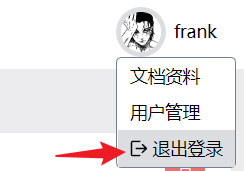

# 后台菜单优化
## 用户退出登录
* localStorage中的token删掉
* pinia 中的 info 删除

### 优化localStorage工具函数
```
src/utils  工具
|-- env.ts
|-- index.ts   入口文件
|-- store.ts   localStorage工具函数
|-- user.ts    关于用户操作的函数
```
store.ts
```ts
// 定义localStorage工具函数
// set时, 可以设置过期时间 . get时判断是否到期了,如果到期了就删除,没过期返回数据 (逻辑处理要细品)
// 时间上的处理, 善用 new Date().getTime()得到时间戳

export interface IData {
  data:any
  expire?: number;     //过期时间 (s)
}
export default {
  set(key: string, data:any , expire?:number): void {    // 三个参数: 1.字符串名 2.data数据 3.expire过期时间
    const cache:IData = { data }
    if (expire) {
      cache.expire = expire * 1000 + new Date().getTime();
    }
    localStorage.setItem(key, JSON.stringify(cache));
  },
  get(key: string) {
    const cacheStore = localStorage.getItem(key);
    if (cacheStore) {
      const cache = JSON.parse(cacheStore);
      const expire = cache?.expire;
      if (expire && expire < new Date().getTime()) {
        localStorage.removeItem(key);
        return null;
      }
      return cache.data ;
    }
    return null;
  },
  remove(key:string){
    localStorage.removeItem(key)
  }
};
```
其中由于 'token'这个字符串会被重复使用 , 直接配置成`enum`
```
src/enum
|-- cacheEnum.ts
```
cacheEnum.ts
```ts
export enum CacheEnum {
  TOKEN_NAME = 'login_token'
}
```
随之把所有用到'token'字符串的地方 , 全部更改成`CacheEnum.TOKEN_NAME` , 比如路由守卫`guard.ts`

**登录**和**用户退出的登录**函数封装

user.ts  
```ts
import store from '@/utils/store';
import {CacheEnum} from '@/enum/cacheEnum';
import userApi , {ILoginData} from '@/apis/userApi';
import router from '@/router';
// 这里的router 不是composition api , 所以不能使用const router = useRouter(), 必须导入具体router实例

//login 登录
export async function login(values:ILoginData){
  const {result: {token}} = await userApi.login(values); // 获取 token
  store.set(CacheEnum.TOKEN_NAME,  token )
  await router.push({name:'home'})
}
//logout  删除localStorage里的token
export function logout(){
  store.remove(CacheEnum.TOKEN_NAME)
  await router.push('/')                 // 跳转到home页
  useUserStore().info = null             // pinia 的 info 清空
}
```
src/api/userApi.ts 
```ts{16-26}
import { http } from '@/plugins/axios'
export interface  User {
  name: string,
  age:number,
  avatar:string
}
 async function  info(){
   return  await http.request<User>({
    url:'user/info'
  })

}
interface LoginInterface {
  token: string
}
export interface ILoginData {   // 声明类型
  account:string
  password:string,
}
async function login(data:ILoginData){
  return await http.request<LoginInterface>({
    url:'login',
    method:'post',
    data
  })
}

export default {info , login }
```
index.ts 入口文件
```ts
import store from './store'

import env from './env'
import * as user  from './user'

export  { store , env  , user}
```
在其他组件里使用**退出登录**函数


```
import * as utils from './utils'

<div @click="utils.user.logout()">退出登录</div>
```


