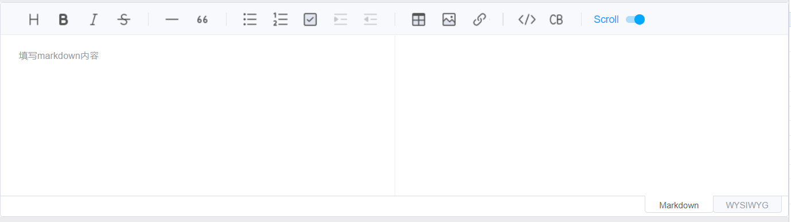
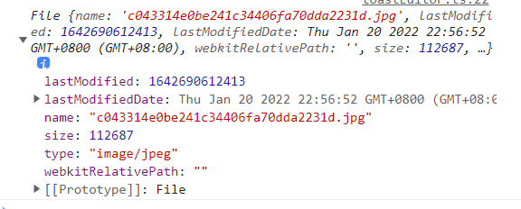
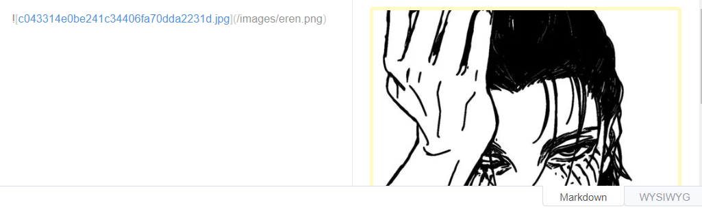

# toastui的 markdown 编辑器
`markdown`编辑器使用了[toastui编辑器](https://ui.toast.com/tui-editor)

## 基本配置
```
components/markdown
|--toastEditor.ts  配置
|--editor.vue     组件
```
```
npm install --save @toast-ui/editor
```
toastEditor.ts
```ts
import Editor from '@toast-ui/editor';
export default  class {
  editor:Editor
  constructor(el:string, initialValue:string, height:string, placeholder:string) {
    this.editor =  new Editor({
      el: document.querySelector(el),
      initialEditType:'markdown',
      previewStyle: 'vertical',
      height: height,
      initialValue: initialValue,
      placeholder: placeholder
    });
  }
}
```
types/typings.d.ts  声明编辑器ts类型
```ts
declare namespace toastui {
  class Editor {
    constructor(options: any)
    getMarkdown: () => string
  }
}
```
editor.vue
```vue
<script setup lang="ts">
 import ToastEditor from './toastEditor'
 import {nextTick} from 'vue';

 nextTick(()=>{
   new ToastEditor('#editor','500px','abc' )
 })
</script>

<template>
  <div id="editor"></div>
</template>

<style lang="scss" scoped>
@import "https://uicdn.toast.com/editor/latest/toastui-editor.min.css";  // 解决样式跟tailwindcss的样式冲突 
#editor {
  background: white;
}
</style>
```
## 编辑器props类型声明及处理 
`v-model`传递响应式数据

views/editor/markdown.vue
```vue
<script setup lang="ts">
import Editor from '@/components/markdown/editor.vue'
import {ref} from 'vue';

const content = ref('响应式数据')

</script>
<template>
  <div>
    <Editor v-model="content" :height="300" placeholder=请输入markdown内容"/>
    {{content}}
  </div>
</template>
<style lang="scss" scoped>

</style>
```
* `props` 的类型定义 , props的声明及 `withDefaults` 和 `defineProps` 的使用
* 父组件数据传递 , `defineEmits` 的使用 , 编辑器中获取内容 `emit('update:modelValue' , 值)`

components/markdown/editor.vue
```vue
<script setup lang="ts">
import ToastEditor from './toastEditor';
import {nextTick} from 'vue';

interface IProps {
  height?: number,
  modelValue?: string,
  placeholder?: string
}

const props = withDefaults(defineProps<IProps>(), {
  height: 500,
  modelValue: '',
  placeholder: '填写markdown内容'
});
const emit = defineEmits(['update:modelValue']);

nextTick(() => {
  const toastui = new ToastEditor('#editor', props.modelValue, `${props.height}px`, props.placeholder);
  toastui.editor.on('change', (type: string) => {
    if (type === 'markdown') {
      emit('update:modelValue', toastui.editor.getMarkdown());
    } else {
      emit('update:modelValue', toastui.editor.getHTML());
    }
  });
});
</script>

<template>
  <div id="editor"></div>
</template>
<style lang="scss" scoped>
@import "https://uicdn.toast.com/editor/latest/toastui-editor.min.css";

#editor {
  background: white;
}
</style>
```
types/typings.d.ts  ts类型
```ts
declare namespace toastui {
  class Editor {
    constructor(options: any)
    getMarkdown: () => string
    getHTML:() => string
    on:(event:string , callback:Function)=>void
  }
}
```
## 定义mock图片的上传接口
mock/upload.ts
```ts
import {MockMethod} from 'vite-plugin-mock';

export default [
  {
    url: '/api/upload/image',
    method: 'post',               // 注意是 post
    response: ({ query }) => {
      return {
        code: 200,
        message:'请求成功',
        type:'success',
        result: {
          url:'/images/eren.png',
        },
      }
    },
  }
] as MockMethod[];
//http://localhost:3000/api/upload/image  测试数据
```
src/apis/uploadApi.ts
```ts
import {http} from '@/plugins/axios'

interface IUploadImage {
  url:string
}
export function uploadImage(data:FormData){  
  return http.request<IUploadImage>({
    url:'upload/image',
    method:'post',
    data
  })
}
```
## 自定义图片上传
toastEditor.ts
```ts{15,18-30}
import {uploadImage} from '@/apis/uploadApi';
import Editor from '@toast-ui/editor';
export default class {
  editor: Editor;

  constructor(el: string, initialValue: string, height: string, placeholder: string) {
    this.editor = new Editor({
      el: document.querySelector(el),
      initialEditType: 'markdown',
      previewStyle: 'vertical',
      height: height,
      initialValue: initialValue,
      placeholder: placeholder
    });
    this.ImageHook();
  }

  private ImageHook() {
    this.editor.removeHook('addImageBlobHook');

    this.editor.addHook('addImageBlobHook', async (blob:any, callback:Function) => {
      // console.log(blob)
      const form = new FormData();
      form.append('file', blob, blob.name);   // <input type="file">

      const response = await uploadImage(form)

      callback(response.result.url , blob.name)
    });
  }
}
```
`blob`打出来看看  

会显示在输入框里
 
types/typings.d.ts
```ts
declare namespace toastui {
  class Editor {
    constructor(options: any)

    getMarkdown: () => string;
    getHTML: () => string;
    on: (event: string, callback: Function) => void;
    removeHook: (type: string) => void;
    addHook: (type: string, handler: Function) => void;
  }
}
```
## 全屏缩放事件
components/markdown/toastEditor.ts
```ts{14,33,42,49-71}
import {uploadImage} from '@/apis/uploadApi';
import Editor from '@toast-ui/editor';

export default class {
  editor: Editor;

  constructor(el: string, initialValue: string, public height: string, placeholder: string) {
    this.editor = new Editor({
      el: document.querySelector(el),
      initialEditType: 'markdown',
      previewStyle: 'vertical',
      height: height,
      initialValue: initialValue,
      placeholder: placeholder,
      toolbarItems: this.toolbar()
    });
    this.ImageHook();
  }

  private ImageHook() {
    this.editor.removeHook('addImageBlobHook');

    this.editor.addHook('addImageBlobHook', async (blob: any, callback: Function) => {
      // console.log(blob)
      const form = new FormData();
      form.append('file', blob, blob.name);   // <input type="file">

      const response = await uploadImage(form);

      callback(response.result.url, blob.name);
    });
  }

  private toolbar() {     
    return [            // 文档 抄
      ['heading', 'bold', 'italic', 'strike'],
      ['hr', 'quote'],
      ['ul', 'ol', 'task', 'indent', 'outdent'],
      ['table', 'image', 'link'],
      ['code', 'codeblock'],
      // Using Option: Customize the last button
      [{
        el: this.fullscreen(),
        command: 'fullscreen',
        tooltip: 'fullscreen'
      }]
    ];
  }

  private fullscreen() {
    let isFullscreen = false;
    const button = document.createElement('button') as HTMLButtonElement;
    button.innerHTML = '全屏';
    button.style.margin = '0';
    button.addEventListener('click', () => {
      this.editor.setHeight('100vh');
      const editorEl = document.querySelector('#editor') as HTMLDivElement;
      editorEl.classList.toggle('fullscreen');  // 添加类 改 css
      isFullscreen = !isFullscreen;

      if (isFullscreen === true) {
        document.documentElement.addEventListener('keyup', (event) => {
          if (event.key === 'Escape') {
            editorEl.classList.remove('fullscreen');
            this.editor.setHeight(this.height)  // 恢复原来高度
            this.editor.focus()  // 输入框给焦点
          }
        });
      }
    });
    return button;
  }
}
```
components/markdown/editor.vue
```vue{38-46}
<script setup lang="ts">
import ToastEditor from './toastEditor';
import {nextTick} from 'vue';

interface IProps {
  height?: number,
  modelValue?: string,
  placeholder?: string
}

const props = withDefaults(defineProps<IProps>(), {
  height: 500,
  modelValue: '',
  placeholder: '填写markdown内容'
});
const emit = defineEmits(['update:modelValue']);

nextTick(() => {
  const toastui = new ToastEditor('#editor', props.modelValue, `${props.height}px`, props.placeholder);
  toastui.editor.on('change', (type: string) => {
    if (type === 'markdown') {
      emit('update:modelValue', toastui.editor.getMarkdown());
    } else {
      emit('update:modelValue', toastui.editor.getHTML());
    }
  });
});
</script>

<template>
  <div id="editor"></div>
</template>
<style lang="scss" scoped>
@import "https://uicdn.toast.com/editor/latest/toastui-editor.min.css";

#editor {
  background: white;
  &.fullscreen {            // 全屏 时样式 
    position: fixed;
    left: 0;
    right: 0;
    top: 0;
    bottom: 0;
    background: #fff;
    z-index:999;
  }
}
</style>
```
typings.d.ts
```ts
declare namespace toastui {
  class Editor {
    constructor(options: any)

    getMarkdown: () => string;
    getHTML: () => string;
    on: (event: string, callback: Function) => void;
    removeHook: (type: string) => void;
    addHook: (type: string, handler: Function) => void;
    setHeight:(height:string)=>void
    focus:()=>void
  }
}
```
