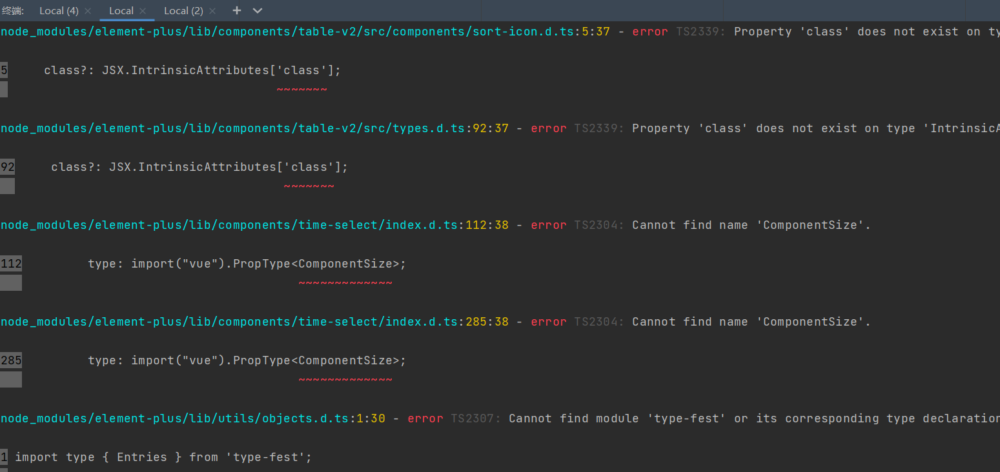
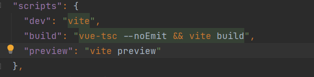
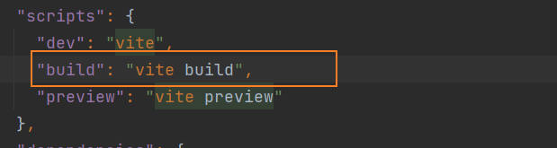
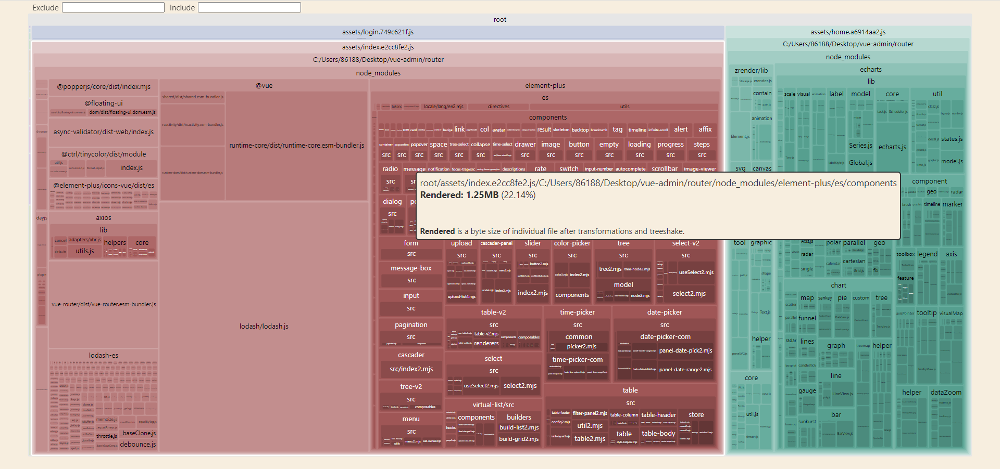
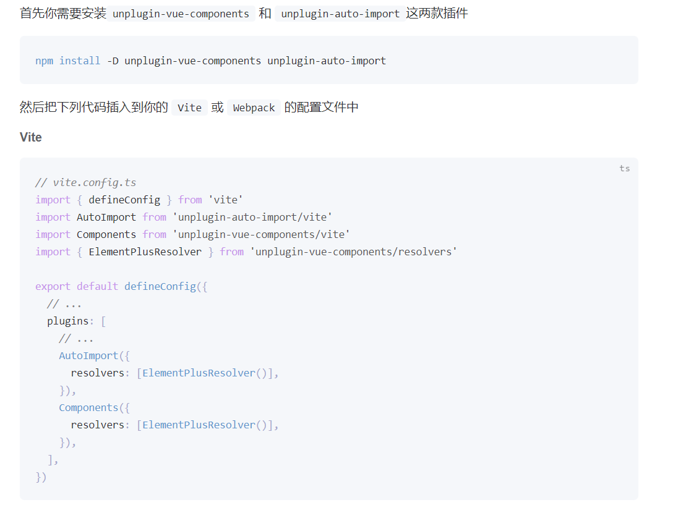

  # 打包
  ## Vue3+ Vite +TypeScript打包时报类型错误，dev启动不报错
  * `yarn dev`运行时项目不报错 , 会正常运行
  * `yarn build`时 , 抛出一堆 error
  
  * 原因:  `package.json`中，`build`配置`vue-tsc`的问题，把对应的命令给删掉：
  
  

  ## 可视化打包工具
  [rollup-plugin-visualizer官网](https://github.com/btd/rollup-plugin-visualizer)
  
  `yarn build`打包之后会生成一个`stats.html`,预览
  安装
  ```sh
  npm install --save-dev rollup-plugin-visualizer
  ```
  Usage with vite (vite.config.js)
  ```
  module.exports = {
    plugins: [visualizer()],
  };
  ```

  vite.config.ts
  ```ts{5,12}
  import {ConfigEnv,  loadEnv} from 'vite';
  import alias from './vite/alias';
  import {parseEnv} from './vite/util';
  import setupPlugins from './vite/plugins';
  import { visualizer } from "rollup-plugin-visualizer";

  export default ({command, mode}: ConfigEnv) => {   //command是生产环境, mode是运行模式 'development'（serve），'production'（build）
    const isBuild = command === 'build'; //是否编译模式
    const root = process.cwd()  //项目根目录
    const env = parseEnv(loadEnv(mode , root))
    return {
      plugins: [...setupPlugins(isBuild,env), visualizer()],
      resolve: {alias}
    };
  }
  ```
  ## Element Plus 的按需加载
  完整引入`element plus`导致打包体积大 , 所以改成按需导入
  [官网](https://element-plus.gitee.io/zh-CN/guide/quickstart.html#%E6%8C%89%E9%9C%80%E5%AF%BC%E5%85%A5)

  首先你需要安装`unplugin-vue-components` 和 `unplugin-auto-import`这两款插件
  ```sh
  npm install -D unplugin-vue-components unplugin-auto-import
  ```
  

  vite/plugins/index.ts
  ```ts{10}
  import {Plugin} from 'vite';
  import vue from '@vitejs/plugin-vue';
  import setupMockPlugin from './mock';
  import setupElementPlugin from './element';

  export default function setupPlugins(isBuild:boolean , env:ViteEnv) {
    const plugins:Plugin[] = [vue()]
    plugins.push(setupMockPlugin(isBuild))

    setupElementPlugin(plugins)  // 传过去plugins
    return plugins
  }
  ```
  vite/plugins/element.ts
  ```ts
  import {Plugin} from 'vite';
  import AutoImport from 'unplugin-auto-import/vite';
  import Components from 'unplugin-vue-components/vite';
  import {ElementPlusResolver} from 'unplugin-vue-components/resolvers';

  export default function setupElementPlugin(plugins: Plugin[]) {
    plugins.push(
      AutoImport({
        resolvers: [ElementPlusResolver()],
      }),
      Components({
        resolvers: [ElementPlusResolver()],
      })
    );
  }
  ```
  ## 分块打包
  使用分块打包可以将内容打包到不同的文件中，减少单个文件大小，提高加载速度。下面将`node_modules`的扩展单独进行打包
  实例:
  ```ts
  export default defineConfig({
    plugins: [vue()],
    build: {
      rollupOptions: {
        emptyOutDir: true,  // 清掉dist目录
        output: {
          manualChunks(id:string) {
            if (id.includes('node_modules')) {
              return id.toString().split('node_modules/')[1].split('/')[0].toString()
            }
          },
        },
      },
    },
  })
  ```
  vite.config.ts
  ```ts{14-26}
  import {ConfigEnv,  loadEnv} from 'vite';
  import alias from './vite/alias';
  import {parseEnv} from './vite/util';
  import setupPlugins from './vite/plugins';
  import { visualizer } from "rollup-plugin-visualizer";

  export default ({command, mode}: ConfigEnv) => {   //command是生产环境, mode是运行模式 'development'（serve），'production'（build）
    const isBuild = command === 'build'; //是否编译模式
    const root = process.cwd()  //项目根目录
    const env = parseEnv(loadEnv(mode , root))
    return {
      plugins: [...setupPlugins(isBuild,env), visualizer()],
      resolve: {alias},
      build: {
        rollupOptions: {
          emptyOutDir: true,
          output: {
            manualChunks(id:string) {
              if (id.includes('node_modules')) {
                return id.toString().split('node_modules/')[1].split('/')[0].toString()
              }
            },
          },
        },
      },
    };
  }
  ```
  ## CDN加载
  可以使用CDN加载的包，使用CDN完成，这样会减少打包后的文件大小

  下面是使用cdn加载 echarts、font-awesome 、animate.css包
  ```
  <script src="https://cdn.bootcdn.net/ajax/libs/echarts/5.2.2/echarts.min.js"></script>
  <link href="https://cdn.bootcdn.net/ajax/libs/font-awesome/6.0.0-beta3/css/all.min.css" rel="stylesheet" />
  <link href="https://cdn.bootcdn.net/ajax/libs/animate.css/4.1.1/animate.min.css" rel="stylesheet" />
  ```

  如果使用ts编译代码，不要忘记安装 echarts的类型支持
  ```sh
  yarn add @types/echarts
  ```


