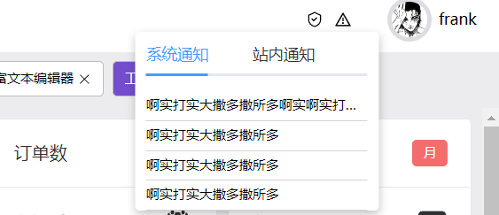
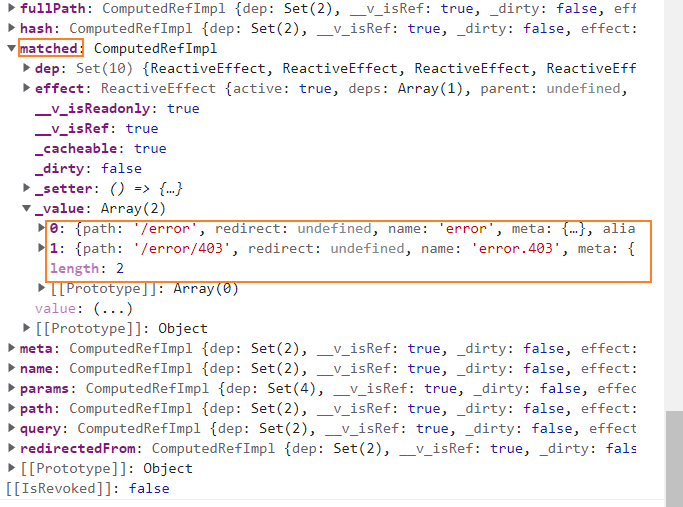

# 菜单的响应处理
菜单的收缩功能会同时被影响至左侧菜单组件和上面的导航栏组件 , 所以有必要把控制变量放到全局状态管理 `pinia`

src/plugins/store/menuStore.ts
```ts{14,60-63}
import {defineStore} from 'pinia';

import {IMenu} from '../../../types/menus';
import router from '@/router';
import { RouteLocationNormalized } from 'vue-router';
import store from '@/utils/store';
import {CacheEnum} from '@/enum/cacheEnum';

export const useMenuStore = defineStore('router', {
  state: () => {
    return {
      menus: [] as IMenu[],
      historyMenus: [] as IMenu[],   // 跳转的历史记录菜单
      menuClose:true as boolean
    };
  },
  actions: {
    init() {
      this.getMenusByRoutes();
      this.historyMenus = store.get(CacheEnum.HISTORY_MENU) || []
    },
    getMenusByRoutes() {
      this.menus = router.getRoutes()
        .filter(route => {
          return route.meta.menu && route.children.length;
        })
        .map(route => {
          let menu = {...route.meta?.menu} as IMenu;
          menu.children = route.children
            .filter(route => route.meta?.menu)
            .map(route => {
              return {...route.meta?.menu, routeName: route.name};
            }) as IMenu[];
          return menu;
        });
    },
    addHistoryMenu(route: RouteLocationNormalized) {
      const menu = {...route.meta?.menu, routeName: route.name as string};
      const isHas = this.historyMenus.some(menu => {
        return menu.routeName === route.name;
      });
      if(!route.meta.menu) return
      if (!isHas) {// 如果历史记录里已经存在 , 则不添加
        this.historyMenus.unshift(menu);
      }
      if(this.historyMenus.length > 10) {
        this.historyMenus.pop()
      }

      store.set(CacheEnum.HISTORY_MENU , this.historyMenus)  // 在localStorage保存
      // console.log(this.historyMenus)
    },
    removeHistoryMenu(menu:IMenu){
      const index = this.historyMenus.indexOf(menu)
      this.historyMenus.splice(index , 1)
      console.log(index)
      console.log(this.historyMenus);
      store.set(CacheEnum.HISTORY_MENU , this.historyMenus)
    },
    toggleClose(){
      this.menuClose = !this.menuClose
    }
  }
});
```
### 全屏模式
```
const fullScreen = ()=>{
  document.documentElement.requestFullscreen()
}
```
```
<div @click="fullScreen">全屏</div>  
```
### 悬浮通知组件

主要用到了`elementplus`的`tabs`组件, 点击图标是显示通知组件 , 点击组件外区域时隐藏组件

`dom`渲染之后(nextTick) , 可以监听`document.documentElement`的`click`事件 , 点击时把控制组件显示或隐藏的响应式变量变为`false`。但是点击组件的时候也会隐藏, 这是因为事件的冒泡机制, 组件的点击事件会冒泡到`document.documentElement`, 所以需要用`@click.stop`阻止冒泡防止点击组件时关闭

notification.vue
```vue
<script lang="ts" setup>
import {nextTick, ref} from 'vue';
import Icon from '@/components/Icon.vue';

const activeName = ref<string>('first');
const visible =  ref<boolean>(false)
const toggle = ()=>{
  visible.value = !visible.value
}

// 渲染之后
nextTick(()=>{
  document.documentElement.addEventListener('click',()=>{
    visible.value  = false
  })
})

</script>
<template>
  <div class="notification">
    <Icon name="admin" @click.stop="toggle"  />  // 阻止冒泡
    <el-tabs v-model="activeName" class="demo-tabs" v-if="visible" @click.stop>  // 阻止冒泡
      <el-tab-pane label="系统通知" name="first" class="pane">
        <a href="">啊实打实大撒多撒所多啊实啊实打实大撒多撒所多啊实啊实打实大撒多撒所多啊实</a>
        <a href="">啊实打实大撒多撒所多</a>
        <a href="">啊实打实大撒多撒所多</a>
        <a href="">啊实打实大撒多撒所多</a>
      </el-tab-pane>
      <el-tab-pane label="站内通知" name="second">hello</el-tab-pane>
    </el-tabs>
  </div>
</template>
<style lang="scss" scoped>
.notification {
  position: relative;
  >svg {
    margin-right: 10px;
    cursor: pointer;
  }
  .demo-tabs {
    position: absolute;
    left: 0;
    width: 220px;
    transform: translateX(-70%);
    top: 120%;
    background: white;
    padding: 0 10px 0 10px;
    border-radius: 4px;
    box-shadow: rgba(0, 0, 0, 0.24) 0px 3px 8px;
    .pane {
      max-height: 300px;
      padding: 0;
      overflow-y: auto;
      overflow-x: hidden ;
      a {
        font-size: 12px;
        display: block;
        text-overflow : ellipsis;
        overflow: hidden;
        white-space : nowrap;
        padding: 4px 0;
        border-bottom: 1px solid lightgrey;
        &:hover {
          color: #6c5ce7;
        }
      }
    }
  }
}
</style>
```
### 面包屑组件


这个组件主要作用就是显示当前路由的轨迹 , 基于路由的`matched`属性(得到匹配的路由数组)的`meta.menu`属性循环展示

(1)之前在`admin.vue`布局页面中 , 跳转路由的时候执行了`pinia`中添加历史路由记录的方法 , 所以可以在`pinia`中的`addHistoryMenu`方法里添加一个存当前路由的函数

admin.vue
```vue{14}
<script lang="ts" setup>
import MenuComponent from '@/layouts/admin/menu.vue';
import NavBar from '@/layouts/admin/navbar.vue';
import HistoryLink from '@/layouts/admin/historyLink.vue';
import {onBeforeRouteUpdate, useRoute} from 'vue-router';
import {useMenuStore} from '@/plugins/store/menuStore';
import {watch} from 'vue';

const menus = useMenuStore()
menus.init()
const route = useRoute()

watch(route , ()=>{
  menus.addHistoryMenu(route)  //添加菜单历史记录
},  { immediate:true })
</script>
```
plugins/store/menuStore.ts
```ts{15,54}
import {defineStore} from 'pinia';

import {IMenu} from '../../../types/menus';
import router from '@/router';
import { RouteLocationNormalized } from 'vue-router';
import store from '@/utils/store';
import {CacheEnum} from '@/enum/cacheEnum';

export const useMenuStore = defineStore('router', {
  state: () => {
    return {
      menus: [] as IMenu[],
      historyMenus: [] as IMenu[],   // 跳转的历史记录菜单
      menuClose:true as boolean,
      route:null as RouteLocationNormalized  // 当前的路由
    };
  },
  actions: {
    init() {
      this.getMenusByRoutes();
      this.historyMenus = store.get(CacheEnum.HISTORY_MENU) || []
    },
    getMenusByRoutes() {
      this.menus = router.getRoutes()
        .filter(route => {
          return route.meta.menu && route.children.length;
        })
        .map(route => {
          let menu = {...route.meta?.menu} as IMenu;
          menu.children = route.children
            .filter(route => route.meta?.menu)
            .map(route => {
              return {...route.meta?.menu, routeName: route.name};
            }) as IMenu[];
          return menu;
        });
    },
    addHistoryMenu(route: RouteLocationNormalized) {
      const menu = {...route.meta?.menu, routeName: route.name as string};
      const isHas = this.historyMenus.some(menu => {
        return menu.routeName === route.name;
      });
      if(!route.meta.menu) return
      if (!isHas) {// 如果历史记录里已经存在 , 则不添加
        this.historyMenus.unshift(menu);
      }
      if(this.historyMenus.length > 10) {
        this.historyMenus.pop()
      }

      store.set(CacheEnum.HISTORY_MENU , this.historyMenus)  // 在localStorage保存
      // console.log(this.historyMenus)

      this.route = route   // 当前路由
    },
    removeHistoryMenu(menu:IMenu){
      const index = this.historyMenus.indexOf(menu)
      this.historyMenus.splice(index , 1)
      console.log(index)
      console.log(this.historyMenus);
      store.set(CacheEnum.HISTORY_MENU , this.historyMenus)
    },
    toggleClose(){
      this.menuClose = !this.menuClose
    }
  }
});
```
(2) `pinia`中读取当前路由`route`
打出来看看
 

路由的`matched`会返回数组即匹配的所有路由 , 然够在模板里`v-for`循环展示内容

breadcrumb.vue 
```vue
<script lang="ts" setup>
import {useMenuStore} from '@/plugins/store/menuStore';
import {useRoute} from 'vue-router';
import {watch} from 'vue';

const menuStore = useMenuStore()
const route  = useRoute()
let currentRoute
watch(route,()=>{
  currentRoute = menuStore.route
  // console.log(currentRoute.matched)
},{immediate:true})

</script>
<template>
  <el-breadcrumb separator="/" class="breadcrumb">
    <el-breadcrumb-item :to="{ path: '/' }">首页</el-breadcrumb-item>
    <template v-if="currentRoute">
      <el-breadcrumb-item  v-for="(r,index) in currentRoute.matched" :key="index" >{{r.meta.menu.title}}</el-breadcrumb-item>
    </template>
  </el-breadcrumb>
</template>
<style lang="scss" scoped>
.breadcrumb {
  @media (max-width: 768px) {
    display: none;
  }
}
</style>
```


