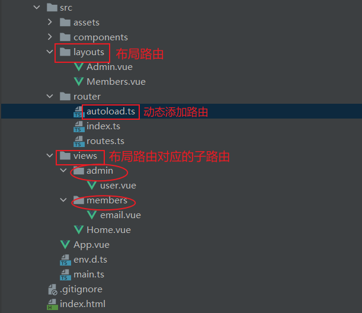

 # 项目
 介绍: 使用`Vue3`开发的前端脚手架，使用技术包括`Vue3`、`typescript`、`tailwindcss`、`elementPlus`、`axios`、`mockJs`、`vite`
 ## 初始的路由配置
 

**注意**: 布局路由一定要写上`<router-view>`
```
src/router
|--autoload.ts
|--guard.ts    //路由守卫
|--index.ts
|--routes.ts
```
src/router/routes.ts
```js
import {RouteRecordRaw} from 'vue-router';

const routes = [
  {
    path: '/',
    name: 'home',
    component: () => import('../layouts/Admin.vue'),
  }
] as RouteRecordRaw[]

export default routes

```
src/router/index.ts
```js
import {createRouter, createWebHashHistory} from 'vue-router';
import {App} from 'vue';
import routes from './routes';
import layoutRoutes from './autoload';

const router = createRouter({
  history: createWebHashHistory(),
  routes: [
    ...routes , ...layoutRoutes
  ]
});
console.log(layoutRoutes)
export function setupRouter(app: App) {
  app.use(router);
}


export default router;
```
src/router/autoload.ts

使用`import.meta.globEager(pattern)`api , 获取vue文件
```ts
import {RouteRecordRaw} from 'vue-router';
//import.meta.globEager(pattern)
const layoutsModules = import.meta.globEager('../layouts/*.vue'); //获取布局路由
const viewsModules = import.meta.globEager('../views/**/*.vue');  //获取布局路由对应的子路由
//https://cn.vitejs.dev/guide/features.html#glob-import 看vite文档
//import.meta.globEager(pattern)
//返回的格式为, 例如
// {
//   './dir/foo.js': () => import('./dir/foo.js'),
//   './dir/bar.js': () => import('./dir/bar.js')
// }
const layoutsRoutes = [] as RouteRecordRaw[];

Object.entries(layoutsModules).forEach(([file, module]) => {
  //file 打出来看看 :  `../layouts/Admin.vue`
  const layoutsRoute = getRouteByModules(file, module);
  layoutsRoute.children = getChildRouteByModules(layoutsRoute);  //添加 children

  layoutsRoutes.push(layoutsRoute);
});

function getRouteByModules(file: string, module: { [p: string]: any }) {
  const name = file.split('/').pop()?.split('.')[0].toLowerCase();
  const obj = {
    path: `/${name}`,
    name: name,
    component: module.default    // module.default
  } as RouteRecordRaw;
  return obj;
}

function getChildRouteByModules(layoutsRoute: RouteRecordRaw) {
  let childRoutes = [] as RouteRecordRaw[];  //子路由 children是数组
  Object.entries(viewsModules).forEach(([file, module]) => {
    if (file.includes(layoutsRoute.name as string)) {
      const childName = file.split('/').pop()?.split('.')[0];
      childRoutes.push(
        {                  // 单个子路由
          path: childName,
          name: childName,
          component: module.default
        } as RouteRecordRaw);
    }
  });
  return childRoutes;
}

export default layoutsRoutes;
```
src/main.ts
```ts
import { createApp } from 'vue'
import App from '@/App.vue'
import router , { setupRouter } from '@/router';

async function bootstrap() {
  const app = createApp(App)
  setupRouter(app)     //路由
  //setupPlugins(app)  //插件
  await router.isReady()
  app.mount('#app')
}
bootstrap()
```