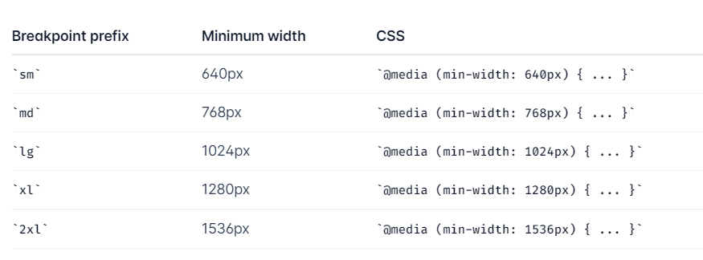

# tailwindcss
[英文文档](https://tailwindcss.com/docs/installation)
[中文文档](https://www.tailwindcss.cn/docs)
## 基本使用
### 响应式
[官网](https://tailwindcss.com/docs/responsive-design)

### 表单的样式
```vue
<script lang="ts" setup></script>
<template>
  <div class="bg-slate-100 h-screen  flex justify-center items-start md:items-center  p-5" >
    <div class="hd-wrapper">
      <div class="p-5">
        <h2 class="text-center text-gray-700 text-lg p-4">会员登录</h2>
        <div>
          <input type="text" placeholder="请输入账号或邮箱" class="hd-input mt-4"/>
          <input type="password" placeholder="请输入密码" class="hd-input mt-5" />
        </div>
        <button class="hd-button mt-5 " type="submit">登录</button>
        <div class="hd-links mt-5">
          <a href="">网站首页</a>
          <a href="">会员注册</a>
          <a href="">找回密码</a>
          <!-- <a href="">找回密码</a> -->
        </div>
      </div>

      <div class="hd-img">
        
      </div>
    </div>
  </div>
</template>

<style lang="scss" scoped>    // @apply 复用
.hd-wrapper { 
  @apply w-[720px]  bg-white md:grid grid-cols-2 rounded-md shadow-md overflow-hidden
  translate-y-10 md:translate-y-0
}
.hd-input {
  @apply w-full py-1 px-2 placeholder:text-sm border border-gray-500
  rounded-md outline-none outline-offset-0 focus:outline-violet-500
  focus:outline-offset-1 duration-200 focus:border-white
}
.hd-button {
  @apply bg-violet-700 w-full p-2 text-white rounded-md hover:bg-violet-600 duration-200
  active:bg-violet-700
}
.hd-links {
  @apply  flex justify-center  gap-3 text-sm text-gray-600 ;
}
.hd-img {
  @apply hidden md:block
}
</style>
```
