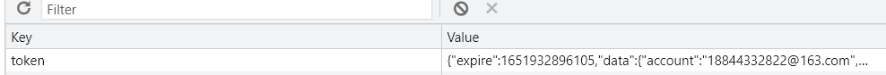

# TOKEN储存与登录请求

## 异步请求获取token
mock/user.ts mock模拟的后台数据
```ts{19-32}
import {MockMethod} from 'vite-plugin-mock';
import {Random} from 'mockjs';
export default [
  {
    url: '/api/info',
    method: 'get',
    response: ({ query }) => {
      return {
        code: 200,
        message:'请求成功',
        type:'success',
        result: {
          name: 'frank',
          age:18
        },
      }
    },
  },
  {
    url: '/api/login',     
    method: 'post',
    response: () => {
      return {
        code: 200,
        message:'登录成功',
        type:'success',
        result: {
          token:Random.string(10)
        },
      }
    },
  },
] as MockMethod[];
```
src/apis/userApi.ts 之前用axios封装的api模块
```ts{13-22}
import { http } from '@/plugins/axios'
interface  User {
  name: string,
  age:number,
  avatar:string
}
 async function  info(){
   return  await http.request<User>({
    url:'info'
  })

}
interface LoginInterface {
  token: string
}
async function login(data:any){
  return await http.request<LoginInterface>({
    url:'login',
    method:'post',    // method:'post'
    data  :data       // data : data
  })
}

export default {info , login}
```
## 定义LocalStorage工具函数
src/utils/store.ts
```ts
// 定义localStorage工具函数
// set时, 可以设置过期时间 . get时判断是否到期了,如果到期了就删除,没过期返回数据 (逻辑处理要细品)
// 时间上的处理, 善用 new Date().getTime()
interface IData {
  expire?: number;     //过期时间 (s)
  [key: string]: any;
}
export default {
  set(key: string, data: IData): void {
    if (data.expire) {
      data.expire = data.expire * 1000 + new Date().getTime();
    }
    localStorage.setItem(key, JSON.stringify(data));
  },
  get(key: stirng) {
    const item = localStorage.getItem(key);
    if (item) {
      const data = JSON.parse(item);
      const expire = data?.expire;
      if (expire < new Date().getTime()) {
        localStorage.removeItem(key);
        return null;
      }
      return data;
    }
    return null;
  }
};
```
## 优化env开发环境工具函数
```
src/utils
|--env.ts
|--store.ts
|--index.ts     //入口文件
```
index.ts 入口文件
```ts
import store from './store'
import env from './env'

export  { store , env }
```
env.ts  环境变量
```ts
import _ from 'lodash'
const env: any = _.cloneDeep(import.meta.env);

Object.entries(import.meta.env as Record<string, any>).forEach(([key, value]) => {

  if (value === 'true' || value === 'false') {
    env[key] = value === 'true';
  } else if (/^\d+$/.test(value)) {
    env[key] = Number(value);
  } else if (value === 'null') {
    env[key] = null;
  } else if (value === 'undefined') {
    env[key] = undefined;
  }
});
export default  env as ViteEnv
```
store.ts localStorage工具函数
```ts
// 定义localStorage工具函数
// set时, 可以设置过期时间 . get时判断是否到期了,如果到期了就删除,没过期返回数据 (逻辑处理要细品)
// 时间上的处理, 善用 new Date().getTime()
interface IData {
  expire?: number;     //过期时间 (s)
  [key: string]: any;
}
export default {
  set(key: string, data: IData): void {
    if (data.expire) {
      data.expire = data.expire * 1000 + new Date().getTime();
    }
    localStorage.setItem(key, JSON.stringify(data));
  },
  get(key: stirng) {
    const item = localStorage.getItem(key);
    if (item) {
      const data = JSON.parse(item);
      const expire = data?.expire;
      if (expire < new Date().getTime()) {
        localStorage.removeItem(key);
        return null;
      }
      return data;
    }
    return null;
  }
};
```
## 在实际表单中的使用
```vue{5,25-31}
<script lang="ts" setup>
import Icon from '@/components/Icon.vue'
import v from '@/plugins/validate';
import userApi from '../../apis/userApi';
import { store } from '@/utils'
const {Form, Field, ErrorMessage} = v;

import {reactive} from 'vue';
import {localize} from '@vee-validate/i18n';

const form = reactive({
  account: '',
  password: ''
});

// const schema = v.yup.object({
//   account:v.yup.string().email().required().label('用户名'),
//   password:v.yup.string().required().min(3).label('密码')
// })
const schema = {
  account: {required: true, email: true},
  password: {required: true, min: 3, max: 10}
};

const onSubmit = async (values: any) => {
  //console.log(values);
  const {result: {token}} = await userApi.login(values); // 获取 token
  store.set('token',{   //设置 localstorage , 到期时间
    expire:100,
    data:token
  })
  await router.push({name:'home'})
};
</script>
<template>
  <div class="bg-slate-100 h-screen  flex justify-center items-start md:items-center  p-5">
    <div class="hd-wrapper">
      <div class="p-5  form-wrapper">
        <h2 class="text-center text-gray-700 text-lg p-4">会员登录</h2>
        <Form @submit="onSubmit" :validation-schema="schema">
          <Field name="account"
                 placeholder="请输入您的邮箱"
                 label="用户名"
                 :validate-on-input="true" class="hd-input"/>
          <ErrorMessage name="account" class="hd-error"/>
          <Field name="password" type="password" label="密码"
                 placeholder="请输入密码"
                 class="hd-input mt-2"
                 :validate-on-input="true"/>
          <ErrorMessage name="password" class="hd-error"/>
          <button class="hd-button mt-2 " type="submit">登录</button>
        </Form>
        <div class="icon-wrapper">
            <Icon name="wechat-fill"></Icon>
        </div>
        <div class="hd-links mt-5">
          <a href="">网站首页</a>
          <a href="">会员注册</a>
          <a href="">找回密码</a>
        </div>
      </div>
      <div class="hd-img">
        
      </div>
    </div>
  </div>
</template>
```


