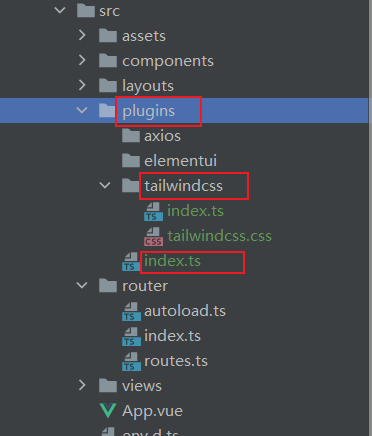
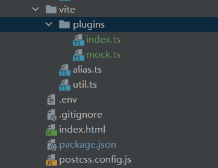

# Vite环境
## 环境变量 .env文件
[官网](https://cn.vitejs.dev/guide/env-and-mode.html)

`.env`
```
VITE_SOME_KEY=123
VITE_ROUTE_AUTOLOAD=true
VITE_API_URL="/api"
```
加载的环境变量也会通过`import.meta.env` 以**字符串形式**暴露给客户端源码。

vite/alias.ts  **@别名**
```ts
import path from 'path';
import {AliasOptions} from 'vite';

const alias = {'@':path.resolve(__dirname,'../src')} as AliasOptions

export default alias
```
vite/util.ts  因为环境变量都是字符串 , 这是**转换env环境变量的函数**
```ts
import * as _ from 'lodash'

export function  parseEnv(env:Record<string,any>) { //转换env环境变量的函数
    const envs = _.cloneDeep(env)
  console.log(envs)
    Object.entries(envs).forEach(([key,value])=>{
      if(value === 'true' || value === 'false') {
        envs[key] = value === 'true'
       }
      if(/^\d+$/.test(value)) {
        envs[key] = parseInt(value)
      }
    })
  return envs
}
```
vite.config.ts  **vite总配置**
```ts
import {ConfigEnv,  loadEnv} from 'vite';
import vue from '@vitejs/plugin-vue';
import alias from './vite/alias';
import {parseEnv} from './vite/util';

export default ({command, mode}: ConfigEnv) => {   //command是生产环境, mode是运行模式 'development'（serve），'production'（build）
  const isBuild = command === 'build'; //是否编译模式
  const root = process.cwd()  //项目根目录
  const env = parseEnv(loadEnv(mode , root))
  return {
    plugins: [vue()],
    resolve: {alias}
  };
}
```

## 插件拓展与tailwindcss配置
[tailwindcss官网vite配置](https://tailwindcss.com/docs/guides/vite)

plugins目录结构 
```sh
yarn add -D tailwindcss postcss autoprefixer
npx tailwindcss init -p
```
生成`tailwind.config.js`配置文件

tailwind.config.js
```js
module.exports = {
  content: [
    "./index.html",
    "./src/**/*.{vue,js,ts,jsx,tsx}",
  ],
  theme: {
    extend: {},
  },
  plugins: [],
}
```
plugins/tailwindcss/tailwindcss.css
```css
@tailwind base;
@tailwind components;
@tailwind utilities;
```
plugins/tailwindcss/index.ts
```ts
import './tailwindcss.css'
export  function setupTailwindcss (){}
```
plugins/index.ts
```ts
import {App} from 'vue';
import {setupTailwindcss} from '@/plugins/tailwindcss';

export function setupPlugins(app:App) {
  setupTailwindcss()
}
```
src/main.ts
```ts{4,9}
import { createApp } from 'vue'
import App from '@/App.vue'
import router , { setupRouter } from '@/router';
import {setupPlugins} from '@/plugins';

async function bootstrap() {
  const app = createApp(App)
  setupRouter(app)
  setupPlugins(app)
  await router.isReady()
  app.mount('#app')
}
bootstrap()
```

## vite插件独立管理
目录结构


vite.config.ts
```ts{11}
import {ConfigEnv,  loadEnv} from 'vite';
import alias from './vite/alias';
import {parseEnv} from './vite/util';
import setupPlugins from './vite/plugins';

export default ({command, mode}: ConfigEnv) => {   //command是生产环境, mode是运行模式 'development'（serve），'production'（build）
  const isBuild = command === 'build'; //是否编译模式
  const root = process.cwd()  //项目根目录
  const env = parseEnv(loadEnv(mode , root))
  return {
    plugins: setupPlugins(isBuild,env),
    resolve: {alias}
  };
}
```
### vite-plugin-mock插件
vite/plugins/index.ts
```ts
import {Plugin} from 'vite';
import vue from '@vitejs/plugin-vue';
import setupMockPlugin from './mock';

export default function setupPlugins(isBuild:boolean , env:Record<string , any>) {
  const plugins:Plugin[] = [vue()]
  plugins.push(setupMockPlugin(isBuild))  //mock插件
  return plugins
}
```

安装 `vite-plugin-mock`插件
目的:要模拟 后台数据
[官网](https://github.com/vbenjs/vite-plugin-mock)
```sh
yarn add mockjs
yarn add vite-plugin-mock -D
```
vite/plugins/mock.ts  
```ts
import { viteMockServe } from 'vite-plugin-mock'
export default function setupMockPlugin(isBuild:boolean){
  return viteMockServe({
    // default
    mockPath: 'mock',
    localEnabled: !isBuild,
  })
}
```
## 优化环境变量导出
src/util/helper.ts
```ts
import * as _ from 'lodash';
 class Helper  {
  public env = {} as ImportMetaEnv

  constructor() {
    this.env = this.getEnvs()
  }
  private getEnvs():ImportMetaEnv {
    const envs = _.cloneDeep(import.meta.env)

    Object.entries(envs).forEach(([key,value])=>{
      if(value === 'true' || value === 'false') {
        envs[key] = value === 'true'
      }
      else if(/^\d+$/.test(value)) {
        envs[key] = parseInt(value)
      }else if (value ==='null') {
        envs[key] = null
      }else if (value ==='undefined') {
        envs[key] = undefined
      }
    })
    return envs
  }
}
const helper = new Helper()
const env = helper.env
export default helper
export { env }
```