# 项目 2

## Vuex 的 ts 技巧和左侧菜单显示

左侧菜单的话数据已经保存在 Vuex 的 login 模块里 , 在 Vuex 的 login 模块中获取 userMenus 数据

但是在 setup()获取 login 模块的 state 数据的时候 store.state.login.xxxx , ts 类型支持有点问题 , 现在解决这个问题

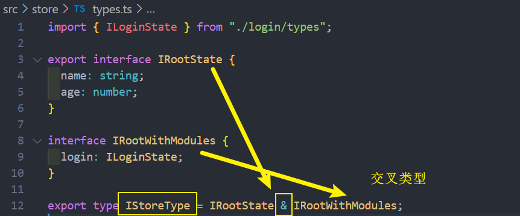
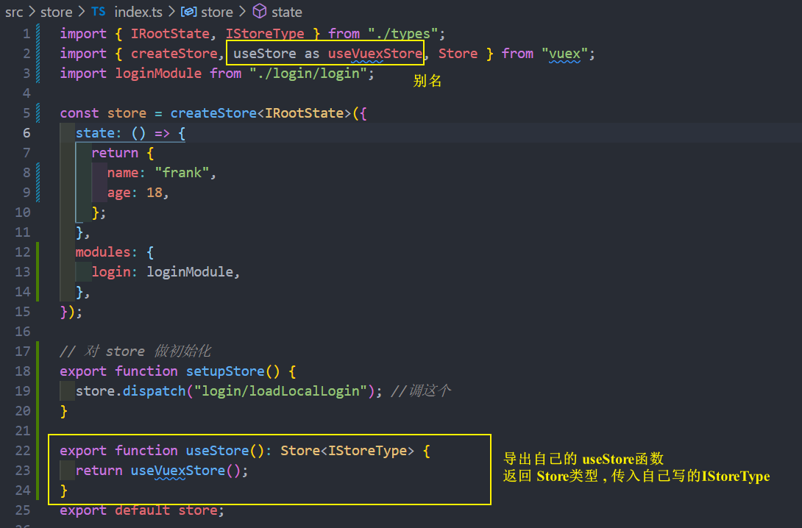

组件内拿到模块里 userMenus 数据
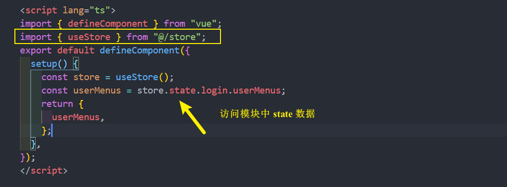

然后展示菜单 [el-menu,el-sub-menu,el-menu-item](https://element-plus.gitee.io/zh-CN/component/menu.html#menu-%E5%B1%9E%E6%80%A7)
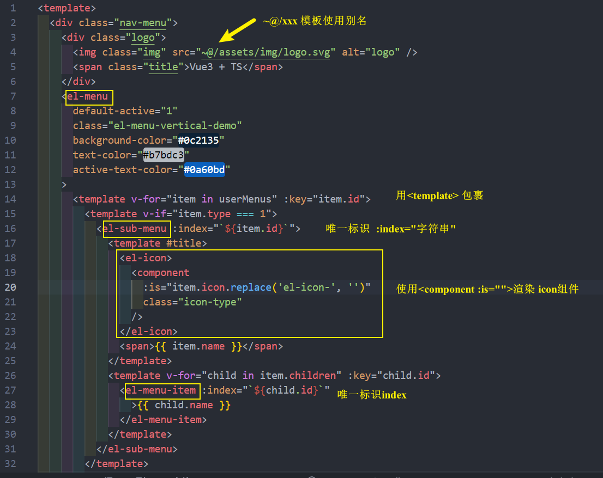
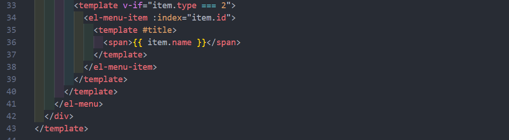

## 菜单的折叠与展开切换

el-menu 的 collapse 属性

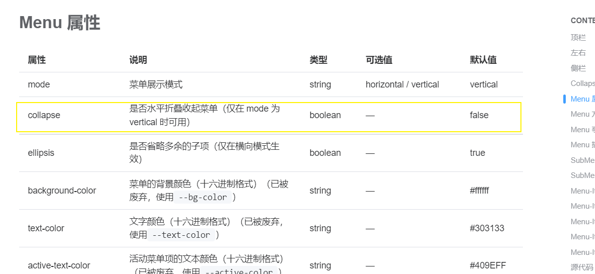

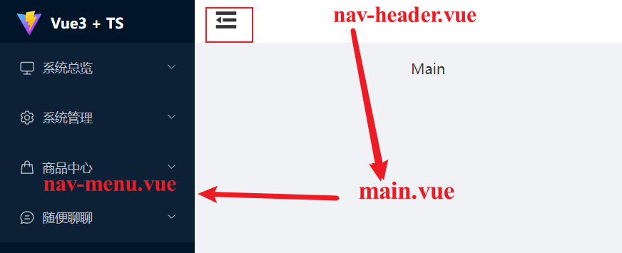  
NavHeader 组件和 NavMenu 组件的共同父组件是 main.vue , 先把对应的 NavHeader 里面的事件传给 main , main 之后改变某一个值 ,再把面里面的某一个值传给 NavMenu

这么做是因为 , main.vue 里面要决定菜单的宽度 , 所以要通过 main.vue 来传

- nav-header.vue
  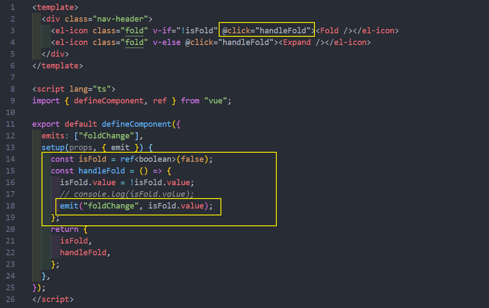
- main.vue
  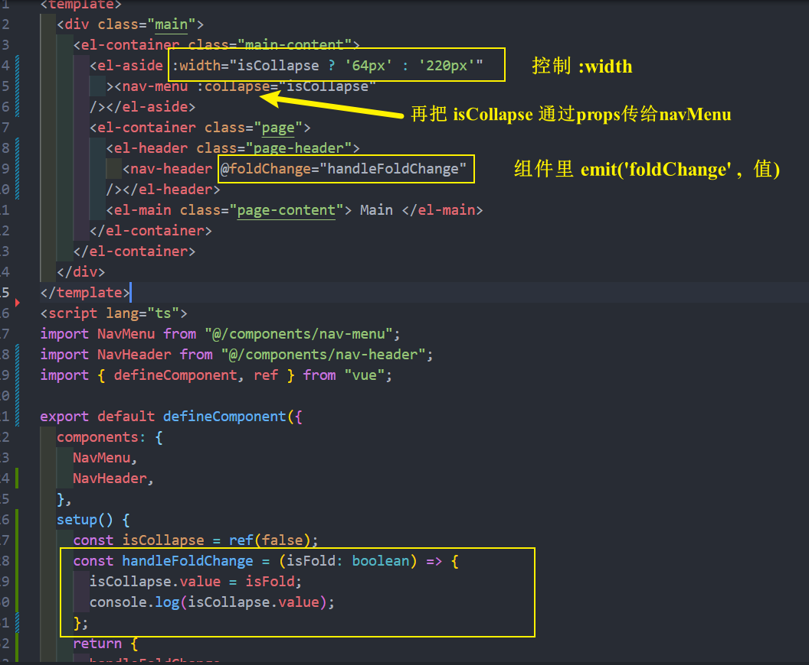
- nav-menu.vue
  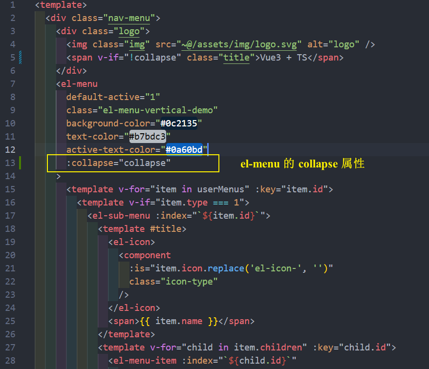  
  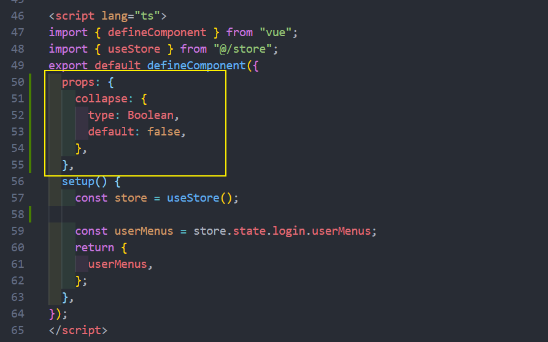  
  还有 el-menu 样式上的 bug 问题, 动画的过程中会出现白色的竖线, 所以需要加上 el-menu{ border-right :none }

## 权限管理和菜单动态路由

权限动态加载路由的**常用的 3 种方法** (这个项目采用最后一种方法) :

- 写死 : 注册所有的组件
  - 在 routes 数组中的 children 把所有的路由写死 , 不管用户需要不需要菜单 , 全部都给注册完。但写死有个弊端 , 虽然有些菜单是
    不显示, 但 url 对应的组件这二中映射关系式依然存在的, 用户手动改 url 的地址访问 , 组件是依然会显示。但这种不该显示, 要直接给 404 页面
- 前端先规定好不同的角色对应的不同的路由, 之后用户登录时拿到 role.name 判断是否对应角色规定好的角色 , 然后动态加载路由放到 routes 中。这个方法也有个弊端 , 如果想要新增角色 , 必须要修改前端代码 , 然后需要要重新部署
  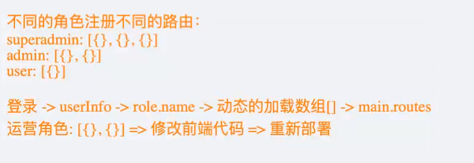
- 根据菜单动态生成路由映射 , 菜单理由 url , 它对应的是路由的 path , 让 path 对应某个 component , 然后生成对应的 routes , 最后 addRoute 动态添加到 children 里面
  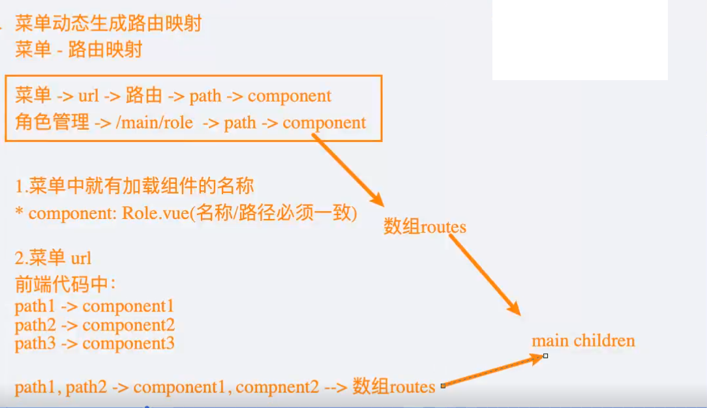

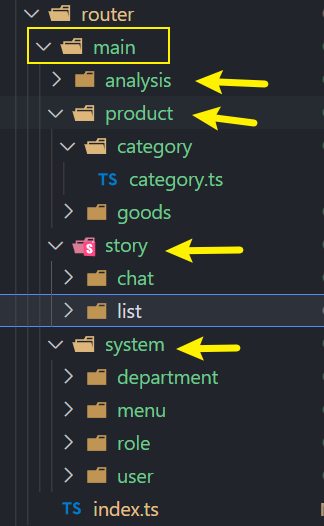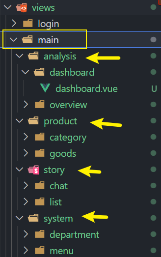

**例如** router/main/analysis/dashboard/dashboard.ts **导出 RouterRecordRaw 对象 , 其余同理**
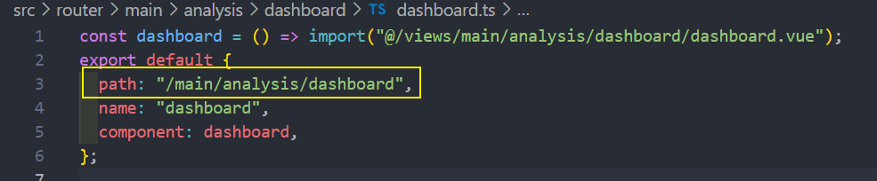
views/main/analysis/dashboard/dashboard.vue **dashboard 对应的组件**
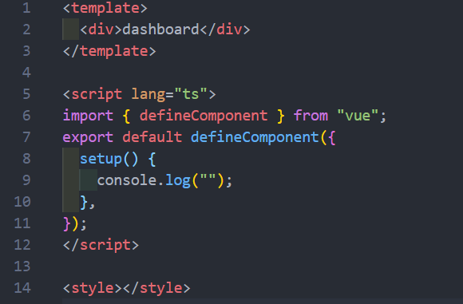

- store/login/login.ts
  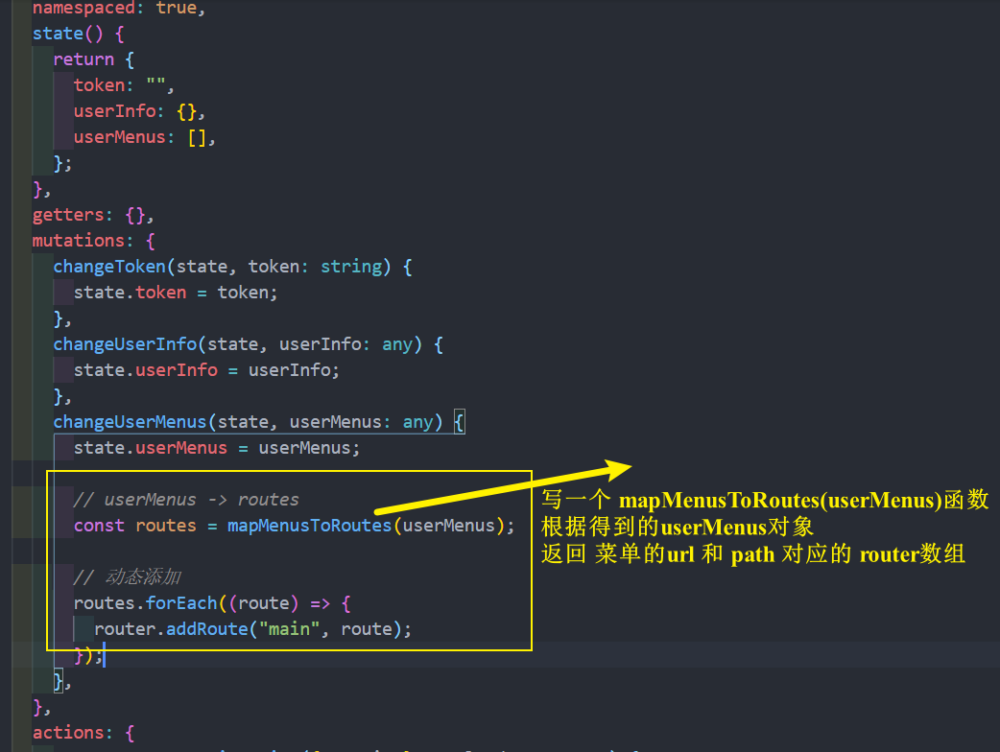

- utils/map-menus.ts
  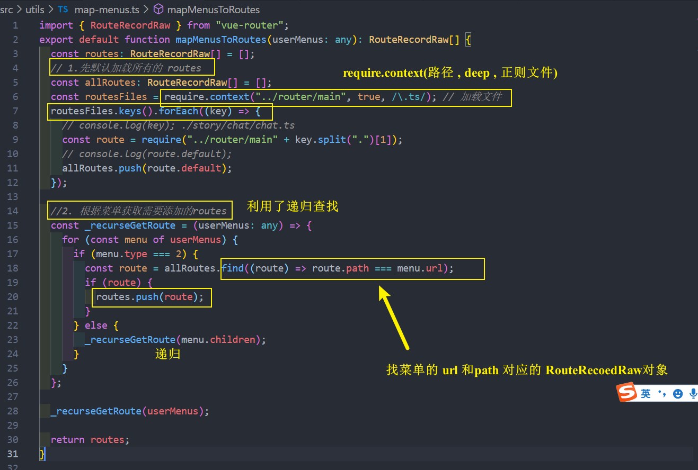

- store/login/login.ts 将得到的 routes 数组遍历, addRoute 动态添加
  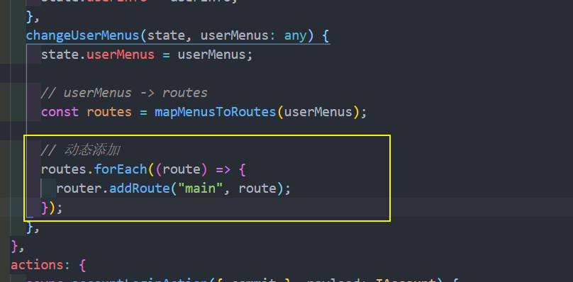

## 页面映射展示

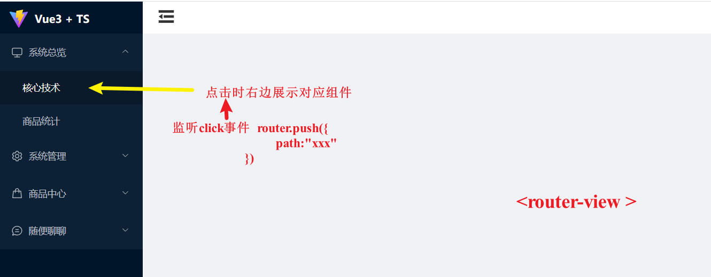

- nav-menu.vue
  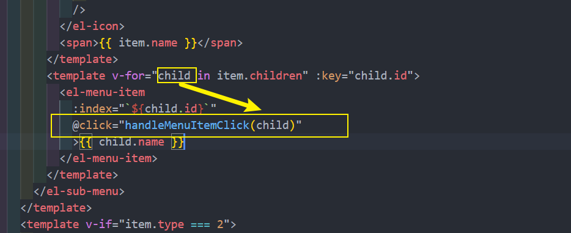
  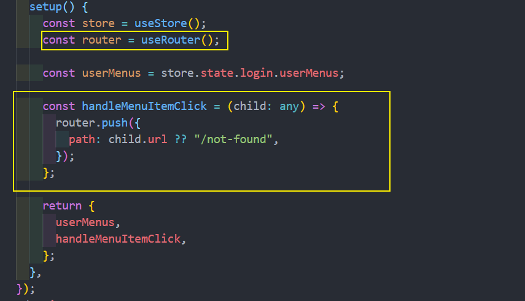

- view/main/ main.vue
  
