# 项目 3
## 用户页 - HyForm 的基本封装
使用时通过 props 传的是 配置选项数组 

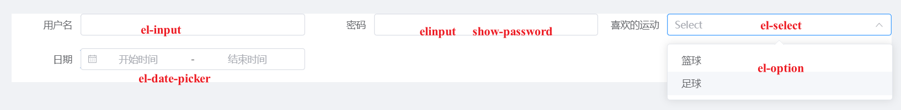 

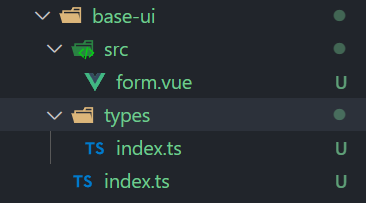 

* base-ui/types/index.ts  HyForm组件的 props 配置选项数组的 IFormItems ts类型

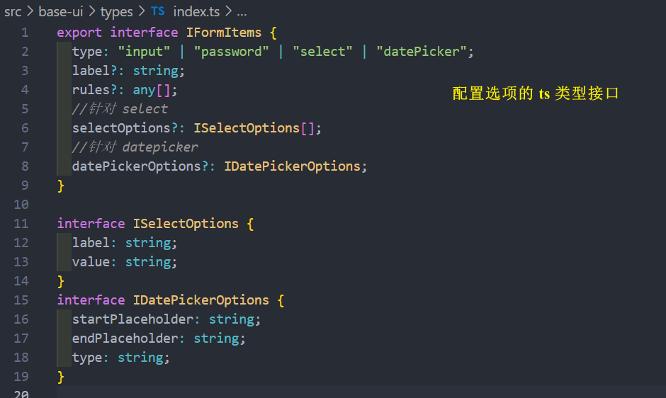 

* user.vue  props 传的是 IFormItems[] 数组 

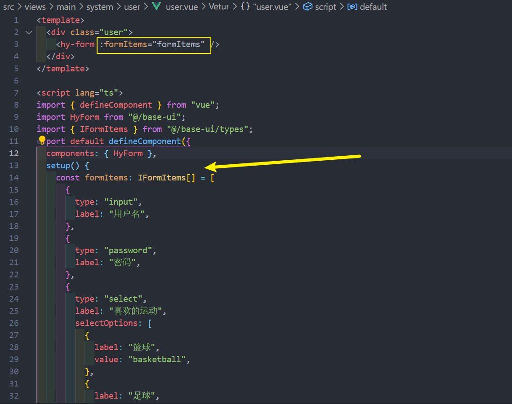 
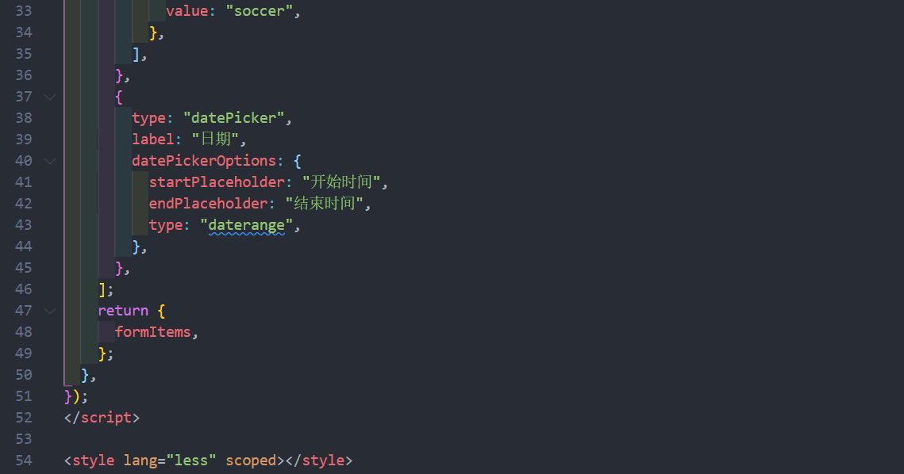 

* base-ui/src/form.ts

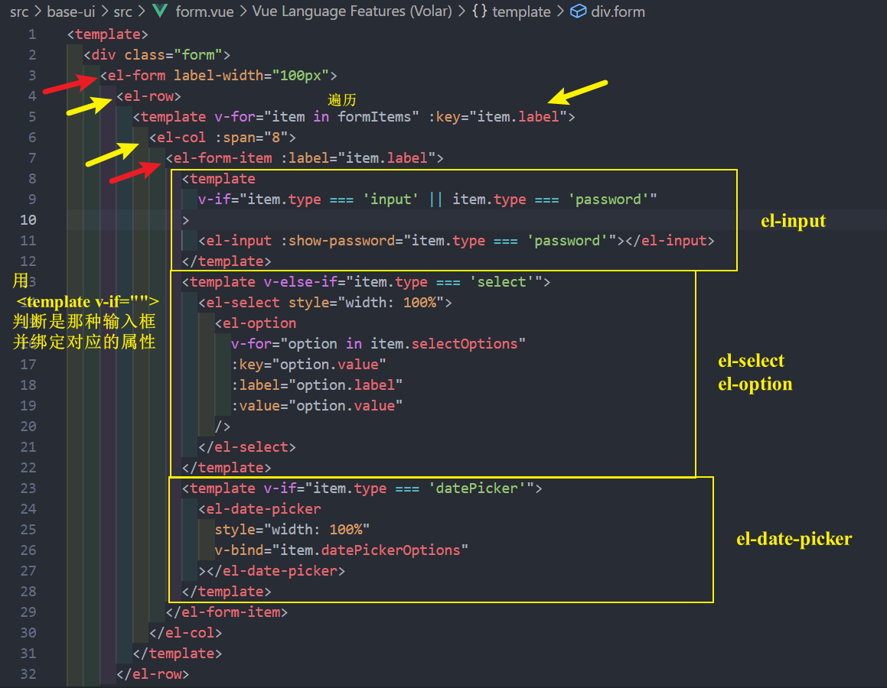 
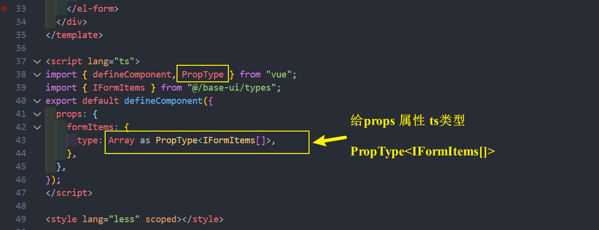  

## 用户页 - HyForm的其他 props 封装和配置文件

* form.vue 其他的 props 
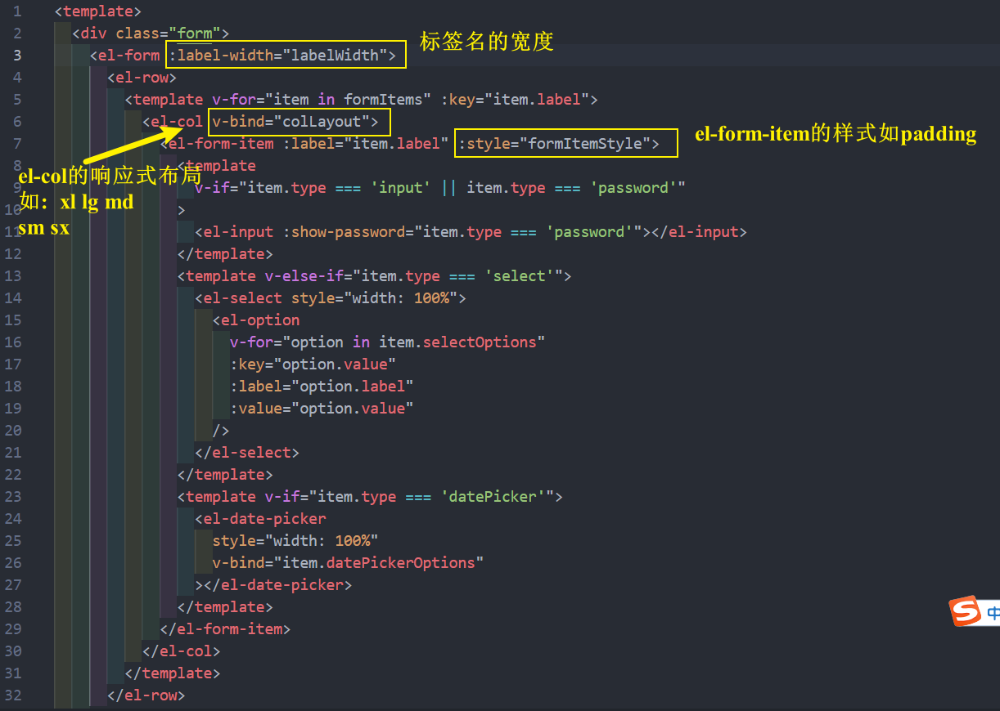
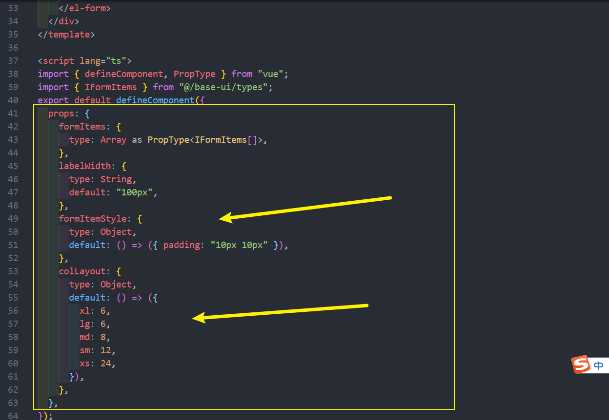

* base-ui/types/index.ts 
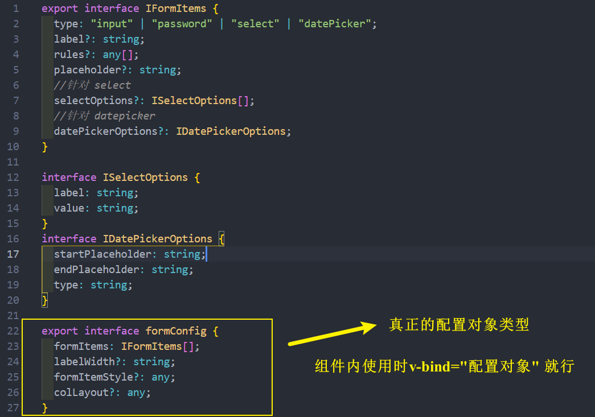

* user.vue  使用组件 
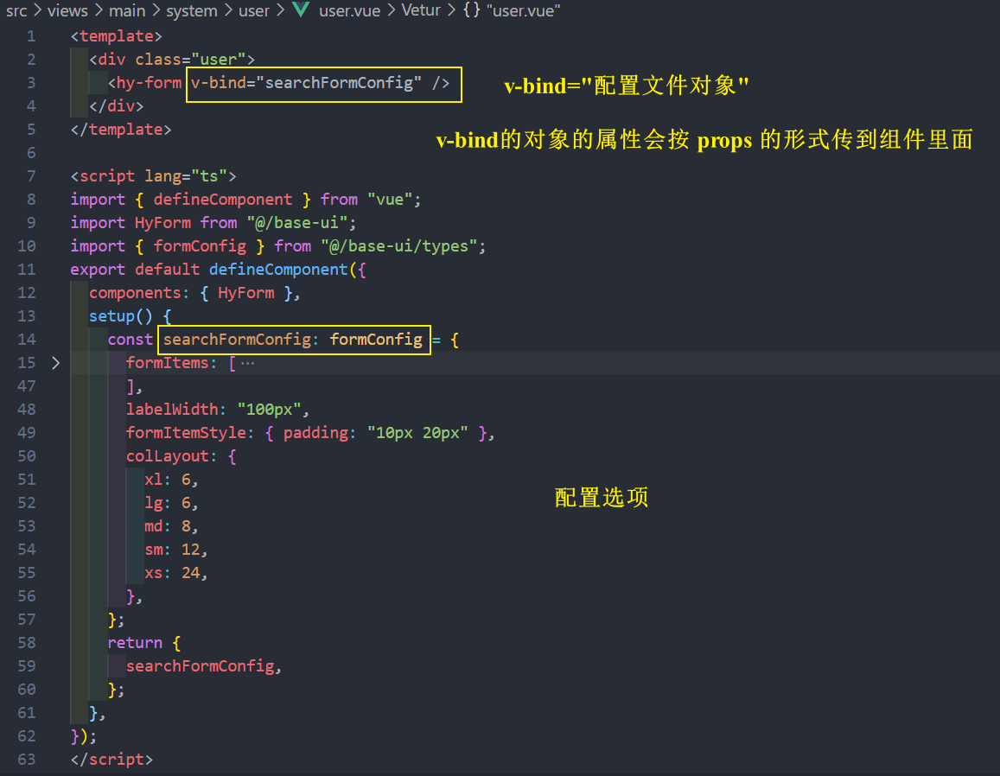

当然 searchFormConfig 配置对象可以单独抽出来 , 放在一个配置文件中即可 
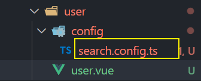
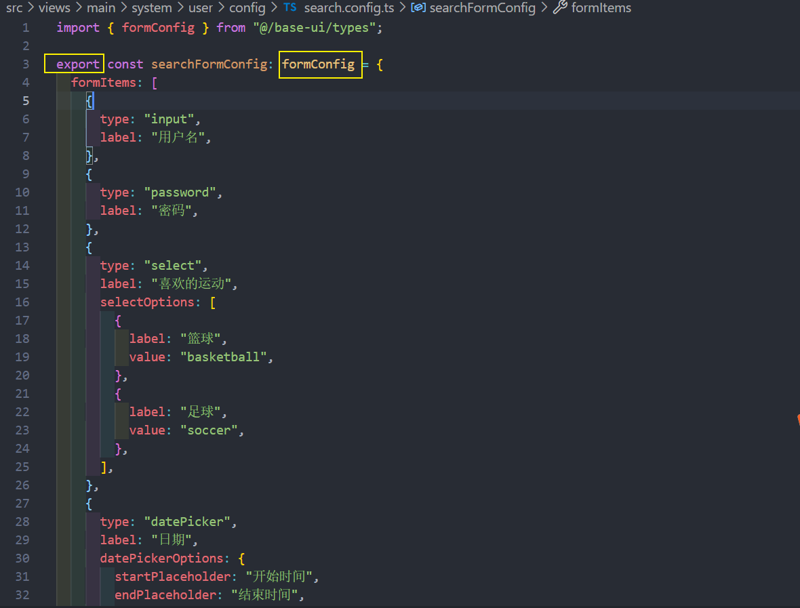

直接导入配置文件即可
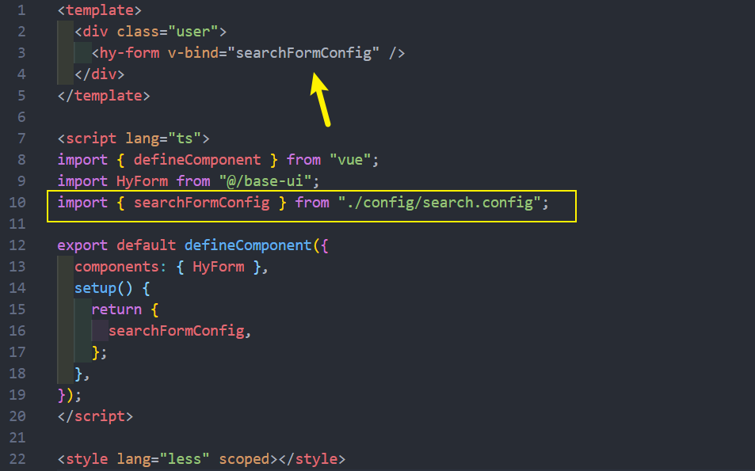
