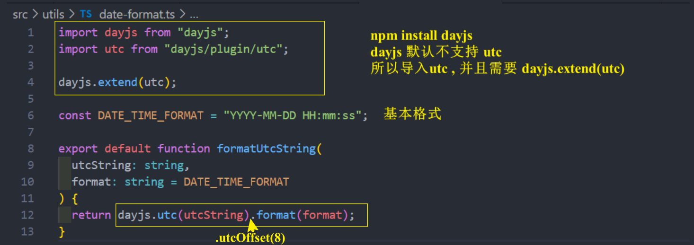

# 项目 3
## 用户页 - HyForm 的基本封装
使用时通过 props 传的是 配置选项数组 

 

 

* base-ui/types/index.ts  HyForm组件的 props 配置选项数组的 IFormItems ts类型

 

* user.vue  props 传的是 IFormItems[] 数组 

 
 

* base-ui/src/form.ts

 
  

## 用户页 - HyForm的其他 props 封装和配置文件

* form.vue 其他的 props 

* base-ui/types/index.ts 

* user.vue  使用组件 

当然 searchFormConfig 配置对象可以单独抽出来 , 放在一个配置文件中即可 

直接导入配置文件即可

## HyForm 实现双向绑定
要把各各输入框需绑定的初始值以对象**绑定到 v-model**

* user.vue 

* form/types/index.ts 配置文件ts类型中添加 field 类型

* form/src/form.vue  注意看 

## user数据的获取和 Vuex system模块中数据保存
* user.vue  在组件内调 system 模块的 action 获取用户列表数据

 

* store 创建 system 模块 

 
* store  system.ts   Vuex system 模块 , 定义 actions 网络请求获取用户列表数据

 
 

封装网络请求

* service/system/system.ts  封装 getPageListData 函数

还有要把 ISystemState 类型添加到 IStoreType 类型( 在store.state.system.xxx的时候会有提示 )

setup() 中获取Vuex数据
 

## HyTable 的基础封装 
最初效果
 
* 目录结构
  
* table.vue
  
* user.vue 使用组件
 
  
  
## HyTable 的动态插槽啊和作用域插槽 
propList 添加 slotName在使用具名插槽对应的名字
  

table.vue  细品
  

user.vue 使用组件时 
  

展示这种效果 

  
## utc 时间格式化 

时间格式化这个功能的函数有可能在其他组件频发使用,  所以要以 app.use(xxx) 插件的形式添加到全局
 

具体 formatUtcString 函数的实现 

 
 

在组件内部使用时  

 

## HyTable的 序号-选中-操作列
* **序号**  : el-table-column的 type 设置为 index , 会显示序号
 
user.vue 

 

table.vue 
 
 
* 选中 : el-table-column的 type 设置为 selection , 则显示多选框 (跟上面同理)
 
user.vue

table.vue

- 操作项 

user.vue 

## HyTable的header插槽和footer插槽的封装
table.vue 

## elementPlus的中文国际化处理
[国际化](https://element-plus.gitee.io/zh-CN/guide/i18n.html#%E5%85%A8%E5%B1%80%E9%85%8D%E7%BD%AE)

App.vue 

