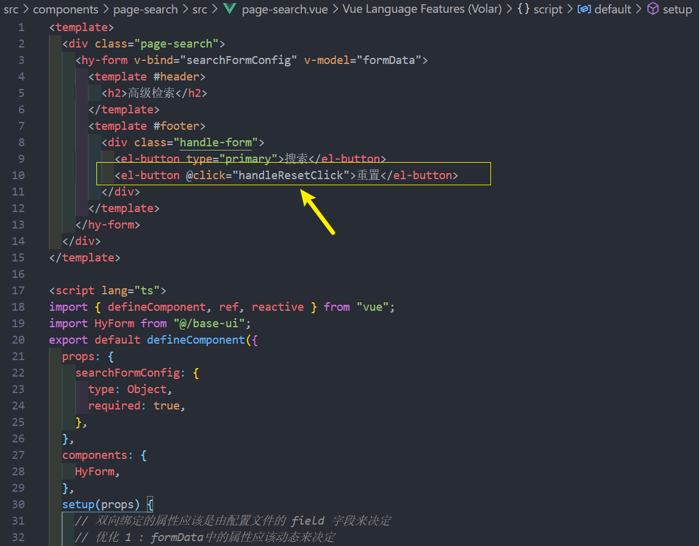
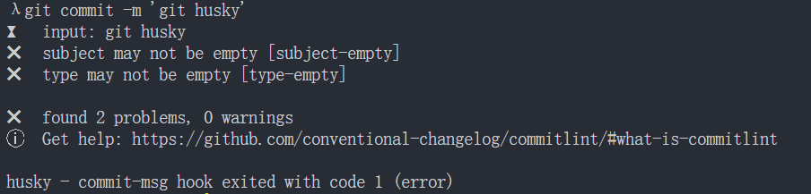

# 项目 4

## Vuex 中不同页面数据处理

单独封装 PageContent 的目的是 , 在不同页面中通过 props 传对应请求 url 的字段的方式让 pageContent 提交action时payload中传入字符串让Vuex 自动拼接字符串自动获取数据

page-content.vue

store/main/system/system.ts

**然后回到page-content.vue中, 再修改读取 Vuex 里state数据的方式**

**利用 getters 可以返回函数的特性传入参数动态匹配**

page-content.vue

store/main/system/system.ts

## PageSearch 数据的二次处理 
PageSearch中双向绑定的数据有个问题 , 他们是不可以被事先写死的 , 双向绑定的属性应该是由配置文件的 field 字段来决定 

## 重置操作 - HyForm的双向绑定问题
page-search.vue

form.vue  **form 组件内部绑定值的时候不用 v-model 语法糖, 采用原始的绑定方法**

**理清思路** : 在外部赋值 formData的属性为空字符串 , 因为是v-model, 传入组件的props属性 modelValue 被修改 , modelValue被修改 , form 组件内绑定的 :model-value 被修改 , 模板上就触发 @update:modelValue , 所以监听事件并用函数版最新的属性值**合并**, 再用 emit 通知给外面   

## 查询操作 - 根据条件查询结果

现在网络请求在page-content里 , 现在我在 page-search里面点击某个按钮 , 想发送page-content里的网络请求 , 如何做到这一点 ? 

**方法** : 我在点击page-search里某个按钮的时候 , 先把事件传给 user.vue , 因为 user 是他们的父组件 , 然后让user组件调用page-Content里的网络请求函数 , 这样做就行(如上图所示)

page-content.vue 

page-content组件上绑定 ref , 通过 ref 在 user.vue调函数

但是上面这段代码 , 在其他页面中依然会用到 , 所以封装成一个 hook , 减少重复操作 

* 封装 hooks 

* user.vue  组件内使用 , 记得解构并 return 

