#  项目 5 
## 页面数据中的删除操作逻辑
涉及网络请求的都放在 Vuex 里, 比如删除数据... 我只需要调 dispatch 即可

page-content.vue
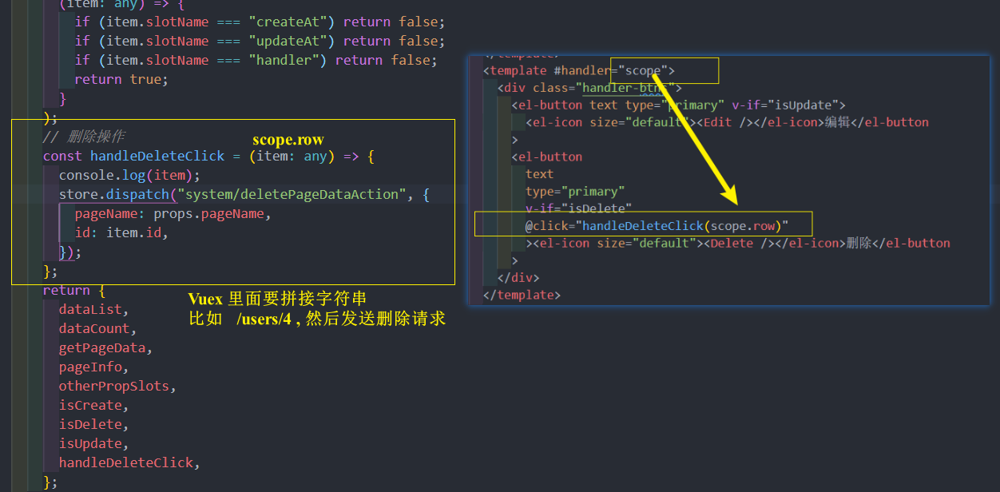
service/main/system.ts
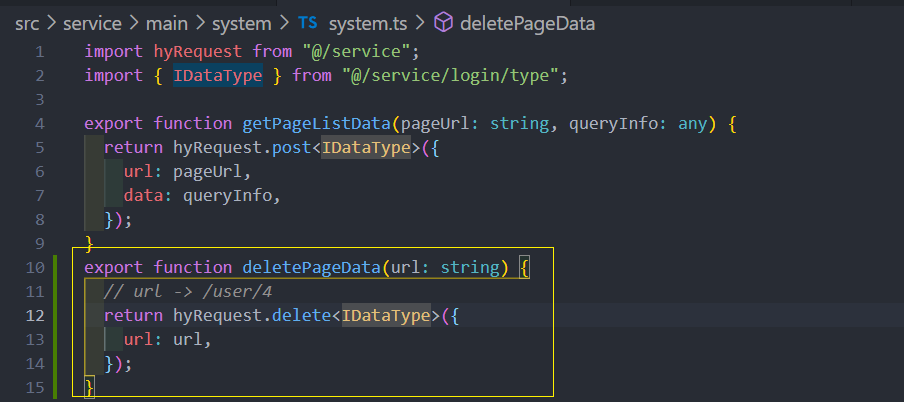
store/main/system/system.ts
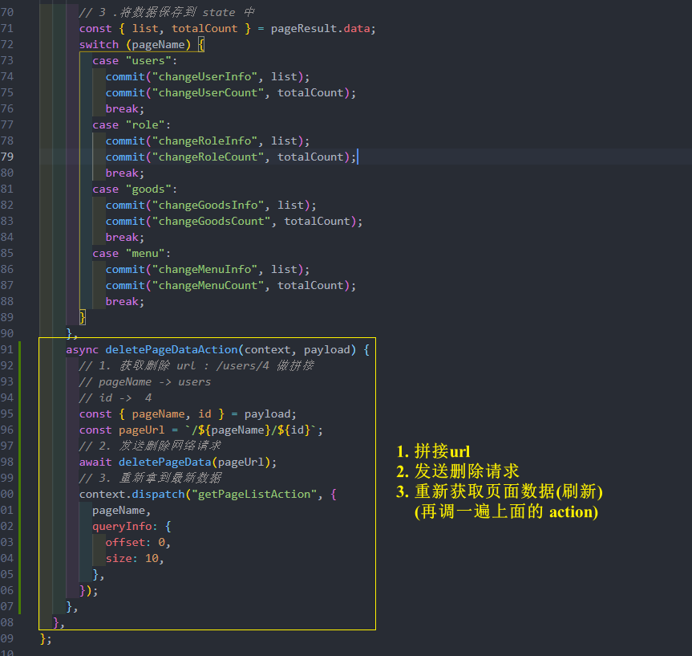

## 页面弹窗的 PageModal 的封装
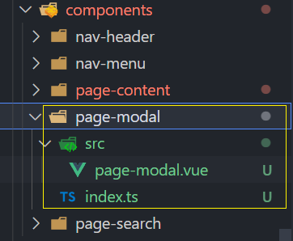
page-modal.vue  PageModal 弹窗的初步封装
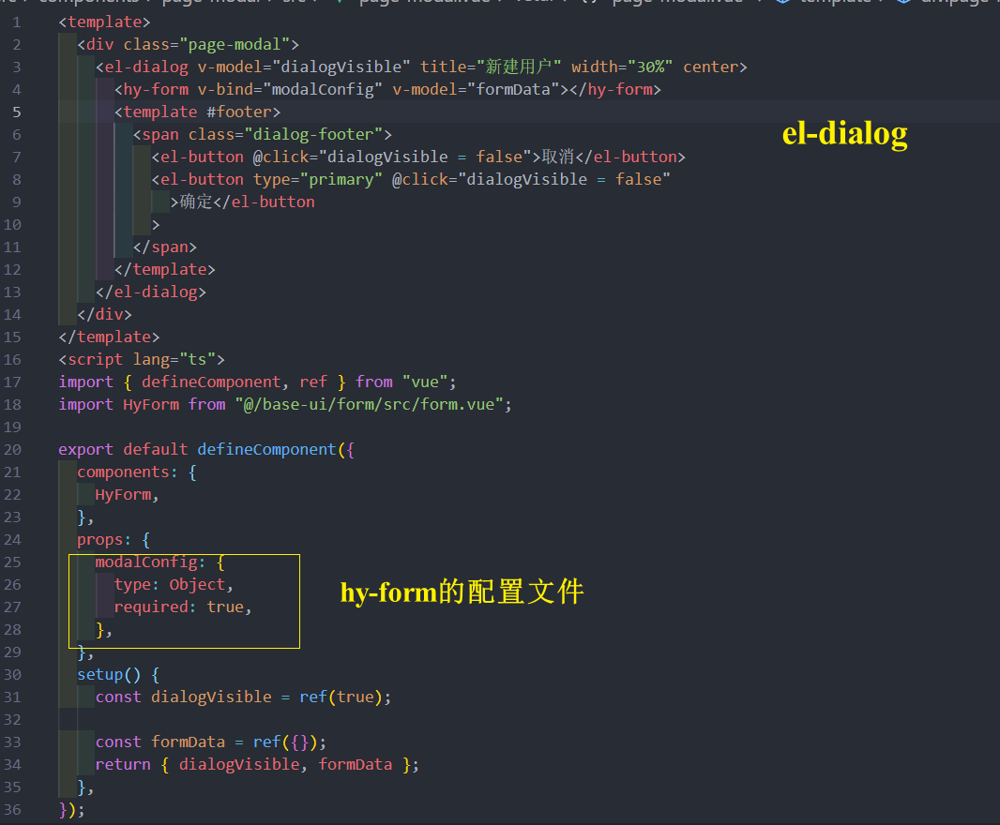
hy-form的配置文件
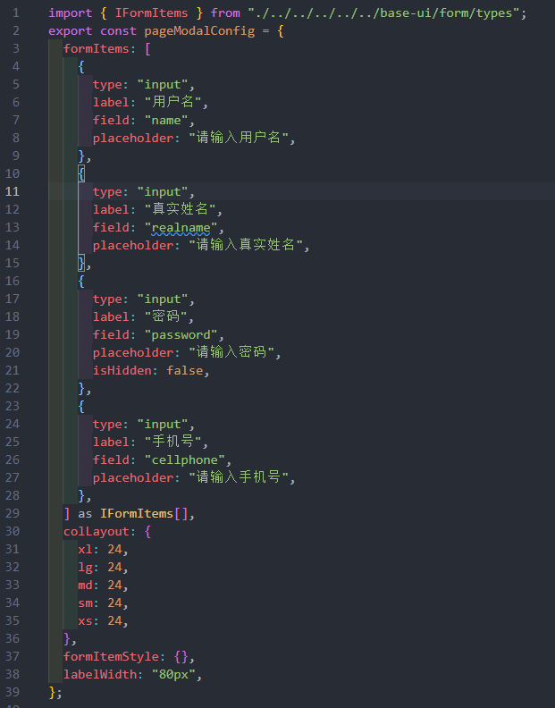
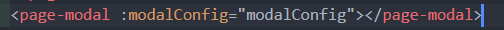

## 新建 / 编辑 按钮逻辑和 hook 的封装
新建用户按钮和编辑按钮在 page-content 组件 , PageModel在父组件 user.vue , 使用常见的触发emit -> 监听 , 在user.vue 用 ref 访问PageModel的数据和方法

**page-content.vue**
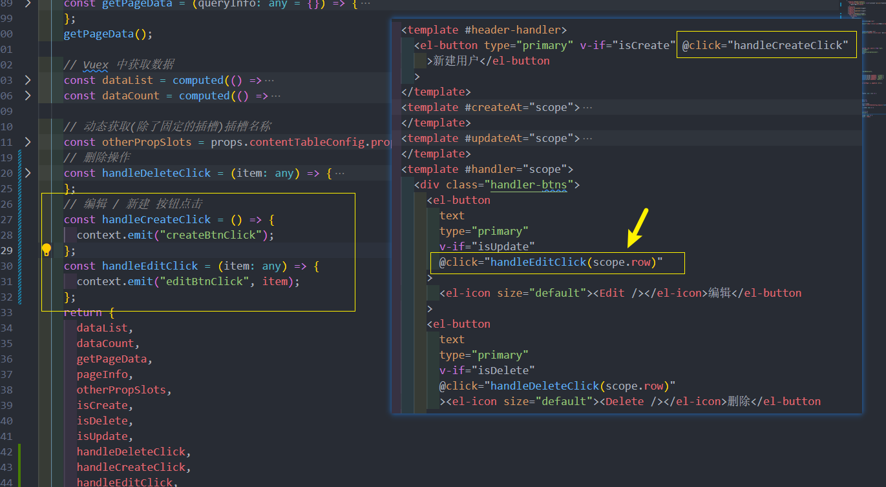
**user.vue**
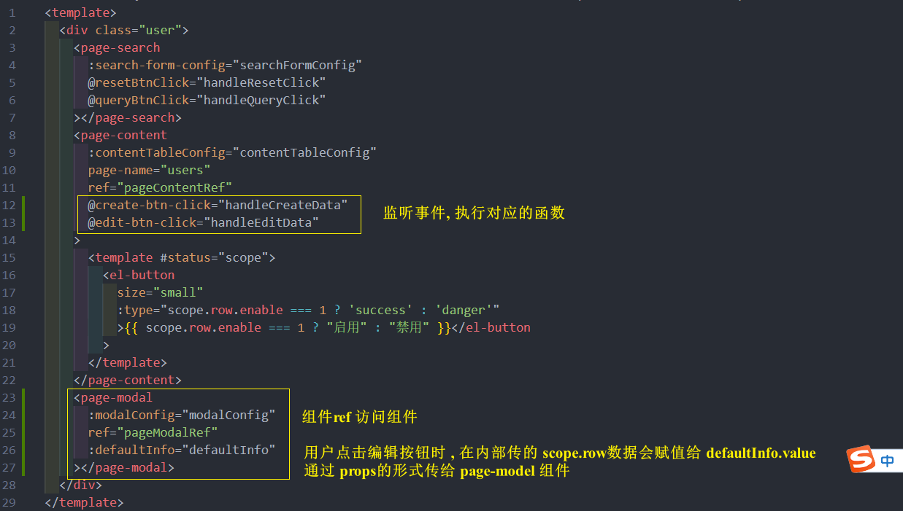
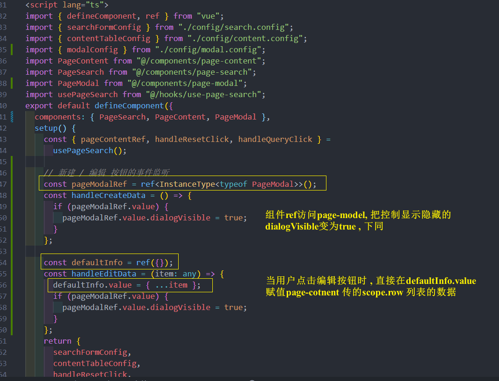

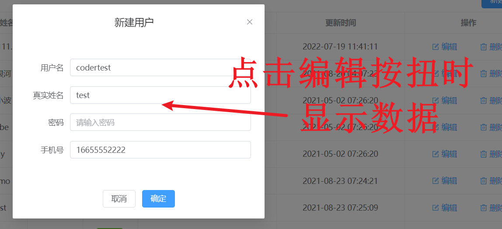
**page-model.vue**
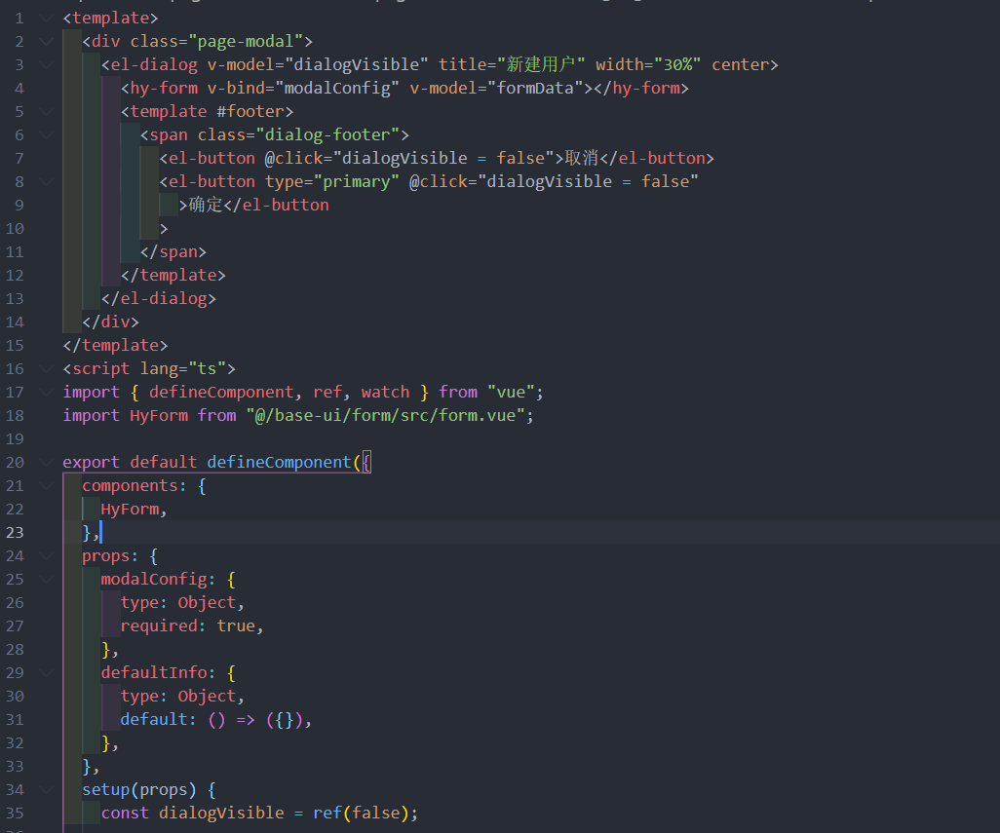
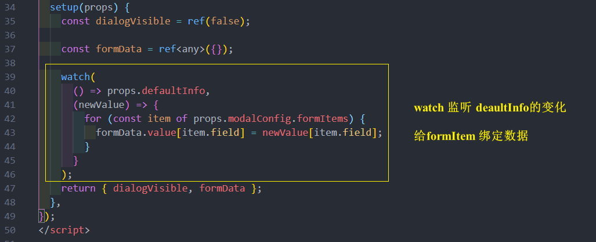

封装成 hook 
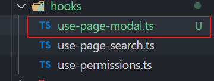
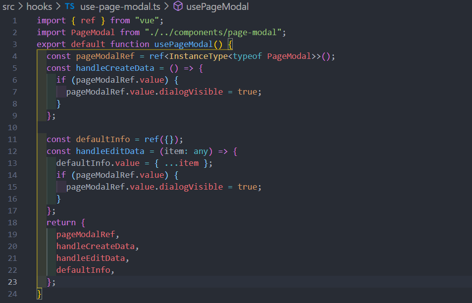

## 密码 Item的显示和隐藏 
公共的逻辑可放在hook里 , 如果是单个页面的逻辑的话应该要放在那个单独的页面里

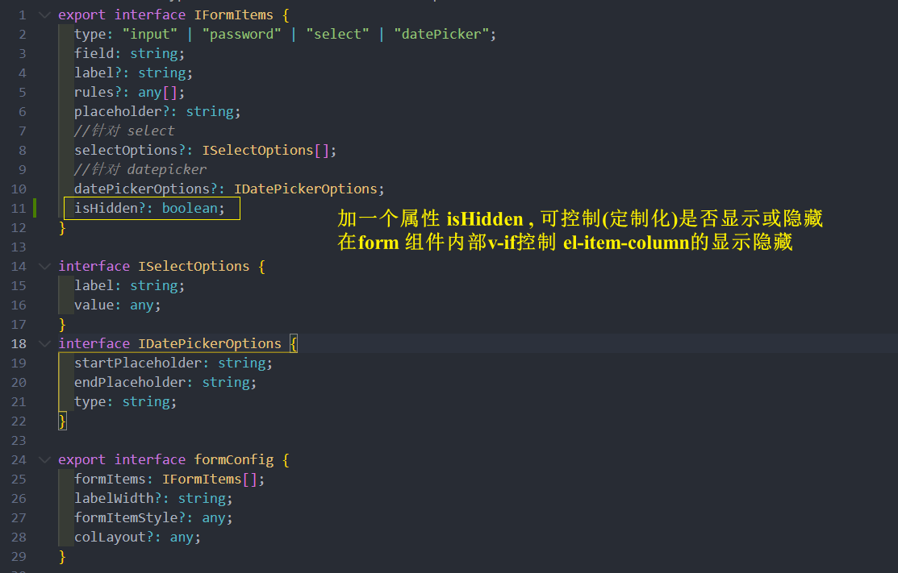
然后在form 组件里  v-if 控制

**单独的逻辑放对应的页面上 , 把回调传到hook中 , hook 里也要通过参数接受回调并调用**

user.vue
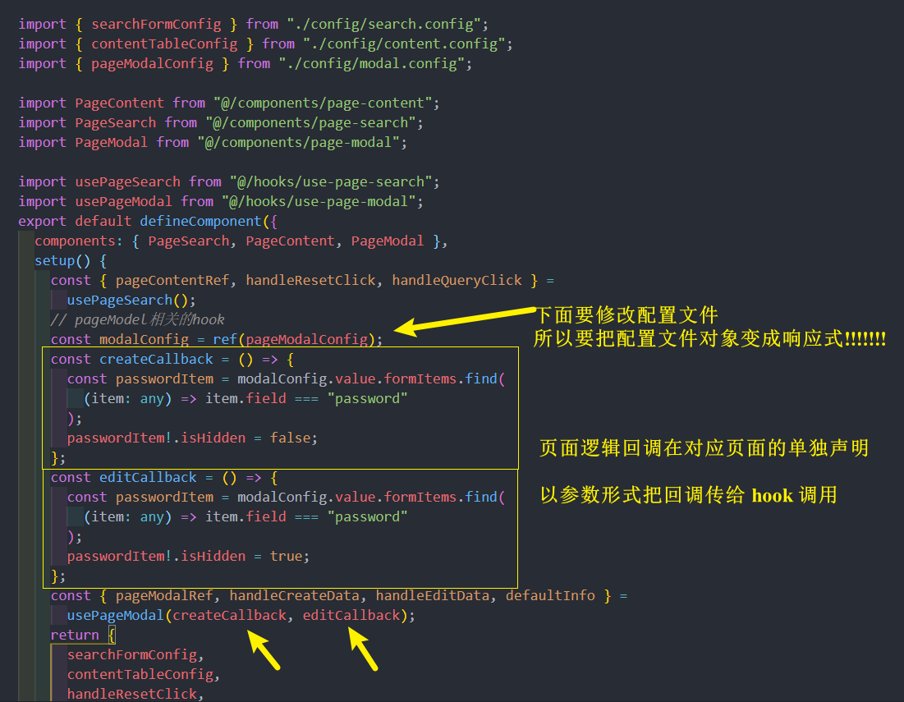
use-page-modal.ts
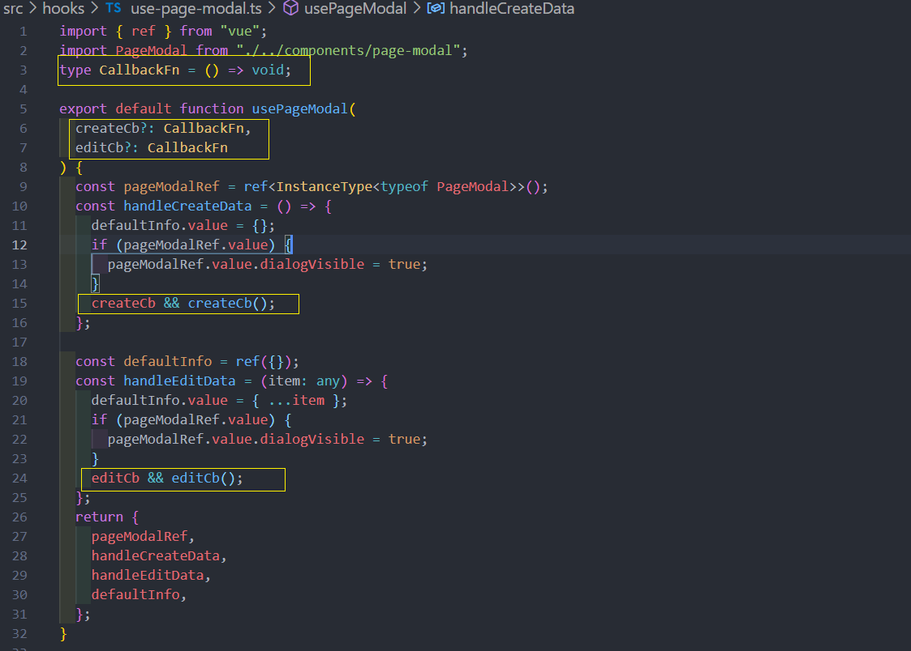
