# axios 封装
创建HYRequest类 , 这个类允许别人创建多个axios实例(默认是一个)  new HYRequest(config) => 对象

```
service 
|-- request 
      index.ts
|--index.ts
```
## HYRequest类最基本封装
在 constructor 里axios.create(config)创建实例。目的是为了在外面传入不同的配置的时候 , 每次会创造新的axios实例 

* request/index.ts
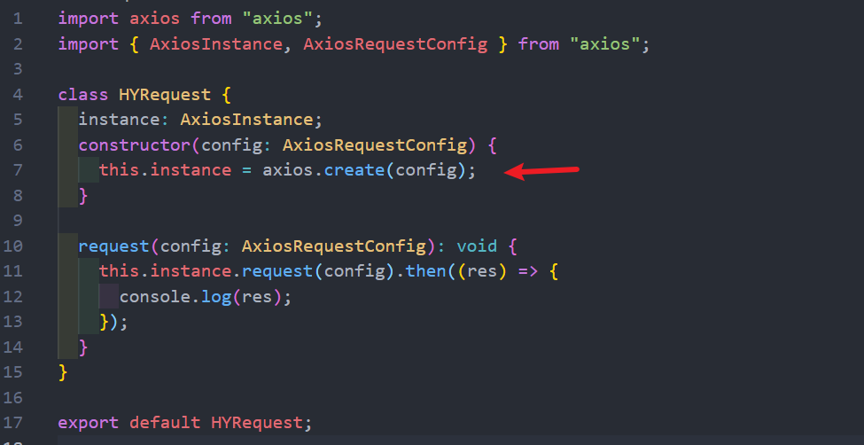
service/index.ts  创建实例
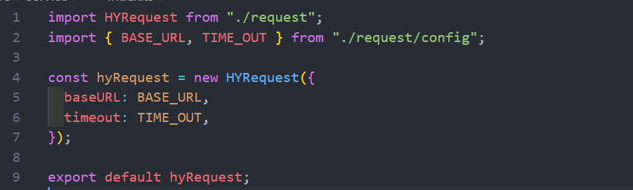
## HYRequest请求config拦截器的封装
希望在new一个axios对象并传入 config 的时候 , 想要传入自定义的拦截器, 如下图
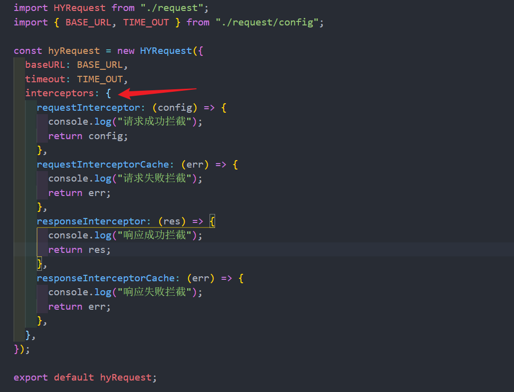

* request/index.ts

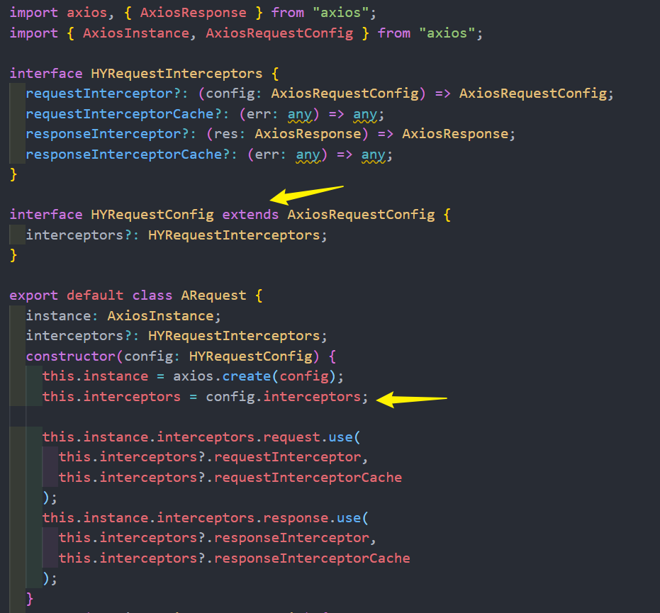
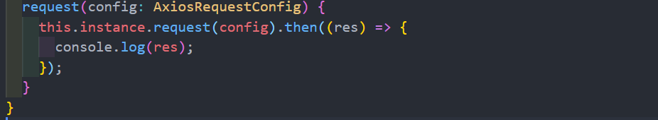

## 封装全局的拦截器和 request 单独的拦截器
* 封装每个实例都拥有的拦截器
* axios实例.request(config) 中想要在 config 里配置单独的拦截器 (如下图)

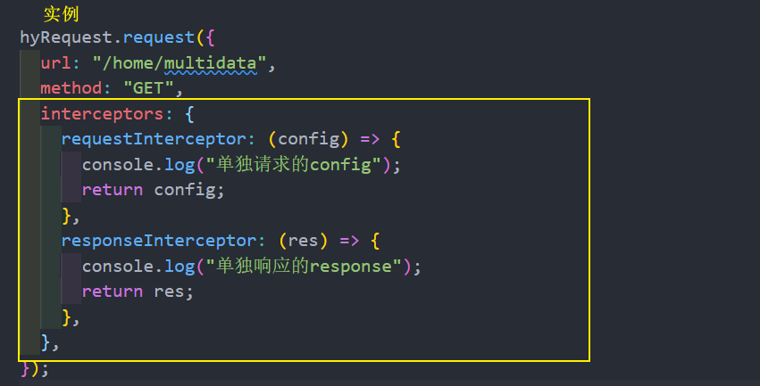

封装

* request/index.ts
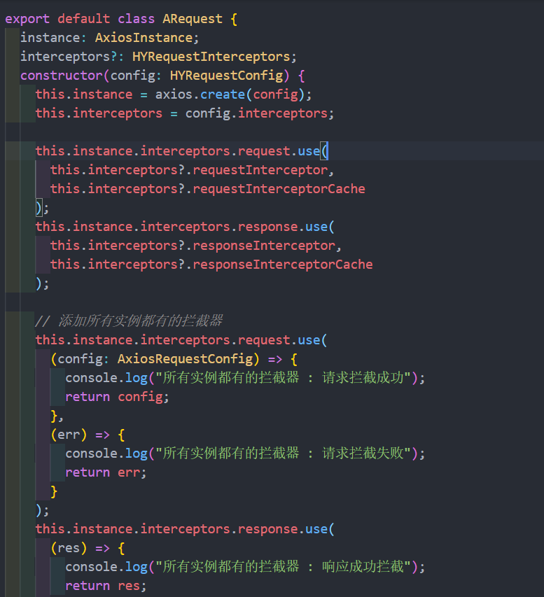
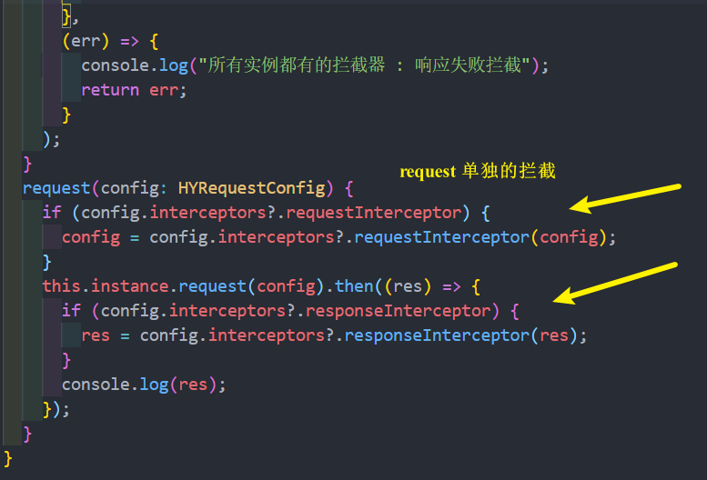


## 拦截器的应用 token-data-error 
* 携带 token 的拦截 

请求都会拦截一下, 先获取一下token, 如过有token的情况下, 把token自动给他携带过去 , 这就意味着我以后的请求自动会携带token的
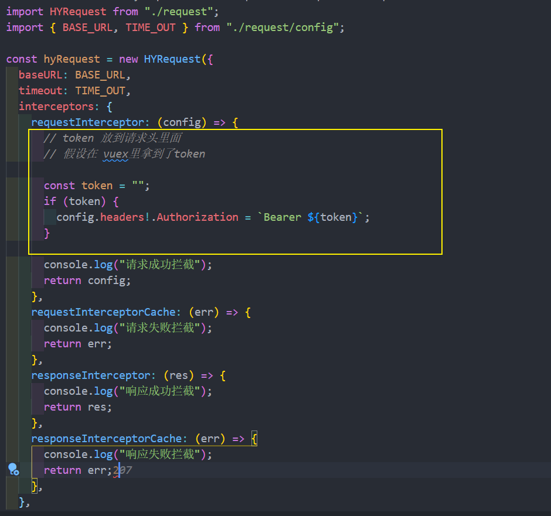

* data

这是axios内部自己封装的对象(如下图) , 真正的数据会在 data 属性里面
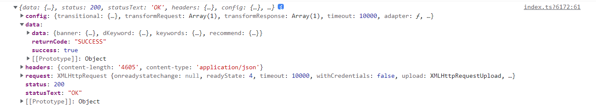

来到全局的响应拦截器里面, 其实真正需要返回的是 res.data
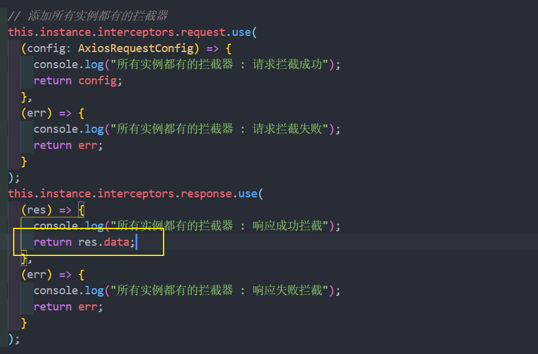
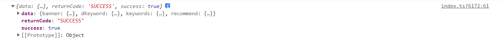

* error 的处理
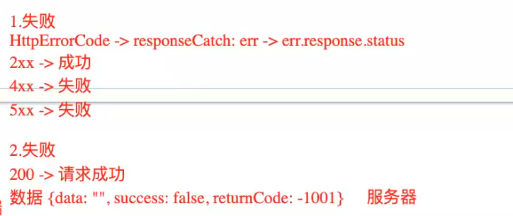
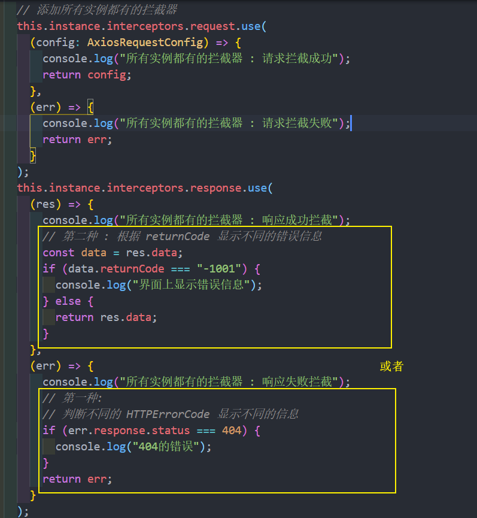

## 拦截器- loading 组件的显示和隐藏
想要实现请求的 loading 效果, 用到了element-plus的 [loading 组件](https://element-plus.gitee.io/zh-CN/component/loading.html#%E4%BB%A5%E6%9C%8D%E5%8A%A1%E7%9A%84%E6%96%B9%E5%BC%8F%E6%9D%A5%E8%B0%83%E7%94%A8)

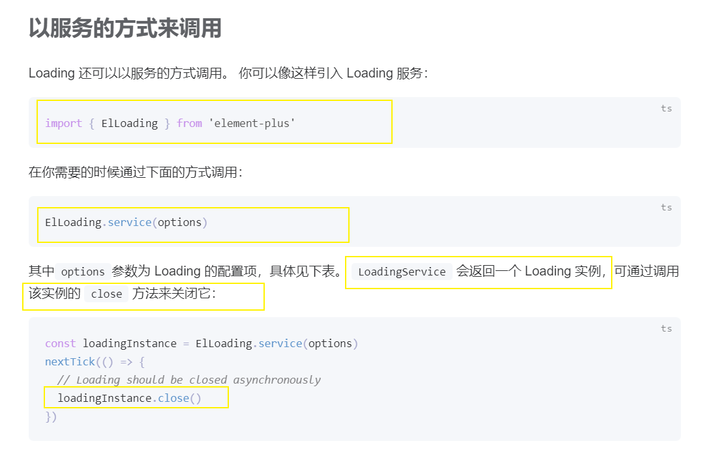
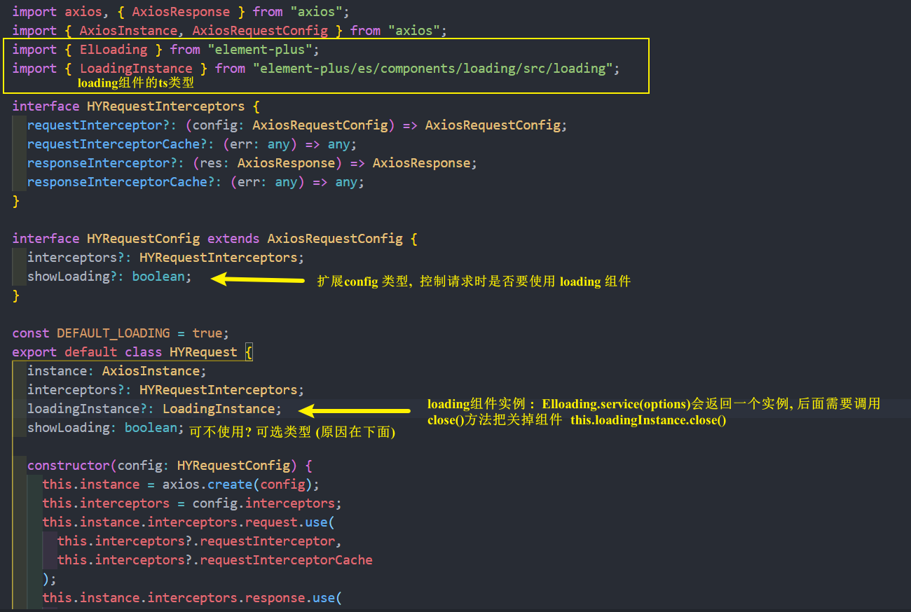
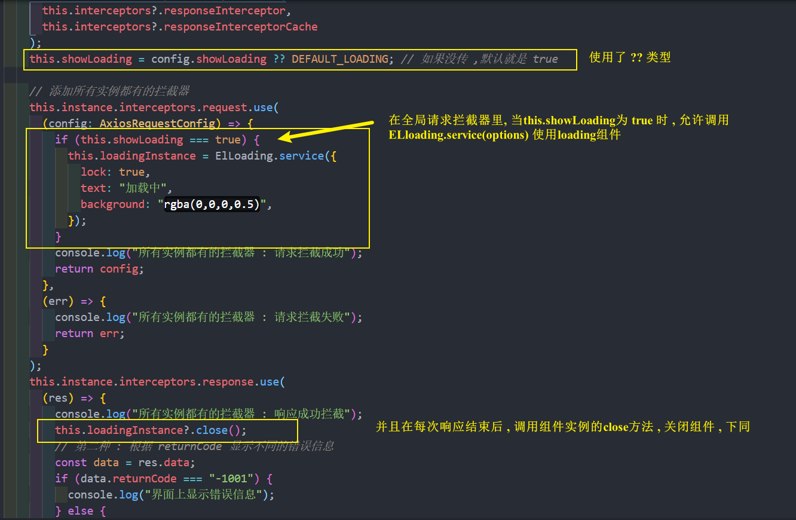
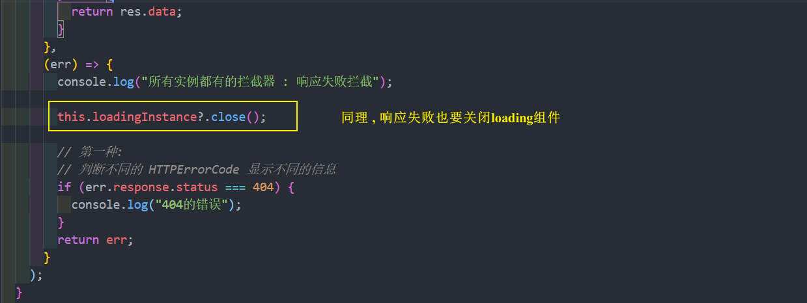


