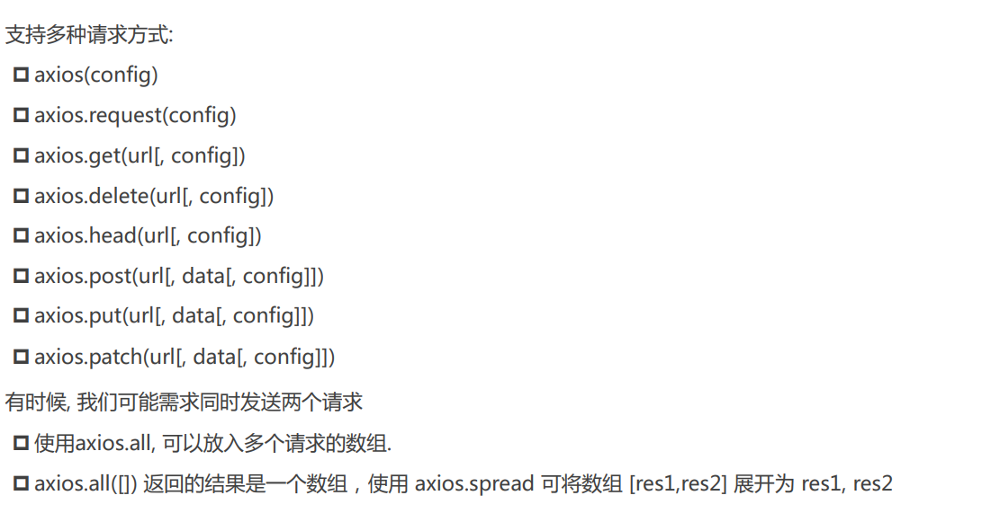
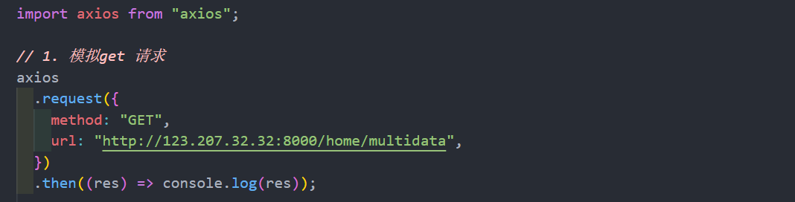
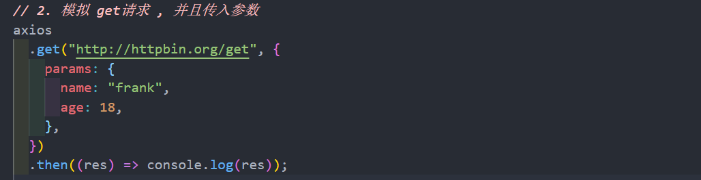
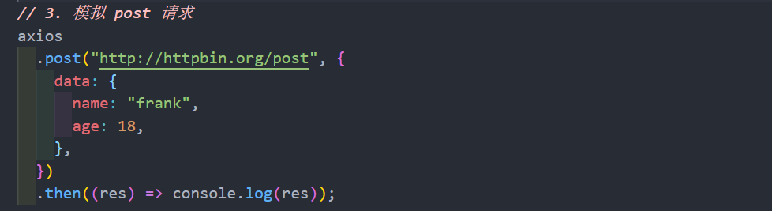
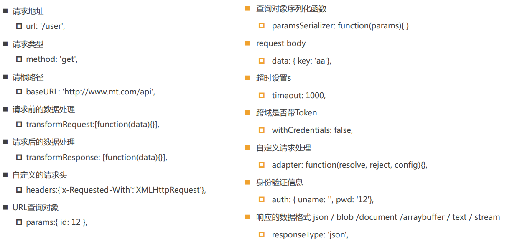
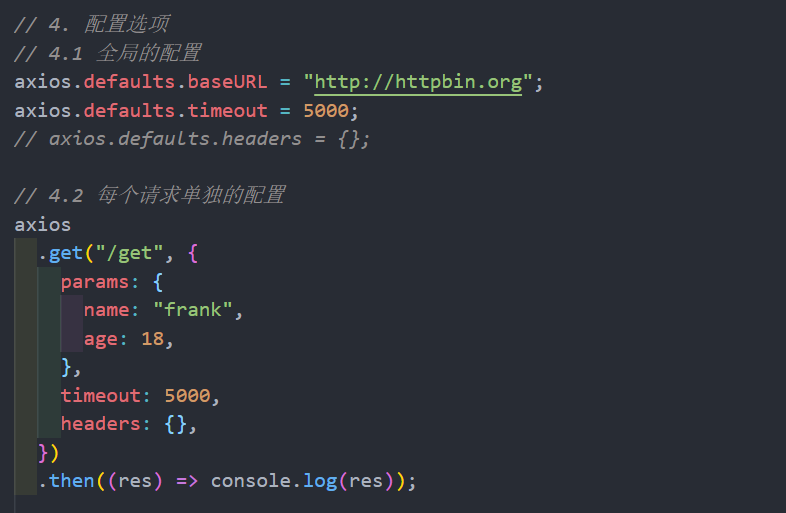
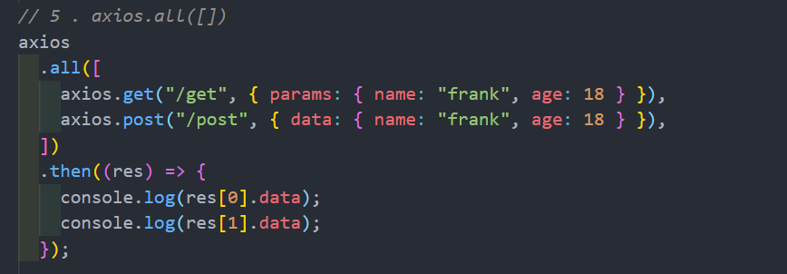
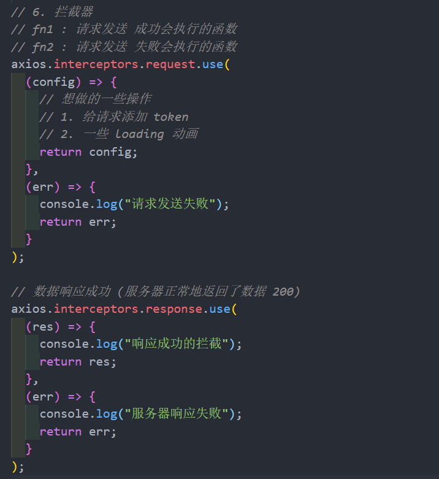
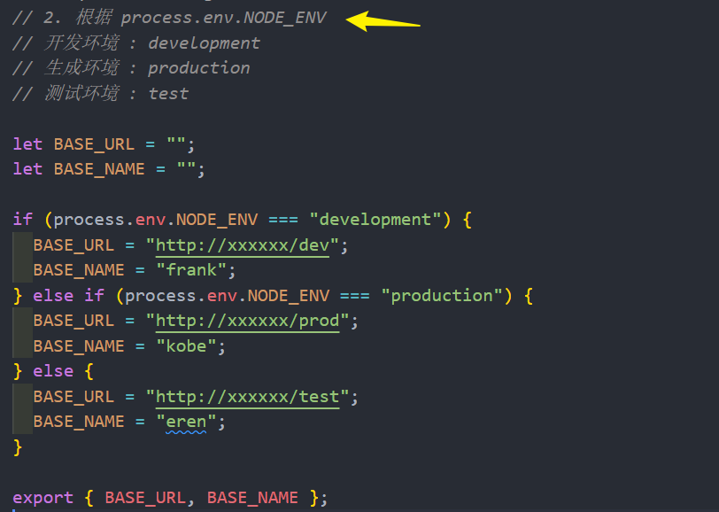

# axios

## 基本使用

axios 的功能特点:

- 在浏览器中发送 XMLHttpRequests 请求
- 在 node.js 中发送 http 请求
- 支持 Promise API
- 拦截请求和响应
- 转换请求和响应数据
- 等等

### 请求方式

简单实例:

### 配置选项

### axios.all([])

### 拦截器

axios 的也可以设置拦截器：拦截每次请求和响应

- axios.interceptors.request.use(请求成功拦截, 请求失败拦截)
- axios.interceptors.response.use(响应成功拦截, 响应失败拦截
  

## 区分不同环境

在开发中，有时候我们需要根据不同的环境设置不同的环境变量，常见的有三种环境：

- 开发环境：development；
- 生产环境：production；
- 测试环境：test；

如何区分环境变量呢？常见有三种方式：

- 方式一 ：手动修改不同的变量
- 方式二 : 根据 process.env.NODE_ENV
  
