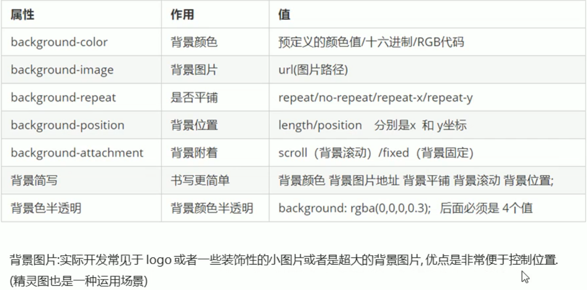

# 背景 
## 背景颜色 
```css
background-color: 颜色值;
```
默认颜色为 transparent(透明的) 
## 背景图片
**background-image** 属性描述了元素的背景图像。 优点: 非常方便控制位置(精灵图也是一种运用场景)
```css
/*不能落下 url()*/ 
background-image: url(images/logo.png);
```

## 背景平铺 
对背景图片进行平铺, 可以使用 **background-repeat** 属性
```css
background-repeat: repeat | np-repeat | repeat-x | repeat-y ;
```


```css
div {
  background-color: pink;
  background-image: url(images/logo.png)
  background-repeat: no-repeat
  /*颜色和图片可以一起使用, 只不过是图片会压住背景颜色*/
}
```
## 背景图片位置 (重要)
利用 **background-position** 属性可以改变图片在背景中的位置
```
background-position: x  y ;
```
参数: x 坐标和 y 坐标 , 可以使用 **方位名词** 和 **精确单位**


1. 参数是方位名词 
* 如果指定的两个词都是方位名词, 则两个次的顺序无关 , 比如 center top 和 top center 
* 如果只制定了一个方位名词, 另一个省略, 那么另一个值默认居中对其


2. 精确单位 
* 如果参数是精确坐标, 那么 第一个肯定是 **x坐标**, 第二个肯定是 **y坐标**
* 如果只指定一个数值, 那么该值一定是 x坐标,  另一个默认垂直居中


3. 混合单位 


## 背景固定 
**background-attachment** 属性是否固定或者随着页面的其余部分滚定
```css
background-attachment: scroll | fixed ;
```

## 背景复合写法(简写)


## 背景半透明 
```css
background:rgba(0 , 0 , 0 , 0.3);
```
* 最后一个参数是 alpha 透明度, 取值范围在 0 ~ 1 之间
* 注意: 背景半透明指的是盒子的背景半透明, 盒子里面的内容不受影响

## 总结 


