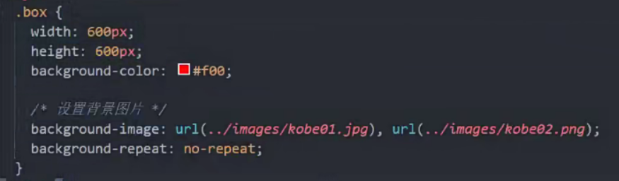
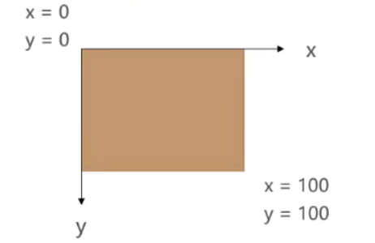
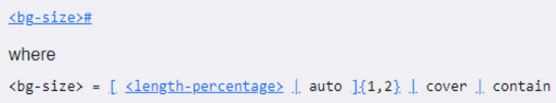
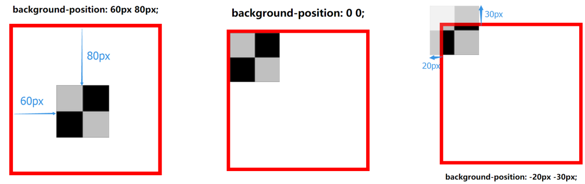
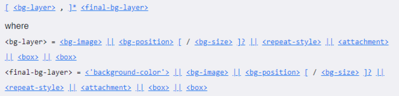
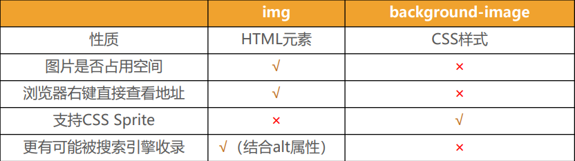

# CSS设置背景
## background-image
background-image用于设置元素的背景图片
* *会 **盖在(不是覆盖)** background-color的上面*

如果设置了多张图片
* *设置的第一张图片将显示在最上面，其他图片按顺序层叠在下面*

**注意：如果设置了背景图片后，元素没有具体的宽高，背景图片是不会显示出来的**

所以 , 一般给 行内元素 加上 display:inline-block; 转换成 行内块元素后, 给他们一些具体的宽高 (使用精灵图)


## background-repeat
background-repeat用于设置背景图片是否要平铺

常见的设值有
*  repeat：平铺(默认值)
*  no-repeat：不平铺
*  repeat-x：只在水平方向平铺
*  repeat-y：只在垂直平方向平铺



## background-size
background-size用于设置背景图片的大小
* auto：默认值, 以背景图本身大小显示
* cover：缩放背景图，以完全覆盖铺满元素,可能背景图片部分看不见
* contain：缩放背景图，宽度或者高度铺满元素，但是图片保持宽高比
* `<percentage>`：百分比，相对于背景区（background positioning area）
* length：具体的大小，比如100px



## background-position
background-position用于设置背景图片在水平、垂直方向上的具体位置
* 可以设置具体的数值 比如 20px 30px;
* 水平方向还可以设值：left、center、right
* 垂直方向还可以设值：top、center、bottom
* 如果**只设置了1个方向，另一个方向默认是center**



## background-attachment
background-attachment决定背景图像的位置是在视口内固定，或者随着包含它的区块滚动。

可以设置以下3个值
* scroll：此关键属性值表示背景相对于元素本身固定， 而不是随着它的内容滚动
* local：此关键属性值表示背景相对于元素的内容固定。如果一个元素拥有滚动机制，背景将会随着元素的内容滚动.
* fixed：此关键属性值表示背景相对于视口固定。即使一个元素拥有滚动机制，背景也不会随着元素的内容滚动。
## background



background-size可以省略，如果不省略，/background-size必须紧跟在background-position的后面

其他属性也都可以省略，而且顺序任意

比较常见的用法 : 
```css
.xxx {
  background:url(./img/logo-sprite.png) no-repeat center center;
  // 或
  background:url(./img/logo-sprite.png) no-repeat -30px 0;
}
```
## background-image 和 img对比


总结
* img，作为网页内容的重要组成部分，比如广告图片、LOGO图片、文章配图、产品图片
* background-image，可有可无。有，能让网页更加美观。无，也不影响用户获取完整的网页内容信息