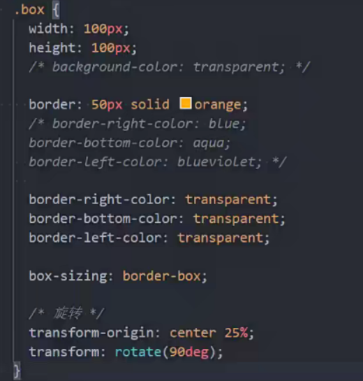
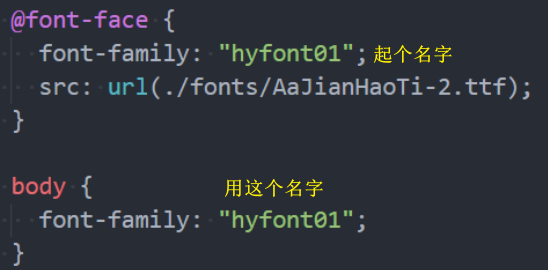
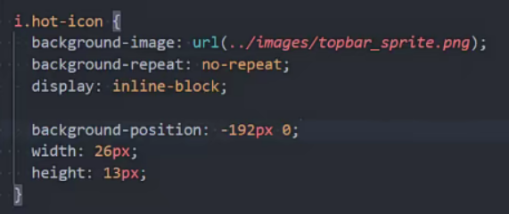
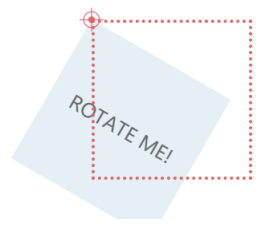
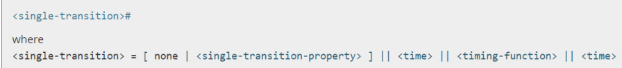
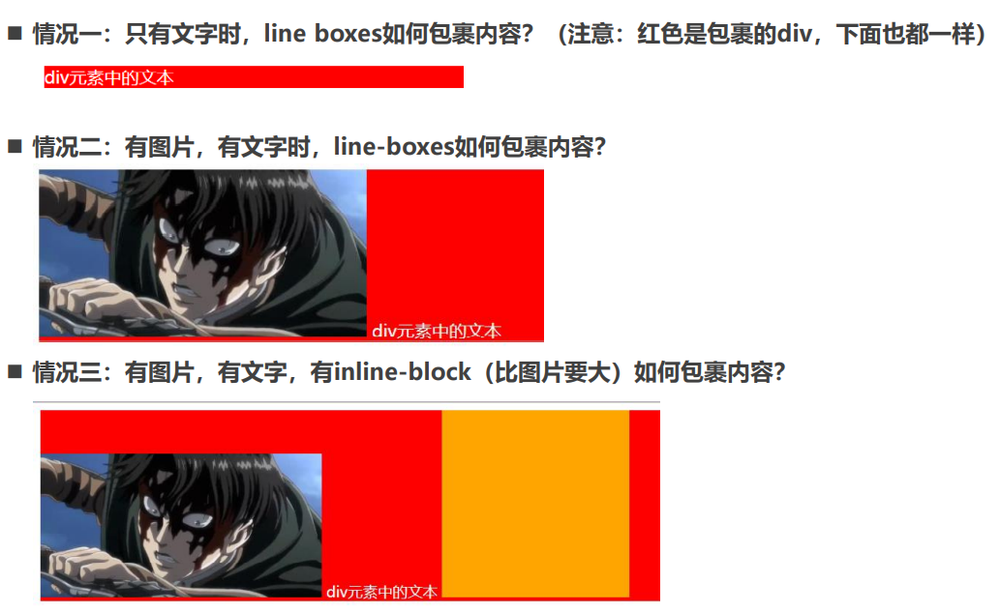
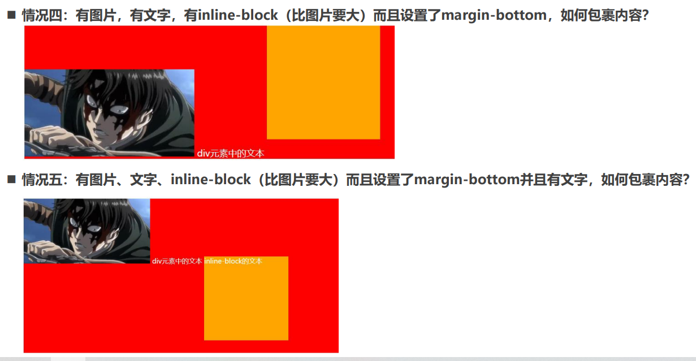

# 额外知识
## 三角

利用border或者CSS的特性我们可以做出很多图形:
[https://css-tricks.com/the-shapes-of-css/#top-of-site](https://css-tricks.com/the-shapes-of-css/#top-of-site)

<!-- ## 使用 Web fonts
为了学习, 如下方式获取字体

第一步：在字体天下网站下载一个字体
* [https://www.fonts.net.cn/fonts-zh-1.html](https://www.fonts.net.cn/fonts-zh-1.html)
* 默认下载下来的是ttf文件；

第二步：使用字体；

使用过程如下：
* 1.将字体放到对应的目录中
* 2.通过`@font-face`来引入字体, 并且设置格式
* 3.使用字体

**注意: @font-face 用于加载一个自定义的字体;**

## web-fonts的兼容性
刚才使用的字体文件是 .ttf, 它是TrueType字体.

* 在开发中某些浏览器可能不支持该字体, 所以为了浏览器的兼容性问题, 需要有对应其他格式的字体;

TrueType字体：拓展名是 .ttf
* OpenType/TrueType字体：拓展名是 .ttf、.otf，
建立在TrueType字体之上
* Embedded OpenType字体：拓展名是 .eot，
OpenType字体的压缩版
* SVG字体：拓展名是 .svg、 .svgz
* WOFF表示Web Open Font Format web开放字体：
拓展名是 .woff，建立在TrueType字体之上

提供一个网站来生产对应的字体文件:
* [https://font.qqe2.com/#](https://font.qqe2.com/#) 暂时可用 -->

## CSS 精灵国
什么是CSS Sprite
* *是一种CSS图像合成技术，将各种小图片合并到一张图片上，然后利用CSS的背景定位来显示对应的图片部分*
* 有人翻译为：CSS雪碧、CSS精灵

使用CSS Sprite的好处
* **减少网页的http请求数量，加快网页响应速度，减轻服务器压力**
* **减小图片总大小**
* **解决了图片命名的困扰，只需要针对一张集合的图片命名**

Sprite图片制作（雪碧图、精灵图）
* 方法1：Photoshop, 设计人员提供
* 方法2：[https://www.toptal.com/developers/css/sprite-generator](https://www.toptal.com/developers/css/sprite-generator)

### 精灵图的使用
精灵图如何使用呢?
* 精灵图的原理是通过只显示图片的很小一部分来展示的;
* **通常使用背景:**
   * ✓ 1.设置对应元素的宽度和高度
   * ✓ 2.设置精灵图作为背景图片
   * ✓ 3.调整背景图片的位置来展示

如何获取精灵图的位置
* [http://www.spritecow.com/](http://www.spritecow.com/)

## cursor
cursor 可以设置鼠标指针（光标）在元素上面时的显示样式

cursor常见的设值有
* **auto**：浏览器根据上下文决定指针的显示样式，比如根据文本和非文本切换指针样式
* **default**：由操作系统决定，一般就是一个小箭头
* **pointer**：一只小手，鼠标指针挪动到链接上面默认就是这个样式
* **text**：一条竖线，鼠标指针挪动到文本输入框上面默认就是这个样式
* **none**：没有任何指针显示在元素上面
## transform
通常 **行内级非替换元素(span , a ...)** 不能进行形变

### 位移 - translate
平移：translate(x, y)

值个数
*  一个值时，设置x轴上的位移
* 二个值时，设置x轴和y轴上的位移

值类型：
* 数字：100px
* 百分比：**参照元素本身**（ refer to the size of bounding box ）

### 缩放 - scale
缩放：scale(x, y)

值个数
* 一个值时，设置x轴上的缩放
* 二个值时，设置x轴和y轴上的缩放

值类型：
* 数字：
  * 1：保持不变
  * 2：放大一倍
  * 0.5：缩小一半
* 百分比：不支持百分比
### 缩放 - rotate
旋转：rotate(deg)

值个数
* 一个值时，表示旋转的角度

值类型：
* deg：旋转的角度
* 正数为顺时针
* 负数为逆时针

**注意：旋转的原点受transform-origin的影响**
### transform-origin
transform-origin：变形的原点

一个值：
* 设置x轴的原点

两个值：
* 设置x轴和y轴的原点

必须是`<length>`，`<percentage>`，或 left, center, right, top, bottom关键字中的一个
* left, center, right, top, bottom关键字
* length：从左上角开始计算
* 百分比：参考元素本身大小

`transform-origin: left top;`

### 倾斜 - skew
旋转：skew(x, y)

值个数
* 一个值时，表示x轴上的倾斜
* 二个值时，表示x轴和y轴上的倾斜

值类型：
* deg：旋转的角度
* 正数为顺时针
* 负数为逆时针

**注意：旋转的原点受transform-origin的影响**
## 过渡动画 - transition
transition CSS 属性是 transition-property，transition-duration，transition-timing-function 和 transition-delay 的
一个简写属性。

transition-property：指定应用过渡属性的名称
* 可以写all表示所有可动画的属性
* 属性是否支持动画查看文档

transition-duration：指定过渡动画所需的时间
* 单位可以是秒（s）或毫秒（ms）

transition-timing-function：指定动画的变化曲线
* [https://developer.mozilla.org/zh-CN/docs/Web/CSS/transition-timing-function](https://developer.mozilla.org/zh-CN/docs/Web/CSS/transition-timing-function)

transition-delay：指定过渡动画执行之前的等待时间

## 关键帧动画

transition来进行过渡动画，但是过渡动画只能控制首尾两个值：
* 从关键帧动画的角度相当于只是定义了两帧的状态：第一帧和最后一帧。
* 如果我们希望可以有更多状态的变化，可以直接使用关键帧动画。

关键帧动画使用@keyframes来定义多个变化状态，并且使用animation-name来声明匹配：
* 1.使用 @keyframes创建一个规则
* 2. @keyframes中使用百分比定义各个阶段的样式
* 3. 通过animation将动画添加到属性上

另外，也可以使用from 和 to关键字：
* from相当于0%
* to相当于100%

### animation 
**CSS animation 属性是 animation-name，animation-duration, animation-timing-function，animation-delay，animationiteration-count，animation-direction，animation-fill-mode 和 animation-play-state 属性的一个简写属性形式。**

* animation-name：指定执行哪一个关键帧动画
* animation-duration：指定动画的持续时间
* animation-timing-function：指定动画的变化曲线
* animation-delay：指定延迟执行的时间
* animation-iteration-count：指定动画执行的次数，执行infinite表示无限动画
* animation-direction：指定方向，常用值normal和reverse
* animation-fill-mode：执行动画最后保留哪一个值
   * none：回到没有执行动画的位置
   * forwards：动画最后一帧的位置
   * backwards：动画第一帧的位置
* animation-play-state：指定动画运行或者暂停（在JavaScript中使用，用于暂停动画）

## vertical-align
**官方文档的翻译：vertical-align会影响 *行内块级元素* 在一个 *行盒* 中垂直方向的位置**

**思考：一个div没有设置高度的时候，会不会有高度？**
* 没有内容，没有高度
* 有内容，内容撑起来高度

**但是内容撑起来高度的本质是什么呢？**
* 内容有行高（line-height），撑起来了div的高度

**行高为什么可以撑起div的高度？**
* 这是因为line boxes的存在，并且line-boxes有一个特性，包裹每行的inline level
* 而其中的文字是有行高的，必须将整个行高包裹进去，才算包裹这个line-level

那么，进一步思考：
* 如果这个div中有图片，文字，inline-block，甚至他们设置了margin这些属性呢？

### vertical-align – 不同情况分析

### vertical-align 的 baseline
**结论：line-boxes一定会想办法包裹住当前行中所有的内容。**

但是，但是为什么对齐方式千奇百怪呢？
* 你认为的千奇百怪，其实有它的内在规律
* 答案就是baseline对齐

**来看官方vertical-align的默认值：没错，就是baseline**

**但是baseline都是谁呢？**
* 文本的baseline是字母x的下方
* Inline-block默认的baseline是margin-bottom的底部（没有，就是盒子的底部）
* Inline-block有文本时，baseline是最后一行文本的x的下方

一切都解释通了
### vertical-align的其他值

* baseline(默认值)：基线对齐（你得先明白什么是基线）
* top：把行内级盒子的顶部跟line boxes顶部对齐
* middle：行内级盒子的中心点与父盒基线加上x-height一半的线对齐
* bottom：把行内级盒子的底部跟line box底部对齐
* `<percentage>`：把行内级盒子提升或者下降一段距离（距离相对于line-height计算\元素高度）， 0%意味着同baseline一样
* `<length>`：把行内级盒子提升或者下降一段距离，0cm意味着同baseline一样

**解决图片下边缘的间隙方法:**
* 方法一: 设置成top/middle/bottom
* 方法二: 将图片设置为block元素

