# 额外知识 (2)
## 新增全局属性 data-*
**在HTML5中, 新增一种全局属性的格式 `data-*`, 用于自定义数据属性:**
* data设置的属性可以在JavaScript的DOM操作中通过**dataset**轻松获取到；
* 通常**用于HTML和JavaScript数据之间的传递**

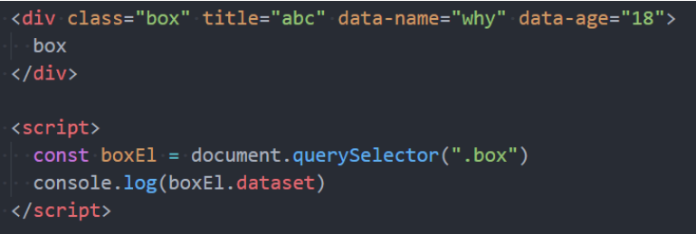

在小程序中, 就是通过data-来传递数据的, 所以该全局属性必须要掌握

## white-space
white-space用于设置空白处理和换行规则

* normal：合并所有连续的空白，**允许**单词超屏时自动换行
* nowrap：合并所有  连续的空白，**不允许**单词超屏时自动换行
* pre：**阻止**合并所有连续的空白，**不允许**单词超屏时自动换行
* pre-wrap：**阻止**合并所有连续的空白，**允许**单词超屏时自动换行
* pre-line：合并所有连续的空白（但保留换行），**允许**单词超屏时自动换行
## text-overflow
text-overflow 通常用来设置文字溢出时的行为
* clip：溢出的内容直接裁剪掉（字符可能会显示不完整）
* ellipsis：溢出那行的结尾处用省略号表示

text-overflow生效的前提是 overflow 不为 visible

常见的是将white-space、text-overflow、overflow一起使用：
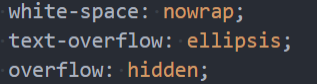

## CSS中的函数
* var: 使用CSS定义的变量;
* calc: 计算CSS值, 通常用于计算元素的大小或位置;
* blur: 毛玻璃(高斯模糊)效果;
* gradient：颜色渐变函数；

### CSS函数 - var
CSS中可以自定义属性
* 属性名需要以两个减号（--）开始;
* 属性值则可以是任何有效的CSS值;

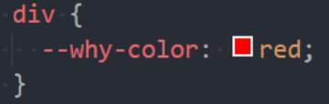

可以通过var函数来使用:

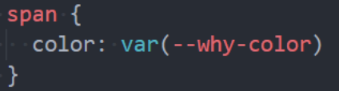

规则集定义的选择器, 是自定义属性的可见作用域(只在选择器内部有效)
* 所以推荐将**自定义属性定义在html**中，也可以使用 **:root 选择器;**

### CSS函数 - calc
calc() 函数允许在声明 CSS 属性值时执行一些计算。
* 计算支持加减乘除的运算；
* + 和 - 运算符的两边必须要有空白字符。
* 通常用来设置一些元素的尺寸或者位置；

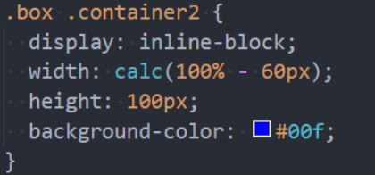

### CSS函数 - blur
blur() 函数将高斯模糊应用于输出图片或者元素;
* blur(radius)
* radius, 模糊的半径, 用于定义高斯函数的偏差值, 偏差值越大, 图片越模糊;

通常会和两个属性一起使用：
* filter: 将模糊或颜色偏移等图形效果应用于元素;
* backdrop-filter: 为元素后面的区域添加模糊或者其他效果;

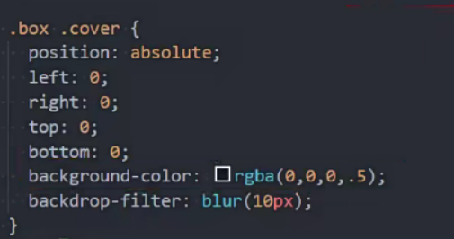
### CSS函数 – gradient
### linear-gradient的使用
linear-gradient：创建一个表示两种或多种颜色线性渐变的图片；
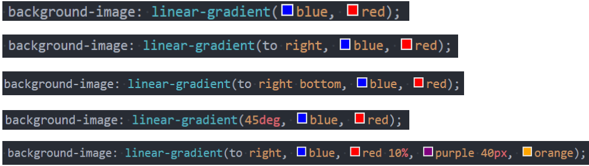

radial-gradient：创建了一个图像，该图像是由从原点发出的两种或者多种颜色之间的逐步过渡组成
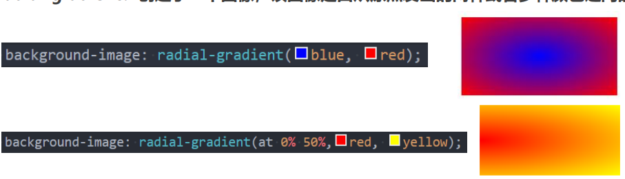
## BFC
块级元素的布局属于Block Formatting Context（BFC）
* 也就是block level box都是在BFC中布局的； 

行内级元素的布局属于Inline Formatting Context（IFC）
* 而inline level box都是在IFC中布局的；

MDN上有整理出在哪些具体的情况下会创建BFC：
* **根元素**（`<html>`）
* 浮动元素（元素的 float 不是 none）
* 绝对定位元素（元素的 position 为 absolute 或 fixed）
* 行内块元素（元素的 display 为 inline-block）
* 表格单元格（元素的 display 为 table-cell，HTML表格单元格默认为该值），表格标题（元素的 display 为 table-caption，HTML表格标题默认为该值）
* 匿名表格单元格元素（元素的 display 为 table、table-row、 table-row-group、table-header-group、table-footer-group（分别是HTML table、
row、tbody、thead、tfoot 的默认属性）或 inline-table）
* overflow 计算值(Computed)不为 visible 的块元素
* 弹性元素（display 为 flex 或 inline-flex 元素的直接子元素）
* 网格元素（display 为 grid 或 inline-grid 元素的直接子元素）
* display 值为 flow-root 的元素

--------------------------------------------------------------------------------------------------
(背)

* 在 BFC 中，box 会在**垂直方向上一个挨着一个的排布**
* **垂直方向的间距由 margin 属性**决定；
* 在同一个BFC中，**相邻两个box之间的margin会折叠（collapse）**；
* 在BFC中，每个元素的**左边缘是紧挨着包含块的左边缘的**；

普通的两个 div 元素是属于同一个 BFC 中, 因为 html根元素它会创建 BFC , 楞个 div的话是处在 html根元素创建的BFC 里面

所以可以在 一个 div 外面包裹另一个 div, 并且加上 overflow:auto , 那么外面包裹的 div 他会创建一个新的 BFC

那么这个东西有什么用呢？
* 解决 margin 的折叠问题
* 解决浮动高度塌陷问题

### BFC的作用一：解决折叠问题
在同一个BFC中，相邻两个box之间的margin会折叠（collapse）
* 官方文档明确的有说
* The vertical distance between two sibling boxes is determined by the 'margin' properties. Vertical margins 
between adjacent block-level boxes in a block formatting context collapse.

那么如果让两个box是不同的BFC呢？那么就可以解决折叠问题

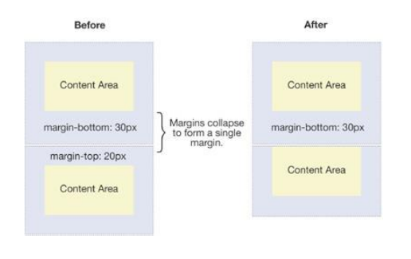

### BFC的作用二：解决浮动高度塌陷

## 媒体查询
媒体查询的使用方式主要有三种：
* 方式一：**通过@media和@import使用不同的CSS规则（常用）；**
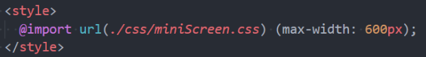
* 方式二：**使用media属性为`<style>, <link>, <source>`和其他HTML元素指定特定的媒体类型；**
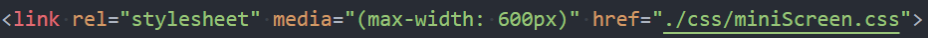
* 方式三：使用Window.matchMedia() 和MediaQueryList.addListener() 方法来测试和监控媒体状态；

比较常用的是通过@media来使用不同的CSS规则，目前掌握这个即可；

### 媒体类型（Media types)
 常见的媒体类型值如下：
* all：适用于所有设备。
* print：适用于在打印预览模式下在屏幕上查看的分页材料和文档。
* **screen（掌握）：主要用于屏幕**
* speech：主要用于语音合成器

### 媒体特性（Media features）
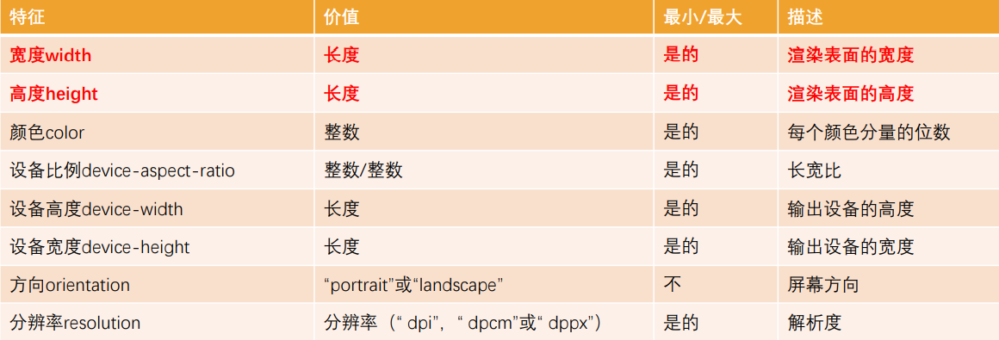

### 逻辑操作符（logical operators）
媒体查询的表达式最终会获得一个Boolean值，也就是真（true）或者假（false）。
* 如果结果为真（true），那么就会生效；
* 如果结果为假（false），那么就不会生效；

如果有多个条件，我们可以通过逻辑操作符联合复杂的媒体查
* **and**：and 操作符用于将多个媒体查询规则组合成单条媒体查询
* not：not运算符用于否定媒体查询，如果不满足这个条件则返回true，否则返回false。
* only：only运算符仅在整个查询匹配时才用于应用样式。
* , (逗号)：逗号用于将多个媒体查询合并为一个规则。

比如下面的媒体查询，表示：屏幕宽度大于500，小于700的时候，body背景颜色为红色；
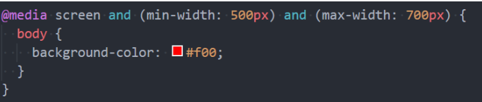
### 常见的移动端设备
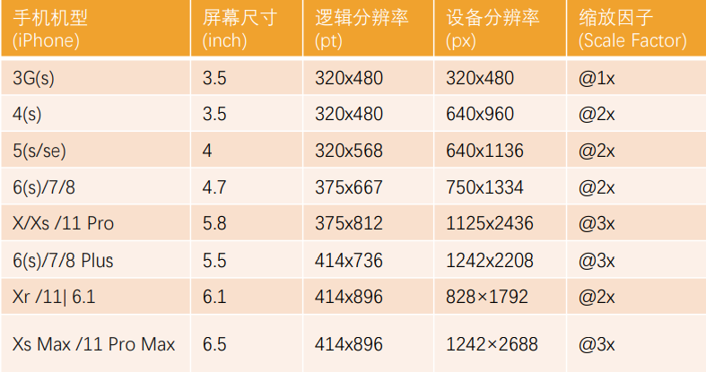

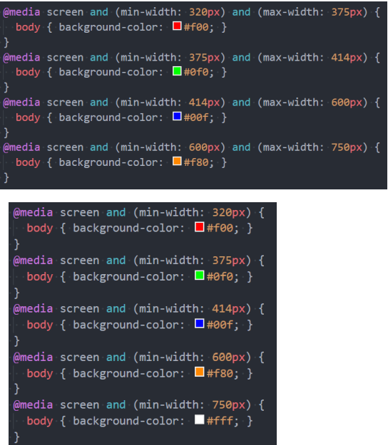