# 额外知识 (3)
## CSS中的单位
### 相对单位
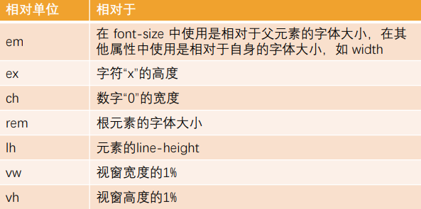

* em: 相对于自身的 font-size 大小
* rem : 相对于 html 的 font-size 大小 (默认 16px)

## Less
### 变量（Variables）
**`@变量名: 变量值;`**

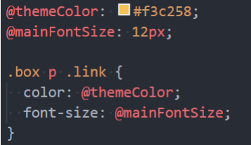
### 嵌套（Nesting）
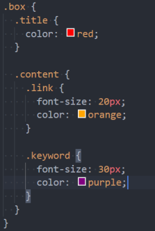

**特殊符号：& 表示当前选择器的父级**
### 运算（Operations) 太笨了不用
在Less中，算术运算符 +、-、 、/ 可以对任何数字、颜色或变量进行运算。
* 算术运算符在加、减或比较之前会进行单位换算，计算的结果以**最左侧操作数的单位类型为准**；
* 如果单位换算无效或失去意义，则忽略单位；

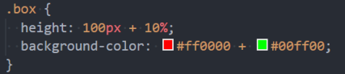

### 混合（Mixins)
在原来的CSS编写过程中，多个选择器中可能会有大量相同的代码
* 我们希望可以**将这些代码进行抽取到一个独立的地方，任何选择器都可以进行复用；**
* 在less中提供了**混入（Mixins）**来帮助我们完成这样的操作；

混合（Mixin）是一种将一组属性从一个规则集（或混入）到另一个规则集的方法。

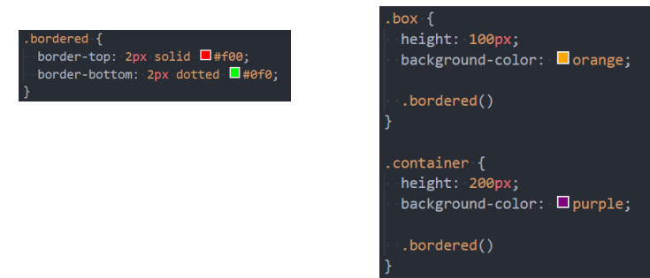

**注意：混入在没有参数的情况下，小括号可以省略，但是不建议这样使用；**

**混入也可以传入变量（暂时了解）**
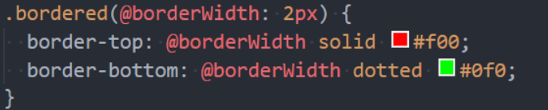
**Less语法六：映射（Maps）**
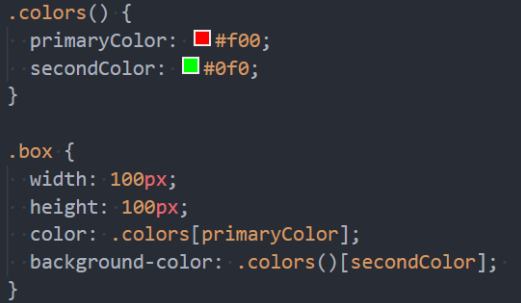
**混入和映射结合：混入也可以当做一个自定义函数来使用（暂时了解）**
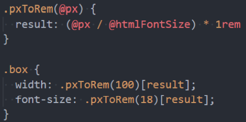
### 其他语法补充(了解)
extend继承
* 和mixins作用类似，用于**复用代码**
* 和mixins相比，**继承代码最终会转化成并集选择器**

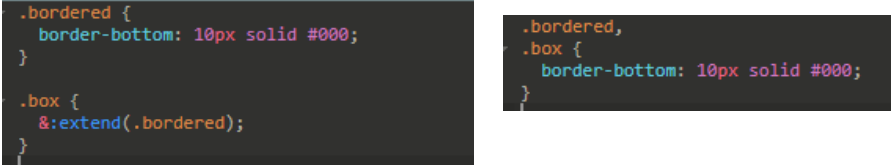

Less语法八：Less内置函数
* Less 内置了多种函数用于转换颜色、处理字符串、算术运算等。
* 内置函数手册：[https://less.bootcss.com/functions/](https://less.bootcss.com/functions/)

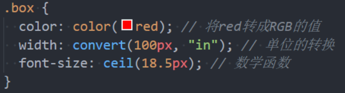

**作用域（Scope）**
* 在查找一个变量时，首先在本地查找变量和混合（mixins）；
* 如果找不到，则从“父”级作用域继承；

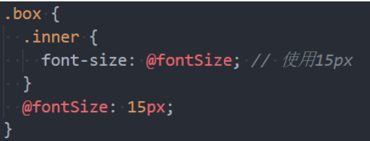

**注释（Comments）**
* 在Less中，块注释和行注释都可以使用；

**导入（Importing）**
* 导入的方式和CSS的用法是一致的；
* 导入一个 .less 文件，此文件中的所有变量就可以全部使用了；
* 如果导入的文件是 .less 扩展名，则可以将扩展名省略掉；

 
