# flex 布局
## flex 布局的重要概念
**两个重要的概念：**
* 开启了 flex 布局的元素叫 *flex container*
* flex container 里面的直接子元素叫做 *flex item*

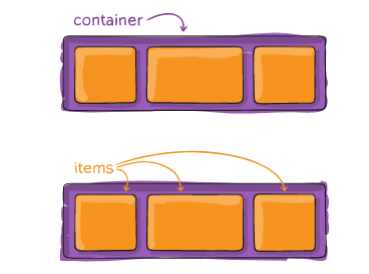

**当flex container中的子元素变成了flex item时, 具备一下特点:**
* flex item 的布局*将受 flex container 属性的设置来进行控制和布局;*
* flex item *不再严格区分块级元素和行内级元素*;
* flex item *默认情况下是包裹内容的, 但是可以设置宽度和高度*

**设置 display 属性为 flex 或者 inline-flex 可以成为 flex container**
* **flex：** flex container 以 block-level 形式存在
* **inline-flex：** flex container 以 inline-level 形式存在
## flex 布局的模型
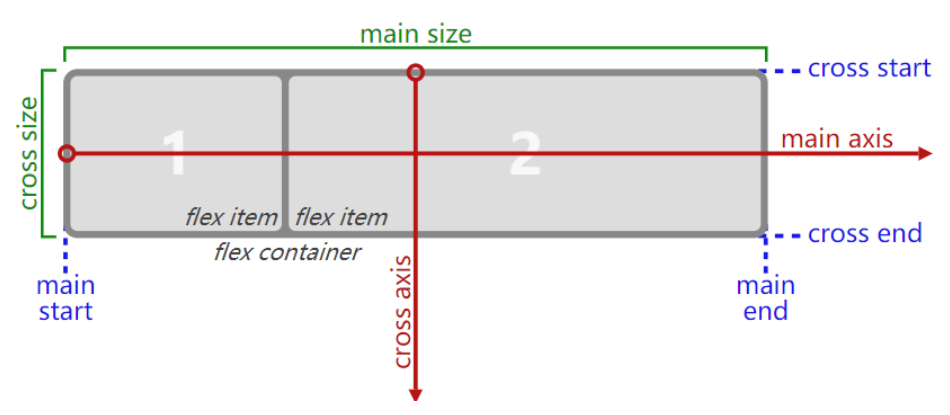
## flex container 的属性
### flex-direction
flex items 默认都是沿着 main axis（主轴）从 main start 开始往 main end 方向排布
* flex-direction 决定了 main axis 的方向，有 4 个取值
* **row（默认值）、row-reverse、column、column-reverse**
 
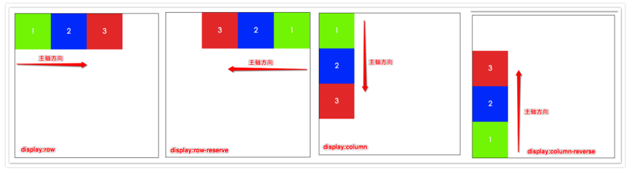
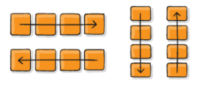

### flex-wrap
flex-wrap 决定了 flex container 是单行还是多行
* **nowrap（默认）**：单行
* **wrap**：多行
* wrap-reverse：根本不用
### flex-flow
flex-flow 属性是 flex-direction 和 flex-wrap 的简写
*  顺序任何, 并且都可以省略

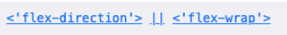

### justify-content
justify-content 决定了 flex items 在 main axis 上的对齐方式
* **flex-start**（默认值）：与 main start 对齐
* **flex-end**：与 main end 对齐
* **center**：居中对齐
* **space-between：**
   * flex items 之间的距离相等
   * 与 main start、main end两端对齐
* **space-around**：
   * flex items 之间的距离相等
   * flex items 与 main start、main end 之间的距离是 flex items 之间距离的一半
* **space-evenly：**
   * flex items 之间的距离相等
   * flex items 与 main start、main end 之间的距离 等于 flex items 之间的距离

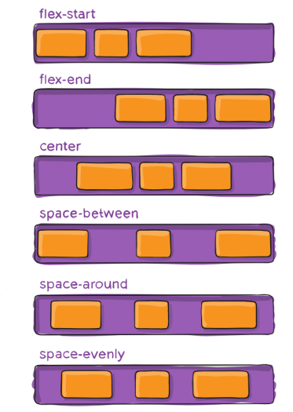
### align-items
align-items 决定了 flex items 在 cross axis 上的对齐方式
* **normal**：在弹性布局中，效果和stretch一样
* **stretch**：当 flex items 在 cross axis 方向的 size 为 auto 时，会

自动拉伸至填充 flex container
* **flex-start**：与 cross start 对齐
* **flex-end**：与 cross end 对齐
* **center**：居中对齐
* **baseline**：与基准线对齐

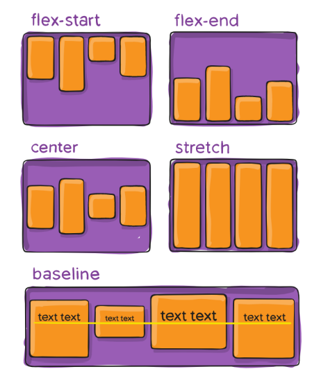
### align-content
align-content 决定了**多行** flex items 在 cross axis (交叉轴)上的对齐方式，用法与 justify-content 类似

* stretch（默认值）：与 align-items 的 stretch 类似
* flex-start：与 cross start 对齐
* flex-end：与 cross end 对齐
* center：居中对齐
* space-between：
   * flex items 之间的距离相等
   * 与 cross start、cross end两端对齐
* space-around：
   * flex items 之间的距离相等
   * flex items 与 cross start、cross end 之间的距离是 flex items 之间距离的一半
* space-evenly：
   * flex items 之间的距离相等
   * flex items 与 cross start、cross end 之间的距离 等于 flex items 之间的距离
## flex item 的属性
### order
order 决定了 flex items 的排布顺序
* 可以设置任意整数（正整数、负整数、0），值越小就越排在前面
* 默认值是 0

### align-self
flex items 可以通过 **align-self** 覆盖 flex container 设置的 align-items
* auto（默认值）：遵从 flex container 的 align-items 设置
* stretch、flex-start、flex-end、center、baseline，效果跟 align-items 一致

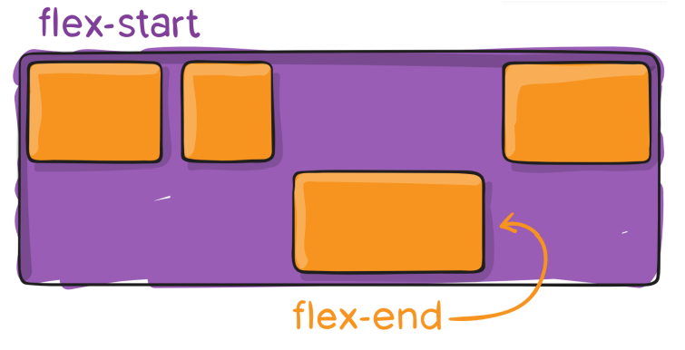
### flex-grow
flex-grow 决定了 flex items 如何扩展(拉伸/成长)
* 可以设置任意非负数字（正小数、正整数、0），**默认值是 0**
* 当 flex container 在 main axis 方向上有**剩余 size** 时，flex-grow 属性才会有效

如果所有 flex items 的 flex-grow 总和 sum 超过 1，每个 flex item 扩展的 size 为
* flex container 的剩余 size * 自己的 flex-grow 值 / sum

**flex items 扩展后的最终 size 不能超过 max-width\max-height**
### flex-shrink
flex-shrink 决定了 flex items 如何收缩(缩小)
* 可以设置任意非负数字（正小数、正整数、0），**默认值是 1**
* 当 flex items 在 main axis 方向上超过了 flex container 的 size，flex-shrink 属性才会有效

如果所有 flex items 的 flex-shrink 总和超过 1，每个 flex item 收缩的 size为
* flex items 超出 flex container 的 size * 收缩比例 / 所有 flex items 的收缩比例之和

**flex items 收缩后的最终 size 不能小于 min-width\min-height**
### flex-basis
flex-basis 用来设置 flex items 在 main axis 方向上的 **base size**
* auto（默认值）、具体的宽度数值（100px）

**因为设置了基础尺寸, 可以被扩展尺寸(通常代替 width 属性 使用 flex-basis 设置基础尺寸)**

决定 flex items 最终 base size 的因素，从优先级高到低
* max-width\max-height\min-width\min-height
* flex-basis
* width\height
* 内容本身的 size
### flex
flex 是 **flex-grow || flex-shrink || flex-basis 的简写**,flex 属性可以指定1个，2个或3个值

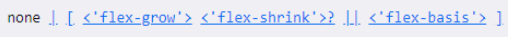

**所以 flex:1 是 flex-grow:1**

单值语法: 值必须为以下其中之一:
* **一个无单位数(`<number>`): 它会被当作`<flex-grow>`的值**
* 一个有效的宽度(width)值: 它会被当作 `<flex-basis>`的值。
* 关键字none，auto或initial

双值语法: 第一个值必须为一个无单位数，并且它会被当作 `<flex-grow>` 的值。
* 第二个值必须为以下之一
   * 一个无单位数：它会被当作 `<flex-shrink>`的值。
   * 一个有效的宽度值: 它会被当作` <flex-basis>` 的值。

三值语法:
* 第一个值必须为一个无单位数，并且它会被当作 `<flex-grow>` 的值。
* 第二个值必须为一个无单位数，并且它会被当作 `<flex-shrink> `的值。
* 第三个值必须为一个有效的宽度值， 并且它会被当作` <flex-basis> `的值。
### 思考: 如下布局如何解决对其问
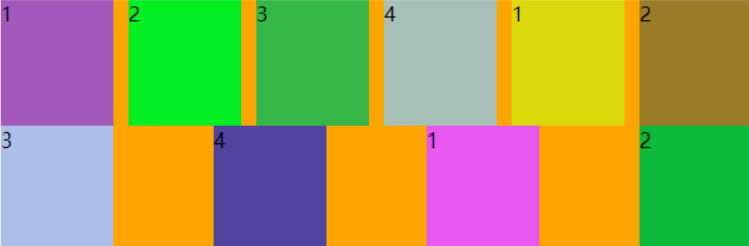

display:flex 的子元素不区分 行内块

方法 : 
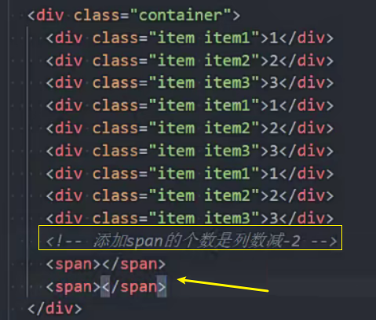

然后**给空的 span 元素, 只加上正确的 width 宽度**

