# 浮动
float 属性可以指定一个元素应沿其容器的左侧或右侧放置，允许文本和内联元素环绕它。
* float 属性最初只用于在一段文本内浮动图像, 实现文字环绕的效果;
* 但是早期的CSS标准中并没有提供好的左右布局方案, 因此在一段时间里面它成为网页多列布局的最常用工具;

绝对定位、浮动都会让元素脱离标准流，以达到灵活布局的效果

可以通过float属性让元素产生浮动效果，float的常用取值
* none：不浮动，默认值
* left：向左浮动
* right：向右浮动
## 浮动的规则
#### 规则 1
**元素一旦浮动后, 脱离标准流**
* 朝着向左或向右方向移动，直到自己的边界紧贴着包含块（一般是父元素）或者其他浮动元素的边界为止
* 定位元素会层叠在浮动元素上面

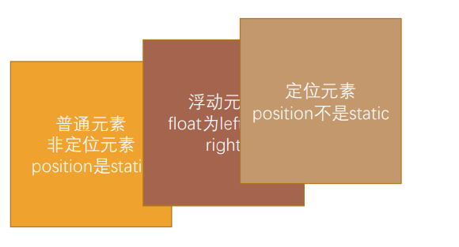

#### 规则 2 
**如果元素是向左（右）浮动，浮动元素的左（右）边界不能超出包含块的左（右）边界**

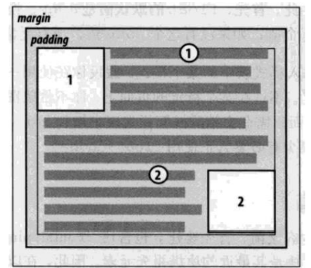
#### 规则 3 
**浮动元素之间不能层叠**

* 如果一个元素浮动，另一个浮动元素已经在那个位置了，后浮动的元素将紧贴着前一个浮动元素（左浮找左浮，右浮找右浮）
* 如果水平方向剩余的空间不够显示浮动元素，浮动元素将**向下移动**，直到有充足的空间为止

#### 规则 4
**浮动元素不能与行内级内容层叠，行内级内容将会被浮动元素推出**
* 比如行内级元素、inline-block元素、块级元素的文字内容

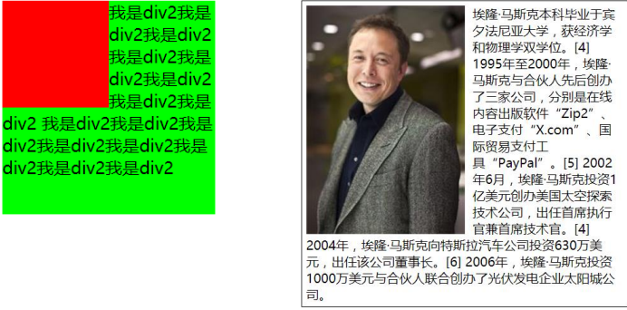
#### 规则 5
**行内级元素、inline-block元素浮动后，其顶部将与所在行的顶部对齐**

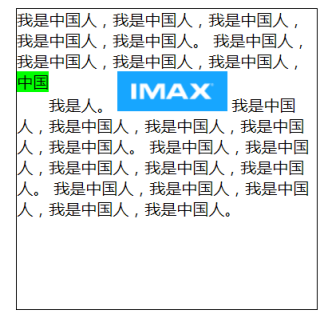
## 浮动练习
### 练习 1  - 百度页码
浮动常用的场景
* *解决行内级元素、inline-block元素的 **水平间隙** 问题*

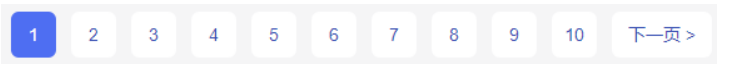

### 练习 2 - 京东的布局 (负 margin 技巧)
浮动布局方案:
* 实现京东页面下面的布局

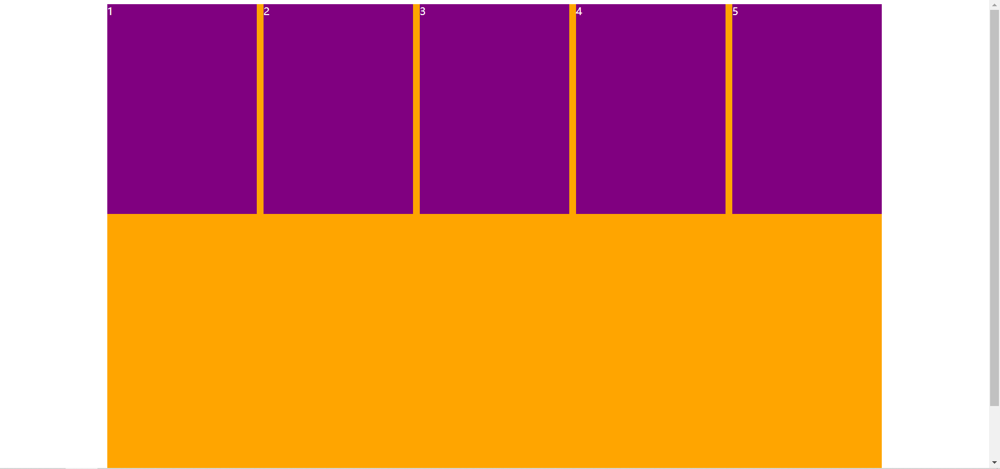
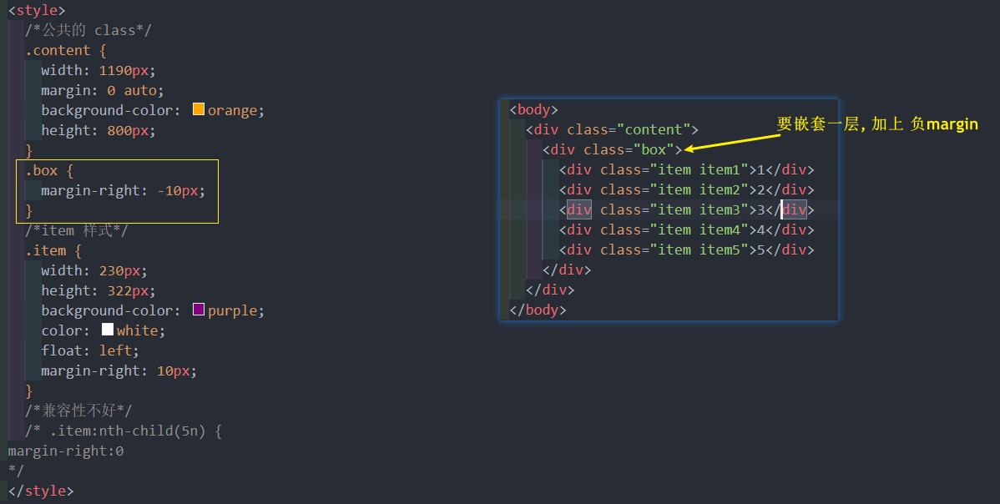
### 练习 3 - 京东多列布局 (也是 负 margin 技巧)
浮动布局方案:
* 实现京东页面下面的布局

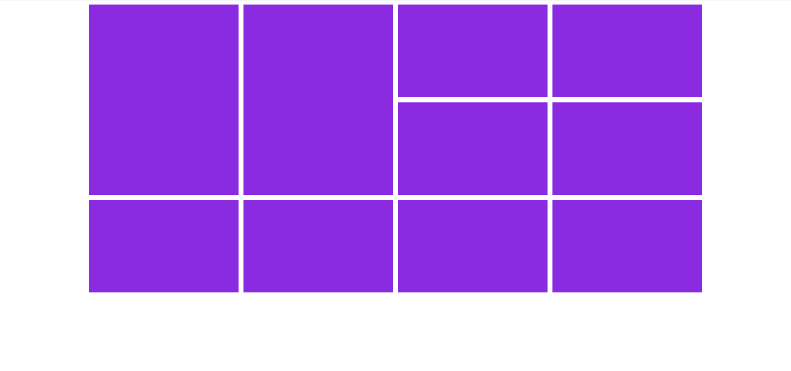
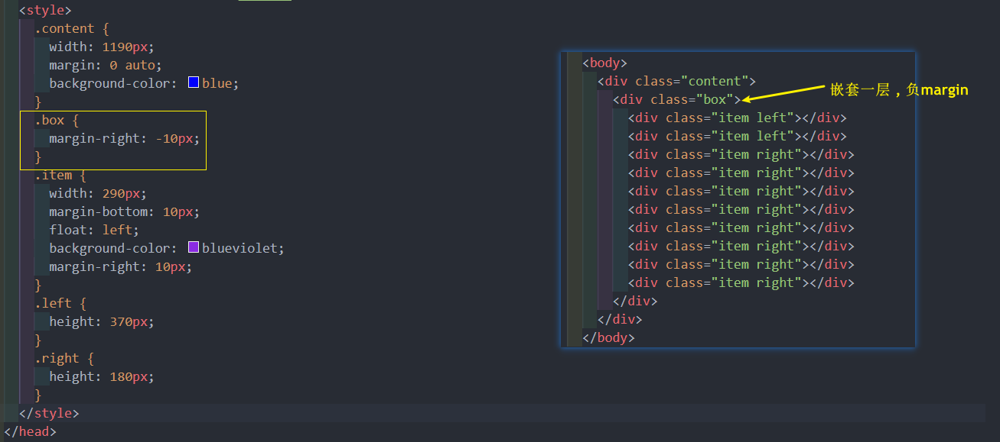
### 练习 4 
浮动布局方案:
* 实现考拉页面下面的布局

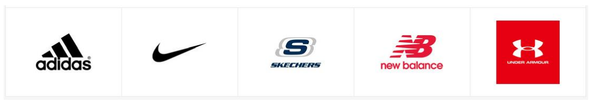 
## 浮动的问题 – 高度塌陷
*由于浮动元素脱离了标准流，变成了脱标元素，所以不再向父元素汇报高度*
* 父元素**计算总高度**时，就**不会计算浮动子元素的高度**，导致了**高度坍塌**的问题

解决父元素高度坍塌问题的过程，一般叫做清浮动（清理浮动、清除浮动）

清浮动的目的是
* **让父元素计算总高度的时候，把浮动子元素的高度算进去**

如何清除浮动呢? 使用clear属性
### clear 属性
clear属性是做什么的呢?
* clear 属性可以**指定一个元素是否必须移动(清除浮动后)到在它之前的浮动元素下面;**

clear的常用取值
* left：要求元素的顶部低于之前生成的所有**左**浮动元素的底部
* right：要求元素的顶部低于之前生成的所有**右**浮动元素的底部
* both：要求元素的顶部低于之前生成的**所有**浮动元素的底部
* none：默认值，无特殊要求

那么可以利用这个特性来清除浮动.
### 清除浮动的方法
事实上有很多方法可以清除浮动

**方法一: 给父元素设置固定高度**
* 扩展性不好（不推荐）

**方法二: 在父元素最后增加一个空的块级子元素，并且让它设置 `clear: both`**
* 会**增加很多无意义的空标签**，维护麻烦
* 违反了结构与样式分离的原则（不推荐）

**方法三: 给父元素添加一个伪元素**
* *推荐;*
* 编写好后可以轻松实现清除浮动
###  伪元素清除浮动
给父元素增加 `::after` 伪元素
* 纯 CSS 样式解决，结构与样式分离（推荐）

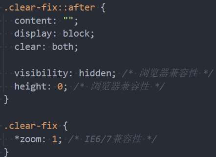

