# Grid 栅格
最强大的布局系统 , **Grid**是一个二维系统，这意味着它可以同时处理**列**和**行**

有三个重要概念: 容器 , 栅格线 , 单元格 

先定义容器 , 然后要把格子画好

## 容器
### 行级容器
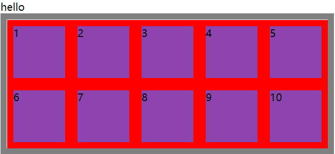
```html
<span>hello</span>
<section>
    <div>1</div>
    <div>2</div>
    <div>3</div>
    <div>4</div>
    <div>5</div>
    <div>6</div>
    <div>7</div>
    <div>8</div>
    <div>9</div>
    <div>10</div>
</section>
```
```css
section {
    display: grid;
    border:10px solid gray;
    width: 500px;
    height: 200px;
    grid-template-rows:100px 100px ;
    grid-template-columns: 100px 100px 100px 100px 100px ;
    //也可以用百分比 
    //grid-template-columns: 20% 20% 20% 20% 20%  ;
}
div {
    background: #8e44ad;
    border: 10px solid  red;
    box-sizing: border-box;
    //没有定义元素的宽高, 就会撑满
}
```
### 块级容器
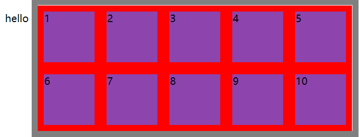
```
display:inline-grid
```
## 划分行列
grid有**行**有**列** , 使用 `grid-template-columns` 规则可划分列数，使用 `grid-template-rows` 划分行数
### 固定宽度
2行5列 , 当容器宽度过大时将漏白
```
display:grid;
width:1000px;
height:200px;
grid-template-rows:100px 100px;
grid-template-columns:200px 200px 200px 200px 200px;
```
### 百分比
使用百分比 , 自动适应容器
```
display: grid;
grid-template-rows: 50% 50%;
grid-template-columns: 25% 25% 25% 25%;
```
### 重复设置
使用 `repeat` 设置，第一个参数为重复数量，第二个参数是重复值
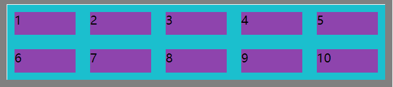
```css
section {
    border:10px solid gray;
    width: 500px;
    height: 100px;
    display:grid;
    grid-template-rows:repeat(2,50px);
    grid-template-columns:repeat(5,100px);
}

div {
    background: #8e44ad;
    border: 10px solid #1bbfce;
    box-sizing: border-box;
}
```
也可以使用多个值来定义重复 , 例如
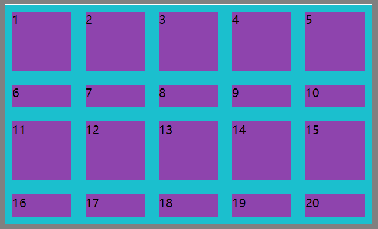
```css
section {
    border:10px solid gray;
    width: 500px;    
    height: 300px;
    display:grid;
    grid-template-rows:repeat(2,100px 50px);    // 重复多个值
    grid-template-columns:repeat(5,100px);
}

div {
    background: #8e44ad;
    border: 10px solid #1bbfce;
    box-sizing: border-box;
}
```
### 自动填充
可使用`repeat(auto-fill, ...)` , 第一栅格的尺寸 , 自动分配元素的布局
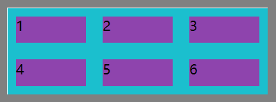
```css
section {
    border:10px solid gray;
    width: 300px;
    height: 100px;
    display:grid;
    grid-template-rows:repeat(auto-fill, 50px);
    grid-template-columns:repeat(auto-fill,100px);
}

div {
    background: #8e44ad;
    border: 10px solid #1bbfce;
    box-sizing: border-box;
}
```
### 比例划分
#### fr
宽按`1份 2份 1份`等比例分布 , 高按`1份 1份`等比分布

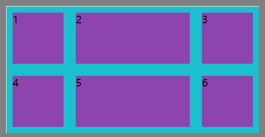
```css
section {
    border:10px solid gray;
    width: 400px;
    height: 200px;
    display:grid;
    grid-template-rows:1fr 1fr;
    grid-template-columns:1fr 2fr 1fr ;
}

div {
    background: #8e44ad;
    border: 10px solid #1bbfce;
    box-sizing: border-box;
}
```
#### 重复 fr
可使用例如`repeat(2 , 1fr)`, 重复设置
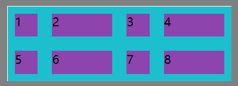
```
  width: 300px;
  height: 100px;
  display: grid;
  grid-template-rows: repeat(2, 1fr);
  grid-template-columns: repeat(2, 1fr 2fr);
```
### minmax()
使用`minmax()`可以设置取值范围 , 比如`最小100px ~ 最大1fr`间取值
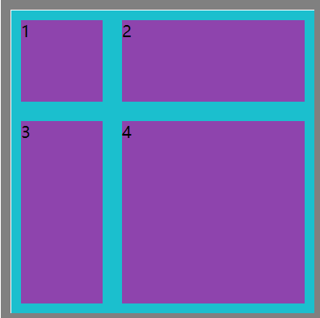
```
    width: 300px;
    height: 300px;
    display: grid;
    grid-template-rows: 100px minmax(100px, 1fr);   // minmax()
    grid-template-columns: 100px 1fr;
```
## 行列间间距
### 行间距 
可使用`row-gap`设置
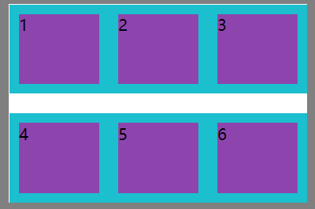
```css
section {
    border:10px solid gray;
    width: 300px;
    height: 200px;
    display: grid;
    row-gap: 20px;         // row-gap: ???
    grid-template-rows: 1fr 1fr;
    grid-template-columns: 1fr 1fr 1fr ;
}
```
### 列间距
可使用`column-gap`设置
### 组合设置
例如 `gap:20px 10px` 页次定义**行和列**的各自间距
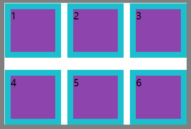

也可统一设置行列间距为 20px , 如 `gap:20px`
```
    width: 300px;
    height: 200px;
    display: grid;
    gap: 20px;               // gap: ???
    grid-template-rows: 1fr 1fr;
    grid-template-columns: 1fr 1fr 1fr ;
```
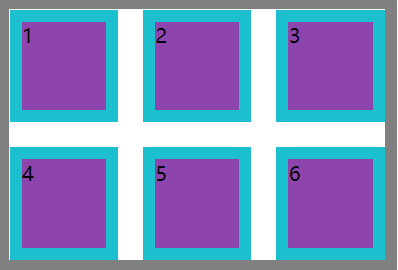

## 元素定位
### 栅格线数字编号
通过单独设置元素的栅格线范围进行布局, 栅格线从上到下 , 从左到右 , 从`1`开始计数

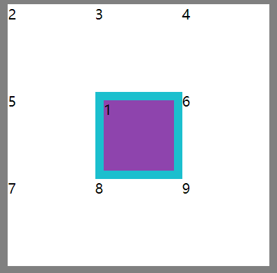
```css{14-17}
section {
    border:10px solid gray;
    width: 300px;
    height: 300px;
    display: grid;
    grid-template-rows: 1fr 1fr  1fr;
    grid-template-columns: 1fr 1fr 1fr ;
}

div:first-child {
    background: #8e44ad;
    border: 10px solid #1bbfce;
    box-sizing: border-box;
    grid-row-start: 2;
    grid-column-start:2;
    grid-row-end: 3;
    grid-column-end:3;
}
```
#### 小练习
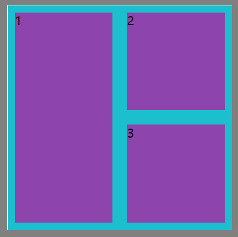
```css
section {
    border:10px solid gray;
    width: 300px;
    height: 300px;
    display: grid;
    grid-template-rows: 1fr 1fr ;
    grid-template-columns: 1fr 1fr;
}

div:first-child {
    background: #8e44ad;
    border: 10px solid #1bbfce;
    box-sizing: border-box;
    grid-row-start: 1;
    grid-column-start:1;
    grid-row-end: 3;
    grid-column-end:2;
}
div:nth-child(2){
    background: #8e44ad;
    border: 10px solid #1bbfce;
    box-sizing: border-box;
    grid-row-start: 1;
    grid-column-start:2;
    grid-row-end: 2;
    grid-column-end:3;
}
div:nth-child(3){
    background: #8e44ad;
    border: 10px solid #1bbfce;
    box-sizing: border-box;
    grid-row-start: 2;
    grid-column-start:2;
    grid-row-end: 3;
    grid-column-end:3;
}
```
### 自定义栅格命名
使用`[]`**行**和**列**的前后栅格线命名 , 命名重叠栅格线可以重叠, 重叠的栅格线中可以选一个随便使用
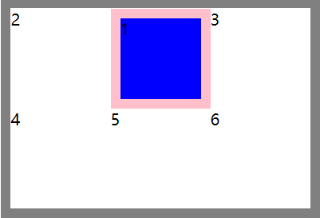
```css{6,7}
section {
    border:10px solid gray;
    width: 300px;
    height: 200px;
    display: grid;
    grid-template-rows:[r1-start] 1fr [r1-end r2-start] 1fr [r2-end r3-start] ;
    grid-template-columns:[c1-start] 1fr [c1-end c2-start] 1fr [c2-end c3-start] 1fr [c3-end c4-start];
}

div:first-child {
    grid-row-start: r1-start;
    grid-column-start: c2-start;
    grid-row-end: r1-end;
    grid-column-end: c3-start;
    border: 10px solid pink;
    background: blue;
}
```
### 自动栅格命名
对重复设置的栅格系统会自动命名

例如 ,`grid-template-rows:repeat(2 ,[r-start] 1fr [r-end] ) ;`

比如 `r-start 2` 和 `r-end 1` 是同一条栅格线 , 可以任意使用
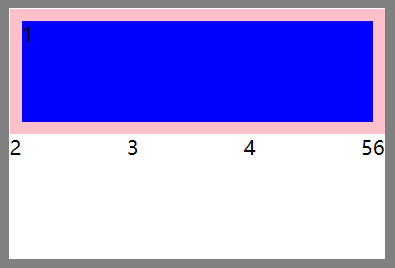
```css{6-7,11-14}
section {
    border:10px solid gray;
    width: 300px;
    height: 200px;
    display: grid;
    grid-template-rows:repeat(2 ,[r-start] 1fr [r-end] ) ;
    grid-template-columns:repeat(3 ,[c-start] 1fr [c-end] )
}

div:first-child {
    grid-row-start: r-start 1;
    grid-column-start: c-start 1;
    grid-row-end: r-end 1;
    grid-column-end: c3-end 3;
    border: 10px solid pink;
    background: blue;
}
```
### 偏移量 span
使用 `span` 可以设置包含栅格的数量或

先设置起始的栅格线 , 再定义偏移量 `span`的个数

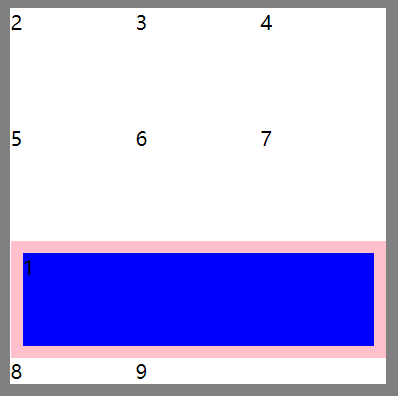
```css{13-16}
section {
    border:10px solid gray;
    width: 300px;
    height: 300px;
    display: grid;
    grid-template-rows:repeat(3 ,1fr ) ;
    grid-template-columns:repeat(3 ,1fr )
}

div:first-child{
    border: 10px solid pink;
    background: blue;
    grid-row-start: 3;
    grid-column-start: 1;
    grid-row-end:span 1 ;         //偏移量
    grid-column-end: span 3;      //偏移量
}
```
### 简写形式
#### grid-row 和 grid-column
语法 : `开始`/`结束`
```
grid-row:2/4           
// 也可用 span
//比如 grid-row:2 / span 1 
grid-column:2/4
```
#### grid-area
语法 : `grid-row-start/grid-column-start/grid-row-end/grid-column-end`

九宫格的正中间举例:
```
grid-area:2/2/3/3 ;
```
## 区域声明
区域是由多个单元格构成，使用`grid-template-areas`可以定义栅格区域，并且栅格区域必须是矩形的
### 区域布局
适配移动端的常用布局
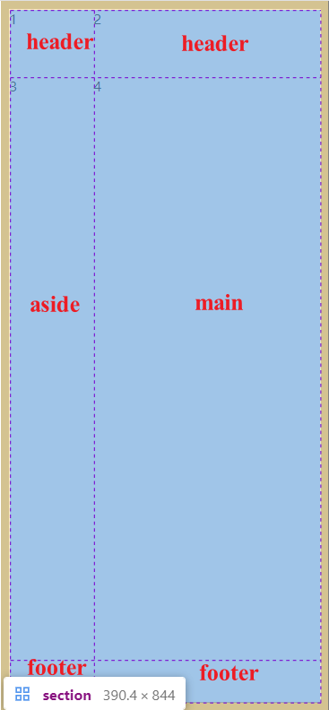
```html
<section>
    <header>1</header>
    <aside>2</aside>
    <main>3</main>
    <footer>4</footer>
</section>
```
```css{15-17,20,24,28,32}
body{
    margin:0;
}
* {
    box-sizing: border-box;
}
section {
    border:10px solid gray;
    width: 100vw;
    height: 100vh;
    display: grid;
    grid-template-rows:80px 1fr 50px;
    grid-template-columns:100px 1fr;

    grid-template-areas: "header header"
                        "aside main"
                        "footer footer";
}
header {
    grid-area: header;
    background: #8e44ad;
}
aside {
    grid-area: aside;
    background: #f1c40f;
}
main {
    grid-area: main;
    background: green;
}
footer {
    grid-area: footer;
    background: bisque;
}
```
结果如图:
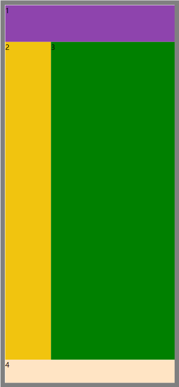
### 区域命名
会根据`grid-template-areas` , 系统会自动命名栅格线

比如:
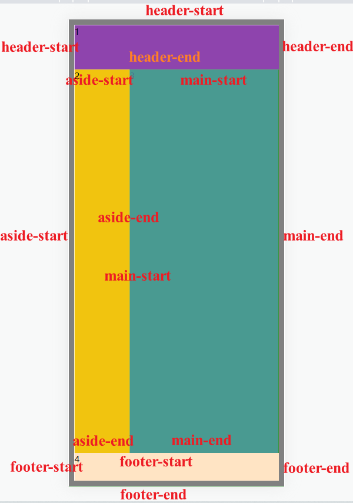
```html
<section>
    <div></div>
    <div></div>
</section>
```
```css{13-15,18,22}
body{
    margin:0;
}
* {
    box-sizing: border-box;
}
section {
    display: grid;
    width: 100vw;
    height: 100vh;
    grid-template-rows: 80px 1fr 50px;
    grid-template-columns: 80px 1fr;
    grid-template-areas: "header header"
                        "aside  main"
                        "footer footer";
}
div:first-child {
    grid-area: header-start/  aside-start/ main-end/ main-end;
    background: #f1c40f;
}
div:nth-child(2){
    grid-area: main-end/  aside-start/ footer-end/ footer-end;
    background: darkseagreen;
}
```
效果为:

### 区域站位符
可以用`.`给不许逃做处理的区域站位

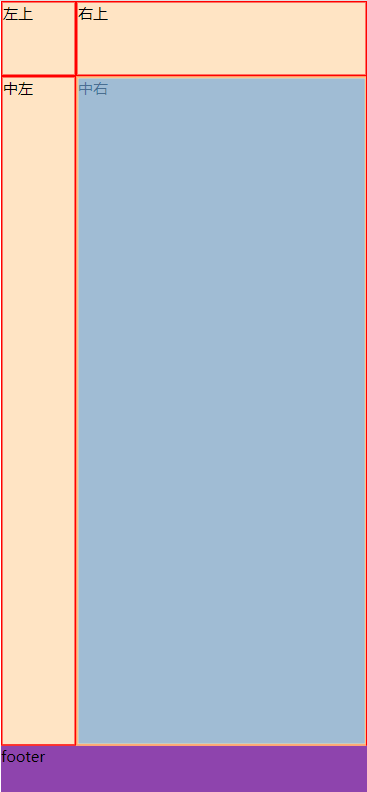
```html
<section>
    <div>左上</div>
    <div>右上</div>
    <div>中左</div>
    <div>中右</div>
    <footer>footer</footer>
</section>
```
```css{13-16,22}
body{
    margin:0;
}
* {
    box-sizing: border-box;
}
section {
    display: grid;
    width: 100vw;
    height: 100vh;
    grid-template-rows: 80px 1fr 50px;
    grid-template-columns: 80px 1fr;
    grid-template-areas: ". ."
                        ".  ."
                        "footer footer";
}
div {
    background: bisque;
    border:2px solid red;
}
footer {
    grid-area: footer;
    background: #8e44ad;
}
```
## 流动方向
`grid-auto-flow` 属性可以改变单元格排列方式
* `grid-auto-flow:column`  纵向
* `grid-auto-flow:row`  横向
* `grid-auto-flow:dense`  元素使用前面空余的单元格 

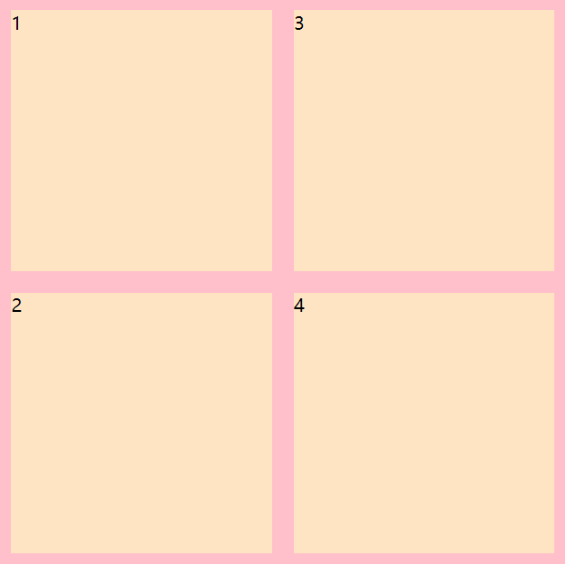
```css{13}
body{
    margin:0;
}
* {
    box-sizing: border-box;
}
section {
    display: grid;
    width: 500px;
    height: 500px;
    grid-template-columns: repeat(2,1fr);
    grid-template-rows: repeat(2,1fr);
    grid-auto-flow: column;
}
div {
    background: bisque;
    border:10px solid pink;
}

```