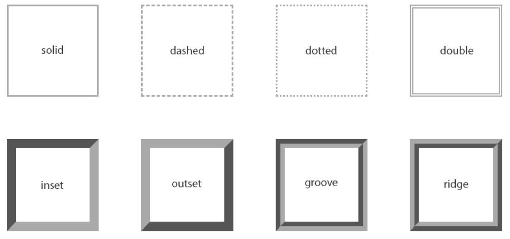
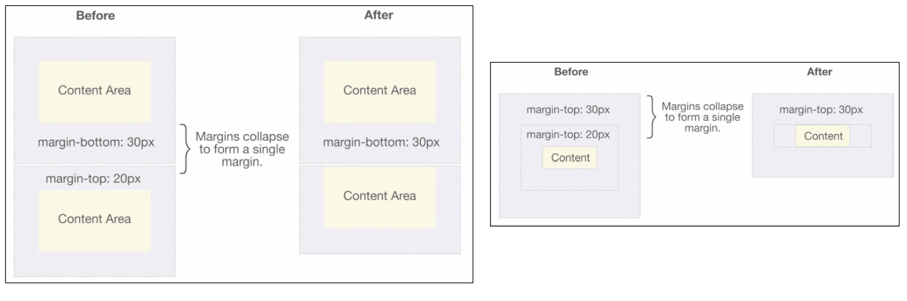
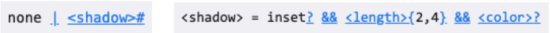
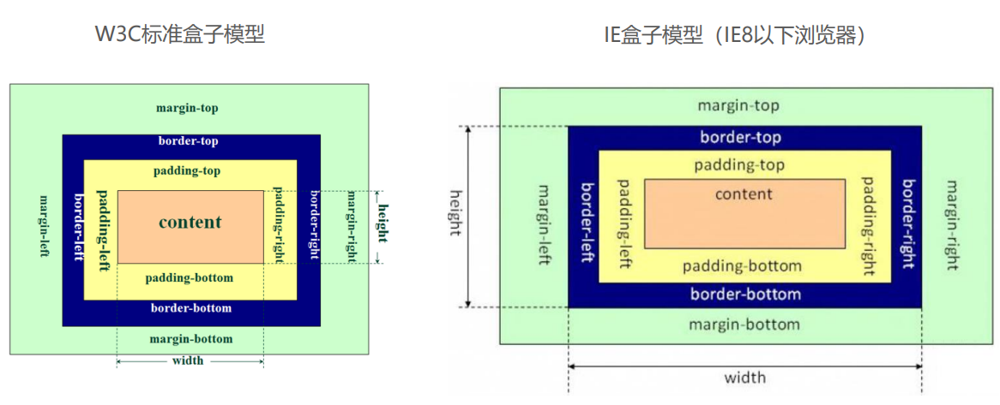

# 盒子模型
## border-style 样式

## 上下 margin 的传递 (很少遇到)
**margin-top 传递**
* *如果块级元素的顶部线和父元素的顶部线重叠，那么这个块级元素的 margin-top 值会传递给父元素*

**margin-bottom传递**
* *如果块级元素的底部线和父元素的底部线重叠，并且父元素的高度是auto，那么这个块级元素的 margin-bottom 值会传递给父元素*

如何防止出现传递问题？
* 给父元素设置 padding-top\padding-bottom, 也就是用父元素的 padding 实现效果
* 给父元素设置 border
* 触发BFC: 设置 overflow为auto

! 建议 !
* margin 一般是用来设置**兄弟元素之间的间距**
* padding 一般是用来设置**父子元素之间的间距**

## 上下margin 的折叠  
**垂直方向上相邻的2个margin（margin-top、margin-bottom）有可能会合并为1个margin，这种现象叫做collapse（折叠）**

**水平方向上的margin（margin-left、margin-right）永远不会collapse**

**折叠后最终值的计算规则**
* 两个值进行比较，取较大的值

如何防止 margin collapse？
* 就只设置其中一个元素的margin

## 上下 margin 折叠的情况
* 两个兄弟块级元素之间上下margin的折叠
* 父子块级元素之间margin的折叠

## outline - 外轮廓
outline 表示元素的外轮廓
* **不占用空间**
* **默认显示在 border 的外面**

outline相关属性有
* outline-width: 外轮廓的宽度
* outline-style：取值跟 border 的样式一样，比如solid、dotted...等
* outline-color: 外轮廓的颜色
* outline：outline-width、outline-style、outline-color的简写属性，跟 border 用法类似

应用实例:
* **去除a元素、input元素的focus轮廓效果**
## 盒子阴影 – box-shadow
box-shadow属性可以设置一个或者多个阴影
* 每个阴影用`<shadow>`表示 可以设置多个 , 阴影会叠加颜色
* 多个阴影之间用逗号,隔开，从前到后叠加

* 第1个`<length>`：**offset-x**, 水平方向的偏移，正数往右偏移
* 第2个`<length>`：**offset-y**, 垂直方向的偏移，正数往下偏移
* 第3个`<length>`：**blur-radius**, 模糊半径
* 第4个`<length>`：**spread-radius**, 延伸半径
* `<color>`：**阴影的颜色**，如果没有设置，就跟随color属性的颜色
* `inset`：**外框阴影变成内框阴影** (几乎不用)

以通过一个网站测试盒子的阴影: [https://html-css-js.com/css/generator/box-shadow/](https://html-css-js.com/css/generator/box-shadow/)
## 文字阴影 - text-shadow
text-shadow用法类似于box-shadow，用于给文字添加阴影效果

`<shadow>`的常见格式如下
* 相当于box-shadow, 它没有spread-radius的值;

可以通过一个网站测试文字的阴影:
*[https://html-css-js.com/css/generator/box-shadow/](https://html-css-js.com/css/generator/box-shadow/)
## 行内非替换元素的注意事项
以下属性对行内级非替换元素不起作用
* **width、height、margin-top、margin-bottom 都不生效**

以下属性对行内级非替换元素的效果比较特殊
* **padding-top和padding-bottom (上下会被撑起来, 但不占据空间) 、上下方向的border(上下会被撑起来, 也是不会占据空间)**

* 为什么被这么设计 ??? 
因为行内级一般会一块块排列的, 但如果被padding, margin 影响, 那么会被破坏当前的效果
## CSS属性 - box-sizing
box-sizing用来设置盒子模型中宽高的行为

**content-box**
* padding、border都布置在width、height外边

**border-box**
* padding、border都布置在width、height里边

## 元素的水平居中方案
在一些需求中，需要元素在父元素中水平居中显示（父元素一般都是块级元素、inline-block）

**行内级元素(包括inline-block元素)**
* 水平居中：在父元素中设置text-align: center

**块级元素**
* 水平居中：margin: 0 auto
* 解释 : 块级元素默认独占一行, 但如果给他覆一个宽度后, 它的宽度会变成 设置的宽度 + margin-right = 独占一行

