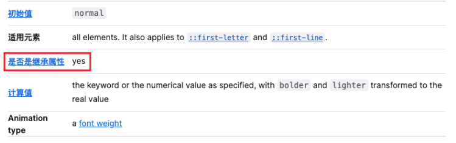
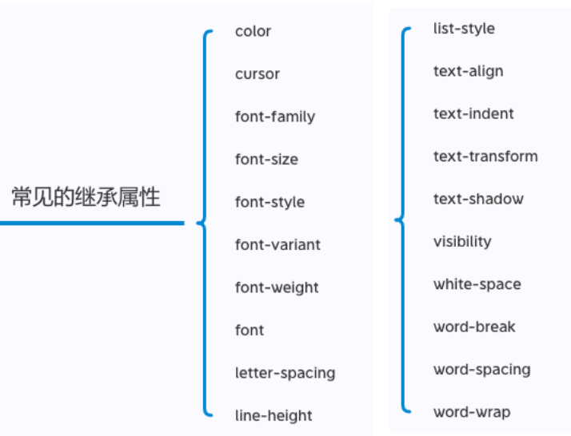
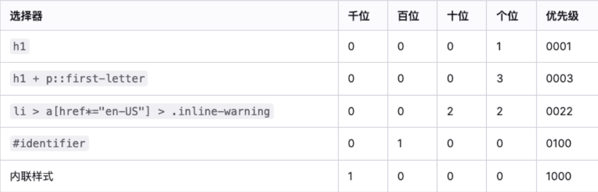

# 继承 - 层叠 - 元素类型
## CSS的属性继承
CSS的某些属性具有继承性(Inherited):

* 如果一个属性具备继承性, 那么在该元素上设置后, 它的后代元素都可以继承这个属性;
* 当然, 如果后代元素自己有设置该属性, 那么优先使用后代元素自己的属性(不管继承过来的属性权重多高);

如何知道一个属性是否具有继承性呢?
* 常见的 font-size/font-family/font-weight/line-height/color/text-align都具有继承性;
* 这些**不用刻意去记**, 用的多自然就记住了

要看文档

**注意(了解): 继承过来的是计算值, 而不是设置值**

常见的继承属性(不用背), 想了解就查看文档就行

## CSS属性的层叠
*CSS的翻译是层叠样式表, 什么是层叠呢?*
* 对于一个元素来说, **相同一个属性**我们可以**通过不同的选择器给它进行多次设置**
* 那么属性会**被一层层覆盖上去**
* 但是最终**只有一个会生效**

那么多个样式属性覆盖上去, 哪一个会生效呢?
* **判断一**: **选择器的权重, 权重大的生效, 根据权重可以判断出优先级**
* **判断二**: **先后顺序, 权重相同时, 后面设置的生效**

那么如何知道元素的权重呢?
### 选择器的权重
* **!important**：10000
* **内联样式**：1000
* **id选择器**：100
* **类选择器、属性选择器、伪类**：10
* **元素选择器、伪元素**：1
* **通配符**：0
小练习 : 

## 元素类型
###  display 值
CSS中有个display属性，能修改元素的显示类型，有4个常用值
* **block**：让元素显示为块级元素
* **inline**：让元素显示为行内级元素
* **inline-block**：让元素同时具备行内级、块级元素的特征
* **none**：隐藏元素

#### 特性

block元素:
1. 独占父元素的一行
2. 可以随意设置宽高
3. 高度默认由内容决定

inline-block元素:
1. 跟其他行内级元素在同一行显示
2. 可以随意设置宽高

inline:
1. 跟其他行内级元素在同一行显示;
2. 不可以随意设置宽高;
3. 宽高都由内容决定;

### 元素隐藏方法
**方法一: display设置为none**
* 元素不显示出来, 并且也不占据位置, 不占据任何空间(和不存在一样);

**方法二: visibility设置为hidden**
* 设置为 hidden, 虽然元素不可见, 但是会占据元素应该占据的空间;
* 默认为 visible, 元素是可见的;

**方法三: rgba设置颜色, 将a的值设置为0**
* rgba 的 A 设置的是alpha值, 可以设置透明度, 不影响子元素;

**方法四: opacity设置透明度, 设置为0**
* 设置整个元素的透明度, 会影响所有的子元素;
### overflow
overflow 用于控制内容溢出时的行为
* **visible**：溢出的内容照样可见
* **hidden**：溢出的内容直接裁剪
* **scroll**：溢出的内容被裁剪，但可以通过滚动机制查看
  * 会一直显示滚动条区域，滚动条区域占用的空间属于width、height
* **auto**：自动根据内容是否溢出来决定是否提供滚动机制

