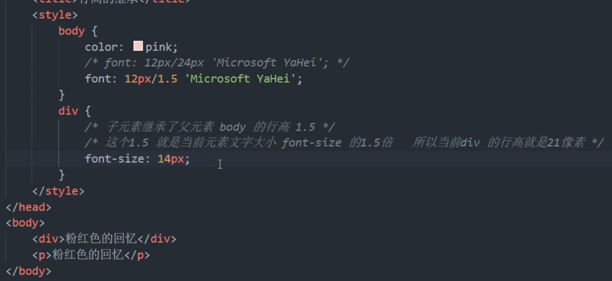
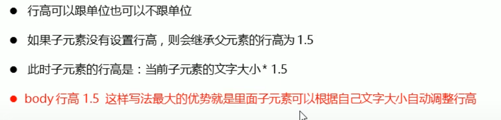
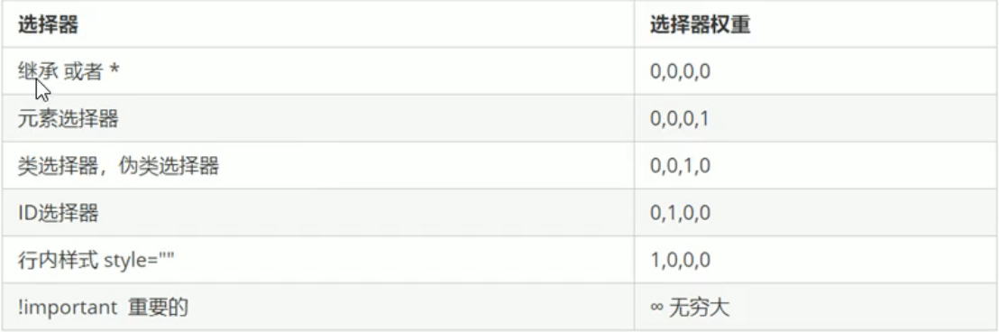
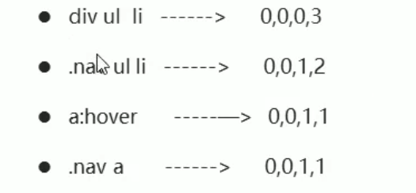
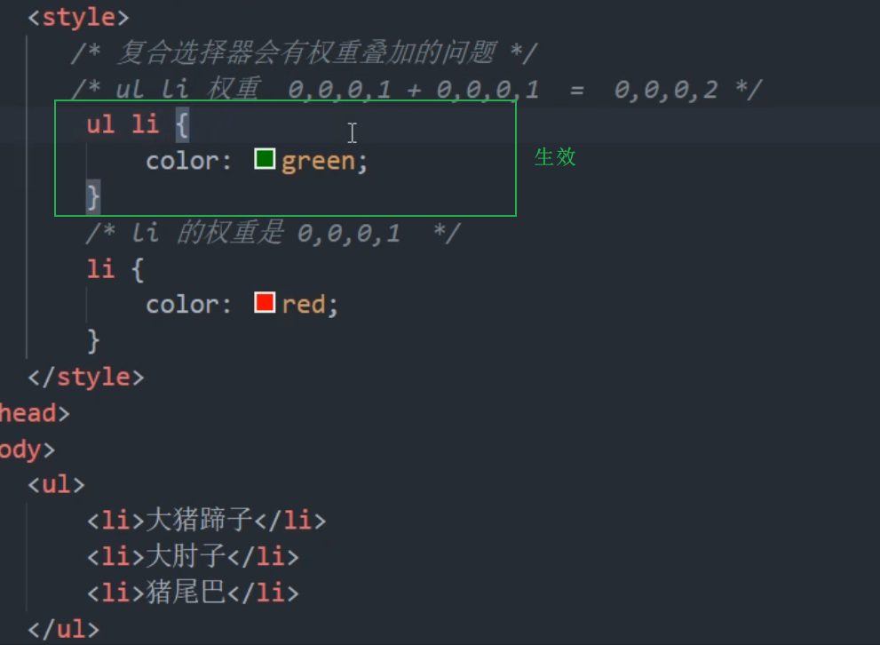
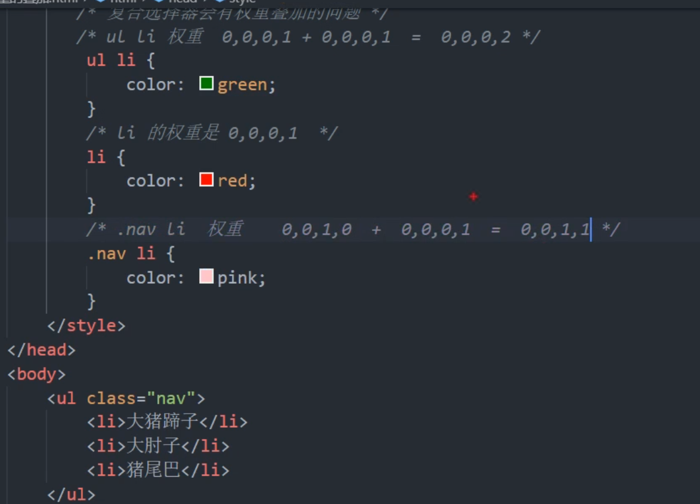

# 三大特性 层叠性、继承性、优先级
## 1. 层叠性 
*相同选择器给设置相同的样式, 此时一个样式就会 **覆盖(层叠)** 另一个冲突的样式*

层叠性原则: 
* 样式冲突, 遵循的原则是 **就近原则** , 哪个样式离结构近, 就执行哪个样式
* 样式不冲突 , 不会层叠

## 2. 继承性

子标签会继承附表钱的样式, 如文本颜色和字号。 

* 恰当的使用继承可以简化代码, 降低 css 样式的复杂性 

* 子元素可以继承父元素的样式 (**text-**, **font-** , **line-** 这些元素开头的可以继承, 以及 **color** 属性)

### 行高的继承 

## 3. 优先级
* 选择器相同, 则执行层叠性
* 选择器不同 , 则根据 **选择器权重** 执行

优先级注意点: 
* 权重是由 4组 数字组成, 但是**不会有进位**
* 可以理解为类选择器永远大于元素选择器, id选择器永远大于类选择器, 以此类推...
* 等级判断从左到右, 如果某一位相同, 则判断下一位, 以此类推
* 简单记忆法, 通配符和继承权重为 0 , 标签选择器为 1 , 类(伪类)选择器为 10 , id 选择器为 100, 行内样式表为1000 , !important 无穷大
* **继承的权重为 0**

### 权重叠加
**权重叠加** : 如果有复合选择器, 则有权重叠加,  需要计算权重

