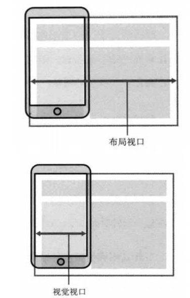
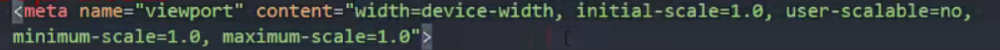
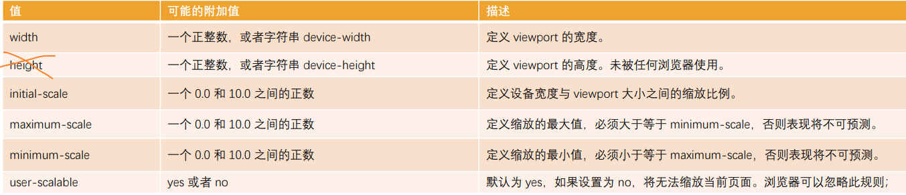
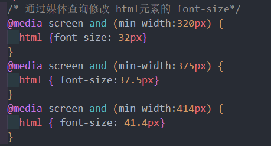
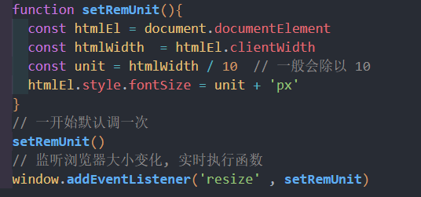
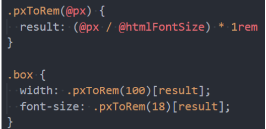
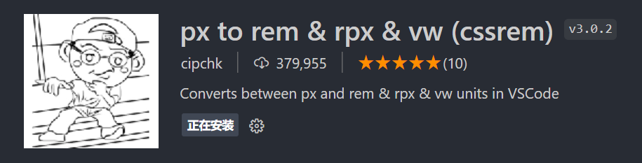
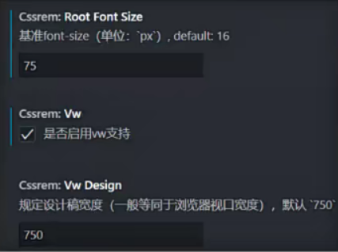
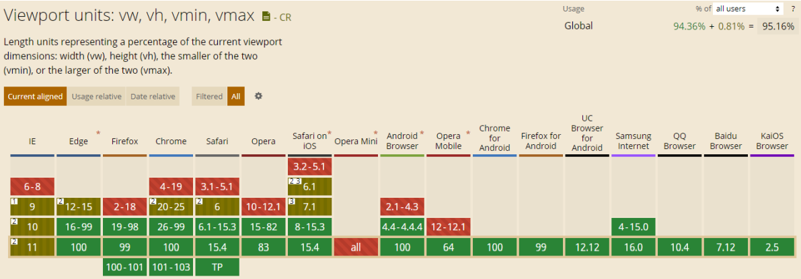
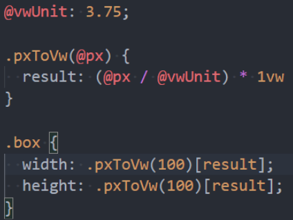

# 移动端适配
两个概念:
* 自适应：根据不同的设备屏幕大小来自动调整尺寸、大小；
* 响应式：会随着屏幕的实时变动而自动调整，是一种自适应

## 认识视口 viewport
### 布局视口和视觉视口 
布局视口（layout viewport）

默认情况下，一个在PC端的网页在移动端会如何显示呢？
* 第一，它会*按照宽度为980px来布局一个页面的盒子和内容；*
* 第二，为了*显示可以完整的显示在页面中，对整个页面进行缩小；*

我们相对于980px布局的这个视口，称之为**布局视口**（layout viewport）；
* 布局视口的**默认宽度是980px；**

**视觉视口（visual viewport）**
* 如果默认情况下，我们按照980px显示内容，那么右侧有一部分区域
就会无法显示，所以手机端浏览器会默认对页面进行缩放以显示到用
户的可见区域中；
* 那么显示在可见区域的这个视口，就是视觉视口（visual viewport）

### 理想视口（ideal viewport）
理想视口（ideal viewport）：
* 默认情况下的layout viewport并不适合我们进行布局；
* 我们可以对layout viewport进行宽度和缩放的设置，以满足正常在一个移动端窗口的布局；
* 这个时候可以设置meta中的viewport；

默认的布局视口是 980px, 需要把**视觉视口 等于 布局视口** : content="width=device-width" 让布局视口的宽度等于设备的宽度

## 移动端适配方案
* 方案一：百分比设置；(不用)
   * 因为不同属性的百分比值，相对的可能是不同参照物，所以百分比往往很难统一；
   * 所以百分比在移动端适配中使用是非常少的；
* **方案二：rem单位+动态html的font-size；**
* **方案三：vw单位；**
* **方案四：flex的弹性布局；**

## 适配方案 – rem + 动态html的font-size

### 修改 rem 的 font-size尺寸
**方案一：媒体查询**
* 可以通过媒体查询来设置不同尺寸范围内的屏幕html的font-size尺寸
* 缺点：
   * 1.需要针对不同的屏幕**编写大量的媒体查询**
   * 2.如果动态改变尺寸，**不会实时的进行更新**

**方案二：编写js代码** (好处: 可以实时更新html 的 font-size)
* 如果希望实时改变屏幕尺寸时，font-size也可以实时更改，可以通过js代码；
* 方法：
   * 1.根据 html 的宽度计算出font-size的大小，并且设置到html上；
   * 2.监听页面的实时改变，并且重新设置font-size的大小到html上；

**方案三：lib-flexible库**
* 事实上，lib-flexible库做的事情是相同的，也可以直接引入它

### rem的单位换算
**方案一：手动换算**
* 比如有一个在375px屏幕上，100px宽度和高度的盒子
* 需要将 100px 转成对应的 rem 值
* 100/37.5 = 2.6667，其他也是相同的方法计算即可

**方案二：less/scss函数**

**方案三：postcss-pxtorem**(用的多)
* 目前在前端的工程化开发中，可以借助于webpack的工具来完成自动的转化

**方案四：VSCode插件**
* px to rem 的插件，在编写时自动转化

## 适配方案 - vw
在flexible GitHub上已经有写过这样的一句话：

**所以它更推荐使用viewport的两个单位vw、wh**

vw的兼容性如何呢？

### vw 和 rem 对比
rem事实上是作为一种过渡的方案，它利用的也是vw的思想。
* 前面不管是我们自己编写的js，还是flexible的源码；
* 都是将1rem等同于设计稿的1/10，在利用1rem计算相对于整个屏幕的尺寸大小；
* 那么我们来思考，1vw不是刚好等于屏幕的1/100吗？
* 而且相对于rem还更加有优势；

vw相比于rem的优势：
* **优势一**：不需要去计算 html 的 font-size 大小，也不需要给 html 设置这样一个font-size；
* **优势二**：不会因为设置 html 的 font-size 大小，而必须给 body 再设置一个font-size，防止继承；
* **优势三**：因为不依赖 font-size 的尺寸，所以不用担心某些原因html的font-size尺寸被篡改，页面尺寸混乱；
* **优势四**：vw 相比于 rem 更加语义化，1vw刚才是1/100的viewport的大小;
* **优势五**：可以具备 rem 之前所有的优点；

vw只面临一个问题，将尺寸换算成vw的单位即可；

### vw的单位换算

**方案一：手动换算**
* 比如有一个在375px屏幕上，100px宽度和高度的盒子；
* 我们需要将100px转成对应的vw值；
* 100/3.75=26.667，其他也是相同的方法计算即可；

**方案二：less/scss函数**

**方案三：postcss-px-to-viewport-8-plugin**
* 和rem一样，在前端的工程化开发中，可以借助于webpack的工具来完成自动的转化

**方案四：VSCode插件**
* px to vw 的插件，在编写时自动转化

