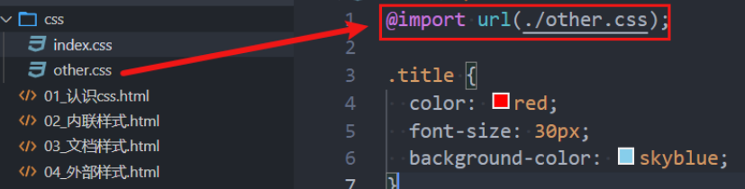
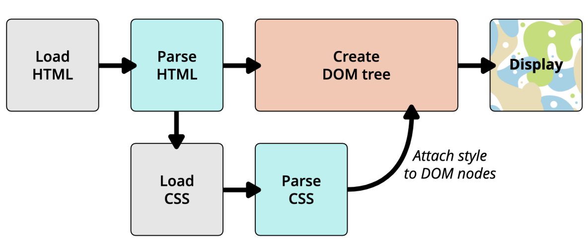

# CSS
## 官方文档
CSS官方文档地址
* [https://www.w3.org/TR/?tag=css](https://www.w3.org/TR/?tag=css)

CSS推荐文档地址：
* [https://developer.mozilla.org/zh-CN/docs/Web/CSS/Reference#%E5%85%B3%E9%94%AE%E5%AD%97%E7%B4%A2%E5%BC%95](https://developer.mozilla.org/zh-CN/docs/Web/CSS/Reference#%E5%85%B3%E9%94%AE%E5%AD%97%E7%B4%A2%E5%BC%95)

由于浏览器版本、CSS版本等问题，查询某些CSS是否可用：
* 可以到[https://caniuse.com/](https://caniuse.com/)查询CSS属性的可用性；

## @import 引入
可以在style元素或者CSS文件中使用 **`@import`** 导入其他的CSS文件

## link 元素
link元素是**外部资源链接**元素，规范了**文档与外部资源**的关系
* link元素通常是在head元素中

最常用的链接是**样式表（CSS）**；
* 此外也可以被用来创建站点图标（比如 “favicon” 图标）；

link元素常见的属性：
* **href**：此属性指定被链接资源的URL。 URL 可以是绝对的，也可以是相对的。
* **rel**：指定链接类型，常见的链接类型：[https://developer.mozilla.org/zh-CN/docs/Web/HTML/Link_types](https://developer.mozilla.org/zh-CN/docs/Web/HTML/Link_types)
   * icon：站点图标；
   * stylesheet：CSS样式；
## CSS 颜色的表示方法
在CSS中，颜色，有以下几种表示方法：

颜色关键字（color keywords）：
* 是不区分大小写的标识符，它表示一个具体的颜色；
* 可以表示哪些颜色呢？
* [https://developer.mozilla.org/zh-CN/docs/Web/CSS/color_value#%E8%AF%AD%E6%B3%95](https://developer.mozilla.org/zh-CN/docs/Web/CSS/color_value#%E8%AF%AD%E6%B3%95)

RGB颜色：
* RGB是一种色彩空间，通过**R（red，红色）、G（green，绿色）、B（blue，蓝色）**三原色来组成了不同的颜色；
   * 也就是通过调整这三个颜色不同的比例，可以组合成其他的颜色；
* RGB各个原色的取值范围是 `0~255`；
### RGB的表示方法
RGB颜色可以通过以#为前缀的十六进制字符和函数（rgb()、rgba()）标记表示。

**方式一：十六进制符号：#RRGGBB[AA]**
* R（红）、G（绿）、B （蓝）和A （alpha）是十六进制字符（0–9、A–F）；A是可选的。
   * 比如，#ff0000等价于#ff0000ff；

**方式二：十六进制符号：#RGB[A]**
* R（红）、G（绿）、B （蓝）和A （alpha）是十六进制字符（0–9、A–F）
* 三位数符号（#RGB）是六位数形式（#RRGGBB）的减缩版
   * 比如，#f09和#ff0099表示同一颜色
* 四位数符号（#RGBA）是八位数形式（#RRGGBBAA）的减缩版
  * 比如，#0f38和#00ff3388表示相同颜色

**方式三：函数符： rgb[a](R, G, B[, A])**
* R（红）、G（绿）、B （蓝）可以是`<number>（数字）`，或者`<percentage>（百分比）`，255相当于100%。
* A（alpha）可以是0到1之间的数字，或者百分比，数字1相当于100%（完全不透明）

## 浏览器渲染的流程

1. **浏览器先加载 HTML**
2. **开始解析 HTML(从上到下一次解析)**
3. **遇到 link 标签, 去独立下载 CSS (不会等你, 继续往下解析)**
4. 解析完 HTML , 会形成 DOM tree , 但并不会立即展示。因为需要加载完css, 解析完 css, 要把样式加到 DOM 节点(nodes) 中 
5. 加完 css 会**形成渲染树**(render tree), 最后 display 展示 

