# text  - font - 选择器
## text 文本
### text-decoration(常用)
text-decoration有如下常见取值:
* none：无任何装饰线
   * 可以去除a元素默认的下划线
* underline：下划线
* overline：上划线
* line-through：中划线（删除线）

a元素有下划线的本质是被添加了text-decoration属性
### text-transform(一般)
text-transform 有几个常见的值:
* capitalize：(使首字母大写, 资本化的意思)将每个单词的首字符变为大写
* uppercase：(大写字母)将每个单词的所有字符变为大写
* lowercase：(小写字母)将每个单词的所有字符变为小写
* none：没有任何影响

实际开发中用JavaScript代码转化的更多.
### text-indent(一般)
* text-indent用于设置第一行内容的缩进
* `text-indent: 2em;` 刚好是缩进 2 个文字

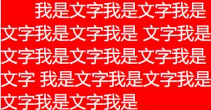

为了 SEO 在 HTML里面协商对应文字后, 如果**想要隐藏文字的话 text-index: -9999px;** 可以这么做 
### text-align(重要)
**行内级元素**(img , span ....)相对它的**块父元素**(div ....)对其

常用的值: 
* left：左对齐
* right：右对齐
* center：正中间显示
* justify：两端对齐

### letter-spacing、word-spacing(一般)
letter-spacing、word-spacing分别用于设置字母、单词之间的间距
* 默认是 **`0`**，可以设置为负数

## font 字体
### font-size(重要)
常用的设置
* **具体 数值+单位**
   * 默认 `16px`
   * 也可以使用 em 单位(**不推荐**)：1em 代表 100%，2em 代表 200%，0.5em 代表 50%

em: 相对于 **父元素** 的字体尺寸

* **百分比**
   * 基于**父元素**的 font-size 计算，比如 50% 表示等于父元素 font-size 的一半

百分比 这个东西每个属性都不一样, 所以要去查文档
### font-family (重要, 不过一般仅设置一次)
font-family用于设置文字的字体名称
* 可以设置1个**或者多个**字体名称;
* 浏览器会选择列表中第一个该计算机上有安装的字体;
* 或者是通过 @font-face 指定的可以直接下载的字体。
### font-weight(重要)
常见的取值: 
* 100 | 200 | 300 | 400 | 500 | 600 | 700 | 800 | 900 ：每一个数字表示一个重量
* normal：等于400 
* bold：等于700

strong、b、h1~h6等标签的font-weight默认就是bold
### font-style(一般)
font-style用于设置文字的常规、斜体显示
* normal：常规显示
* italic(斜体)：用字体的斜体显示(通常会有专门的字体)
* oblique(倾斜)：文本倾斜显示(仅仅是让文字倾斜)

em、i、cite、address、var、dfn等元素的font-style默认就是italic
### font-variant(了解)
font-variant可以影响小写字母的显示形式
* variant是变形的意思;

可以设置的值如下
* normal：常规显示
* small-caps：将小写字母替换为缩小过的大写字母
### line-height(常用)
line-height用于设置文本的行高

行高可以先简单**理解为一行文字所占据的高度**
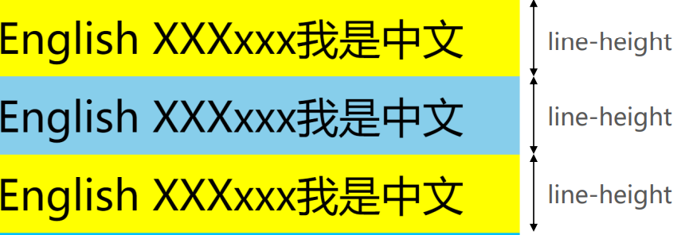

* 行高的**严格定义**是：**两行文字基线（baseline）之间的间距**
* 基线（baseline）：**与小写字母x最底部对齐的线**

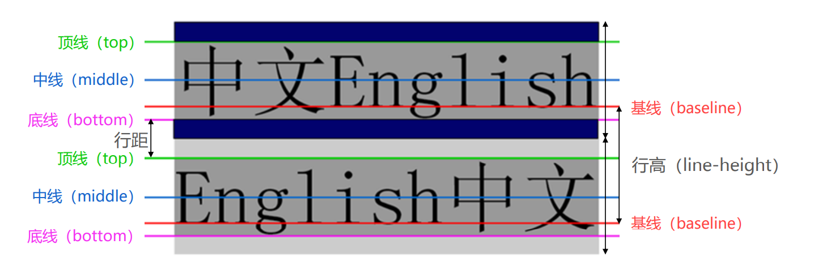

**注意区分height和line-height的区别**
*  height：元素的整体高度
* line-height：元素中每一行文字所占据的高度

应用实例：假设div中只有一行文字，如何让这行文字在div内部垂直居中
* 让line-height等同于height
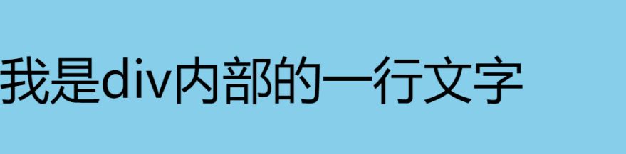

### font
font是一个缩写属性
* font 属性可以用来作为 font-style, font-variant, font-weight, font-size, line-height 和 font-family 属性的简写;
* **font-style font-variant font-weight font-size/line-height font-family**

规则:
* font-style、font-variant、font-weight可以随意调换顺序，也可以省略
* /line-height可以省略，如果不省略，必须跟在font-size后面
* font-size、font-family不可以调换顺序，不可以省略

## CSS选择器（selector）
选择器的种类繁多，大概可以这么归类
* 通用选择器（universal selector）
* 元素选择器（type selectors）
* 类选择器（class selectors）
* id选择器（id selectors）
* 属性选择器（attribute selectors）
* 组合（combinators）
* 伪类（pseudo-classes）
* 伪元素（pseudo-elements）
### 通用选择器
通用选择器（universal selector）
* 所有的元素都会被选中;

一般用来给所有元素作一些通用性的设置
* 比如内边距、外边距;
* 比如重置一些内容;

**效率比较低，尽量不要使用;**
### 简单选择器
* 元素选择器（type selectors）, 使用元素的名称;
* 类选择器（class selectors）, 使用 .类名 ;
* id选择器（id selectors）, 使用 #id

### id注意事项
一个HTML文档里面的id值**是唯一的，不能重复**
* id值如果由多个单词组成，单词之间可以用中划线-、下划线_连接，也可以使用驼峰标识
* 最好不要用标签名作为id值
### 属性选择器(attribute selectors)
拥有某一个属性 `[att]`

属性等于某个值 `[att=val]`

其他了解的(不用记)
* `[attr*=val]`: 属性值包含某一个值val;
* `[attr^=val]`: 属性值以val开头;
* `[attr$=val]`: 属性值以val结尾;
* `[attr|=val]`: 属性值等于val或者以val开头后面紧跟连接符-;
* `[attr~=val]`: 属性值包含val, 如果有其他值必须以空格和val分割;

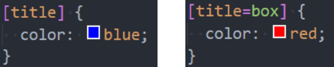

### 后代选择器 （descendant combinator）
**后代选择器一: 所有的后代(直接/间接的后代)**
* 选择器之间以空格分割
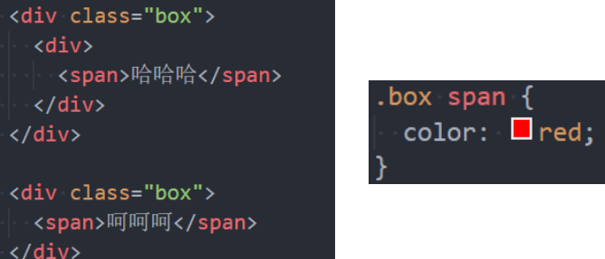

**后代选择器二: 直接子代选择器(必须是直接自带)**
* 选择器之间以 > 分割

**兄弟选择器一:相邻兄弟选择器**
* 使用符号 + 连接

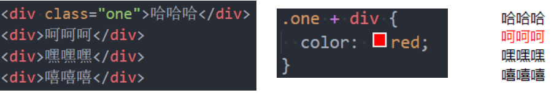

**兄弟选择器二: 普遍兄弟选择器 ~**
*  使用符号 ~ 连接

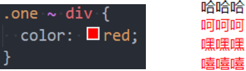

### 选择器组 – 交集选择器

**交集选择器: 需要同时符合两个选择器条件(两个选择器紧密连接)**
* 在开发中通常为了精准的选择某一个元素;

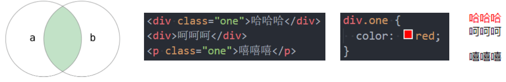

**并集选择器: 符合一个选择器条件即可(两个选择器以,号分割)**
* 在开发中通常为了给多个元素设置相同的样式

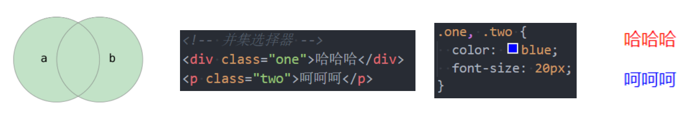

## 认识伪类
伪类是选择器的一种，它用于**选择处于特定状态的元素**

常见的伪类有

**1.动态伪类（dynamic pseudo-classes）**
* :link、:visited、:hover、:active、:focus

**2.目标伪类（target pseudo-classes）**
* :target

**3.语言伪类（language pseudo-classes）**
*  :lang( )

**4.元素状态伪类（UI element states pseudo-classes）**
*  :enabled、:disabled、:checked

**5.结构伪类（structural pseudo-classes）**
*  :nth-child( )、:nth-last-child( )、:nth-of-type( )、:nth-last-of-type( )
* :first-child、:last-child、:first-of-type、:last-of-type
* :root、:only-child、:only-of-type、:empty

**6.否定伪类（negation pseudo-classes）**
* :not()

[所有的伪类](https://developer.mozilla.org/zh-CN/docs/Web/CSS/Pseudo-classes)

### 动态伪类（dynamic pseudo-classes)
使用举例
* a:link 未访问的链接
* a:visited 已访问的链接
* **a:hover** 鼠标挪动到链接上(重要)
* a:active 激活的链接（鼠标在链接上长按住未松开）

使用注意
* :hover必须放在:link和:visited后面才能完全生效
* :active必须放在:hover后面才能完全生效
* 所以建议的编写顺序是 :link、:visited、:hover、:active

**除了a元素，:hover、:active也能用在其他元素上**

### 动态伪类 - :focus
:focus 指当前**拥有输入焦点的元素**（能接收键盘输入）
* 文本输入框一聚焦后，背景就会变红色

因为链接a元素可以被键盘的Tab键选中聚焦，所以:focus也适用于a元素

**动态伪类编写顺序建议为**
* :link、:visited、:focus、:hover、:active

**直接给a元素设置样式，相当于给a元素的所有动态伪类都设置了**
*  相当于a:link、a:visited、a:hover、a:active、a:focus的color都是red
### 结构伪类 - :nth-child
**:nth-child(1)**
* 是父元素中的第1个子元素

**:nth-child(2n)**
* 代表任意正整数和0
* 是父元素中的第偶数个子元素（第2、4、6、8......个）
* 跟:nth-child(even)同义

**:nth-child(2n + 1)**
* n代表任意正整数和0
* 是父元素中的第奇数个子元素（第1、3、5、7......个）
* 跟:nth-child(odd)同义

**nth-child(-n + 2)**
* 代表前2个子元素
### 结构伪类 - :nth-last-child( )
:nth-last-child()的语法跟:nth-child()类似，不同点是:nth-last-child()从最后一个子元素开始往前计数
* :nth-last-child(1)，代表倒数第一个子元素
* :nth-last-child(-n + 2)，代表最后2个子元素

:nth-of-type()用法跟:nth-child()类似
* 不同点是:nth-of-type()计数时只计算同种类型的元素

:nth-last-of-type()用法跟:nth-of-type()类似
* 不同点是:nth-last-of-type()从最后一个这种类型的子元素开始往前计数

### 结构伪类 - :nth-of-type( )、:nth-last-of-type( )
其他常见的伪类(了解): 
* :first-child，等同于:nth-child(1)
* :last-child，等同于:nth-last-child(1)
* :first-of-type，等同于:nth-of-type(1)
* :last-of-type，等同于:nth-last-of-type(1)
* :only-child，是父元素中唯一的子元素
* :only-of-type，是父元素中唯一的这种类型的子元素

下面的伪类偶尔会使用:
* :root，根元素，就是HTML元素
* :empty代表里面完全空白的元素
### 否定伪类（negation pseudo-class)
:not()的格式是 :not(x)
*  x是一个简单选择器
* 元素选择器、通用选择器、属性选择器、类选择器、id选择器、伪类（除否定伪类）

:not(x) 表示除x以外的元素

## 伪元素（pseudo-elements）

**常用的伪元素有**
*  :first-line、::first-line
*  :first-letter、::first-letter 
*  :before、**::before**
*  :after、**::after**

为了区分伪元素和伪类，建议**伪元素使用2个冒号**，比如::first-line

### 伪元素 - ::first-line - ::first-letter(了解)
* ::first-line可以针对首行文本设置属性
* ::first-letter可以针对首字母设置属性

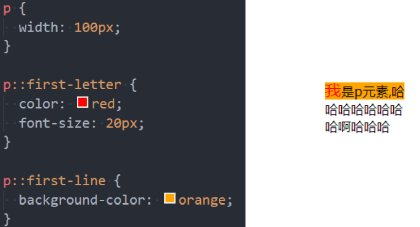

### 伪元素 - ::before和::after(常用)
::before和::after用来在一个元素的**内容之前或之后插入其他内容（可以是文字、图片)**
*  常通过 **content 属**性来为一个元素添加修饰性的内容

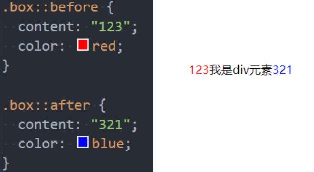

