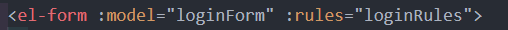

# element-ui 
[Element-ui 官网](https://element.eleme.io/#/zh-CN/component/installation)

安装 element-ui
```
npm i element-ui
```

## element-ui 集成
**按需引入**

在 global 文件夹的 register-element 模块单独管理


**main.js**


global/index.js  入口文件


global/register-element.js 

## 表单校验
### 表单校验的先决条件
表单校验需要如下先决条件, [https://element.eleme.io/#/zh-CN/component/form](https://element.eleme.io/#/zh-CN/component/form)


**model 属性**
 

**绑定 model**
 

**rules规则**
 先至为空 , 后面再总结 

**设置 prop 属性**


**给 input 绑定字段属性**


### 表单校验规则
要完成表单的校验，需要编写规则

ElementUI 的表单校验规则来自第三方校验规则参见 [async-validator](https://github.com/yiminghe/async-validator)

几个基本使用的规则

| 规则      | 说明                                                         |
| --------- | ------------------------------------------------------------ |
| required  | 如果为true，表示该字段为必填                                 |
| message   | 当不满足设置的规则时的提示信息                               |
| pattern   | 正则表达式，通过正则验证值                                   |
| min       | 当值为字符串时，min表示字符串的最小长度，当值为数字时，min表示数字的最小值 |
| max       | 当值为字符串时，max表示字符串的最大长度，当值为数字时，max表示数字的最大值 |
| trigger   | 校验的触发方式，change（值改变） / blur （失去焦点）两种，   |
| validator | 如果配置型的校验规则不满足你的需求，你可以通过自定义函数来完成校验 |

校验规则的格式 :***{ key(字段名): value(校验规则) -> [{},{}...] }***

* **手机号**  1.必填 2.手机号格式校验 3. 失去焦点校验
* **密码** 1.必填 2.6-16位长度 3. 失去焦点校验
 

### 自定义校验规则
**`validator`** 是一个函数, 其中有三个参数 (**`rule`**(当前规则),**`value`**(当前值),**`callback`**(回调函数))
```js
var  func = function (rule, value, callback) {
    // 根据value进行进行校验 
    // 如果一切ok  
    // 直接执行callback
    callback() // 一切ok 请继续
    // 如果不ok 
    callback(new Error("错误信息"))
}
```
根据以上要求，增加手机号第三位必须是 9 的校验规则

如下


### 手动校验的实现
如果直接点登陆按钮，没有离开焦点，那该怎么校验 ?

此时需要用到手动完整校验

form 表单提供了一份 API 方法，我们可以对表单进行完整和部分校验

| 方法名        | 说明                                                         | 参数                                                         |
| :------------ | :----------------------------------------------------------- | :----------------------------------------------------------- |
| validate      | 对整个表单进行校验的方法，参数为一个回调函数。该回调函数会在校验结束后被调用，并传入两个参数：是否校验成功和未通过校验的字段。**若不传入回调函数，则会返回一个 promise** | Function(callback: Function(boolean, object))                |
| validateField | 对部分表单字段进行校验的方法                                 | Function(props: array \| string, callback: Function(errorMessage: string)) |
| resetFields   | 对整个表单进行重置，将所有字段值重置为初始值并移除校验结果   | —                                                            |
| clearValidate | 移除表单项的校验结果。传入待移除的表单项的 prop 属性或者 prop 组成的数组，如不传则移除整个表单的校验结果 | Function(props: array \| string)                             |

这些方法是 el-form 的 API，需要获取 el-form 的实例，才可以调用

**采用 ref 进行调用 , 调用校验 validate 方法**


如果没传入回调, 返回的是 Promise 


