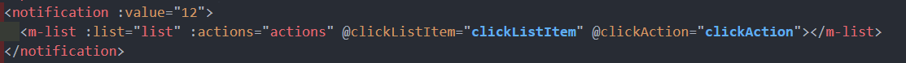

# 初级组件 - 下
* 趋势标记组件
* 列表组件
* 通知菜单组件
* 通知菜单和列表组件联动
* 组件自定义属性

## 趋势标记组件
先创建响应文件,全局注册, 配置路由... 做下准备工作

这里全局注册的方法容易忘, 下面再记录一下


components/trend/index.ts
```ts 
import Trend from './src/index.vue'
import { App} from 'vue'

export default {
  install(app: App) {
    app.component('trend',Trend)
  }
}
```
components/index.ts  components 总入口文件
```ts 
import chooseIcon from './chooseIcon'
import chooseArea from './chooseArea'
import trend from './trend'
import { App } from 'vue';

const components = [
  chooseArea,
  chooseIcon,
  trend
]
export default {
  install(app:App) {
    components.forEach(component => {
      app.use(component)
    })
  }
}
```
### 图标的组合实现上升/下降趋势
先分析趋势标记组件要接受哪一种 props
1. 标记当前趋势 type 是上升(up) 或 下降 (down), 默认 up
2. 趋势显示的文字 text: 
   1. 父组件传递过来的数据
   2. 插槽
3. 可以自定义颜色 : upIconColor 默认(#f5222d), downIconColor 默认(#52c41a)
4. 还有一些需求...

```vue
<template>
  <div class="container">
    <div class="trend">
      <div class="text">{{ text }}</div>
      <div class="icon">
        <el-icon-arrow-up
          v-if="type === 'up'"
          :style="{ color: upIconColor }"
        />
        <el-icon-arrow-down v-else :style="{ color: downIconColor }" />
      </div>
    </div>
  </div>
</template>

<script setup lang="ts"> 
const props = defineProps({
  // 趋势类型
  type: {
    type: String,
    default: "up",
  },
  // 文字
  text: {
    type: String,
  },
  upIconColor: {
    type: String,
    default: "#f5222d",
  },
  downIconColor: {
    type: String,
    default: "#52c41a",
  },
});
</script>

<style lang="scss" scoped>
.container {
  display: inline-block;
  .trend {
    display: flex;
    align-items: center;
    .text {
    }
    .icon {
      display: flex;
      align-items: center;
      svg {
        margin-left: 4px;
        width: 16px;
        height: 16px;
      }
    }
  }
}
</style>
```
### 插槽的处理
先处理一下 如果以**插槽**的形式传过来文字, 那么就**不显示**以 props 的形式传过来的 text, 只显示插槽传过来的值

这个怎么处理 ? 
* 判断一下插槽中有没有写入东西, 并用 v-if / v-else 判断显示与否
* 默认的插槽名字是 `default`, 如果是具名插槽, 那么是 slots.xxx
```js
<div class="text">
    <slot v-if="slots.default"></slot>
    <div v-else>{{ text }}</div>
</div>

import { useSlots } from "vue";
const slots = useSlots();
```
### 计算属性实现文字颜色 
当然文字颜色也要通过 props 传递具体的颜色 , 这里需要判断一下是 up时 的颜色还是 down 时的颜色

```js
<div class="text" :style="{ color: textColor }">
    <slot v-if="slots.default"></slot>
    <div v-else>{{ text }}</div>
</div>

import { ... , computed } from "vue";
const props = defineProps({
  ...
  upTextColor: { // 上升趋势文字颜色
    type: String,
    default: "black",
  },
  downTextColor: { // 下降趋势文字颜色  
    type: String,
    default: "black",
  },
});
...

// 计算文字颜色
const textColor = computed(() => {
  return props.type === "up" ? props.upTextColor : props.downTextColor;
});
```
### 自定义图标
也是可以让通过 props 定制, 并且自定义的图标使用 **component 动态组件**进行处理

```js
<component
      :is="`el-icon${toLine(upIcon)}`"
      v-if="type === 'up'"
      :style="{ color: upIconColor }"
></component>
<component
      :is="`el-icon${toLine(downIcon)}`"
      v-else
      :style="{ color: downIconColor }"
></component>

import { toLine } from "../../../utils";
...
const props = defineProps({
  ...
  upIcon: {
    type: String,
    default: "ArrowUp",
  },
  downIcon: {
    type: String,
    default: "ArrowDown",
  },
});
```
## 通知菜单
### icon 和 badge 组件的组合使用
该组件接受的 props 是借鉴了 el-badge 的属性, 先这么初步实现


```vue
<template>
  <el-badge :value="value" :max="max" :is-dot="isDot" style="cursor: pointer">
    <component :is="`el-icon${toLine(icon)}`"></component>
  </el-badge>
</template>
<script setup lang="ts">
import { toLine } from "../../../utils";

const props = defineProps({
  // 要显示的图标
  icon: {
    type: String,
    default: "Bell",
  },
  // 消息条数
  value: {
    type: [String, Number],
    required: true,
  },
  // 最大值
  max: {
    type: Number,
    default: 50,
  },
  // 是否显示小圆点
  isDot: {
    type: Boolean,
    default: false,
  },
});
</script>
```
### 使用 el-popover 弹出框 和 封装一个列表组件
点击图标时弹出的弹出框使用 [el-popover](https://element-plus.gitee.io/zh-CN/component/popover.html)

并且弹出框里面的内容, 用户可以自定义, 因为配了一个 **插槽**


```vue{2-6,15-16}
<template>
  <el-popover placement="bottom-start" :width="300" trigger="click">
    <template #default>
      <slot></slot>
    </template>
    <template #reference>
      <el-badge
        style="cursor: pointer"
        :value="value"
        :max="max"
        :is-dot="isDot"
      >
        <component :is="`el-icon${toLine(icon)}`"></component>
      </el-badge>
    </template>
  </el-popover>
</template>
```

关于弹出框里面需要展示的组件 封装一个新的组件叫 `m-list` 。 先创建文件, 全局注册...


先声明 m-list 组件 可接受的 props 的 ts 类型 , list/src/types.ts 
```ts
// 列表的每一项
export interface ListItem {
  // 头像
  avatar?: string
  // 标题
  title?: string,
  // 描述
  desc?: string
  // 相对时间
  time?: string
  // 标签内容
  tag:string,
  // 标签类型
  tagType?: ''|'success'|'info'|'warning'|'danger'
}

// 列表
export interface ListOptions {
  // tab 标题
  title: string
  content:ListItem[]
}
// 底部操作选项
export interface ActionOptions {
  icon?: string
  text:string
}
```

index.vue  初步声明一下 m-list  组件可接受的 props
```vue
<template>
  <div>list组件</div>
</template>

<script setup lang="ts">
import { PropType } from "vue";
import { ListOptions, ActionOptions, ListItem } from "./types";
const props = defineProps({
  list: {
    type: Array as PropType<ListOptions[]>,
    required: true
  },
  actions: {
    type: Array as PropType<ActionOptions[]>,
    default: () => []
  },
});
</script>
```
###  list 列表组件的 UI 渲染
先模拟后端返回给我的数据, m-list 组件接受的 props 数据 `list`

data.ts
```ts
export const list = [
  {
    title: '通知',
    content: [
      {
        title: '蒂姆·库克回复了你的邮件',
        time: '2019-05-08 14:33:18',
        avatar: 'https://gw.alipayobjects.com/zos/rmsportal/ThXAXghbEsBCCSDihZxY.png'
      },
      {
        title: '乔纳森·伊夫邀请你参加会议',
        time: '2019-05-08 14:33:18',
        avatar: 'https://gw.alipayobjects.com/zos/rmsportal/OKJXDXrmkNshAMvwtvhu.png'
      },
      {
        title: '斯蒂夫·沃兹尼亚克已批准了你的休假申请',
        time: '2019-05-08 14:33:18',
        avatar: 'https://gw.alipayobjects.com/zos/rmsportal/kISTdvpyTAhtGxpovNWd.png'
      }

    ],
  },
  {
    title: '关注',
    content: [
      {
        avatar: 'https://gw.alipayobjects.com/zos/rmsportal/fcHMVNCjPOsbUGdEduuv.jpeg',
        title: '曲丽丽 评论了你',
        desc: '描述信息描述信息描述信息',
        time: '3小时前'
      },
      {
        avatar: 'https://gw.alipayobjects.com/zos/rmsportal/fcHMVNCjPOsbUGdEduuv.jpeg',
        title: '曲丽丽 评论了你',
        desc: '描述信息描述信息描述信息',
        time: '3小时前'
      },
      {
        avatar: 'https://gw.alipayobjects.com/zos/rmsportal/fcHMVNCjPOsbUGdEduuv.jpeg',
        title: '曲丽丽 评论了你',
        desc: '描述信息描述信息描述信息',
        time: '3小时前'
      }
    ]
  },
  {
    title: '代办',
    content: [
      {
        title: '任务名称',
        desc: '任务需要在 2017-01-12 20:00 前启动',
        tag: '未开始',
        tagType: ''
      },
      {
        title: '第三方紧急代码变更',
        desc: '冠霖提交于 2017-01-06，需在 2017-01-07 前完成代码变更任务',
        tag: '马上到期',
        tagType: 'danger'
      },
      {
        title: '信息安全考试',
        desc: '指派竹尔于 2017-01-09 前完成更新并发布',
        tag: '已耗时8天',
        tagType: 'warning'
      }
    ]
  },
]
export const actions = [
  {
    text: '清空代办',
    icon: 'delete'
  },
  {
    text: '查看更多',
    icon: 'edit'
  },
]
```

把模拟的数据以 props 的形式传递给 m-list 组件
```js{2}
<notification :value="12">
  <m-list :list="list" :actions="actions"></m-list>
</notification>

import { list, actions } from "./data";
```

然后渲染数据


```vue
<template>
  <div class="m-list">
    <el-tabs v-model="activeName" class="demo-tabs" stretch>
      <el-tab-pane
        v-for="(item, index) in list"
        :label="item.title"
        :name="item.title"
      >
        <el-scrollbar max-height="300px">
          <div
            class="container"
            v-for="(listItem, index) in item.content"
            :key="index"
          >
            <div class="avatar" v-if="listItem.avatar">
              <el-avatar :src="listItem.avatar"></el-avatar>
            </div>
            <div class="content">
              <div class="title" v-if="listItem.title">
                <div class="title-text">{{ listItem.title }}</div>
                <el-tag
                  :type="listItem.tagType"
                  v-if="listItem.tagType"
                  size="small"
                >
                  {{ listItem.tag }}
                </el-tag>
              </div>
              <div class="desc" v-if="listItem.desc">{{ listItem.desc }}</div>
              <div class="time" v-if="listItem.time">{{ listItem.time }}</div>
            </div>
          </div>
        </el-scrollbar>
        <div class="actions">
          <div class="action" v-for="(action, i) in actions" :key="i">
            <div class="a-icon" v-if="action.icon">
              <component :is="`el-icon-${action.icon}`"></component>
            </div>
            <div class="a-title">{{ action.text }}</div>
          </div>
        </div>
      </el-tab-pane>
    </el-tabs>
  </div>
</template>

<script setup lang="ts">
import { ref, PropType } from "vue";
import { ListOptions, ActionOptions } from "./types";
const props = defineProps({
  list: {
    type: Array as PropType<ListOptions[]>,
    required: true,
  },
  actions: {
    type: Array as PropType<ActionOptions[]>,
    default: () => [],
  },
});
// 选中的 tab
const activeName = ref<string>(props.list[0].title);
//
</script>
<style lang="scss" scoped>
.container {
  display: flex;
  padding: 12px 0;
  cursor: pointer;
  transition: all 0.25s ease;
  &:hover {
    background-color: rgb(232, 232, 232);
  }
  .avatar {
    display: flex;
    justify-content: center;
    align-items: center;
    flex: 1;
    padding: 10px;
  }
  .content {
    flex: 3;
    padding: 10px;
    .title {
      position: relative;
      .title-text {
      }
      .el-tag {
        position: absolute;
        top: 0;
        right: 0;
      }
    }
    .desc {
      margin-top: 4px;
      font-size: 12px;
    }
    .time {
      margin-top: 4px;
      font-size: 12px;
    }
  }
}
.actions {
  display: flex;;
  .action {
    flex:1;
    display: flex;
    align-items: center;
    justify-content: center;
    padding:8px;
    transition: all 0.25s ease;
    cursor: pointer;
    border-radius: 4px;
    &:hover {
      background-color: rgb(247, 244, 244);
    }
    .a-icon {
      display: flex;
      align-items: center;
      svg {
        width:14px;
        height:14px;
        margin-right:4px;
      }
    }
    .a-title {}
  }
}
</style>
```

### 完善 list 组件 点击时分发事件,  并融合进通知菜单
点击列表的某一项 , 或者点击底部操作按钮都要分发事件通知给父组件


```vue{17-24}
<script setup lang="ts">
import { ref, PropType } from "vue";
import { ListOptions, ActionOptions,ListItem } from "./types";
const props = defineProps({
  list: {
    type: Array as PropType<ListOptions[]>,
    required: true,
  },
  actions: {
    type: Array as PropType<ActionOptions[]>,
    default: () => [],
  },
});
// 选中的 tab
const activeName = ref<string>(props.list[0].title);

const emits = defineEmits(['clickListItem','clickAction'])
// 点击列表某一项. 派发事件
const clickListItem = (listItem:ListItem,index:number) => {
  emits('clickListItem', {index,listItem})
}
const clickAction = (i:number,action:ActionOptions) => {
  emits('clickAction', {index:i,action})
}
</script>
```
并在父组件监听一下事件 , 接受传递多来的结果 



