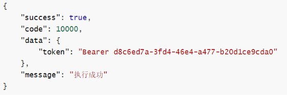
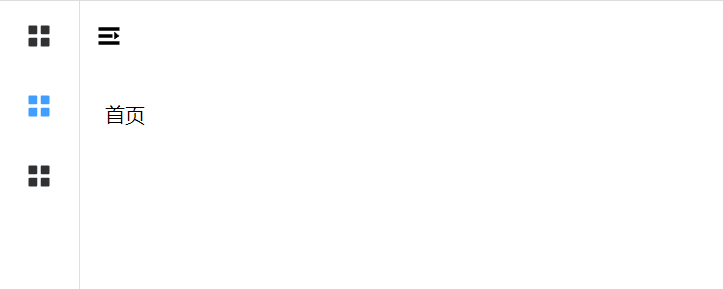
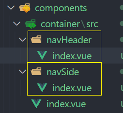
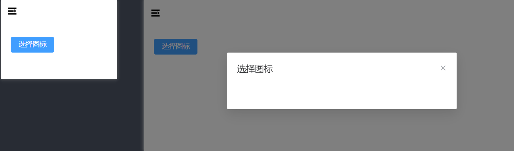
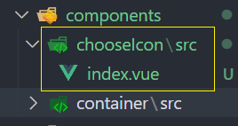
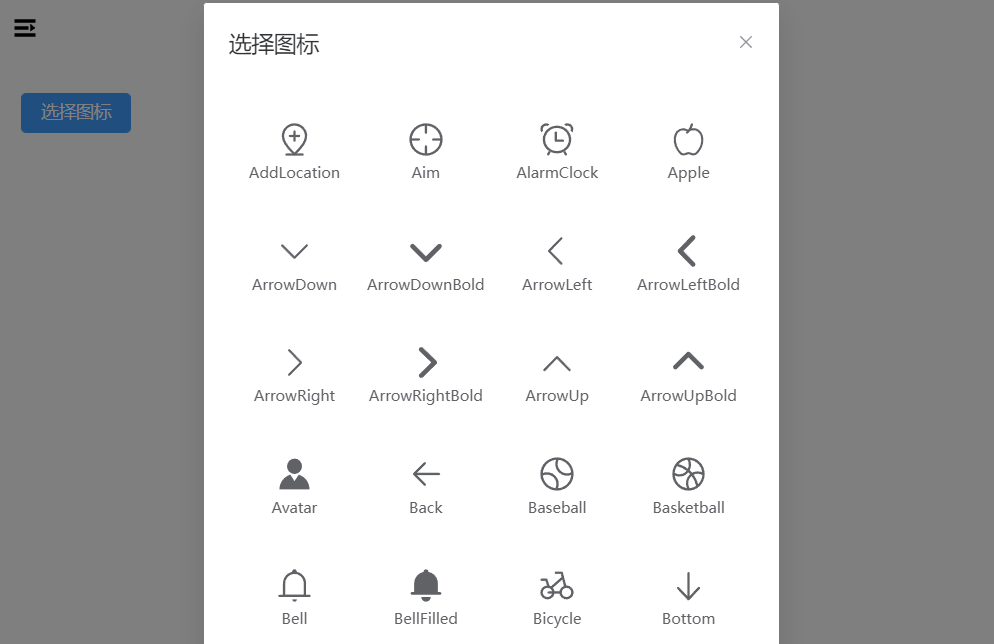
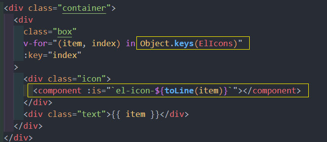
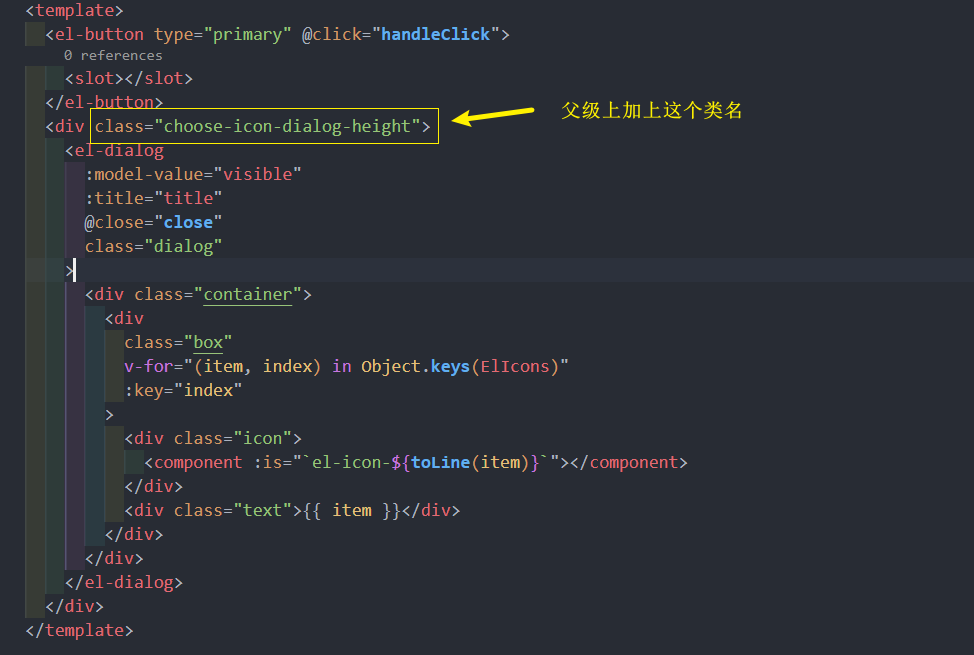
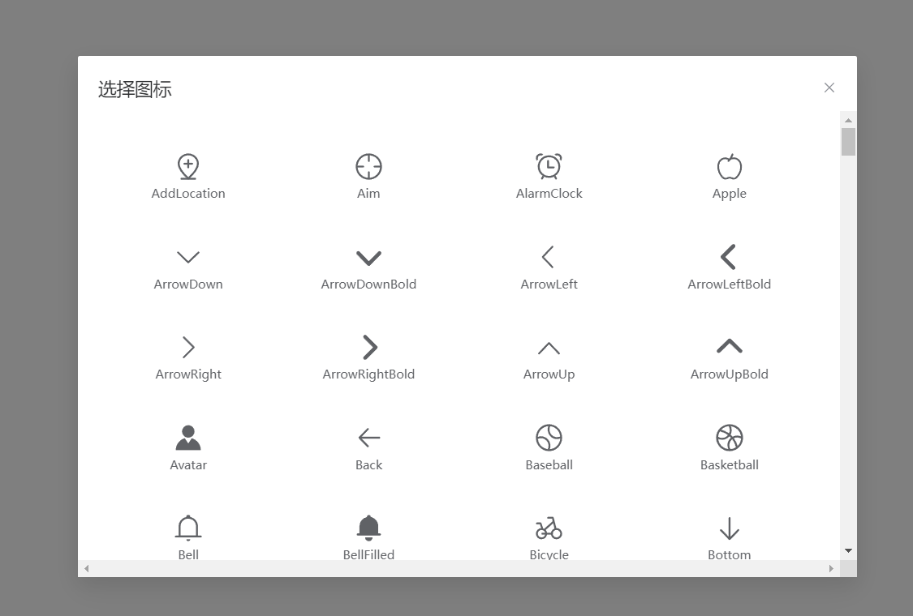
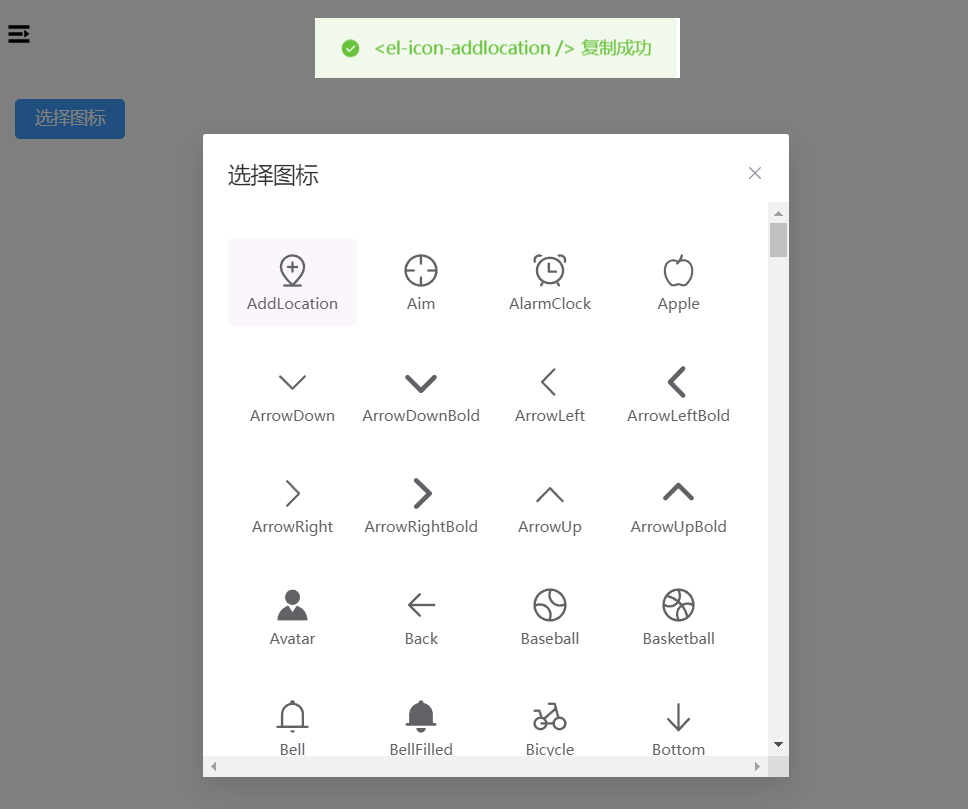

# 搭建环境

## 搭建 Vite 项目

```shell
# 查看 npm 版本
npm -v
```

[Vite 官网](https://cn.vitejs.dev/guide/#scaffolding-your-first-vite-project)

创建项目

```shell
# npm 7+, extra double-dash is needed:
npm create vite@latest my-vue-app -- --template vue
```

```shell
npm install
npm run dev
```

`vite.config.ts` 配置端口号

```ts
import { defineConfig } from "vite";
import vue from "@vitejs/plugin-vue";

// https://vitejs.dev/config/
export default defineConfig({
  plugins: [vue()],
  server: {
    port: 8080,
  },
});
```

## 配置路由 和 Element Plus

#### 安装 Vue Router 和 Element Plus

```shell
npm install -S vue-router@next element-plus
```

项目 src 目录下创建 router 文件夹, 创建 index.ts 文件

```ts
import { createRouter, createWebHashHistory, RouteRecordRaw } from "vue-router";
const routes: RouteRecordRaw[] = [
  {
    path: "/",
    component: () => import("../views/Home.vue"),
  },
];

const router = createRouter({
  history: createWebHashHistory(),
  routes,
});

export default router;
```

记得模板上要写上 router-view 出口

#### 安装 sass

```shell
npm install -D sass sass-loader
```

#### 找不到模块报错解决

typescript 只能理解 .ts 文件，无法理解 .vue 文件

因此需要给.vue 文件加上类型说明文件

解决方法：在项目根目录或 src 文件夹下创建一个后缀为 .d.ts 的文件，并写入以下内容：

```ts
declare module "*.vue" {
  import type { DefineComponent } from "vue";
  // eslint-disable-next-line @typescript-eslint/no-explicit-any, @typescript-eslint/ban-types
  const component: DefineComponent<{}, {}, any>;
  export default component;
}
```

#### main.js 引入

在 main.js 引入 vue-router 和 Element Plus

```js
import { createApp } from "vue";
import "./style.css";
import App from "./App.vue";
import router from "./router";
import ElementPlus from "element-plus";
import "element-plus/dist/index.css";

const app = createApp(App);
app.use(router);
app.use(ElementPlus);
app.mount("#app");
```

## 全局注册图标

[注册所有图标](https://element-plus.gitee.io/zh-CN/component/icon.html#%E4%BD%BF%E7%94%A8%E5%8C%85%E7%AE%A1%E7%90%86%E5%99%A8)

```shell
npm install @element-plus/icons-vue
```

需要从 @element-plus/icons-vue 中导入所有图标并进行全局注册

```js
....
import * as Icons from "@element-plus/icons-vue";
import { toLine } from "./utils";
const app = createApp(App);

// 注册全局图标 浪费一点性能
for (const [key, component] of Object.entries(Icons)) {
  // 注册全部组件 el-icon-xxx 的形式
  app.component(`el-icon-${toLine(key)}`, component);
}
...
```

在组件中药使用 el-icon-xxx 的写法, 所以事先封装工具函数 utils/index.ts , 把驼峰命名写法 -> 横杠链接的写法

```ts
// 驼峰命名 变成 横岗链接的写法
export const toLine = (value: string) => {
  return value.replace(/(A-Z)g/, "-$1").toLowerCase();
};
```

给图标一个默认大小, src 创建 styles 文件夹, 创建 index.scss 写入全局样式 , 不要忘记 main.js 引入样式表

```scss
svg {
  width: 1em;
}
* {
  padding: 0;
  margin: 0;
}
```

## 伸缩菜单

创建布局容器 src/components/container/src/index.vue

```vue
<template>
  <div class="common-layout">
    <el-container>
      <el-aside width="200px">Aside</el-aside>
      <el-container>
        <el-header>Header</el-header>
        <el-main>
          <!--router-view 出口-->
          <router-view></router-view>
        </el-main>
      </el-container>
    </el-container>
  </div>
</template>

<script setup lang="ts"></script>

<style lang="scss" scoped></style>
```

然后重新配置一下主路由 router/index.ts

```ts
import { createRouter, createWebHashHistory, RouteRecordRaw } from "vue-router";
import Container from "../components/container/src/index.vue";

const routes: RouteRecordRaw[] = [
  {
    path: "/",
    component: Container,
    redirect: "/home",
    children: [
      {
        path: "home",
        name: "home",
        component: () => import("../views/Home.vue"),
      },
    ],
  },
];

const router = createRouter({
  history: createWebHashHistory(),
  routes,
});

export default router;
```

创建完布局容器之后 , 现在初步实现左侧的菜单, 实现一级菜单

```vue
<template>
  <div class="common-layout">
    <el-container>
      <el-aside width="200px">
        <el-menu default-active="2" class="el-menu-vertical-demo">
          <el-menu-item index="1">
            <span>导航1</span>
          </el-menu-item>
          <el-menu-item index="2">
            <span>导航2</span>
          </el-menu-item>
          <el-menu-item index="3">
            <span>导航3</span>
          </el-menu-item>
        </el-menu>
      </el-aside>
      <el-container>
        <el-header>Header</el-header>
        <el-main>
          <router-view></router-view>
        </el-main>
      </el-container>
    </el-container>
  </div>
</template>
<style lang="scss" scoped>
.common-layout,
.el-container,
.el-menu {
  height: 100%;
}
</style>
```

发现导航时已经出现了, 但整体的高度没有撑满, 如图


styles/index.scss

```scss
html,
body,
#app {
  height: 100%;
}
```

### 初步实现

准备工作就绪, 现在处理一下伸缩菜单功能

el-aside 的 width 应设为 auto , 并且要加上 .el-menu-vertical-demo:not(.el-menu--collapse) { width: 200px;}

```vue
<template>
  <div class="common-layout">
    <el-container>
      <el-aside width="auto">
        <el-menu
          default-active="2"
          class="el-menu-vertical-demo"
          :collapse="isCollapse"
        >
          <el-menu-item index="1">
            <el-icon-menu />
            <span>导航1</span>
          </el-menu-item>
          <el-menu-item index="2">
            <el-icon-menu />
            <span>导航2</span>
          </el-menu-item>
          <el-menu-item index="3">
            <el-icon-menu />
            <span>导航3</span>
          </el-menu-item>
        </el-menu>
      </el-aside>
      <el-container>
        <el-header>
          <span @click="toggleClick" class="toggle-btn">
            <el-icon-expand v-if="isCollapse"></el-icon-expand>
            <el-icon-fold v-if="!isCollapse"></el-icon-fold>
          </span>
        </el-header>
        <el-main>
          <router-view></router-view>
        </el-main>
      </el-container>
    </el-container>
  </div>
</template>

<script setup lang="ts">
import { ref } from "vue";
const isCollapse = ref(true);

const toggleClick = () => {
  isCollapse.value = !isCollapse.value;
};
</script>

<style lang="scss" scoped>
.el-menu-vertical-demo:not(.el-menu--collapse) {
  width: 200px;
}
.el-header {
  padding: 0;
  display: flex;
  align-items: center;
  .toggle-btn {
    display: inline-block;
    padding: 12px;
    cursor: pointer;
  }
}
</style>
```

### 抽离侧边栏和头部





index.vue **v-model:isCollapsed 绑定**

```vue
<template>
  <div class="common-layout">
    <el-container>
      <el-aside width="auto">
        <nav-side :is-collapse="isCollapse" />
      </el-aside>
      <el-container>
        <el-header>
          <nav-header v-model:isCollapse="isCollapse" />
        </el-header>
        <el-main>
          <router-view></router-view>
        </el-main>
      </el-container>
    </el-container>
  </div>
</template>

<script setup lang="ts">
import NavHeader from "./navHeader/index.vue";
import NavSide from "./navSide/index.vue";
import { ref } from "vue";
const isCollapse = ref(true);
</script>

<style lang="scss" scoped>
.el-header {
  padding: 0;
  display: flex;
  align-items: center;
  .toggle-btn {
    display: inline-block;
    padding: 12px;
    cursor: pointer;
  }
}
</style>
```

navHeader/index.vue

```vue{9-18}
<template>
  <span @click="toggleClick" class="toggle-btn">
    <el-icon-expand v-if="isCollapse"></el-icon-expand>
    <el-icon-fold v-if="!isCollapse"></el-icon-fold>
  </span>
</template>

<script setup lang="ts">
const props = defineProps({
  isCollapse: {
    type: Boolean,
    required: true,
  },
});
const emits = defineEmits(["update:isCollapse"]);
const toggleClick = () => {
  emits("update:isCollapse", !props.isCollapse);
};
</script>

<style lang="scss" scoped>
</style>
```

navSide.vue

```vue
<template>
  <el-menu
    default-active="2"
    class="el-menu-vertical-demo"
    :collapse="isCollapse"
  >
    <el-menu-item index="1">
      <el-icon-menu />
      <span>导航1</span>
    </el-menu-item>
    <el-menu-item index="2">
      <el-icon-menu />
      <span>导航2</span>
    </el-menu-item>
    <el-menu-item index="3">
      <el-icon-menu />
      <span>导航3</span>
    </el-menu-item>
  </el-menu>
</template>

<script setup lang="ts">
defineProps({
  isCollapse: {
    type: Boolean,
    required: true,
  },
});
</script>

<style lang="scss" scoped>
.el-menu-vertical-demo:not(.el-menu--collapse) {
  width: 200px;
  .el-menu-item {
    span {
      margin-left: 10px;
    }
  }
}
</style>
```

## 图标选择器
需求: 点击按钮, 弹出对话框展示所有 icon 图标, 并且点击图标可以复制对应的代码
### 创建组件, 点击时显示对话框





components/chooseIcon/src/index.vue

```vue
<template>
  <el-button type="primary" @click="handleClick">
    <slot></slot>
  </el-button>
  <el-dialog :model-value="visible" :title="title" @close="close"></el-dialog>
</template>

<script setup lang="ts">
const props = defineProps<{
  // 对话框的显示/隐藏
  visible: boolean;
  // 对话框的标题
  title: string;
}>();

const emits = defineEmits(["update:visible"]);
// 点击
const handleClick = () => {
  emits("update:visible", true);
};
// 关闭
const close = () => {
  emits("update:visible", false);
};
</script>
```

注册一下新的路由页面

```ts
  {
        path: 'chooseIcon',
        name:'chooseIcon',
        component:() => import('../views/chooseIcon/index.vue')
      }
      ....
```

使用组件 , v-model:visible

```vue
<template>
  <div>
    <choose-icon title="选择图标" v-model:visible="visible">
      选择图标
    </choose-icon>
  </div>
</template>

<script setup lang="ts">
import ChooseIcon from "../../components/chooseIcon/src/index.vue";
import { ref } from "vue";

const visible = ref<boolean>(false);
</script>
```

### 巧用 component 动态组件显示所有图标


之前已经注册上了所有的图标组件 如: el-icon-xxx , 想要在页面中显示图标的话可以使用 component 动态组件, 把组件的字符串绑定到 `:is`上 



```vue{11-22,28-29}
<template>
  <el-button type="primary" @click="handleClick">
    <slot></slot>
  </el-button>
  <el-dialog
    :model-value="visible"
    :title="title"
    @close="close"
    class="dialog"
  >
    <div class="container">
      <div
        class="box"
        v-for="(item, index) in Object.keys(ElIcons)"
        :key="index"
      >
        <div class="icon">
          <component :is="`el-icon-${toLine(item)}`"></component>
        </div>
        <div class="text">{{ item }}</div>
      </div>
    </div>
  </el-dialog>
</template>

<script setup lang="ts">
...
import * as ElIcons from "@element-plus/icons-vue";
import { toLine } from "../../../utils";
...
</script>

<style lang="scss" scoped>
.container {
  display: flex;
  flex-wrap: wrap;

  .box {
    border-radius: 4px;
    padding:10px 0;
    width: 25%;
    display: flex;
    flex-direction: column;
    justify-content: center;
    align-items: center;
    margin-bottom: 20px;
    font-size: 12px;
    transition: all 0.25 ease;
    cursor: pointer;
    &:hover {
      background-color: rgb(220, 233, 240);
    }
    svg {
      width: 2.5em;
      height: 2.5em;
    }
  }
}
</style>
```
### 利用命名空间修改 dialog 的样式
还没完, 这里发现 dialog 它因为图标的数量非常的长, 所以要让它在一定的的区域内**滚动**

styles/ui.scss
```scss
// 修改组件内部的样式
// 1. 需要自定义一个类名空间(类名尽量复杂一点)
// 2. 在浏览器里面调试样式
// 3. 把调试好的类名放在这个类名里面 
// 4. 在main.js 引入这个文件
// 5. 在组件内需要改样式的父元素是哪个加上这个类名

.choose-icon-dialog-height {
  .el-dialog__body {
    height:400px;
    overflow: scroll;
  }
}
```


滚动条出现了 ~ 


### 自定义 hooks 函数实现复制功能

创建文件夹 hooks , hooks/useCopy/index.ts

封装**复制文本**的 Hooks
```ts
import { ElMessage } from 'element-plus'
// 复制文本
export const useCopy = (text: string) => {
  // 创建输入框
  let input = document.createElement('input')
  // 给输入框value赋值
  input.value = text
  // 追加到body上去
  document.body.appendChild(input)
  // 选择输入框操作
  input.select()
  // 执行复制曹组
  document.execCommand('Copy')
  // 删除加入的输入框
  document.body.removeChild(input)
  // 提示用户
  ElMessage.success(`${text} 复制成功`)
}
```

组件内点击图标时调用 hook
```vue{26}
<template>
  <div
      class="box"
      v-for="(item, index) in Object.keys(ElIcons)"
      :key="index"
      @click="clickItem(item)"
      >
  ...
</template>
<script lang="ts" scoped>
...
import { toLine } from "../../../utils";
import { useCopy } from '../../../hooks/useCopy'
...


// 关闭
const close = () => {
  emits("update:visible", false);
};

// 点击图标
const clickItem = (item) => {
  const iconName = `<el-icon-${toLine(item)} />`
  // 复制功能的 hooks
  useCopy(iconName)
  // 关闭对话框
  close()
}
</script>
```

## 省市区选择组件
需求:  三个**下拉框**, 没有填前一个就不能填下一个


