# 中级组件
## 进度条
需求: 实现一下进度条移动动画 

接受的 props :
* 百分比 percentage
* 是否要开启动画 isAnimation , 默认 false
* 想要设置的动画时长(毫秒) time,  默认 3000

```vue
<template>
  <el-progress :percentage="progress" v-bind="$attrs"></el-progress>
</template>

<script lang="ts" setup>
import { onMounted, ref } from "vue";
const props = defineProps({
  // 百分比
  percentage: {
    type: Number,
    required: true,
  },
  // 是否开启动画
  isAnimation: {
    type: Boolean,
    default: false,
  },
  // 动画时长(毫秒)
  time: {
    type: Number,
    default: 3000,
  },
});

// setInterval 间隔时长
const t = Math.ceil(props.time / props.percentage)
// 判断并设置百分比
const progress = ref(0);

onMounted(() => {
  if (props.isAnimation) { // 开启了动画
    let timer = setInterval(() => {
      progress.value += 1
      if (progress.value >= props.percentage) { 
        progress.value = props.percentage
        clearInterval(timer)  // 删除定时器!!
      }
    },t)
  } else {
    progress.value = props.percentage
  }
})
</script>
```
注意:
* 一定要**清除定时器**
* 可以使用 v-bind="$attrs" 绑定其他 el-progress 的属性

使用此组件
```vue
<template>
  <m-progress :percentage="100" isAnimation status="success"/>
  <br />
  <m-progress :text-inside="true" :stroke-width="26" :percentage="70" isAnimation/>  
  <br />
  <m-progress :percentage="60" isAnimation type="circle"/>
</template>
```
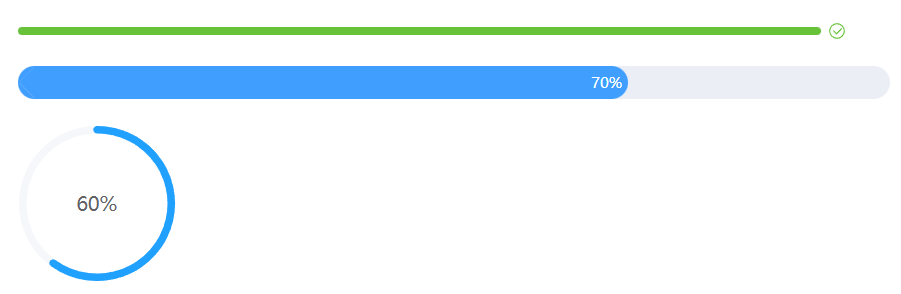


## 时间选择
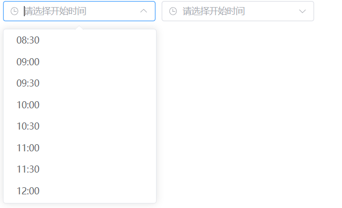

需求中的细节:
* 清空了开始时间, 结束时间也要跟着清空
* 如果没有选择开始时间 , 则不能先选择结束时间
* 选择开始时间, 选择结束时间 都要向父组件分发事件并传递选择的值 
  * 开始时间 就传递选择的开始时间值
  * 结束时间 要传递两个值: 一个开始值, 一个结束值 , 也就是他们俩组成的一个对象
* 组件内部要绑定 el-time-picker 的其他属性 
  * v-bind="$attrs.startOptions"
  * v-bind="$attrs.endOptions"
  * 可以通过分别传入对应的配置对象
### 完成时间选择组件的全部功能
直接实现了上面的需求
```vue
<template>
  <div class="choose-time" style="display: flex">
    <div class="start-time">
      <el-time-select
        v-model="startTime"
        :placeholder="startPlaceholder"
        :start="startTimeStart"
        :step="step"
        :end="startTimeEnd"
        clearable
        v-bind="$attrs.startOptions"
      />
    </div>
    <div class="end-time" style="margin-left: 10px">
      <el-time-select
        v-model="endTime"
        :min-time="startTime"
        :placeholder="endPlaceholder"
        :start="endTimeStart"
        :step="step"
        :end="endTimeEnd"
        clearable
        :disabled="endTImeDisabled"
        v-bind="$attrs.endOptions"
      />
    </div>
  </div>
</template>

<script setup lang="ts">
import { ref, watch } from "vue";
const props = defineProps({
  // 开始时间的占位符
  startPlaceholder: {
    type: String,
    default: "请选择开始时间",
  },
  // 开始的初始化选择
  startTimeStart: {
    type: String,
    default: "08:00",
  },
  // 时间间隔
  step: {
    type: String,
    default: "00:30",
  },
  // 开始时间的结束选择
  startTimeEnd: {
    type: String,
    default: "18:30",
  },
  // 结束时间的占位符
  endPlaceholder: {
    type: String,
    default: "请选择开始时间",
  },
  // 结束时间的初始化选择
  endTimeStart: {
    type: String,
    default: "08:00",
  },
  // 结束时间的结束选择
  endTimeEnd: {
    type: String,
    default: "18:30",
  },
});
const emits = defineEmits(["changeStart", "changeEnd"]);
const startTime = ref<string>("");
const endTime = ref<string>("");

// 禁用 结束时间 的选择
const endTImeDisabled = ref<boolean>(false);

watch(
  startTime,
  (val) => {
    if (val === "") {
      endTime.value = "";
      endTImeDisabled.value = true;
    } else {
      endTImeDisabled.value = false;
    }
    if (val !== "") {
      emits("changeStart", {
        start: startTime.value,
      });
    }
  },
  {
    immediate: true,
  }
);

watch(endTime, (val) => {
  if (val !== "") {
    emits("changeEnd", {
      start: startTime.value,
      end: endTime.value,
    });
  }
});
</script>
```

使用该组件 
```vue
<template>
  <div>时间选择器页面</div>
  <choose-time @changeStart="changeStart" @changeEnd="changeEnd"></choose-time>
</template>

<script setup lang="ts">
const changeStart = (res) => {
  console.log(res);
};
const changeEnd = (res) => {
  console.log(res); 
};
</script>
```
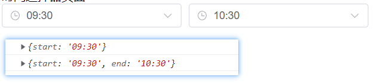

## 日期选择
需求细节: 
* 开始时间还没有选择, 则结束时间不可以选择
* 接受一个 props ->  disableToday : 选择开始日期  是否**禁用**今天之前的日期(不可选), 默认 false

el-time-picker 的一个属性

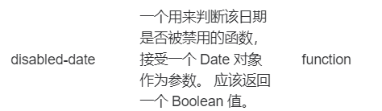

接受一个函数,  控制日期是否被禁用

并且如果选择了一个开始日期 , 那么在选择结束日期时**不允许**选择的开始日期之前的日期
* 选择开始时间, 选择结束时间 都要向父组件分发事件并传递选择的值 
  * 开始时间 就传递选择的开始时间值
  * 结束时间 要传递两个值: 一个开始值, 一个结束值 , 也就是他们俩组成的一个对象
* 组件内部要绑定 el-time-picker 的其他属性 
  * v-bind="$attrs.startOptions"
  * v-bind="$attrs.endOptions"
  * 可以通过分别传入对应的配置对象

```vue
<template>
  <div class="choose-date" style="display: flex">
    <div class="start-date">
      <el-date-picker
        v-model="startDate"
        type="date"
        :placeholder="startPlaceholder"
        :disabled-date="startDisabledFn"
        clearable
        v-bind="$attrs.startOptions"
      />
    </div>
    <div class="end-date" style="margin-left: 10px">
      <el-date-picker
        v-model="endDate"
        type="date"
        :placeholder="endPlaceholder"
        clearable
        :disabled="endDisabled"
        :disabled-date="endDisabledFn"
        v-bind="$attrs.endOptions"
      />
    </div>
  </div>
</template>

<script setup lang="ts">
import { ref, watch } from "vue";
const props = defineProps({
  startPlaceholder: {
    type: String,
    default: "请选择开始日期",
  },
  endPlaceholder: {
    type: String,
    default: "请选择结束日期",
  },
  // 是否禁用选择今天之前的日期
  disableToday: {
    type: Boolean,
    default: false,
  },
});
const startDate = ref<Date | null>(null);
const endDate = ref<Date | null>(null);

const emits = defineEmits(["changeStart", "changeEnd"]);
// 禁用选择今天之前日期的函数
const startDisabledFn = (time: Date) => {
  if (props.disableToday) {
    return time.getTime() < Date.now() - 1000 * 60 * 60 * 25;
  } else {
    return false;
  }
};
// 禁用 结束日期中的选择的开始日期 的函数
const endDisabledFn = (time: Date) => {
  if (startDate.value) {
    return time.getTime() < startDate.value.getTime() + 1000 * 60 * 60 * 24;
  }
};
// 处理 开始 与 结束 间的逻辑
const endDisabled = ref<Boolean>(true); // 禁用 选择结束日期
watch(startDate, (val) => {
  if (val !== null) {
    endDisabled.value = false;
    emits("changeStart", { startDate: startDate.value });
  }
  if (val === null) {
    endDate.value = null;
    endDisabled.value = true;
  }
});

watch(endDate, (val) => {
  if (val !== null) {
    emits("changeEnd", {
      startDate: startDate.value,
      endDate: endDate.value,
    });
  }
});
</script>
```

使用该组件
```vue
<template>
  <div>
    <choose-date
      @changeStart="changeStart"
      @changeEnd="changeEnd"
    ></choose-date>
  </div>
</template>

<script setup lang="ts">
const changeStart = (res) => {
  console.log(res);
};
const changeEnd = (res) => {
  console.log(res);
};
</script>

<template>
  <div>
    <choose-date
      @changeStart="changeStart"
      @changeEnd="changeEnd"
    ></choose-date>
  </div>
</template>

<script setup lang="ts">
const changeStart = (res) => {
  console.log(res);
};
const changeEnd = (res) => {
  console.log(res);
};
</script>
```
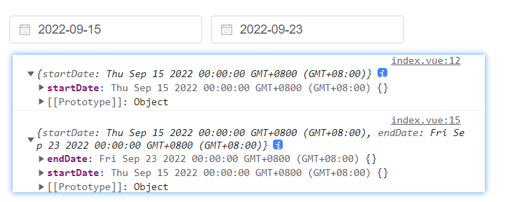
## 城市选择
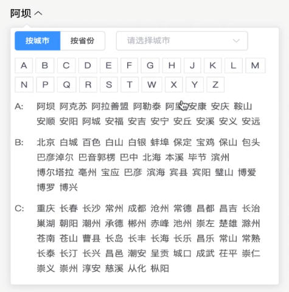
### 完成基本布局
需求 : 点击时显示弹出框( el-popover ) , 弹出框里显示 按钮式单选框 和 下拉框

css 技巧 : width 根据内容物宽度自适应-> 使用 width:fit-content;
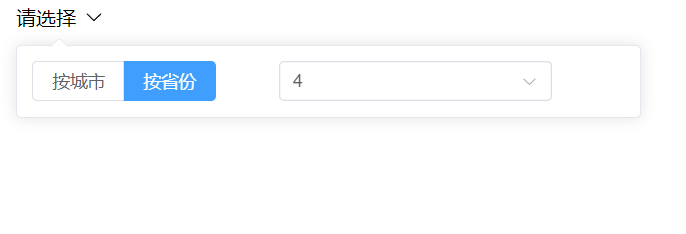

```vue
<template>
  <el-popover trigger="click" :width="500" placement="bottom-start" v-model:visible="visible">
    <template #default>
      <el-row>
        <el-col :span="10">
          <el-radio-group v-model="radioValue">
            <el-radio-button label="按城市"></el-radio-button>
            <el-radio-button label="按省份"></el-radio-button>
          </el-radio-group>
        </el-col>
        <el-col :span="14">
          <el-select v-model="selectedValue">
            <el-option
              v-for="item in 4" :key="item" :value="item" :label="item">
            </el-option>
          </el-select>
        </el-col>
      </el-row>
    </template>
    <template #reference>
      <div class="result">
        <div>{{ result }}</div>
        <div class="icon">
          <el-icon-arrow-down />
        </div>
      </div>
    </template>
  </el-popover>
</template>

<script setup lang="ts">
import { ref } from "vue";

const result = ref<string>("请选择");
// popover 显示/隐藏
const visible = ref<boolean>(false);
// 被选择的单选框 : '按城市' /  '按省份'
const radioValue = ref<string>("按城市");
// 被选择的下拉框
const selectedValue = ref<string>("");
</script>

<style lang="scss" scoped>
.result {
  display: flex;
  cursor: pointer;
  width: fit-content;
  .icon {
    display: flex;
    align-items: center;
    margin-left: 6px;
  }
}
svg {
  width: 1em;
  height: 1em;
}
</style>
```
### 获取城市数据并显示所有城市
需求: 
* 图标加上过渡动画
* 展示字母表
* 展示城市

1. 图标加上过渡动画
```js
<el-icon-arrow-down :class="{ isActive: visible }" />

 // popover 显示/隐藏
const visible = ref<boolean>(false);

svg {
  width: 1em;
  height: 1em;
  transition: all 0.25s linear;
}
.isActive {
  transform: rotate(180deg);
}
```

2. 展示 字母表
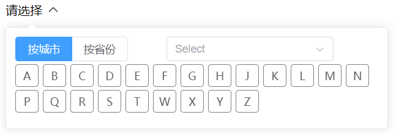

先要导入城市相关的数据, 其城市相关数据格式如下
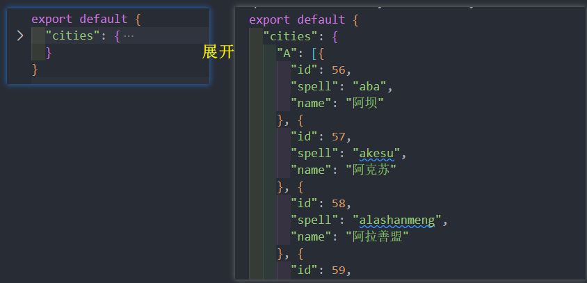
```js
<div class="city">
    <div v-for="item in Object.keys(cities)" :key="item">{{item}}</div>
</div>

import allCities from "../lib/city";
// 所有城市数据
const cities = ref<any>(allCities.cities);


  .city {
  display: flex;
  flex-wrap: wrap;
  margin:4px 0;
  > div {
    display: flex;
    justify-content: center;
    padding: 4px 8px;
    border:1px solid gray;
    border-radius:4px;
    margin-right:6px;
    margin-bottom:4px;
    width:12px;
    transition:background-color 0.25s ease;
    &:hover {
      background-color: rgb(182, 180, 180);
      cursor:pointer;
      color:white;
    }
  }
}
```

3. 展示城市 
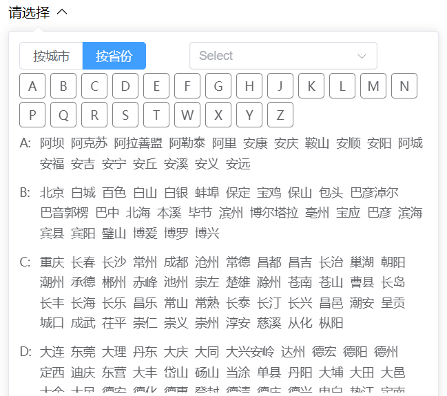

使用 el-scrollbar 滚动条实现可以滚动, 因为城市较多占空间
```js
<!--展示城市-->
<el-scrollbar max-height="300px">
  <template v-for="(value,key) in cities" :key="key">
      <el-row class="city-row">
          <el-col :span="1">{{key+':'}}</el-col>
          <el-col :span="23">
            <span v-for="item in value" :key="item.id" class="city-item">{{item.name}}</span>
          </el-col>
      </el-row>
  </template>
</el-scrollbar>

// 所有城市数据
const cities = ref<any>(allCities.cities);


.city-row{
  margin-bottom: 10px;
}
.city-item {
  display: inline-block;
  margin:0 4px 4px 4px;
  cursor:pointer;
  border-radius: 4px;
  &:hover{
    background-color: antiquewhite;
  }
}
```

### 绑定事件, 并实现点击字母跳转到对应区域
需求: 
* 当点击某一个城市时
   * 给最终结果赋值
   * 关闭弹出层
   * 并且传递给父组件选中的城市(派发事件)

* 当点击某一个字母表 , 需要跳转到对应的区域
   * 为什么不能用 a标签的锚点链接? 因为如果点击了a标签可以跳转, 但同时会把地址栏的地址改掉, 会跳转到路由, 但是我并没有配置路由
   * 那怎么办? 
   * 对需要展示的区域加上 `id` , 并且使用原生dom  `const el = document.getElementById( id )` , 调用 `el.scrollIntoView()`


1. 点击某一个城市
```js{6}
  <el-col :span="23">
     <span
        v-for="item in value"
        :key="item.id"
        class="city-item"
        @click="clickCity(item)"
      >{{ item.name }}</span>
  </el-col>


interface City {
  id: number;
  spell: string;
  name: string;
}
const emits = defineEmits(["changeCity"]);

// 点击了某一个城市
const clickCity = (item: City) => {
  // 给最终结果赋值
  result.value = item.name;
  // 关闭弹层
  visible.value = false;
  // 派发事件, 给父组件传递选中的城市数据
  emits("changeCity", item);
};
```

在父组件监听 @changeCity 
```vue
<template>
    <choose-city @changeCity="changeCity"></choose-city>
</template>
  
<script setup lang='ts'>
const changeCity = (city) => {
  console.log(city)
}
</script>
```

2. 当点击某一个字母表 , 跳转到对应的区域  ( 具体思路看上面的需求解释)
```js{6,11}
<!--字母表-->
<div class="city">
  <div
      v-for="item in Object.keys(cities)"
      :key="item"
      @click="clickAlphabet(item)"
  >
    {{ item }}
  </div>

<!--给需要跳转的区域加上对应的 id-->
<el-row class="city-row" :id="key">
    <el-col :span="1">{{ key + ":" }}</el-col>
    <el-col :span="23">
      <span
        v-for="item in value"
        :key="item.id"
        class="city-item"
        @click="clickCity(item)"
        >{{ item.name }}</span
      >
    </el-col>


// 点击了字母表
const clickAlphabet = (item: string) => {
  const el = document.getElementById(item);
  el?.scrollIntoView();
};
```

### 完善 按城市/按省份 的切换, 实现 按省份 的布局和逻辑
怎么切换 按城市/按省份 ?  根据单选框的值 radioValue 配合 template + v-if  进行切换 
```js
        <template v-if="radioValue === '按城市'">
          <!--字母表-->
          <div class="city">
           ...
          </div>
          <!--展示城市-->
          <el-scrollbar max-height="300px">
           ...
          </el-scrollbar>
        </template>

        <template v-if="radioValue === '按省份'">
          <!--字母表-->
          <div class="province">
            ...
          </div>
          <!--展示省份-->
          <el-scrollbar max-height="300px">
            ...
          </el-scrollbar>
        </template>

// 被选择的单选框 : '按城市' /  '按省份'
const radioValue = ref<string>("按城市");
```

实现 按省份 的布局和逻辑
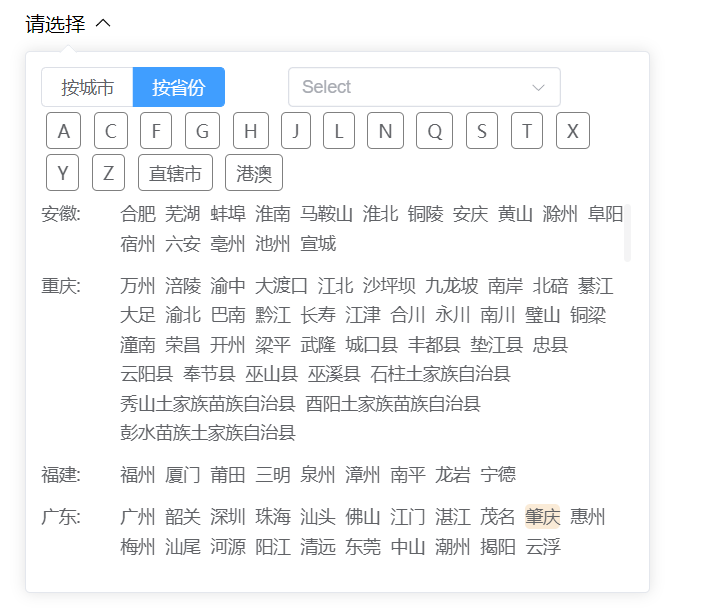
```vue
 <template v-if="radioValue === '按省份'">
          <!--字母表-->
          <div class="province">
            <div
              class="province-item"
              v-for="key in Object.keys(provinces)"
              :key="key"
              @click="clickAlphabet(key)"
            >
              {{ key }}
            </div>
          </div>
          <!--展示省份-->
          <el-scrollbar max-height="300px">
            <template v-for="(arr, key) in provinces" :key="key">
              <template v-for="(item ,index) in arr" :key="index">
                <el-row class="province-row" :id="key">
                  <el-col :span="3">{{ item.name }}:</el-col>
                  <el-col :span="21">
                    <span v-for="province in item.data" class="province-item" @click=clickProvince(province)>{{province}}</span>
                  </el-col>
                </el-row>
              </template>
            </template>
          </el-scrollbar>
        </template>
```
```js
// 所有省份数据
import province from "../lib/province.json";
// 所有省份数据
const provinces = ref<any>(province);

const emits = defineEmits(["changeCity",'changeProvince']);

// 点击了字母表 , 这个是公用逻辑, 注意要给指定区域加上 id
const clickAlphabet = (item: string) => {
  const el = document.getElementById(item);
  el?.scrollIntoView();
};

// 点击某一个省份
const clickProvince = (provinceName: string) => {
  result.value = provinceName // 给结果赋值
  visible.value = false // 关闭弹层
  emits('changeProvince', provinceName) // 给父组件分发事件
}
```

在父组件监听
```vue{4}
<template>
  <choose-city
    @changeCity="changeCity"
    @changeProvince="changeProvince"
  ></choose-city>
</template>

<script setup lang="ts">
const changeCity = (city) => {
  console.log(city);
};
const changeProvince = (province) => {
  console.log(province);
};
</script>
```
### 使用 filter-method 实现 搜索过滤
需求: 
* 下拉框中展示所有城市
* '按城市'是 可支持拼音搜索/中文搜索 , '按省份'只支持中文搜索(由于数据本身的限制)
* 点击某一个下拉框城市时 : 给结果赋值 , 分发事件传递给父组件

1. 首先下拉框展示所有城市
```js
<el-select ...>
   <el-option
      v-for="item in options"
      :key="item.id"
      :value="item.id"
      :label="item.name"
    >

// 所有城市数据
const cities = ref(allCities.cities);
...
// 下拉框选择项
const options = ref<City[]>([]);

onMounted(() => {
  const values = Object.values(cities.value).flat();
  options.value = values;
});
```

2. '按城市'是 可支持拼音搜索/中文搜索 , '按省份'只支持中文搜索(由于数据本身的限制)

要在 el-select 加上 filterable 属性 和 filter-method 自定义函数, 完成过滤逻辑
```js
 <el-select
    v-model="selectedValue"
    placeholder="请选择城市"
    filterable
    :filter-method="filterMethod"
    @change="changeSelect"
  >

  // 自定义搜索 匹配规则
const filterMethod = (val: string) => {
  let values = Object.values(cities.value).flat(); // 所有城市数据
  if (val === "") {
    // 没输入东西
    options.value = values;
  } else {
    // 输入了东西
    // 分情况 : 按城市可以搜索拼音或者中文 , 按省份只能搜中文(由于数据本身的限制)
    if (radioValue.value === "按城市") {
      options.value = values.filter((item) => {
        return item.spell.includes(val) || item.name.includes(val);
      });
    } else {
      options.value = values.filter((item) => {
        return item.name.includes(val);
      });
    }
  }
};
```
3. 点击某一个城市:  监听el-select的 @change 事件
```js
  <el-select
    v-model="selectedValue"
    placeholder="请选择城市"
    filterable
    :filter-method="filterMethod"
    @change="changeSelect"
  >
const changeSelect = (id: number) => {
  let values = Object.values(cities.value).flat();
  // 找到点击的城市
  const selectedCity = values.find(item => item.id === id)
  // 给结果赋值
  result.value = selectedCity!.name
  // 分发事件, 传递结果给父组件
  if (radioValue.value === '按城市') {
    emits('changeCity',selectedCity)
  } else if(radioValue.value === '按省份') {
    emits('changeProvince',selectedCity!.name)
  }
}
```
### 完整代码 
```vue
<template>
  <el-popover
    trigger="click"
    :width="500"
    placement="bottom-start"
    v-model:visible="visible"
  >
    <template #default>
      <el-row>
        <el-col :span="10">
          <el-radio-group v-model="radioValue">
            <el-radio-button label="按城市"></el-radio-button>
            <el-radio-button label="按省份"></el-radio-button>
          </el-radio-group>
        </el-col>
        <el-col :span="14">
          <el-select
            v-model="selectedValue"
            placeholder="请选择城市"
            filterable
            :filter-method="filterMethod"
            @change="changeSelect"
          >
            <el-option
              v-for="item in options"
              :key="item.id"
              :value="item.id"
              :label="item.name"
            >
            </el-option>
          </el-select>
        </el-col>
        <template v-if="radioValue === '按城市'">
          <!--字母表-->
          <div class="city">
            <div
              v-for="item in Object.keys(cities)"
              :key="item"
              @click="clickAlphabet(item)"
            >
              {{ item }}
            </div>
          </div>
          <!--展示城市-->
          <el-scrollbar max-height="300px">
            <template v-for="(value, key) in cities" :key="key">
              <el-row class="city-row" :id="key">
                <el-col :span="1">{{ key + ":" }}</el-col>
                <el-col :span="23">
                  <span
                    v-for="item in value"
                    :key="item.id"
                    class="city-item"
                    @click="clickCity(item)"
                    >{{ item.name }}</span
                  >
                </el-col>
              </el-row>
            </template>
          </el-scrollbar>
        </template>
        <template v-if="radioValue === '按省份'">
          <!--字母表-->
          <div class="province">
            <div
              class="province-item"
              v-for="key in Object.keys(provinces)"
              :key="key"
              @click="clickAlphabet(key)"
            >
              {{ key }}
            </div>
          </div>
          <!--展示省份-->
          <el-scrollbar max-height="300px">
            <template v-for="(arr, key) in provinces" :key="key">
              <template v-for="(item, index) in arr" :key="index">
                <el-row class="province-row" :id="key">
                  <el-col :span="3">{{ item.name }}:</el-col>
                  <el-col :span="21">
                    <span
                      v-for="province in item.data"
                      class="province-item"
                      @click="clickProvince(province)"
                      >{{ province }}</span
                    >
                  </el-col>
                </el-row>
              </template>
            </template>
          </el-scrollbar>
        </template>
      </el-row>
    </template>
    <template #reference>
      <div class="result">
        <div>{{ result }}</div>
        <div class="icon">
          <el-icon-arrow-down :class="{ isActive: visible }" />
        </div>
      </div>
    </template>
  </el-popover>
</template>

<script setup lang="ts">
import { onMounted, ref } from "vue";
import allCities from "../lib/city";
import { City } from "./types";
import province from "../lib/province.json";
const result = ref<string>("请选择");
// popover 显示/隐藏
const visible = ref<boolean>(false);
// 被选择的单选框 : '按城市' /  '按省份'
const radioValue = ref<string>("按城市");
// 被选择的下拉框
const selectedValue = ref<string>("");
// 所有城市数据
const cities = ref(allCities.cities);
// 所有省份数据
const provinces = ref<any>(province);

const emits = defineEmits(["changeCity", "changeProvince"]);

// 点击了某一个城市
const clickCity = (item: City) => {
  // 给最终结果赋值
  result.value = item.name;
  // 关闭弹层
  visible.value = false;
  // 派发事件, 给父组件传递选中的城市数据
  emits("changeCity", item);
};
// 点击了字母表
const clickAlphabet = (item: string) => {
  const el = document.getElementById(item);
  el?.scrollIntoView();
};

// 点击某一个省份
const clickProvince = (provinceName: string) => {
  result.value = provinceName; // 给结果赋值
  visible.value = false; // 关闭弹层
  emits("changeProvince", provinceName); // 给父组件分发事件
};
// 下拉框选择项
const options = ref<City[]>([]);

onMounted(() => {
  const values = Object.values(cities.value).flat();
  options.value = values;
});

// 自定义搜索 匹配规则
const filterMethod = (val: string) => {
  let values = Object.values(cities.value).flat();
  if (val === "") {
    // 没输入东西
    options.value = values;
  } else {
    // 输入了东西
    // 分情况 : 按城市可以搜索拼音或者中文 , 按省份只能搜中文(由于数据本身的限制)
    if (radioValue.value === "按城市") {
      options.value = values.filter((item) => {
        return item.spell.includes(val) || item.name.includes(val);
      });
    } else {
      options.value = values.filter((item) => {
        return item.name.includes(val);
      });
    }
  }
};
const changeSelect = (id: number) => {
  let values = Object.values(cities.value).flat();
  // 找到点击的城市
  const selectedCity = values.find(item => item.id === id)
  result.value = selectedCity!.name
  if (radioValue.value === '按城市') {
    emits('changeCity',selectedCity)
  } else if(radioValue.value === '按省份') {
    emits('changeProvince',selectedCity!.name)
  }
}
</script>

<style lang="scss" scoped>
.result {
  display: flex;
  cursor: pointer;
  width: fit-content;
  .icon {
    display: flex;
    align-items: center;
    margin-left: 6px;
  }
}
svg {
  width: 1em;
  height: 1em;
  transition: all 0.25s linear;
}
.isActive {
  transform: rotate(180deg);
}
.city {
  display: flex;
  flex-wrap: wrap;
  margin: 4px 0;
  > div {
    display: flex;
    justify-content: center;
    padding: 4px 8px;
    border: 1px solid gray;
    border-radius: 4px;
    margin-right: 6px;
    margin-bottom: 4px;
    width: 12px;
    transition: background-color 0.25s ease;
    &:hover {
      background-color: rgb(182, 180, 180);
      cursor: pointer;
      color: white;
    }
  }
}
.city-row {
  margin-bottom: 10px;
}
.city-item {
  display: inline-block;
  margin: 0 4px 4px 4px;
  cursor: pointer;
  border-radius: 4px;
  &:hover {
    background-color: antiquewhite;
  }
}
.province {
  display: flex;
  flex-wrap: wrap;
  margin: 4px 0;
  > div {
    border: 1px solid gray;
    padding: 4px 8px;
    border-radius: 4px;
    margin-right: 6px;
    margin-bottom: 4px;
    transition: background-color 0.25s ease;
    &:hover {
      background-color: rgb(182, 180, 180);
      cursor: pointer;
      color: white;
    }
  }
}
.province-row {
  margin-bottom: 10px;
}
.province-item {
  display: inline-block;
  margin: 0 4px 4px 4px;
  cursor: pointer;
  border-radius: 4px;
  &:hover {
    background-color: antiquewhite;
  }
}
</style>
```
## 表格组件
1. 可配置性 , 可维护性强
2. 具备 element plus 园内有表哥的所有功能
3. 可以拓展更多的功能 

目的:
1. 简单好用
2. 拓展性强
3. 可维护性强

### 使用 ts 定义表格组件需要的类型
types.ts
```ts
export interface tableOptions {
  // 表头
  label: string
  // 字段名称
  prop?: string
  // 列宽度
  width?:string
  // 对齐方式
  align?: 'left' | 'center' | 'right'
  // 自定义列表末班名称
  slot? :string
}
```
index.vue  props 需要传入 表格的配置, 表格的数据
```vue
<template>
  <div>表格组件</div>
</template>

<script setup lang="ts">
import { tableOptions } from "./types";
import { PropType } from "vue";
const props = defineProps({
  // 表格的配置
  options: {
    type: Array as PropType<tableOptions[]>,
    required: true,
  },
  //表格数据
  data: {
    type: Array as PropType<any[]>,
  },
});
</script>
```
### 通过配置的数据完成一个基础版表格
渲染一下基础的结构 , 如下 : 
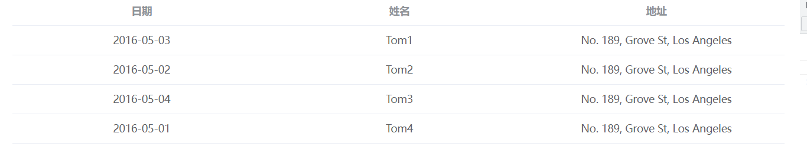

给 m-table 组件传入 数据 与 配置
```vue
<template>
  <m-table :data="tableData" :options="tableOptions"></m-table>
</template>

<script setup lang="ts">
import { tableOptions } from "../../components/table/src/types";
const tableData = [
  {
    date: "2016-05-03",
    name: "Tom1",
    address: "No. 189, Grove St, Los Angeles",
  },
  {
    date: "2016-05-02",
    name: "Tom2",
    address: "No. 189, Grove St, Los Angeles",
  },
  {
    date: "2016-05-04",
    name: "Tom3",
    address: "No. 189, Grove St, Los Angeles",
  },
  {
    date: "2016-05-01",
    name: "Tom4",
    address: "No. 189, Grove St, Los Angeles",
  },
];
const tableOptions: tableOptions[] = [
  {
    label: "日期",
    prop: "date",
    align: "center",
  },
  {
    label: "姓名",
    prop: "name",
    align: "center",
  },
  {
    label: "地址",
    prop: "address",
    align: "center",
  },
];
</script>
```

m-table 组件渲染 props 接受的数据 
```vue
<template>
  <el-table :data="data">
    <template v-for="option in options" :key="option.label">
      <el-table-column
        :prop="option.prop"
        :align="option.align"
        :label="option.label"
      ></el-table-column>
    </template>
  </el-table>
</template>

<script setup lang="ts">
import { tableOptions } from "./types";
import { PropType } from "vue";
const props = defineProps({
  // 表格的配置
  options: {
    type: Array as PropType<tableOptions[]>,
    required: true,
  },
  //表格数据
  data: {
    type: Array as PropType<any[]>,
  },
});
</script>
```
### 巧用插槽实现 操作项
需求:
*  最后一列可以添加操作项

1. 添加操作项
一开始要从配置选项触发 , 在配置选项中添加属性叫 `action : boolean` , true 表示要有操作项

types.ts
```ts{12,13}
export interface tableOptions {
  // 表头
  label: string
  // 字段名称
  prop?: string
  // 列宽度
  width?:string
  // 对齐方式
  align?: 'left' | 'center' | 'right'
  // 自定义列表末班名称
  slot?: string,
  // 是否要有操作项
  action?:boolean
}
```
在配置数据的最后一列添加 action:true , 开启操作项
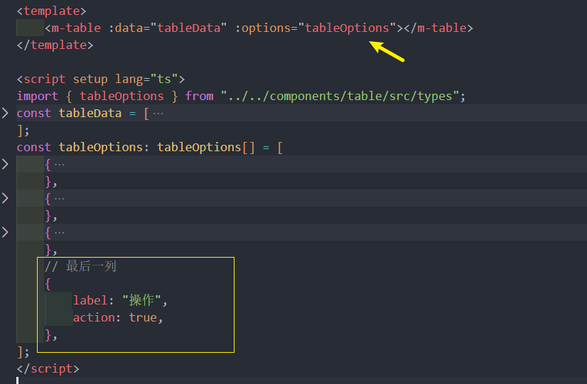

**在组件内部:**

过滤一下 不是操作项/ 是操作项的配置选项
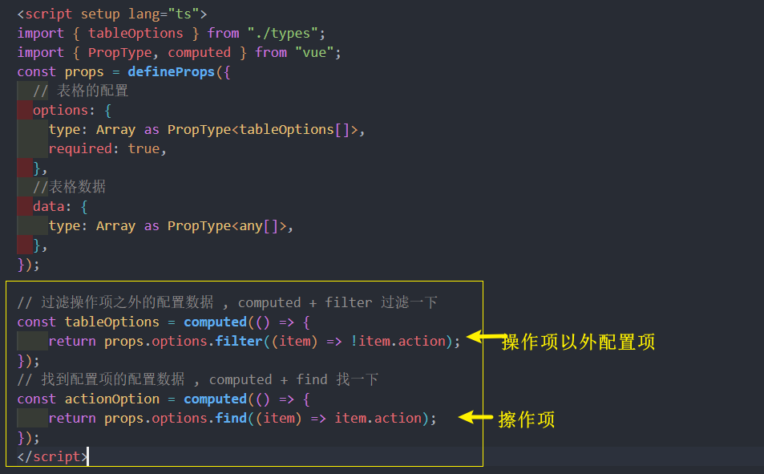
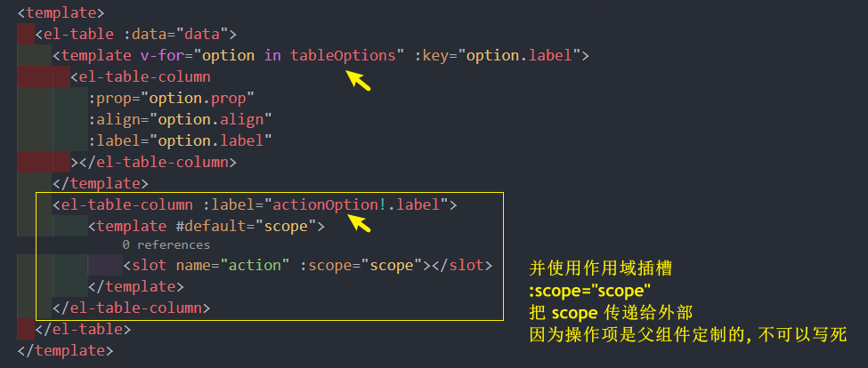

**父组件中使用:**
```vue{3-6,22-29}
<template>
  <m-table :data="tableData" :options="tableOptions">
    <template #action="{ scope }">
      <el-button type="primary" @click="editAction(scope)">编辑</el-button>
      <el-button type="danger" @click="deleteAction(scope)">删除</el-button>
    </template>
  </m-table>
</template>
<script setup lang="ts">
import { tableOptions } from "../../components/table/src/types";
const tableData = [
...
];
const tableOptions: tableOptions[] = [
    ...
    // 最后一列
    {
        label: "操作",
        action: true,
    },
];
// 编辑按钮
const editAction = (scope) => {
    console.log(scope.row.name)
}
// 删除按钮
const deleteAction = (scope) => {
    console.log(scope.row.name)
}
</script>
```
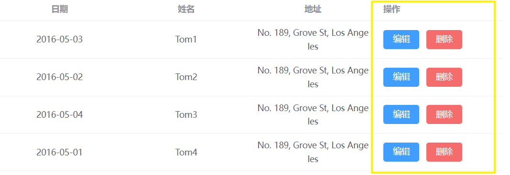
### 巧用插槽 实现自定义列
* 添加自定义功能

也是从配置选项开始出发, 之前已经定义好了slot 属性

types.ts
```vue{10-11}
export interface tableOptions {
  // 表头
  label: string
  // 字段名称
  prop?: string
  // 列宽度
  width?:string
  // 对齐方式
  align?: 'left' | 'center' | 'right'
  // 自定义列表末班名称
  slot?: string,
  // 是否要有操作项
  action?:boolean
}
```
在父组件写入配置对象是如果需要自定义, 就要添加 slot: 'xxx' 字段
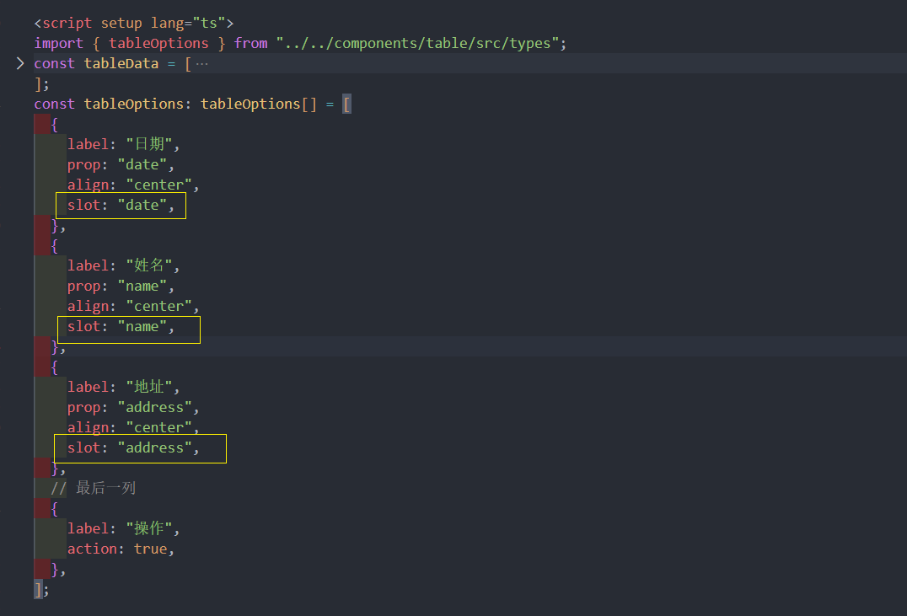

**组件内部:** v-if="!options.slot"  和 v-else 判断一下, 传入 slot 属性的配置项
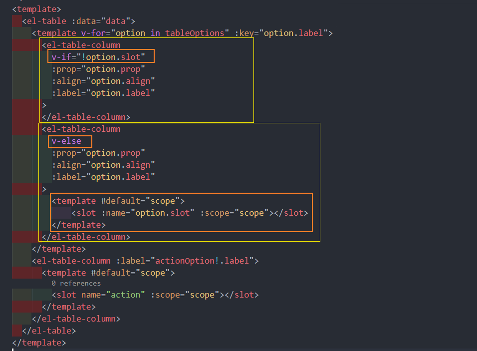

然后在父组件已经可以通过 具名插槽,作用域插槽 随便自定义格式
```vue
<template>
  <m-table :data="tableData" :options="tableOptions">
    <template #action="{ scope }">
      <el-button type="primary" @click="editAction(scope)">编辑</el-button>
      <el-button type="danger" @click="deleteAction(scope)">删除</el-button>
    </template>
    <template v-slot:name="{scope}">
        自定义{{scope.row.name}}
    </template>
    <template v-slot:date="{scope}">
        自定义{{scope.row.date}}
    </template>
    <template v-slot:address="{scope}">
        自定义{{scope.row.address}}
    </template>
  </m-table>
</template>
```
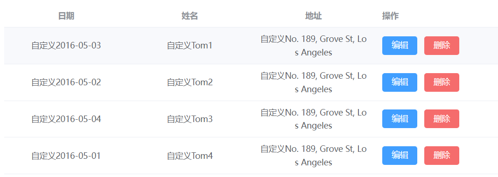

### 为表格加上 loading 效果


