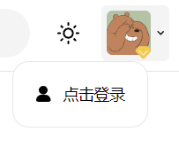
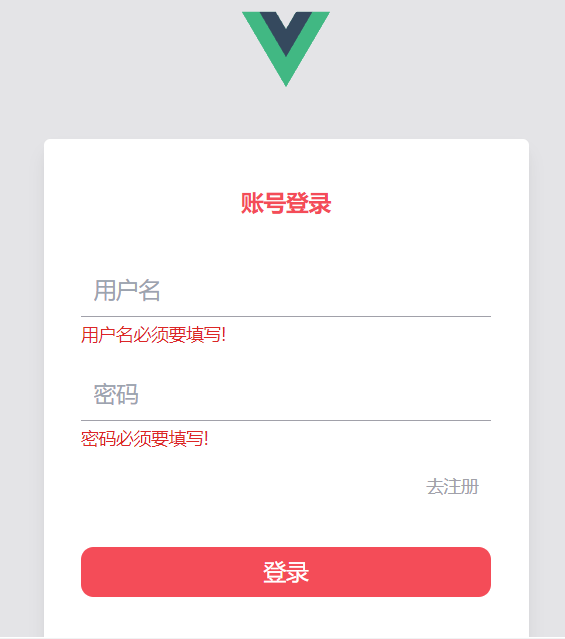
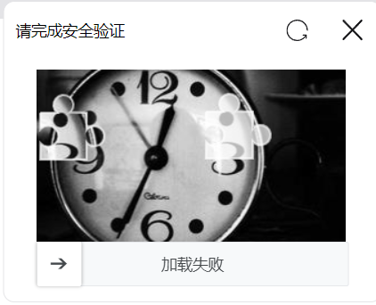
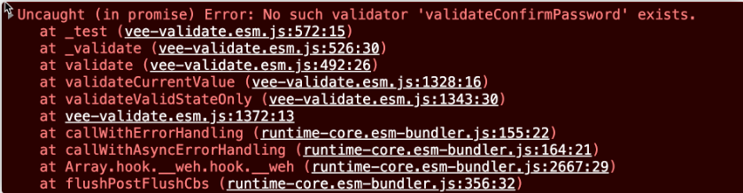

# 人类行为验证处理方案 - 脱离UI组件库实现登录、注册+表单校验

1. 在 `src/views/layout/components/header/header-my.vue` 中新增一个 **登录按钮**



2.  分别构建 `PC 端` 下和 `移动端` 下对应的路由：
```js
{
  path: '/login',
  name: 'login',
  component: () => import('@/views/login-register/login/index.vue')
}
```

3. 创建 `src/views/login-register/login/index.vue` 组件，为登录组件
4. 构建对应基础样式：


```vue
<template>
  <div
    class="relative h-screen bg-white dark:bg-zinc-700 text-center xl:bg-zinc-200"
  >
    <!-- 头部图标：PC端 -->
    <div class="hidden pt-5 h-8 xl:block">
      
    </div>
    <!-- 头部图标：移动端 -->
    <div class="h-[111px] xl:hidden">
      
      
    </div>
    <!-- 表单区 -->
    <div
      class="block px-3 mt-4 dark:bg-zinc-800 xl:bg-white xl:w-[388px] xl:dark:bg-zinc-900 xl:m-auto xl:mt-8 xl:py-4 xl:rounded-sm xl:shadow-lg"
    >
      <h3
        class="mb-2 font-semibold text-base text-main dark:text-zinc-300 hidden xl:block"
      >
        账号登录
      </h3>
      <!-- 表单 -->
      <form>
        <input
          class="dark:bg-zinc-800 dark:text-zinc-400 border-b-zinc-400 border-b-[1px] w-full outline-0 pb-1 px-1 text-base focus:border-b-main dark:focus:border-b-zinc-200 xl:dark:bg-zinc-900"
          name="username"
          type="text"
          placeholder="用户名"
          autocomplete="on"
        />
        <input
          class="dark:bg-zinc-800 dark:text-zinc-400 border-b-zinc-400 border-b-[1px] w-full outline-0 pb-1 px-1 text-base focus:border-b-main dark:focus:border-b-zinc-200 xl:dark:bg-zinc-900"
          name="password"
          type="password"
          placeholder="密码"
          autocomplete="on"
        />

        <div class="pt-1 pb-3 leading-[0px] text-right">
          <a
            class="inline-block p-1 text-zinc-400 text-right dark:text-zinc-600 hover:text-zinc-600 dark:hover:text-zinc-400 text-sm duration-400 cursor-pointer"
          >
            去注册
          </a>
        </div>

        <m-button class="w-full dark:bg-zinc-900 xl:dark:bg-zinc-800">
          登录
        </m-button>
      </form>

      <div class="flex justify-around mt-4">
        <!-- QQ -->
        <m-svg-icon class="w-4 cursor-pointer" name="qq"></m-svg-icon>
        <!-- 微信 -->
        <m-svg-icon class="w-4 cursor-pointer" name="wexin"></m-svg-icon>
      </div>
    </div>
  </div>
</template>
```

## 表单校验实现原理与方案分析
&nbsp;&nbsp;&nbsp;&nbsp;在绝大多数情况下, 进行登录的时, 都会通过 `UI组件库` 实现表单校验功能, 但是在没有这种UI组件库的情况下, 应该如何实现表单校验呢? 

首先就需要搞明白表单校验的 **实现原理**

#### 表单校验的实现原理
&nbsp;&nbsp;&nbsp;&nbsp;所谓表单校验，指的是：
* 在某个特定的时机(输入框失去焦点, 或者 内容变化)
* 检查表单元素中的内容是否满足某个条件 (校验规则)
* 如果不符合, 则展示对应的提示

&nbsp;&nbsp;&nbsp;&nbsp;根据以上描述，所需要关注的，其实就是三点内容：
1. 监听表单元素的对应时机
2. 检查内容是否匹配校验条件
3. 根据检查结果，展示对应提示
#### 自定义表单校验方案分析
1. 创建对应的 `field` 输入框组件
2. 该组件中，包含两个元素：
   1. `input` 输入框
   2. `span` 表示错误提示
3. 监听 `input` 输入框的 `blur 失去焦点` 事件
4. 根据 `input` 的 `value` 判断是否满足一个或多个指定的条件（比如：是否为空）
5. 如果不满足，则展示 `span` 标签，表示错误提示消息


&nbsp;&nbsp;&nbsp;&nbsp;确实可以实现一个基础的表单校验，但是这样的表单校验组件，很难具有 **普适** 性，因为实际开发中，表单校验的场景多种多样，比如：国际化处理。

所以说，把它抽离成一个 **通用组件** 意义并不大

这里采用一种更加普适的方式...

这个方式就是：[vee-validata](https://vee-validate.logaretm.com/v4/)

&nbsp;&nbsp;&nbsp;&nbsp;`vee-validata `是一个 `vue` 中专门做表单校验的库，该库更加具有 **普适** 性，也更加适合大家在实际开发中的使用。

## 基于 vee-validata 实现普适的表单校验
现在用 `vee-validate`来实现登录的表单校验逻辑

1. 安装 `vee-validate`
```shell
npm i vee-validate@4.5.10 --save
```

2. `vee-validata` 中提供了非常详细的基础[使用流程](https://vee-validate.logaretm.com/v4/tutorials/basics)

3. 在这一套流程中，涉及到了三个组件，分别为：
* `Form` 表单
* `Field` 输入框
* `ErrorMessage` 错误提示

4. 就需要使用这三个组件, 代替之前写好的表单结构, 其中每一个单独的表单都具备一个 `name`, 该 `name`对应表单域和错误提示
```vue{3-17}
<template>
  ...
      <!-- 表单 -->
      <vee-form>
        <vee-field ...  name="username" />
        <vee-error-message
          class="text-sm text-red-600 block mt-0.5 text-left"
          name="username"
        >
        </vee-error-message>

        <vee-field  ...  name="password"/>
        <vee-error-message
          class="text-sm text-red-600 block mt-0.5 text-left"
          name="password"
        >
        </vee-error-message>
        ...
      </vee-form>
      ...
</template>

<script>
export default {
  name: 'login'
}
</script>

<script setup>
import headerVue from '../components/header.vue'
// 组件都改一改名字
import {
  Form as VeeForm,
  Field as VeeField,
  ErrorMessage as VeeErrorMessage
} from 'vee-validate'
</script>
```
5. 接下来需要创建出对应的 **校验规则** ，对于 `VeeField` 而言，可以通过 `rules` 属性，绑定对应的校验规则，该规则为一个 **方法**

6. 创建 `src/views/login-register/validate.js` ，对外导出两个函数
```js
/**
 * 用户明德表单校验
 * 返回 true 表示表单校验通过 , 返回 字符串 表示表单校验不通过
 */
export const validateUsername = (value) => {
  if (!value) {
    return '用户名必须要填写!'
  }
  if (value.length < 3 || value.length > 12) {
    return '用户名的长度应该在3 ~ 12位之间'
  }
  return true
}
/**
 * 
 * 密码的比导弹校验
 */
export const validatePassword = (value) => {
  if (!value) {
    return '密码必须要填写!'
  }
  if (value.length < 6 || value.length > 12) {
    return '密码的长度应该在6 ~ 12位之间'
  }
  return true
}
```

7. 在 `src/views/login-register/login/index.vue` 中导入校验函数，并绑定到对应的`vee-filed`组件的 `:rules` 中
```js
<vee-field
  ...
  :rules="validateUsername"
  ...
/>
...
<vee-field
  ...
  :rules="validatePassword"
  ...
/>

import { validateUsername, validatePassword } from '../validate'
```

8. 此时，在**表单域失去焦点时**，表单校验会生效

9. 为 `vee-form` 添加 `submit` 事件，可以发现，当表单校验不通过时，不会触发该事件

```js
<vee-form @submit="onLoginHandler">

/**
 * 点击登录触发
 */
const onLoginHandler = () => {
  console.log('触发登录')
}
```

表单校验完成
## 人类行为验证

目前人类行为验证的实现方案，主要分为两种：

1. 收费平台，年费在几万到几十万不等，有专门的技术人员帮助对接：
* [极验](https://www.geetest.com/)
* [网易易盾](https://dun.163.com/trial/sense)
* …
2. 免费开源，验证的精准度，需要看服务端的能力：
* gitee 开源的： [SliderCaptcha](https://gitee.com/LongbowEnterprise/SliderCaptcha?_from=gitee_search)

项目中主要就是用这个开源的 `SliderCaptcha` 实现

### 构建人类行为验证模块

1. 创建 `vendor` 文件夹，复制 `SliderCaptcha` 源代码至该文件夹中

2. 创建 `src/views/login-register/login/slider-captcha.vue` ，作为人类行为验证组件

3. 在该组件中，完成对应 `UI` 样式：



```vue
<template>
  <div
    class="fixed top-[20%] left-[50%] translate-x-[-50%] w-[340px] h-[270px] text-sm bg-white dark:bg-zinc-800 rounded border border-zinc-200 dark:border-zinc-900 shadow-3xl"
  >
    <div class="flex items-center h-5 text-left px-1 mb-1">
      <span class="flex-grow dark:text-zinc-200">请完成安全验证</span>
      <m-svg-icon
        name="refresh"
        fillClass="fill-zinc-900 dark:fill-zinc-200"
        class="w-3 h-3 p-0.5 rounded-sm duration-300 cursor-pointer hover:bg-zinc-200 dark:hover:bg-zinc-900"
        @click="onReset"
      ></m-svg-icon>
      <m-svg-icon
        name="close"
        fillClass="fill-zinc-900 dark:fill-zinc-200"
        class="ml-2 w-3 h-3 p-0.5 rounded-sm duration-300 cursor-pointer hover:bg-zinc-200 dark:hover:bg-zinc-900"
        @click="onClose"
      ></m-svg-icon>
    </div>
    <div id="captcha"></div>
  </div>
</template>

<script setup>
/**
 * 重置
 */
const onReset = () => {}

/**
 * 关闭
 */
const onClose = () => {}
</script>
```
4. 在 `src/views/login-register/login/index.vue` 中导入该组件：
```html
import sliderCaptchaVue from './slider-captcha.vue'

<!-- 人类行为验证模块 -->
<slider-captcha-vue></slider-captcha-vue>
```

5. 接下来就需要生成 `sliderCaptcha` 实例，并且在 **前端用户拼图成功之后，把用户的拼图操作路径（用户行为）数据传递给服务端，由服务端进行人类行为判定**
6. 在 `src/views/login-register/login/slider-captcha.vue` 中：
```js
import '@/vendor/SliderCaptcha/slidercaptcha.min.css'
import '@/vendor/SliderCaptcha/longbow.slidercaptcha.min.js'
import { getCaptcha } from '@/api/sys'
import { onMounted } from 'vue'

let captcha = null
onMounted(() => {
  captcha = sliderCaptcha({
    // 渲染位置
    id: 'captcha',
    // 用户拼图成功之后的回调
    async onSuccess(arr) {
      const res = await getCaptcha({
        behavior: arr
      })
    },
    // 用户拼图失败之后的回调
    onFail() {
      console.log('onFail')
    },
    // 默认的验证方法，咱们不在此处进行验证，而是选择在用户拼图成功之后进行验证，所以此处永远返回为 true
    verify() {
      return true
    }
  })
})
```
7. 创建 `src/api/sys.js` 模块，构建请求接口：
```js
import request from '@/utils/request'

/**
 * 人类行为验证
 */
export const getCaptcha = (data) => {
  return request({
    url: '/sys/captcha',
    method: 'POST',
    data
  })
}
```

8. 当用户服务端返回成功之后，传递事件到 `login` 组件，同时处理 `close` 和 `reset` 事件
```js
<script>
const EMITS_CLOSE = 'close'
const EMITS_SUCCESS = 'success'
</script>

const emits = defineEmits([EMITS_CLOSE, EMITS_SUCCESS])
// 用户拼图成功之后的回调
async onSuccess(arr) {
  ...
  if (res) {
    emits(EMITS_SUCCESS)
  }
}

/**
 * 重置
 */
const onReset = () => {
  captcha.reset()
}

/**
 * 关闭
 */
const onClose = () => {
  emits(EMITS_CLOSE)
}
```
9. 在 `src/views/login-register/login/index.vue` 中，监听对应事件处理

```js
    <!-- 人类行为验证模块 -->
    <slider-captcha-vue v-if="isCaptchaVisible" @success="onSuccess" @close="onClose"></slider-captcha-vue>

...
import sliderCaptchaVue from './slider-captcha.vue'
import { ref } from 'vue' 

// // 控制 sliderCaptcha 显示/隐藏
const isCaptchaVisible = ref(false)
// 点击登录按钮
const onLoginHandler = (val) => {
  isCaptchaVisible.value = true
}

// 行为验证成功
const onSuccess = () => {
  isCaptchaVisible.value = false
  // TODO: 真正的登录请求
}
// //  sliderCaptcha 关闭
const onClose = () => {
  isCaptchaVisible.value = false
}
</script
```
**注意：** `SliderCaptcha` 中所有图标均被放入该路径下：
```html
<!-- iconfont 在线图标，主要用于 sliderCaptcha -->
  <link rel="stylesheet"
    href="https://at.alicdn.com/t/font_3042963_nv614canpao.css?spm=a313x.7781069.1998910419.47&file=font_3042963_nv614canpao.css" />
```

## 用户登录行为处理
1. 在 `src/api/sys.js` 定义用户登录接口
```js
/**
 * 登录
 */
export const loginUser = (data) => {
  return request({
    url: '/sys/login',
    method: 'POST',
    data
  })
}
```

2. 在 `src/views/login-register/login/index.vue` 中，当用户进行登录时，处理 `loading` 展示
```js
<m-button
  class="w-full dark:bg-zinc-900 xl:dark:bg-zinc-800"
  :loading="loading"
  :isActiveAnim="false"
>
  登录
</m-button>

// 登录时的 loading
const loading = ref(false)
```

3. 定义用户登录方法
```js
/**
 * 人类行为验证通过
 */
const onCaptchaSuccess = async () => {
  ...
  // 登录操作
  onLogin()
}

/**
 * 用户登录行为
 */
const onLogin = () => {
  loading.value = true

  // TODO: 登陆请求
}
```
4. **所有用户登录行为将被放入到 `vuex` 中**

5. 创建 `src/store/modules/user.js` 模块（需要安装 `md5` 加密模块）
```js
import { loginUser } from '@/api/sys'
import md5 from 'md5'
export default {
  namespaced: true,
  state() {
    return {
      token:''
    }
  },
  mutations: {
    setToken(state, newToken) {
      state.token = newToken
    }
  },
  actions: {
    // 登录
    async loginAction(context, data) {
      const { password } = data 
      
      const res = await loginUser({
        ...data,
        password: password ? md5(password) : ''
      })
      const token = res.token
      context.commit('setToken', token)
    }
  }
}
```
染好不能忘记**注册 和 持久化**
6. 注册该模块，并提供 `token` 的 `getters`

7. 在 `src/views/login-register/login/index.vue` 中触发该模块，此时需要处理两个变量：
* `loginForm`：记录用户输入的用户名和密码
```js
// 用户输入的用户名和密码
const loginForm = ref({
  username: '',
  password: ''
})
```
* `loginType`：标记当前的登录模式为 **用户名密码登录，区分后面的 QQ、微信扫码登录**

`src/constants/index.js`
```js
// 登录方式
export const LOGIN_TYPE_USERNAME = 'username'
```

8. 最后触发模块：
```js
const router = useRouter()
/**
 * 用户登录行为
 */
const onLogin = async () => {
  loading.value = true
  // 执行登录操作
  try {
    await store.dispatch('user/login', {
      ...loginForm.value,
      loginType: LOGIN_TYPE_USERNAME
    })
  } finally {
    loading.value = false
  }
  router.push('/')
}
```

## 用户信息获取行为
用户登录成功之后，接下来就需要处理登录后行为，登录后行为分为三部分：

1. 登录成功之后，获取用户信息，并进行展示
2. 退出登录的操作
3. `token` 超时处理的操作

现在处理第一个 **获取用户信息操作**


1. 在 `src/api/sys.js` 中，定义获取用户信息接口
```js
/**
 * 获取用户信息
 */
export const getProfile = () => {
  return request({
    url: '/user/profile'
  })
}
```

2. 在 `src/utils/request.js` 定义请求拦截器，设置 `token：`
```js{3-6}
// 请求拦截器
service.interceptors.request.use(
  (config) => {
    if (store.getters.token) {
      // 如果token存在 注入token
      config.headers.Authorization = `Bearer ${store.getters.token}`
    }
    return config // 必须返回配置
  },
  (error) => {
    return Promise.reject(error)
  }
)
```
3. 在 `src/store/modules/user.js` 中定义获取用户信息的 `action` ，并在用户登录成功之后获取用户信息：
```js
import { loginUser, getProfile } from '@/api/sys'
import md5 from 'md5'
import { message } from '@/libs'
export default {
  namespaced: true,
  state() {
    return {
      token: '',
      userInfo:{}
    }
  },
  mutations: {
    ...
    setProfile(state, newUserInfo) {
      state.userInfo = newUserInfo
    }
  },
  actions: {
    // 登录 action
    async loginAction(context, data) {
      ...
      
      // 调登录请求之后 , 直接调了下面的获取用户信息 action
      context.dispatch('getProfileAction')
    },
    // 获取用户信息 action
    async getProfileAction(context,) {
      const res = await getProfile()
      context.commit('setProfile', res)
      // 登录提示
      message('success', `欢迎你, ${ res.username }`)
    }
  }
}
```

4. 指定对应 `userInfo` 的 `getters`:
```js
  /**
 * 获取用户信息
 */
userInfo: (state) => state.user.userInfo
```

5. 在 `src/views/layout/components/header/header-my.vue` 中，根据用户信息进行展示判定：
```html
<m-popover ...>
  <template #reference>
    <div
      v-if="$store.getters.token"
      ...
    >
      <!-- 头像 -->
      
      <!-- 下箭头 -->
      ...
      <!-- vip 标记 -->
      <m-svg-icon
        v-if="$store.getters.userInfo.vipLevel"
        ...
      ></m-svg-icon>
    </div>
    <div v-else>
      ...
    </div>
  </template>

  <div v-if="$store.getters.token" ...>
    ...
  </div>
</m-popover>
```
用户登录后的数据获取成功
## 退出登录操作
用户退出登录只需要删除 `token` 和 `userInfo`

1. 在 `src/store/modules/user.js` 中，定义对应的 `action`

```js
/**
 * 退出登录
 */
logoutAction(context) {
  context.commit('setToken', '')
  context.commit('setUserInfo', {})
  // 退出登录之后，重新刷新下页面，因为对于前台项目而言，用户是否登录（是否为 VIP）看到的数据可能不同
  location.reload()
}
```

2. 在 `src/views/layout/components/header/header-my.vue` 中为退出登录设定点击事件
```js
/**
 * menu Item 点击事件，也可以根据其他的 key 作为判定，比如 name
 */
const onItemClick = (item) => {
  // 有路径则进行路径跳转
  if (item.path) {
    router.push(item.path)
    return   // 返回了 ,下面代码不执行 
  }

  // 无路径则为退出登录
  confirm('您确定要退出登录吗？').then(() => {
    // 退出登录不存在跳转路径
    store.dispatch('user/logout')
  })
}
```
## token 超时处理
通常情况下 `token` 均具备时效性，在本课程中，`token` 失效后，服务端会返回 401。

当服务端返回 `401` 时，表示 `token` 超时，则需要重新登录。

那么对应的操作可以在 **`axios` 的响应拦截器**中进行


在 `src/utils/request.js` 中：
```js
// 响应拦截器
service.interceptors.response.use(
  (response) => {
    ...
  },
  (error) => {
    // 处理 token 超时问题
    if (
      error.response &&
      error.response.data &&
      error.response.data.code === 401
    ) {
      store.dispatch('user/logout')
    }
    // TODO: 提示错误消息
    return Promise.reject(error)
  }
)
```


## 注册 : '确认密码' 校验
登录操作就已经处理完成了，接下来就处理**注册模块**

1. 创建 `src/views/login-register/register/index.vue`

2. 它的基本视图与 `login` 页面相差无几：
```vue
<template>
  <div
    class="relative h-screen bg-white dark:bg-zinc-700 text-center xl:bg-zinc-200"
  >
    <header-vue></header-vue>
    <!--表单区-->
    <div
      class="block px-3 mt-4 dark:bg-zinc-800 xl:bg-white xl:w-[388px] xl:dark:bg-zinc-900 xl:m-auto xl:mt-8 xl:py-4 xl:rounded-sm xl:shadow-lg"
    >
      <h3
        class="mb-2 font-semibold text-base text-main dark:text-zinc-300 hidden xl:block"
      >
        注册账号
      </h3>
      <!-- 表单 -->
      <vee-form>
        <!-- 用户名 -->
        <vee-field
          class="dark:bg-zinc-800 dark:text-zinc-400 border-b-zinc-400 border-b-[1px] w-full outline-0 pb-1 px-1 text-base focus:border-b-main dark:focus:border-b-zinc-200 xl:dark:bg-zinc-900"
          name="username"
          type="text"
          placeholder="用户名"
          autocomplete="on"
          :rules="validateUsername"
        />
        <vee-error-message
          class="text-sm text-red-600 block mt-0.5 text-left"
          name="username"
        >
        </vee-error-message>
        <!-- 密码 -->
        <vee-field
          class="dark:bg-zinc-800 dark:text-zinc-400 border-b-zinc-400 border-b-[1px] w-full outline-0 pb-1 px-1 text-base focus:border-b-main dark:focus:border-b-zinc-200 xl:dark:bg-zinc-900"
          name="password"
          type="password"
          placeholder="密码"
          autocomplete="on"
          :rules="validatePassword"
        />
        <vee-error-message
          class="text-sm text-red-600 block mt-0.5 text-left"
          name="password"
        >
        </vee-error-message>
        <!-- 确认密码 -->
        <vee-field
          class="dark:bg-zinc-800 dark:text-zinc-400 border-b-zinc-400 border-b-[1px] w-full outline-0 pb-1 px-1 text-base focus:border-b-main dark:focus:border-b-zinc-200 xl:dark:bg-zinc-900"
          name="confirmPassword"
          type="password"
          placeholder="确认密码"
          autocomplete="on"
          rules="validateConfirmPassword:@password"
        />
        <vee-error-message
          class="text-sm text-red-600 block mt-0.5 text-left"
          name="confirmPassword"
        >
        </vee-error-message>

        <div class="pt-1 pb-3 leading-[0px] text-right">
          <div class="mb-2">
            <router-link
              class="inline-block p-1 text-zinc-400 text-right dark:text-zinc-600 hover:text-zinc-600 dark:hover:text-zinc-400 text-sm duration-400 cursor-pointer"
              to="/login"
            >
              去登录
            </router-link>
          </div>
          <!-- <div class="text-center">
            <a
              class="text-zinc-400 dark:text-zinc-600 hover:text-zinc-600 dark:hover:text-zinc-400 text-sm duration-400"
              href="https://m.imooc.com/newfaq?id=89"
              target="__black"
            >
              注册即同意《慕课网注册协议》
            </a>
          </div> -->
        </div>

        <m-button
          type="main"
          class="w-full dark:bg-zinc-900 xl:dark:bg-zinc-800"
        >
          立即注册
        </m-button>
      </vee-form>
    </div>
  </div>
</template>
```

3. 处理对应的表单验证

4. 在 `src/views/login-register/validate.js` 中，新增 **确认密码表单验证**

```js
/**
 * 确认密码的表单校验
 */
export const validateConfirmPassword = (value, arr) => {
  if (value !== arr[0]) {
    return '两次密码输入必须一致'
  }
  return true
}
```
5. 在 `src/views/login-register/register.vue` 中指定表单验证
```html
<vee-form>
  <!-- 用户名 -->
  <vee-field
    ...
    :rules="validateUsername"
  />
  <vee-error-message
    ...
  >
  </vee-error-message>
  <!-- 密码 -->
  <vee-field
    ...
    :rules="validatePassword"
  />
  ...
  </vee-error-message>
  <!-- 确认密码 -->
  <vee-field
    ...
    rules="validateConfirmPassword:@password"
  />
  ...
...
</vee-form>

import {
  validateUsername,
  validatePassword,
  validateConfirmPassword
} from '../validate'
```

6. 此时查看项目，会得到该错误：


7. 该错误的原因是因为 `validateConfirmPassword` 这个接收 `password` 为参数的表单校验，需要进行注册
```js
import {
  ...
  defineRule
} from 'vee-validate'
import {
  validateUsername,
  validatePassword,
  validateConfirmPassword
} from '../validate'
/**
 * defineRule 注册新的规则
 */
defineRule('validateConfirmPassword', validateConfirmPassword)
```

## 处理真正注册操作
用户的所有注册行为也同样在 `vuex` 中进行处理

1. 在 `src/api/sys.js` 中定义注册接口
```js
/**
 * 注册
 */
export const registerUser = (data) => {
  return request({
    url: '/sys/register',
    method: 'POST',
    data
  })
}
```

2. 在 `src/store/modules/user.js` 中，新增注册的 `action`
```js
/**
 * 注册
 */
async registerAction(context, payload) {
  const { password } = payload
  // 注册 , 这里就直接返回结果
  return await registerUser({
    ...payload,
    password: password ? md5(password) : ''
  })
}
```


3. 在 `src/views/login-register/register/index.vue` 中处理对应数据源和方法
```js
// 注册表单
const registerForm = ref({
  username: '',
  password: '',
  confirmPassword: ''
})
const loading = ref(false) 
const store = useStore()
const router = useRouter()

// 点击注册
const onRegister = async () => {
  loading.value = true

  const payload = {
    username: registerForm.value.username,
    password: registerForm.value.password,
  }

  try {
    // 注册 action
    await store.dispatch('user/registerAction', payload)

    // 注册成功 , 那么就直接登录
    await store.dispatch('user/loginAction', {
      ...payload,
      loginType: LOGIN_TYPE_USERNAME
    })
    router.push('/')
  }  finally {
    loading.value = false
  }
}
```
4. 不要忘记 , 数据源 `v-model` 双向绑定  , `vee-form`绑定 `@submit` 注册事件
```html
<template>
  ...
      <!-- 表单 -->
      <vee-form @submit="onRegister">
        <!-- 用户名 -->
        <vee-field
          ...
          v-model="regForm.username"
        />
       ...
        <!-- 密码 -->
        <vee-field
          ...
          v-model="regForm.password"
        />
       
        <!-- 确认密码 -->
        <vee-field
          ...
          v-model="regForm.confirmPassword"
        />
        ...
        <m-button
          ...
          :isActiveAnim="false"
          :loading="loading"
        >
          立即注册
        </m-button>
      </vee-form>
    </div>
  </div>
</template>
```
