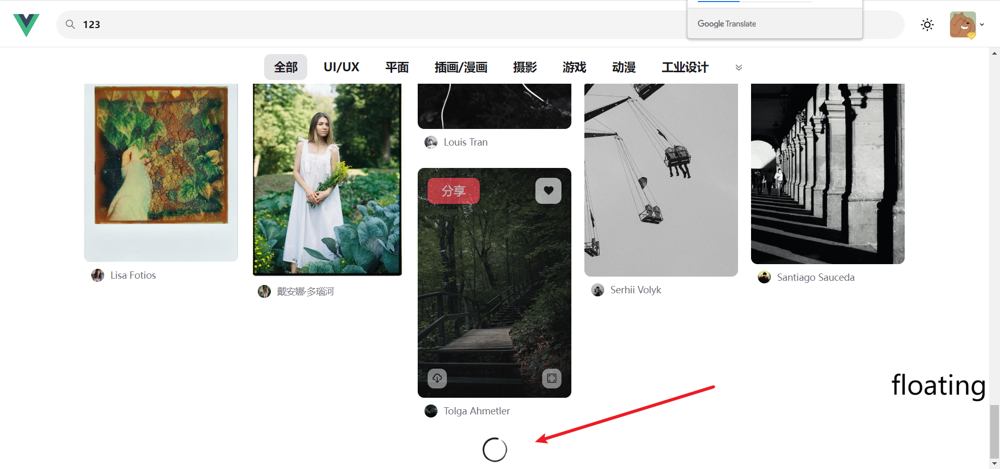

# 长列表组件 infinite + 图片懒加载(自定义指令)
## 长列表组件 infinite 
#### 长列表实现原理
所谓长列表分页加载, 其实指的是: **当滚动到列表底部时, 加载数据**

需要做的核心的一点就是能够 **监听到列表滚动到底部**


那么想要监听到列表滚动到底部的话，可以利用 [IntersectionObserver](https://developer.mozilla.org/zh-CN/docs/Web/API/IntersectionObserver)，该接口可以判断：**目标元素与其祖先元素或顶级文档视窗(viewport)的交叉状态（是否可见）**

那么就可以利用这个特性，把一个元素 **置于列表底部**，当这个元素可见时则表示 **列表滚动到了底部**

那么原生的 `IntersectionObserver` 使用起来比较复杂，所以 `vueuse` 提供了 [useIntersectionObserver](https://vueuse.org/core/useIntersectionObserver/) 方法

#### 使用长列表时，希望如何进行使用
分析一下它的使用方法以及接受的 **props**
```html
<m-infinite-list
  v-model="" // 当前是否处于加载状态
  :isFinished="" // 数据是否全部加载完成
  @onLoad="" // 加载下一页数据的触发事件
>
	列表
</m-infinite-list>
```
### 构建长列表 infinite 组件


创建 `src/libs/infinite-list/index.vue` 组件

1. 构建 `props` 与 `emits`，并处理双向数据绑定逻辑
```vue
<script setup>
const props = defineProps({
  // 是否处于加载状态
  modelValue: {
    type: Boolean,
    required: true
  },
  // 数据是否全部加载完成 
  isFinished: {
    type: Boolean,
    default:false
  }
})
const emits = defineEmits(['update:modelValue', 'onLoad'])
</script>
```
2. 构建对应视图与插槽逻辑
```vue
<template >
  <div>
    <!--列表内容-->
    <slot></slot>
    <div ref="loadingRef">
      <!--加载图标-->
      <m-svg-icon
        v-if="!isFinished"
        name="infinite-load"
        class="mx-auto w-4 h-4 animate-spin mb-1"/>
      <!--没有更多数据了-->
      <p v-if="isFinished" class="text-center text-base text-zinc-400 pb-1">数据已经全部加载完成</p>
    </div>
  </div>
</template>
```
3. 利用 [useIntersectionObserver](https://vueuse.org/core/useIntersectionObserver/) 方法，监听元素可见行为，用于判断列表滚动到底部：

```vue
<script setup>
import { ref} from 'vue'
import { useIntersectionObserver } from '@vueuse/core'
...
...
const loadingRef = ref(null)
useIntersectionObserver(
    loadingRef,
    ([{ isIntersecting }], observerElement) => {
      if (isIntersecting && !props.modelValue && !props.isFinished) {
        // 加载状态设为 true
        emits('update:modelValue', true)
        // 说明已经到达了底部, 触发 onLoad 事件
        emits('onLoad')
      }
    },
)
</script>
```
```vue
<template >
  <div>
    <!--列表内容-->
    <slot></slot>
    <div ref="loadingRef">
      ....
    </div>
  </div>
</template>
```

### 应用 infinite-list 组件 结合 waterfall 实现请求下一页逻辑处理
```vue
<template>
  <div id="containerId">
    <m-infinite-list v-model="isLoading" :isFinished="isFinished" @onLoad="getPexelsData">
      <m-waterfull :data="pexelsData" :column="isMobileTerminal ? 2 : 5" nodeKey="id" class="w-full px-1" :picturePreReading="false">
        <template v-slot="{item, width}">
          <item-vue :item="item" :width="width"></item-vue>
        </template>
      </m-waterfull>
    </m-infinite-list>
  </div>
</template>
<script setup>
import itemVue from './item.vue';
import { getPexelsList } from '@/api/pexels'
import { isMobileTerminal } from '@/utils/flexible';
import { ref } from 'vue'
// 图片列表
const pexelsData = ref([])
// 当前页码
const page = ref(1)
// 一页数量
const size = ref(20)
// 总数据数
const total = ref(0)

// infinite-list 长列表组件相关逻辑
const isLoading = ref(false)
const isFinished = ref(false)

const getPexelsData = async () => {
  // 如果 isFinished 为 true , 则 return
  if (isFinished.value) {
    return 
  }

  isLoading.value = true

  const res = await getPexelsList({
    page: page.value,
    size:size.value
  })
  console.log(res.list)
  // 注意 : 要追加数据!
  pexelsData.value = [...pexelsData.value, ...res.list]
  total.value = res.total

  isLoading.value = false
  // 让 page 页码自增
  if (res.list.length) {
    page.value++
  }
  // 如果数据全部加载完, isFinished 设为 true
  if (total.value === pexelsData.value.length) {
    isFinished.value = true
  }
}
getPexelsData()
</script>
```

## 懒加载
### 懒加载原理
**当图片不可见时，不加载图片。当图片可见时，才去加载图片。**


**可以监听所有图片是否被可见，如果图片处于不可见状态，那么就不加载图片，如果图片处于可见状态，那么开始加载图片。**

而这个功能的实现关键就是 **`IntersectionObserver`**

### 通用指令： v-lazy 实现图片懒加载
那么多的 `img` 标签怎么一个个监听到呢？

那么想要监听到所有 `img` 标签，可以利用**指令**来进行实现

比如可以给所有的 `img` 增加一个 **`v-lazy` 指令**，在这个指令中可以拿到 `el` 也就是 `img` 标签本身，这样就可以监听到所有的 `img` 标签状态

1. 创建 `src/directives/modules/lazy.js` 文件：
```js
import { useIntersectionObserver } from '@vueuse/core'
export default {
  mounted(el) {
    //1.  拿到当前 img 标签的 src 属性
    const imgSrc = el.src
    // 2. 把 img 标签的 src 替换为本地地址，也可以替换为空或者一个透明的图片
    el.src = ''

    const { stop } = useIntersectionObserver(el, ([{ isIntersecting }]) => {
      if (isIntersecting) {
        // 到了可见范围内, 就去 src 赋值
        el.src = imgSrc
        // 加载完图片, 就取消监听
        stop()
      }
    })
  },
}
```
2. 然后在 `src/directives/index.js` 完成对应注册
```js
import lazy from './modules/lazy'
export default {
  install(app) {
    app.directive('lazy',lazy)
  }
}
```
3. 在 `main.js` 中触发 `app.use()`

4. 全局替换所有的 `img` 标签为 ``
## 指令的自动注册
此时在 `src/directives/index.js` 中，面临了一个和注册组件时的同样问题，那就是：***如果指令过多，那么一个一个注册未免过于麻烦了**。所以最好有一种方式完成 **指令的自动注册**

那么想要完成这个功能我们依然要利用 [Glob导入（import.meta.globEager）](https://cn.vitejs.dev/guide/features.html#glob-import) 和 [Object.entries](https://developer.mozilla.org/zh-CN/docs/Web/JavaScript/Reference/Global_Objects/Object/entries) 功能：

```js
/**
 * 全局指令注册
 */
export default {
  async install(app) {
    // https://cn.vitejs.dev/guide/features.html#glob-import
    // import.meta.globEager 为同步导入
    const directives = import.meta.globEager('./modules/*.js')
    for (const [key, value] of Object.entries(directives)) {
      // 拼接组件注册的 name
      const arr = key.split('/')
      const directiveName = arr[arr.length - 1].replace('.js', '')
      // 完成注册
      app.directive(directiveName, value.default)
    }
  }
}
```

## 指定彩色占位图


通常情况下异步的处理，特别是异步的图片处理都会指定一个占位图来进行实现，比如常见的 [骨架屏](https://element-plus.org/zh-CN/component/skeleton.html) 

但是这里不使用骨架屏，而是采用了另外一种 **色彩图** 的形式进行展示

* 封装一个生成随机方法的工具函数
* 然后在 `div` 绑定背景颜色 `:style` 


1. 新建 `src/utils/color.js` 模块，创建生成随机色方法
```js
/**
 * 生成随机色值
 */
export const randomRGB = () => {
  const r = Math.floor(Math.random() * 255)
  const g = Math.floor(Math.random() * 255)
  const b = Math.floor(Math.random() * 255)
  return `rgb(${r}, ${g}, ${b})`
}
```

2. 在 `src/views/main/components/list/item.vue` 中生成随机背景色
```html{3}
   <div 
      class="relative rounded-md"
      :style="{backgroundColor: randomRGB()}"
      >
```

## 总结
1. 瀑布流
2. 长列表
3. 懒加载
4. 指令自动注册
5. 随机颜色背景
…

但是现在对于首页而言，所欠缺的内容还是比较多的，比如：

1. `search` 模块到首页的联动
2. `item` 上的点击处理

