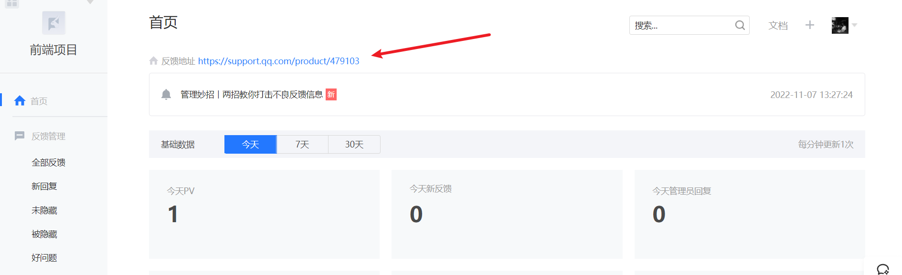

# 用户反馈解决方案 -- 兔小巢构建反馈功能
进入 [腾讯兔小巢](https://txc.qq.com/?from=powerbypc) 平台

兔小巢接入的方式非常的简单，在注册完成之后，官方其实已经给出了对应的接入方案：

简单来说整体流程共分为两步：

1. 获取当前产品反馈地址 ，`URL：https://support.qq.com/product/${productId}`
   * 在产品管理后台中，可以直接获取反馈地址
   
2. 通过 `window.open('https://support.qq.com/product/${productId}','_blank')` 进行跳转


具体代码为：

1. 在 `src/constants/index.js` 中定义反馈的 `URL`：
```js
// 兔小巢反馈地址
export const FEEDBACK_URL = 'https://support.qq.com/product/479103'
```
2. 在 `src/views/layout/components/floating/index.vue` 中增加点击事件：
```js
/**
 * 反馈处理
 */
const onToFeedback = () => {
  window.open(FEEDBACK_URL, '_blank')
}
```
