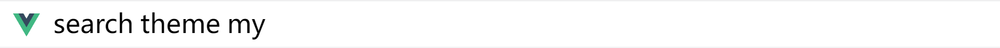
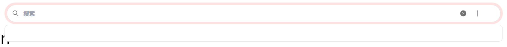
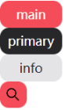
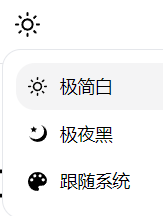
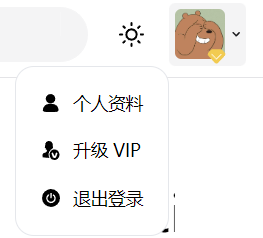

# 通用业务 Header 处理方案
## 处理 PC 端基础架构
`PC端` **将具备两个路由的出口**

1. 一级路由出口：`APP.vue` 中
2. 二级路由出口：`main.vue` 中

那么对于当前的代码而言，现在仅存在一个一级路由出口，所以接下来就需要处理 **二级路由出口**

1. 创建 `src/views/layout/index.vue` 文件，表示 **一级路由出口** 对应的组件

2. 在 `layout/components` 中分别创建**三个**业务组件：

* `header/index.vue`：表示 PC 端头部区域
* `main.vue` ：二级路由出口
* `floating`：右下角悬浮区域

3. 在 `src/views/layout/index.vue` 文件中，导入这三个组件
```vue
<template>
  <div class="h-screen">
    <!-- 需要在 tailwind 中定义 h-header 高度 -->
    <header-vue class="h-header"></header-vue>
    <main-vue class="h-main"></main-vue>
    <floating-vue></floating-vue>
  </div>
</template>

<script setup>
import headerVue from './components/header/index.vue'
import mainVue from './components/main.vue'
import floatingVue from './components/floating/index.vue'
import {} from 'vue'
</script>
```
4. 在 `tailwind.config.js` 中定义 `header、main`
```js
module.exports = {
  // Tailwind 应用范围
 ...
  theme: {
    extend: {
      ...
      height: {
        header: '72px',
        main: 'calc(100vh - 72px)'
      },
      ...
  },
  ...
}
```

5. 在 `src/router/modules/pc-routes.js` 导出对应 `layout` 组件的路由表
```js
export default [
  {
    path: '/',
    name: 'main',
    component: () => import('@/views/layout/index.vue'),
    children: []
  }
]
```
6. 在 `src/views/layout/components/floating/index.vue`中，修改样式，使其脱离标准文档流

```html
<div class="fixed bottom-10 right-2">floating</div>
```

## PC 端 : Header 模块处理分析与简单实现
整个 **`PC` 端 Header 模块** ，从左往右可以分为 4 个模块

1. `logo` : 点击返回到首页
2. `search` : 搜索区域
3. `theme` : 主题切换区域
4. `my` : 信息区域

明确好了这些内容之后, 根据分析实现这些视图区域

1. 分别创建以下组件，并完成初始化
* `src/views/layout/components/header/header-search/index.vue`
* `src/views/layout/components/header/header-theme.vue`
* `src/views/layout/components/header/header-my.vue`

2. 在 `src/views/layout/components/header/index.vue` 中完成初始化
```vue
<template>
  <div class="w-full bg-white border-b border-b-zinc-200 px-2 py-1">
    <div class="flex items-center">
      
      <header-search-vue class="mr-1"></header-search-vue>
      <header-theme-vue class="mr-1"></header-theme-vue>
      <header-my-vue></header-my-vue>
    </div>
  </div>
</template>

<script setup>
import headerSearchVue from './header-search/index.vue'
import headerThemeVue from './header-theme.vue'
import headerMyVue from './header-my.vue'
import { useRouter } from 'vue-router'

const router = useRouter()
const onToHome = () => {
  router.push('/')
}
</script>
```
目前的效果 :


## 通用组件：search 搜索框能力分析
对于 `header` 中的模块我们依次进行处理

`search` 部分为搜索框，对于该搜索框而言我们期望把它做成 **通用组件**

那么既然是通用组件，就需要分析它的 **能力**，它应该具备什么样的功能：

1. 输入内容实现双向数据绑定
2. 鼠标移入与获取焦点时的动画
3. 一键清空文本功能
4. 搜索触发功能
5. 可控制，可填充的下拉展示区
6. 监听到以下事件列表：
* `clear`：删除所有文本事件
* `input`：输入事件
* `focus`：获取焦点事件
* `blur`：失去焦点事件
* `search`：触发搜索（点击或回车）事件

### 通用组件：search 搜索框样式处理

创建 `src/libs/search/index.vue` 文件
```vue
<template>
  <div
    class="group relative p-0.5 rounded-xl border-white duration-500 hover:bg-red-100/40"
  >
    <div>
      <!-- 搜索图标 -->
      <m-svg-icon
        class="w-1.5 h-1.5 absolute translate-y-[-50%] top-[50%] left-2"
        name="search"
        color="#707070"
      />
      <!-- 输入框 -->
      <input
        class="block w-full h-[44px] pl-4 text-sm outline-0 bg-zinc-100 caret-zinc-400 rounded-xl text-zinc-900 tracking-wide font-semibold border border-zinc-100 duration-500 group-hover:bg-white group-hover:border-zinc-200 focus:border-red-300"
        type="text"
        placeholder="搜索"
      />
      <!-- 删除按钮 -->
      <m-svg-icon
        name="input-delete"
        class="h-1.5 w-1.5 absolute translate-y-[-50%] top-[50%] right-9 duration-500 cursor-pointer"
      ></m-svg-icon>
      <!-- 分割线 -->
      <div
        class="opacity-0 h-1.5 w-[1px] absolute translate-y-[-50%] top-[50%] right-[62px] duration-500 bg-zinc-200 group-hover:opacity-100"
      ></div>
      <!-- TODO: 搜索按钮(通用组件) -->
    </div>
    <!-- 下拉区 -->
    <transition name="slide">
      <div
        class="max-h-[368px] w-full text-base overflow-auto bg-white absolute z-20 left-0 top-[56px] p-2 rounded border border-zinc-200 duration-200 hover:shadow-3xl"
      >
        <slot name="dropdown" />
      </div>
    </transition>
  </div>
</template>

<script setup></script>

<style lang="scss" scoped>
.slide-enter-active {
  transition: all 0.5s;
}

.slide-leave-active {
  transition: all 0.5s;
}

.slide-enter-from,
.slide-leave-to {
  transform: translateY(40px);
  opacity: 0;
}
</style>
```

在 `src/views/layout/components/header/header-search/index.vue` 使用组件
```vue
<template>
  <div class="w-full">
    <m-search></m-search>
  </div>
</template>
```
## 通用组件：button 按钮能力分析
现在 `search` 通用组件还差最后的一个 **按钮** 显示

因为会经常使用到各种各样的 `button` 按钮组件，所以说期望拥有一个 `button` **按钮通用组件**

1. 可以显示文字按钮，并提供 `loading` 功能
2. 可以显示 `icon` 按钮，并可以任意指定 `icon` 颜色
3. 可开关的点击动画
4. 可以指定各种风格和大小
5. 当指定的风格或大小不符合预设时，需要给开发者以提示消息

### 通用组件：button 按钮功能实现
要实现这种效果 : 

具体如下步骤: 
1. 构建 `type` 风格可选项 和 `size` 大小可选项
2. 通过 `props` 让开发者控制按钮
3. 区分 `icon` 的button  和 `text` button
4. 依据当前的处理实现视图
5. 处理 `点击事件`

#### 开始实现
1. 创建 `src/libs/button/index.vue` 通用按钮组件

2. 构建 `type` 风格可选项与 `size` 大小可选项
```vue
<script>
// type 可选项: 按钮风格 primary main info
const typeEnum = { // primary , main , info
  primary: 'text-white  bg-zinc-800 hover:bg-zinc-900 active:bg-zinc-800 ', // 字体颜色,背景颜色, 点击时北京颜色
  main: 'text-white  bg-main hover:bg-hover-main active:bg-main ',
  info: 'text-zinc-800 bg-zinc-200 hover:bg-zinc-300 active:bg-zinc-200 '
}
// size 可选项: 按钮大小可选项 default small , 还要区分 文字按钮和图标按钮
const sizeEnum = { // default small,  (icon-default , icon-small)
  default: { 
    button: 'w-8 h-4 text-base', // 按钮尺寸, 字体尺寸
    icon: ''
  },
  'icon-default': {
    button: 'w-4 h-4',
    icon: 'w-1.5 h-1.5'
  },
  small: {
    button: 'w-7 h-3 text-base',
    icon: ''
  },
  'icon-small': {
    button: 'w-3 h-3',
    icon: 'w-1.5 h-1.5'
  }
}
</script>
```
3. `bg-main` 为 **自定义色值**，所以不要忘记在 `tailwind.config.js` 中指定
```js
module.exports = {
  content: ['./index.html', './src/**/*.{vue,js}'],
  theme: {
    extend: {
     ...
      colors: {
        'main': '#f44c58',
        'hover-main':'#f32836'
      }
    },
  },
  plugins: [],
}
```
4.  指定 `props` 让开发者可以控制当前按钮
```vue
<script setup>
const props = defineProps({
  // icon图标名称
  icon: {
    type:String
  },
  // icon 图标颜色
  iconColor: {
    type:String
  },
  // icon 图标类名 (匹配tailwind )
  iconClass: {
    type:String
  },
  // 按钮风格 type
  type: {
    type: String,
    default: 'primary',
    validator(value) {
      const keys = Object.keys(typeEnum)
      const result = keys.includes(value)
      if (!result) {
        throw new Error(`你的 type 必须是 ${keys.join(',')} 中的的一个值`)
      }
      return result
    }
  },
  // size 按钮大小可选项
  size: {
    type: String,
    default: 'default',
    validator(value) {
      const keys = Object.keys(sizeEnum).filter(key => !key.includes('icon-'))
      const result = keys.includes(value)
      if (!result) {
        throw new Error(`你的 size 必须是 ${keys.join(',')} 中的的一个值`)
      }
      return result
    }
  },
  // 按钮点击时是否需要动画
  isActiveAnim: {
    type: Boolean,
    default:true
  },
  // 加载状态
  loading: {
    type: Boolean,
    default:false
  }
})
</script>
```

5. 因为在处理 `size` 的 `prop` 时，区分了 `icon按钮` 和 `文字按钮`，所以说在指定类名时，需要通过一个 **计算属性** 
判定是否需要增加 `icon-` 前缀
```js
// 如果props 传了 icon 图标, 说明是 icon 按钮
// 所以它的 大小 必须要加上 'icon-'
// 处理大小的 key
const sizeKey = computed(() => {
  return props.icon ? 'icon-'+ props.size : props.size
}) 
```
6. 依据当前数据，实现对应的视图
```vue
<template>
  <button
    class="text-sm text-center rounded duration-150 flex justify-center items-center"
    :class="[
      typeEnum[type],
      sizeEnum[sizeKey].button,
      { 'active:scale-105': isActiveAnim }
    ]"
  >
    <!-- 展示 loading -->
    <m-svg-icon
      v-if="loading"
      name="loading"
      class="w-2 h-2 animate-spin mr-1"
    ></m-svg-icon>
    <!-- icon 按钮 -->
    <m-svg-icon
      v-if="icon"
      :name="icon"
      class="m-auto"
      :class="sizeEnum[sizeKey].icon"
      :color="iconColor"
      :fillClass="iconClass"
    ></m-svg-icon>
    <!-- 文字按钮 -->
    <slot v-else />
  </button>
</template>
```
7. 在 `src/libs/search/index.vue` 使用该组件
```vue
<!-- TODO: 搜索按钮(通用组件) -->
<m-button
  class="absolute translate-y-[-50%] top-[50%] right-1"
  icon="search"
  iconColor="#ffffff"
  type="main"
></m-button>
```

8. 最后为 `button` 处理点击事件
```
  <button
    ...
    @click.stop="onBtnClick"
  >
```

```js
const EMITS_CLICK = 'click'

const emits = defineEmits([EMITS_CLICK])

/**
 * 按钮点击事件处理
 */
const onBtnClick = () => {
  if (props.loading) {
    return
  }
  emits(EMITS_CLICK)
}
```
## 完善 search 的 基本功能
那么此时 `search` 组件展示所需要的组件已经全部完成，接下来就可以继续处理 `search` 尚未完成的能力：

1. 输入内容实现双向数据绑定
```html
  <input
        ...
        :value="modelValue" @input="listenInput"
      />
```
```vue
<script>
const EMITS_MODEL_VALUE = 'update:modelValue'
</script>
<script setup>
const props = defineProps({
  modelValue: {
    type: String,
    required: true
  }
})
const emits = defineEmits([EMITS_MODEL_VALUE])
// 监听表单的input 事件, 向外触发 update:modelValue
const listenInput = ($event) => {
  emits(EMITS_MODEL_VALUE, $event.target.value)
}
// 点击 搜索按钮
const clickSearchBtn = () => {
  console.log('点击')
}
</script>
```
2. 搜索按钮在 `hover` 时展示，并为圆角：   `opacity-0 group-hover:opacity-100`
```html
  <!--TODO: 搜索按钮(通用组件)-->
      <m-button
        class="absolute translate-y-[-50%] top-[50%] right-1 rounded-lg opacity-0 group-hover:opacity-100"
        icon="search"
        iconColor="#ffffff"
        type="main"
        @click="clickSearchBtn"
      ></m-button>
```

3. 一键清空文本功能
* 文本存在是展示
```html
 <!--删除按钮-->
      <m-svg-icon
        v-show="modelValue"
       ...
      ></m-svg-icon>
```

* 一键清空文本实现
```html
   <!--删除按钮-->
      <m-svg-icon
        v-show="modelValue"
        ...
        @click="onClearClick"
      ></m-svg-icon>
```
```js
// 一键清空文本
const onClearClick = () => {
  emits(EMITS_MODEL_VALUE, '')
}
```

4. 搜索触发功能
```html
<m-button
  ...
  @click="clickSearchBtn"
  @keyup.enter="clickSearchBtn" 
  <!--还要处理 : 点击enter键是也触发搜索函数-->
></m-button>
```
```js
const EMITS_SEARCH = 'search'
...
const emits = defineEmits([EMITS_MODEL_VALUE,EMITS_SEARCH])

// 点击搜索按钮, 触发事件
const clickSearchBtn = () => {
  console.log('点击')
  emits(EMITS_SEARCH, props.modelValue)
}
```


5. 可控制，可填充的下拉展示区
* input输入框获取焦点时 , 展示 下拉区
```html
  <!--下拉区-->
    <transition name="slide">
      <div
        ...
        v-if="$slots.dropdown && isInputFocus"
      >
        <slot name="dropdown" />
      </div>
    </transition>
```
```html
      <!--input输入框-->
      <input
        ...
        ...
        @focus="onFocusInput"
```
```js
// input 是否获取焦点 : 判断显示/隐藏下拉区
const isInputFocus = ref(false)
// input 获取焦点
const onFocusInput = () =>{
  isInputFocus.value = true
}
```

* 点击整个 search 组件**外部**时, 隐藏 下拉区

使用了 `vueuse` 里的 `onClickOutside` 函数
```html
<div ref="containerRef"  .... ></div>
```
```js
import { onClickOutside } from '@vueuse/core'; 

...
// input 是否获取焦点 : 判断显示/隐藏下拉区
const isInputFocus = ref(false)
const containerRef = ref(null)
// 点击 search 组件外部区域, 隐藏下拉区
onClickOutside(containerRef, () => {
  isInputFocus.value = false
})
```

6. 处理所有关于表单的事件通知
```vue
<script>
// modelValue 改变
const EMITS_MODEL_VALUE = 'update:modelValue'
// 搜索
const EMITS_SEARCH = 'search'
// focus
const EMITS_FOCUS = 'focus'
// input
const EMITS_INPUT = 'input'
// blur
const EMITS_BLUR = 'blur'
// 清空文本
const EMITS_CLEAR = 'clear'
</script>
```
```html
<!-- 输入框 -->
<input
  ...
  @focus="onFocusHandler"
  @blur="onBlurHandler"
  @keyup.enter="onSearchHandlder"
/>
```

```js
const emits = defineEmits([
  EMIT_CLEAR,
  EMIT_INPUT,
  EMIT_FOCUS,
  EMIT_BLUR,
  EMIT_SEARCH
])

/**
 * 清空文本
 */
const onClearClick = () => {
  ...
  emits(EMIT_CLEAR, '')
}

/**
 * 触发搜索
 */
const onSearchHandler = () => {
  emits(EMIT_SEARCH, inputValue.value)
}

/**
 * 监听焦点行为
 */
const isFocus = ref(false)
const onFocusHandler = () => {
  ...
  emits(EMIT_FOCUS)
}

/**
 * 失去焦点
 */
const onBlurHandler = () => {
  emits(EMIT_BLUR)
}

/**
 * 监听输入行为
 */
watch(inputValue, (val) => {
  emits(EMIT_INPUT, val)
})
```

7. 在 `src/views/layout/components/header/header-search/index.vue` 中使用该组件

```vue
<template>
  <div class="w-full">
    <m-search v-model="inputValue">
      <template #dropdown>
        <div>dropdown</div>
      </template>
    </m-search>
  </div>
</template>

<script setup>
import { ref } from 'vue'

const inputValue = ref('')
</script>
```

## 通用组件：popover 气泡卡片能力分析
**鼠标移入之后，展示一个弹出层**

那么这样的一个弹出层逻辑，通常使用 `popover` 进行表示

对于 `popover` 而言，他应该具备以下能力

1. 具有两个插槽
* **具名插槽** reference : 触发弹出层的视图
* **默认插槽** : 弹出层中需要展示的内容

2. 控制弹出层的位置，期望可以在以下位置弹出
* 左上
* 右上
* 左下
* 右下
### popover 基础功能实现
1. 创建 `src/libs/popover/index.vue` 气泡卡片
```vue
<template>
  <div class="relative" @mouseenter="onMouseenter" @mouseleave="onMouseleave">  
    <!--具名插槽: 静态的内容-->
    <div>
      <slot name="reference" />
    </div>
    <!--需要展示的气泡框 transition 过度动画 -->
    <transition name="slide">
      <div v-if="isVisible" class="absolute z-20 bg-white p-1 border rounded-md">
        <!--默认插槽-->
        <slot></slot>
      </div>
    </transition>
  </div>
</template>
<script setup>
import { ref } from 'vue'
// 气泡框的显示/隐藏
const isVisible = ref(false)
// 鼠标进入事件
const onMouseenter = () => {
  isVisible.value = true
}
// 鼠标离开事件
const onMouseleave = () => { 
  isVisible.value = false
}
</script>
<style lang="scss" scoped>
.slide-enter-active,.slide-leave-active {
  transition:all 0.25s ease
}
.slide-enter-from,.slide-leave-to {
  opacity: 0;
  transform: translateY(-20px);
}
</style>
```


2. 在 `src/views/layout/components/header/header-theme.vue `使用 `popover`


```vue
<template>
  <m-popover>
    <!--#reference-->
    <template #reference>
      <div class="p-1 cursor-pointer bg-white rounded-md hover:bg-zinc-100">
        <m-svg-icon class="w-2 h-2" name="theme-light"></m-svg-icon>
      </div>
    </template>
    <!--气泡框内容: 默认插槽-->
    <ul class="w-[140px]">
      <template v-for="item in themeArr" :key="item.id">
        <li class="flex items-center p-1 hover:bg-zinc-100 rounded-md cursor-pointer duration-200" >
          <m-svg-icon class="w-1.5 h-1.5 mr-1" :name="item.icon" />
          <span class="text-sm">{{item.name}}</span>
        </li>
      </template>
    </ul>
  </m-popover>
</template>
<script setup>
import { THEME_LIGHT,THEME_DARK,THEME_SYSTEM } from  '@/constants'
const themeArr = [
  {
    id: 0,
    type: THEME_LIGHT,
    name: '极简白',
    icon: 'theme-light',
  },
  {
    id: 1,
    type: THEME_DARK,
    name: '极夜黑',
    icon: 'theme-dark',
  },
  {
    id: 2,
    type: THEME_SYSTEM,
    name: '跟随系统',
    icon: 'theme-system',
  },
]
</script>
```
3. 在 `src/constants/index.js` 中定义色值常量
```js
// 浅色主题
export const THEME_LIGHT = 'light'
// 深色主题
export const THEME_DARK = 'light'
// 跟随系统
export const THEME_SYSTEM = 'light'
```
`popover` 气泡卡片已经展示成功

### popover 功能延伸，控制气泡展示位置
`popover` 气泡卡片展示成功，但是 **气泡弹出的位置** 无法控制

气泡至少应该做到**4 个位置**的可控展示：
* 左上 `top-left`
* 右上 `top-right`
* 左下 `bottom-left`
* 右下 `bottom-right`

尝试分析...:

* 气泡框它本身是**绝对定位**, 所以就可以改变`left`和`top`改变它本身的位置
* 而这些位置信息可以定义成一个**响应式数据 ref**, 绑定到气泡框元素的 `:style` 样式上面
* 那么这样可以根据用户通过 `props` 传递的四个方向之一, 去定义`left` 和 `top`
* 这个时候可以使用 `watch` 监听 `isVisible` 的变化, 当`isVisible` 等于 `true` 即 气泡框显示时
* 在 `nextTick` 里面去定义当前情况时的 `left` 和 `top` 就 ok , 基本流程是这样
1. 指定所有的可选位置常量，并生成 `enum：`
```vue
<script>
const PROP_TOP_LEFT = 'top-left'
const PROP_TOP_RIGHT = 'top-right'
const PROP_BOTTOM_LEFT = 'bottom-left'
const PROP_BOTTOM_RIGHT = 'bottom-right'

// 定义指定位置的 Enum
const placementEnum = [
  PROP_TOP_LEFT,
  PROP_TOP_RIGHT,
  PROP_BOTTOM_LEFT,
  PROP_BOTTOM_RIGHT
]
</script>
```

2. 创建 `prop`，控制气泡位置：
```js
const props = defineProps({
  // 控制气泡弹出位置，并给出开发者错误的提示
  placement: {
    type: String,
    default: 'bottom-left',
    validator(val) {
      const result = placementEnum.includes(val)
      if (!result) {
        throw new Error(
          `你的 placement 必须是 ${placementEnum.join('、')} 中的一个`
        )
      }
      return result
    }
  }
})
```

3. 获取元素的 `DOM`，创建读取元素尺寸的方法：
```html
<template>
  ...
    <div ref="referenceTarget">
      <!-- 具名插槽 -->
      ...
    </div>
    <!-- 气泡展示动画 -->
    <transition ...>
      <div
        ref="contentTarget"
        ...
      >
        <!-- 匿名插槽 -->
        <slot />
      </div>
    </transition>
  </div>
</template>
```

```js
/**
 * 计算元素尺寸
 */
const referenceTarget = ref(null)
const contentTarget = ref(null)
const useElementSize = (target) => {
  if (!target) return {}
  return {
    width: target.offsetWidth,
    height: target.offsetHeight
  }
}
```

4. 生成气泡的样式对象，用来控制每个位置的对应样式：
```js
/**
 * 计算弹层位置
 */
const contentStyle = ref({
  top: 0,
  left: 0
})
```
```html
<div
  ...
  :style="contentStyle"
>
	<!-- 匿名插槽 -->
	<slot />
</div>
```

5. 监听展示的变化，计算 `contentStyle：`

```js
/**
 * 监听展示的变化，在展示时计算气泡位置
 */
watch(isVisible, (val) => {
  if (!val) {
    return
  }
  // 等待渲染成功之后
  nextTick(() => {
    switch (props.placement) {
      // 左上
      case PROP_TOP_LEFT:
        contentStyle.value.top = 0
        contentStyle.value.left =
          -useElementSize(contentTarget.value).width + 'px'
        break
      // 右上
      case PROP_TOP_RIGHT:
        contentStyle.value.top = 0
        contentStyle.value.left =
          useElementSize(referenceTarget.value).width + 'px'
        break
      // 左下
      case PROP_BOTTOM_LEFT:
        contentStyle.value.top =
          useElementSize(referenceTarget.value).height + 'px'
        contentStyle.value.left =
          -useElementSize(contentTarget.value).width + 'px'
        break
      // 右下
      case PROP_BOTTOM_RIGHT:
        contentStyle.value.top =
          useElementSize(referenceTarget.value).height + 'px'
        contentStyle.value.left =
          useElementSize(referenceTarget.value).width + 'px'
        break
    }
  })
})
```
### 处理慢速移动时，气泡消失闪动问题

其实这个问题非常简单，因为在 `reference` 与 **气泡之间存在间隙** ，当鼠标移动到这个间隙处时，就会触发 `mouseleave` 鼠标移出事件，那么此时 `isVisible` 就会变为 `false`

想要解决这个问题，我们可以利用 **类似于防抖（debounce）** 的概念。

也就是：**鼠标刚离开时，不去立刻修改 isVisible，而是延迟一段时间，如果在这段时间之内，再次触发了鼠标移入事件，则不再修改 isVisible**

1. 定义延迟关闭时长：
```js
// 延迟关闭时长
const DELAY_TIME = 100
```

2. 通过定时器，处理延迟关闭：
```js
// 控制延迟关闭
let timeout = null
/**
 * 鼠标移入的触发行为
 */
const onMouseenter = () => {
  isVisible.value = true
  // 再次触发时，清理延时装置
  if (timeout) {
    clearTimeout(timeout)
  }
}
/**
 * 鼠标移出的触发行为
 */
const onMouseleave = () => {
  // 延时装置
  timeout = setTimeout(() => {
    isVisible.value = false
    timeout = null
  }, DELAY_TIME)
}
```
## 基于 popover 处理用户(my)模块



在 `src/views/layout/components/header/header-my.vue` 中写入以下代码：

1. 定义气泡数据源：

```vue
<script setup>
// 构建 menu 数据源
const menuArr = [
  {
    id: 0,
    title: '个人资料',
    icon: 'profile',
    path: '/profile'
  },
  {
    id: 1,
    title: '升级 VIP',
    icon: 'vip-profile',
    path: '/member'
  },
  {
    id: 2,
    title: '退出登录',
    icon: 'logout',
    path: ''
  }
]
</script>
```

2. 渲染视图：
```vue
<template>
  <m-popover class="flex items-center" placement="bottom-left">
    <template #reference>
      <div
        class="guide-my relative flex items-center p-0.5 rounded-sm cursor-pointer duration-200 outline-none hover:bg-zinc-100"
      >
        <!-- 头像 -->
        
        <!-- 下箭头 -->
        <m-svg-icon
          class="h-1.5 w-1.5 ml-0.5"
          name="down-arrow"
          fillClass="fill-zinc-900 "
        ></m-svg-icon>
        <!-- vip 标记 -->
        <m-svg-icon
          name="vip"
          class="w-1.5 h-1.5 absolute right-[16px] bottom-0"
        ></m-svg-icon>
      </div>
    </template>

    <div class="w-[140px] overflow-hidden">
      <div
        class="flex items-center p-1 cursor-pointer rounded hover:bg-zinc-100/60"
        v-for="item in menuArr"
        :key="item.id"
      >
        <m-svg-icon
          :name="item.icon"
          class="w-1.5 h-1.5 mr-1"
          fillClass="fill-zinc-900 "
        ></m-svg-icon>
        <span class="text-zinc-800 text-sm">{{ item.title }}</span>
      </div>
    </div>
  </m-popover>
</template>
```
