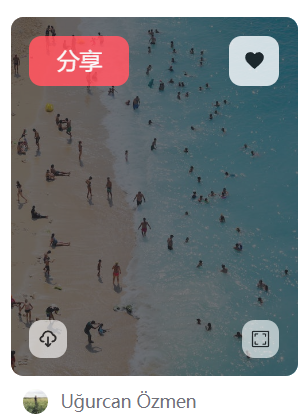

# 瀑布流 + 长列表 + 懒加载处理方案- 高性能通用模块

## 基础列表展示

1. 创建 `src/api/pexels.js` ，定义数据接口
```js
import request from '@/utils/request'

/**
 * 获取图片数据列表
 */
export const getPexelsList = (data) => {
  return request({
    url: '/pexels/list',
    params: data
  })
}
```

2. 创建 `src/views/main/components/list/index.vue` 功能组件，作为列表展示组件

3. 创建 `src/views/main/components/list/item.vue` 组件，作为每个 `item` 的视图组件

4. 在 `src/views/main/index.vue` 中，处理基本 `list` 展示布局：
```vue
<template>
  <div class="h-full overflow-auto bg-white dark:bg-zinc-800 duration-500">
    <navigation-vue></navigation-vue>
    <div class="max-w-screen-xl mx-auto relative m-1 xl:mt-4">
      <list-vue></list-vue>
    </div>
  </div>
</template>

<script setup>
import navigationVue from './components/navigation/index.vue'
import listVue from './components/list/index.vue'
</script>
```
5. 在 `src/views/main/components/list/index.vue`，获取数据，并渲染 `item`
```vue
<template>
  <div>
    <item-vue v-for="item in pexelsList" :key="item.id" :data="item"></item-vue>
  </div>
</template>

<script setup>
import { ref } from 'vue'
import { getPexelsList } from '@/api/pexels'
import itemVue from './item.vue'

/**
 * 构建数据请求
 */
let query = {
  page: 1,
  size: 20
}
const pexelsList = ref([])
const getPexelsData = async () => {
  const res = await getPexelsList(query)
  pexelsList.value = res.list
}
getPexelsData()
</script>
```
6. 在 `src/views/main/components/list/item.vue` 中构建基础布局：



```vue
<template>
  <div
    class="bg-white dark:bg-zinc-900 xl:dark:bg-zinc-800 rounded pb-1 h-[280px] w-[230px]"
  >
    <div class="relative w-full rounded cursor-zoom-in group">
      <!-- :src="data.photo" -->
      
      <!-- 遮罩层 -->
      <div
        class="hidden opacity-0 w-full h-full bg-zinc-900/50 absolute top-0 left-0 rounded duration-300 group-hover:opacity-100 xl:block"
      >
        <m-button class="absolute top-1.5 left-1.5">分享</m-button>
        <m-button
          class="absolute top-1.5 right-1.5"
          type="info"
          icon="heart"
          iconClass="fill-zinc-900 dark:fill-zinc-200"
        />
        <m-button
          class="absolute bottom-1.5 left-1.5 bg-zinc-100/70"
          type="info"
          size="small"
          icon="download"
          iconClass="fill-zinc-900 dark:fill-zinc-200"
        />
        <m-button
          class="absolute bottom-1.5 right-1.5 bg-zinc-100/70"
          type="info"
          size="small"
          icon="full"
          iconClass="fill-zinc-900 dark:fill-zinc-200"
        />
      </div>
    </div>
    <!-- 标题 -->
    <p
      class="text-sm mt-1 font-bold text-zinc-900 dark:text-zinc-300 line-clamp-2 px-1"
      alt
    >
      {{ data.title }}
    </p>
    <!-- 作者 -->
    <div class="flex items-center mt-1 px-1">
      
      <span class="text-sm text-zinc-500 ml-1">{{ data.author }}</span>
    </div>
  </div>
</template>

<script setup>
defineProps({
  data: {
    type: Object,
    required: true
  }
})
</script>
```

7. 期望 `header` 区域不滚动，只有内容区滚动，所以可以在 `src/App.vue` 一级路由出口处，指定对应样式：
```vue
<template>
  <!-- 一级路由出口 -->
  <div class="h-screen fixed top-0 left-0 w-screen">
    <router-view></router-view>
  </div>
</template>
```

## 瀑布流组件构建分析
目前列表组件已经可以展示了，只不过是展示的样式还存在一些问题

那么这样的一个样式处理的过程就是 **瀑布流组件的构建过程**

存在的问题就是：**每个 `item` 应该横向排列，第二行的 item 顺序连接到当前最短的列中** ，而这个也就是构建瀑布流的核心逻辑。

那么想要实现这个核心逻辑，**每个 `item` 肯定就不可以使用正常的布局方式，而必须使用 `absolute` 绝对布局，通过 `top` 和 `left` 来手动控制位置**

想要搞明白一个复杂组件的构建机制，那么最好的方式是想象一下：当去使用这个组件时，希望如何进行使用。

期望将来这个通用组件可以这样使用：
```html
<m-waterfall
        :data=""  // 数据源
        :nodeKey="" // 唯一标识的 key
        :column="" // 渲染的列数
        :picturePreReading="" // 是否需要图片预渲染（在不知道图片高度的情况下）
      >
        <template v-slot="{ item, width }">
          // 对应的 item
        </template>
</m-waterfall>
```
综合起来来看，整个的一个瀑布流组件的构建需要分成几部分:

1. 通过 `props` 传递关键数据（部分）：
* `data`：数据源
* `nodeKey`：唯一标识
* `column`：渲染的列数
* `picturePreReading`：是否需要图片预渲染

2. 瀑布流渲染机制：通过 `absolute` 配合 `relative` 完成布局，布局逻辑为：**每个 `item` 应该横向排列，第二行的 `item` 顺序连接到当前最短的列中**
3. 通过 **作用域插槽 将每个 `item` 中涉及到的关键数据，传递到 `item` 视图中**

### 构建瀑布流布局，获取容器宽度与列宽
1. 创建 `src/libs/waterfall/index.vue`组件，并创建如下 `props：`
```js
const props = defineProps({
  // 数据源
  data: {
    type: Array,
    required: true
  },
  // 唯一标识的 key
  nodeKey: {
    type: String
  },
  // 列数
  column: {
    default: 2,
    type: Number
  },
  // 列间距
  columnSpacing: {
    default: 20,
    type: Number
  },
  // 行间距
  rowSpacing: {
    default: 20,
    type: Number
  },
  // 是否需要进行图片预读取
  picturePreReading: {
    type: Boolean,
    default: true
  }
})
```

2. 构建对应的基础视图：
```vue
<template>
  <div
    class="relative"
    ref="containerTarget"
    :style="{
      height: containerHeight + 'px' // 因为当前为 relative 布局，所以需要主动指定高度
    }"
  >
    <!-- 因为列数不确定，所以需要根据列数计算每列的宽度，所以等待列宽计算完成，并且有了数据源之后进行渲染 -->
    <template v-if="columnWidth && data.length">
      <!-- 通过动态的 style 来去计算对应的列宽、left、top -->
      <div
        class="m-waterfall-item absolute duration-300"
        :style="{
          width: columnWidth + 'px',
          left: item._style?.left + 'px',
          top: item._style?.top + 'px'
        }"
        v-for="(item, index) in data"
        :key="nodeKey ? item[nodeKey] : index"
      >
        <slot :item="item" :width="columnWidth" :index="index" />
      </div>
    </template>
    <!-- 可以给一个加载中的描述，没有也无所谓 -->
    <div v-else>加载中...</div>
  </div>
</template>
```
3. 根据以上基础视图，需要生成对应的：

* `containerHeight`：总高度
* `columnWidth`：列宽
* `item._style.left`：每个 `item` 对应的 `left`
* `item._style.top`：每个 `item` 对应的 `right`

4. 想要计算 **总高度**，那么需要计算出 **每一列的高度** ，最高的一列为 **总高度**
```js
// 容器的总高度
const containerHeight = ref(0)
// 记录每列高度的容器。key：所在列  val：列高
const columnHeightObj = ref({})
/**
 * 构建记录各列的高度的对象。
 */
const useColumnHeightObj = () => {
  columnHeightObj.value = {}
  for (let i = 0; i < props.column; i++) {
    columnHeightObj.value[i] = 0
  }
}
```
5. 想要计算列宽，那么首先需要有容器的总宽度：
```js
// 容器实例
const containerTarget = ref(null)
// 容器总宽度(不包含 padding、margin、border)
const containerWidth = ref(0)
// 容器左边距，计算 item left 时，需要使用定位
const containerLeft = ref(0)
/**
 * 计算容器宽度
 */
const useContainerWidth = () => {
  const { paddingLeft, paddingRight } = getComputedStyle(
    containerTarget.value,
    null
  )
  // 容器左边距
  containerLeft.value = parseFloat(paddingLeft)
  // 容器宽度
  containerWidth.value =
    containerTarget.value.offsetWidth -
    parseFloat(paddingLeft) -
    parseFloat(paddingRight)
}
```

6. 计算列宽
```js
// 列宽
const columnWidth = ref(0)
// 列间距合计
const columnSpacingTotal = computed(() => {
  // 如果是5列，则存在 4 个列间距
  return (props.column - 1) * props.columnSpacing
})
/**
 * 开始计算
 */
const useColumnWidth = () => {
  // 获取容器宽度
  useContainerWidth()
  // 计算列宽
  columnWidth.value =
    (containerWidth.value - columnSpacingTotal.value) / props.column
}

onMounted(() => {
  // 计算列宽
  useColumnWidth()
  console.log(columnWidth.value)
})
```

此时，在 `src/views/main/components/list/index.vue` 中使用该组件，可以打印出计算的值
```vue
<template>
  <div>
    <m-waterfull :data="pexelsData" :column="5" nodeKey="id">
      <template v-slot="{item, width}">
        <!--item 组件-->
        <item-vue :item="item"></item-vue>
      </template>
    </m-waterfull>
  </div>
</template>
```

## 区分图片预加载，获取元素关键属性
想要计算每列的 `left、right` ，那么需要拿到每个 `item` 的高度，因为只有有了每个 `item` 高，才可以判断下一列的第一个 `item` 的位置。

同时根据 `picturePreReading` 又可以分为两种情况：

1. 需要图片预加载时：图片高度未知
2. 不需要图片预加载时：图片高度已知

根据以上分析可得出以下代码：

1. 根据两种不同的情况，我们需要有两个不同的方法来进行计算：

#### 需要图片预加载时 
图片高度未知：
```js
// 需要图片预加载时
// item 高度集合
let itemHeights = []
/**
 * 监听图片加载完成
 */
const waitImgComplete = () => {
  itemHeights = []
  // 拿到所有 item 元素
  const itemElements = [...document.getElementsByClassName("m-waterfall-item")]
  console.log(itemElements)
  // 获取所有 img 标签
  const imgElements = getImgElements(itemElements)
  // 拿到所有 img 标签的 src 路径 
  const allImgs = getAllImgs(imgElements)
  // 监听所有图片全部加载完(内部已经使用了 promise 封装监听图片加载完成)
  onCompleteImgs(allImgs).then(res => {
    // 这里图片已经加载完成
    itemElements.forEach((el) => {
      itemHeights.push(el.offsetHeight)
    })
    console.log(itemHeights) // 所有 item 高度的数组'
     // 渲染位置
    useItemLocation()
  })
}
```
2. 以上使用到了多个工具方法，可以创建 `src/libs/waterfall/utils.js` 模块进行处理：
```js
// 获取所有 img 标签
export function getImgElements(itemElements) {
  const imgElements = []
  itemElements.forEach(el => {
    imgElements.push(...el.getElementsByTagName('img'))
  })
  return imgElements
}


// 获取 img 标签的 src 链接
export function getAllImgs(imgElements) {
  const allImgs = []
  imgElements.forEach(el => {
    allImgs.push(el.getAttribute('src'))
  })
  return allImgs
}

/**
 * 监听图片数组加载完成
 */
export function onCompleteImgs(allImgs) {
  const promiseAll = [] // imgEl promise的数组
  allImgs.forEach((src, index) => {
    promiseAll[index] = new Promise((resolve, reject) => {
      const imgEl = new Image()
      imgEl.src = src 
      imgEl.onload = () => {
        resolve({
          src,
          index
        })
      }
    })
  })
  return Promise.all(promiseAll)
}
```

#### 不需要图片预加载时
1. 图片高度已知
```js
/**
 * 图片不需要预加载时，计算 item 高度
 */
const useItemHeight = () => {
  itemHeights = []
  // 拿到所有元素
  let itemElements = [...document.getElementsByClassName('m-waterfall-item')]
  // 计算 item 高度
  itemElements.forEach((el) => {
    // 依据传入数据计算出的 img 高度
    itemHeights.push(el.offsetHeight)
  })
  // 渲染位置
  useItemLocation()
}
```

#### 渲染位置
在 `useItemLocation` 方法中，打印所有的图片高度：
```js
/**
 * 为每个 item 生成位置属性
 */
const useItemLocation = () => {
	console.log(itemHeights)
}
```

监听数据获取时，触发对应的计算：
```js
// 触发计算
watch(
  () => props.data,
  (newVal) => {
    nextTick(() => {
      if (props.picturePreReading) {
        waitImgComplate()
      } else {
        useItemHeight()
      }
    })
  },
  {
    immediate: true,
    deep: true
  }
)
```
在 `src/views/main/components/list/item.vue` 中去除之前的预定义 `item` 宽高

## 触发计算，定位 item 位置
1. 在 useItemLocation 方法中为每个 item 定位位置：
```js
/**
 * 为每个 item 生成位置属性
 */
const useItemLocation = () => {
  // 遍历数据源
  props.data.forEach((item, index) => {
    // 避免重复计算
    if (item._style) {
      return
    }
    // 生成 _style 属性
    item._style = {}
    // left
    item._style.left = getItemLeft()
    // top
    item._style.top = getItemTop()
    // 指定列高度自增
    increasingHeight(index)
  })

  // 指定容器高度
  containerHeight.value = getMaxHeight(columnHeightObj.value)
}
```
2. 创建 getItemLeft 方法：
```js
/**
 * 返回下一个 item 的 left
 */
const getItemLeft = () => {
  // 最小高度所在的列 * (列宽 + 间距)
  const column = getMinHeightColumn(columnHeightObj.value)
  return (
    column * (columnWidth.value + props.columnSpacing) + containerLeft.value
  )
}
```

3. 在 `utils` 中创建 `getMinHeightColumn` 方法
```js
/**
 * 返回列高对象中的最小高度所在的列
 */
export const getMinHeightColumn = (columnHeightObj) => {
  const minHeight = getMinHeight(columnHeightObj)
  return Object.keys(columnHeightObj).find((key) => {
    return columnHeightObj[key] === minHeight
  })
}
```
4. 创建 `getItemTop` 方法
```js
/**
 * 返回下一个 item 的 top
 */
const getItemTop = () => {
  // 列高对象中的最小的高度
  return getMinHeight(columnHeightObj.value)
}
```

5. 在 `utils` 中创建 `getMinHeight` 方法
```js
/**
 * 返回列高对象中的最小的高度
 */
export const getMinHeight = (columnHeightObj) => {
  const columnHeightArr = Object.values(columnHeightObj)
  return Math.min(...columnHeightArr)
}
```

6. 创建 `increasingHeight` 方法：
```js
/**
 * 指定列高度自增
 */
const increasingHeight = (index) => {
	// 最小高度所在的列  
  const minHeightColumn = getMinHeightColumn(columnHeightObj.value)
  // 该列高度自增
  columnHeightObj.value[minHeightColumn] +=
    itemHeights[index] + props.rowSpacing
}
```

7. 在 `utils` 中创建 `getMaxHeight` 方法，作为容器高度
```js
/**
 * 返回列高对象中的最大的高度
 */
export const getMaxHeight = (columnHeightObj) => {
  const columnHeightArr = Object.values(columnHeightObj)
  return Math.max(...columnHeightArr)
}
```

8. 在组件销毁时，清除所有的 `_style`
```js
/**
 * 在组件销毁时，清除所有的 _style
 */
onUnmounted(() => {
  props.data.forEach((item) => {
    delete item._style
  })
})
```

9. 最后，在第一次获取数据时，构建高度记录容器
```js
// 触发计算
watch(
  () => props.data,
  (newVal) => {
    // 重置数据源
    const resetColumnHeight = newVal.every((item) => !item._style)
    if (resetColumnHeight) {
      // 构建高度记录容器
      useColumnHeightObj()
    }
   ...
  },
  {
    immediate: true,
    deep: true
  }
)
```
## 解决瀑布流展示不全的问题
运行项目可以发现最底部的瀑布流元素无法展示完全。

出现这个问题的原因是因为在 `src/views/layout/index.vue` 中的 `h-main` 的高度，被子组件内部的 `h-full` 的 `class` 给冲掉了。

为了防止以后还出现这样的情况，所以只需要在 `src/views/layout/index.vue` 中为 `main-vue` 外层包一个 `div` 即可：


```html
<div class="h-main">
  <main-vue></main-vue>
</div>
```
## 适配移动端，动态列
目前，瀑布流组件可以适配 `PC` 端，但是移动端，还存在一些问题，所以说， **瀑布流** 组件可以适配移动端场景。

那么想要适配移动端，关键在于三点：

#### 列数的变化
列数的变化想要处理比较简单，只需要利用 `isMobileTerminal` 方法来去判断即可。

在 `src/views/main/components/list/index.vue` 中：
```html
:column="isMobileTerminal ? 2 : 5"
```

#### 列宽和定位
比较麻烦的地方在于 **列宽和定位** 如何进行重新计算，即：重新计算的时机是什么？

期望当 **列数发生变化时**，重新执行计算：

```js
/**
 * 监听列数变化，重新构建瀑布流
 */
const reset = () => {
  // 延迟 100 毫秒，否则会导致宽度计算不正确
  setTimeout(() => {
    // 重新计算列宽
    useColumnWidth()
    // 重置所有的定位数据，因为 data 中进行了深度监听，所以该操作会触发 data 的 watch
    props.data.forEach((item) => {
      item._style = null
    })
  }, 100)
}

/**
 * 监听列数变化
 */
watch(
  () => props.column,
  () => {
    // 在 picturePreReading 为 true 的前提下，需要首先为列宽滞空，列宽滞空之后，会取消瀑布流渲染
    columnWidth.value = 0
    reset()
  }
)
```


此时，在 `src/views/main/components/list/index.vue` 中修改 `picturePreReading` 为 `true` ，表示等待图片预加载。

则 双端切换可以正常实现。

处理两个小的样式问题：

1. 移动端下 `navigationBar` 定位，在 `src/App.vue` 中：
```html
<!-- 一级路由出口 -->
<div class="h-screen fixed top-0 left-0 w-screen">
  <router-view></router-view>
</div>
```

2. 移动端下列表的横向 `padding`，在 `src/views/main/components/list/index.vue` 中
```html
<m-waterfall
        ...
        class="w-full px-1"
      >
```
## 无需图片预加载时，优化功能处理
此时当把 `picturePreReading` 修改为 `false` 时，发现瀑布流展示会出现错误。

出现这个错误的原因是因为：当我们不去进行图片预加载时，会直接 **获取 `waterfall-item`，得到 `waterfall-item` 的高度**。但是因为 **图片还没有获取完成**，所以得到的高度 **不包含** 图片高度，从而导致计算的高度错误。

如果 **知道图片高度时，那么就不需要进行图片的预加载**。目前服务端给我们返回的数据中，包含图片的高度，所以我们就需要利用这个数据，来构建图片的高度，从而跳过图片预加载的过程。

1. 在 `src/views/main/components/list/index.vue` 中，指定 `picturePreReading` 为 `false`，表示不需要图片预加载

2. 在 `src/views/main/components/list/index.vue` 中，传递构建的宽度到 `itemVue` 中：
```html
<template v-slot="{ item, width }">
  <itemVue :data="item" :width="width" />
</template>
```

3. 在 `src/views/main/components/list/item.vue` 中，接收该数据，并 *按照宽度比例，指定图片高度*
```html

```

4. 此时返回到浏览器中，我们可以发现 瀑布流显示成功

5. 并且因为不需要进行图片预加载，所以我们可以做出来更多很酷的操作。
6.  比如：我们可以在 src/libs/waterfall/index.vue 中进行以下判断：
```js
/**
 * 监听列数变化，重新构建瀑布流
 */
const reset = () => {
  // 重新计算列宽
  useColumnWidth()
  // 重置所有的定位数据，因为 data 中进行了深度监听，所以该操作会触发 data 的 watch
  props.data.forEach((item) => {
    item._style = null
  })
}
watch(
  () => props.column,
  () => {
    if (props.picturePreReading) {
      // 在 picturePreReading 为 true 的前提下，需要首先为列宽滞空，列宽滞空之后，会取消瀑布流渲染
      columnWidth.value = 0
      // 等待页面渲染之后，重新执行计算。否则在 item 没有指定过高度的前提下，计算出的 item 高度会不正确
      nextTick(reset)
    } else {
      reset()
    }
  }
)

```

7. 此时，因为不需要重置视图，所以可以得到很漂亮的切换动画，并且将来 **图片懒加载占位预览功能** ，也需要依次来进行实现才可以

## 总结
瀑布流是一个比较复杂的通用组件，因为我们要尽量做到 普适，所以就需要考虑到各种场景下的处理方案，尽量可以满足日常开发的场景。所以这就在原本就复杂的前提下，让这个功能变得更加复杂了。

下面我们就再来梳理一下整个瀑布流的构建过程：

1. 瀑布流的核心就是：**通过 `relative` 和 `absolute` 定位的方式，来控制每个 item 的位置**
2. 影响瀑布流高度的主要元素，通常都是 img 标签
3. 有些服务端会返回 关键 img 的高度，有些不会，所以我们需要分别处理：
* 当服务端 **不返回** 高度时：我们需要等待 `img` 加载完成之后，再来计算高度，然后通过得到的高度计算定位。否则则会出现高度计算不准确导致定位计算不准确的问题。
* 当服务端 **返回** 高度时：开发者则必须利用此高度为 `item` 进行高度设定。一旦 `item` 具备指定高度，那么我们就不需要等待 `img` 加载的过程，这样效率更高，并且可以业务的逻辑会变得更加简单。
4. 当进行响应式切换时，同样需要区分对应场景：
* 当服务端 不返回 高度时：我们需要 重新执行整个渲染流程 ，虽然会耗费一些性能，但是这样可以最大可能的避免出现逻辑错误。让组件拥有更强的普适性。
* 当服务端 返回 高度时：我们同样需要重新计算 列宽 和 定位 ，但是因为 `item` 具备明确的高度，所以我们可以直接拿到具体的高度，而无需重复整个渲染流程，从而可以实现更多的交互逻辑。比如：位移动画、将来的图片懒加载占位…
