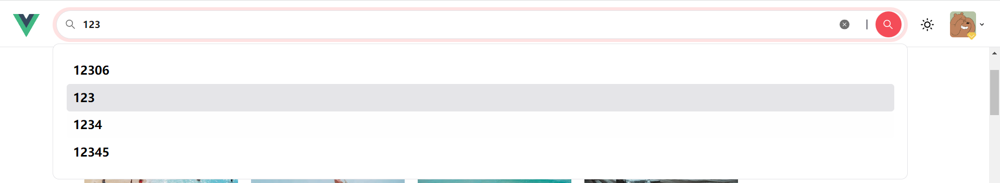

# 多组件联动与高阶组件解决方案
## 多组件联动整体逻辑分析
所谓的多组件联动，其实更准确一点来说，通常指的是：**多个组件之间，存在一个或多个共享的数据。当数据发生改变时，执行对应的逻辑**

那么把这一句话拆分开来看，就是两部分：

1. 多组件之间需要共享数据
2. 监听数据变化，并执行对应逻辑

#### 多组件之间需要共享数据
多组件之间共享数据，通常有三种方式：
1. 组件之间的数据传递 — 常见于层级关系比较清晰的多组件之中
* 父传子
* 子传父
* …
2. 依赖注入： [Provide / Inject](https://v3.cn.vuejs.org/api/composition-api.html#provide-inject) — 嵌套层级比较深，并且子组件只需要父组件的部分内容
3. 全局状态管理工具：[Vuex](https://vuex.vuejs.org/zh/index.html) — 以上两种情况都不适用的情况下

#### 监听数据变化的方式
当组件之间共享的数据发生变化时，需要执行对应的逻辑操作

那么在 `vue` 中监听数据变化的方式，首推就是 `watch`

并且在刚才已经确定了共享的数据需要被保存到 `vuex` 中，所以就需要通过 `watch` 监听到 `vuex` 中共享数据的变化，然后在监听到变化时，执行对应的业务逻辑

#### 整体逻辑分析
那么根据分析，整体实现逻辑应该为：

1. 创建共享数据对应的 vuex 模块
2. 在 `getters` 中建立对应的快捷访问计算属性
3. 在对应的业务组件中，`watch` 监听 `getters`，并执行对应逻辑
## 简单联动处理：navigationBar 对应 list


现在期望当 `navigationBar` 中的 `item` 发生切换时，切换对应的 `list` 中的展示数据，那么根据刚才的分析，切换的关键就在于：**共享数据的变化，引起的逻辑变化**

那么共享数据指的就是 **被选中项**

目前无论是 `PC端` 下还是 `移动端` 下，被选中项都是在组件内部进行处理的，这肯定不符合现在的目的。现在期望共享的数据可以在 `Vuex` 中被维护

1. 创建 `src/store/modules/app.js` ，该模块下的数据 **不会** 被缓存
```js
import { ALL_CATEGORY_ITEM } from '@/constants'

export default {
  namespaced: true,
  state: () => ({
    // 当前选中的分类
    currentCategory: ALL_CATEGORY_ITEM
  }),
  mutations: {
    /**
     * 切换选中分类
     */
    changeCurrentCategory(state, newCategory) {
      state.currentCategory = newCategory
    }
  }
}
```

2. 在 `src/store/index.js` 完成注册，注意：`app` 模块不缓存
3. 在 `src/store/getters.js` 中，提供两个快捷访问：
```js
export default {
  ...
  /**
   * category选中项
   */
  currentCategory: (state) => state.app.currentCategory,
  /**
   * category选中项下标
   */
  currentCategoryIndex: (state, getters) => {
    return getters.categorys.findIndex(
      (item) => item.id === getters.currentCategory.id
    )
  }
}
```
4. 接下来可以分别在 `PC 端 和 移动端`下触发 `changeCurrentCategory`：

`pc端 和 移动端`的逻辑代码全部要根据 Vuex 的数据需要改一改

5. 接下来可以完成对应的 `list` 逻辑操作：

在 `src/views/main/components/list/index.vue` 中
```js
...
// 请求参数
const query = ref({
  page: 1,
  size: 20,
  categoryId: 'all'
})
...
...
/**
 * 重置 qeury 请求参数
*/
const resetQuery = (newQueryObj) => {
  pexelsData.value = []
  total.value = 0
  isLoading.value = false
  isFinished.value = false

  query.value = {...query.value, ...newQueryObj}
}

watch(() => store.getters.currentCategory, (currentCategory) => {
  // 重置参数
  resetQuery({
    page: 1,
    categoryId:currentCategory.id
  })
})
```

那么至此完成了 `navigationBar` 对应 `list` 组件的联动效果

## 明确 searchBar 对应 list 处理流程
searchBar 区域目前还缺少三部分的内容处理：

* 搜索提示
* 搜索历史
* 推荐精选

所以现在处理顺序是
1. 搜索提示
2. 搜索历史
3. 推荐精选
4. `search` 触发时的 `list` 联动

### searchBar : 搜索提示的初步实现


1. 在 `src/api/pexels.js` 定义 **获取搜索提示** 接口：
```js
/**
 * 获取搜索提示
 */
export const getHint = (q) => {
  return request({
    url: '/pexels/hint',
    params: {
      q
    }
  })
}
```

2. 创建 `src/views/layout/components/header/header-search/hint.vue` 组件，作为 **搜索提示** 模块
```vue
<template>
  <div class="">
    <div
      v-for="(item, index) in hintData"
      :key="index"
      class="py-1 pl-1 text-base font-bold text-zinc-500 rounded cursor-pointer duration-300 hover:bg-zinc-200 dark:hover:bg-zinc-900"
      @click="onItemClick(item)"
    >
      {{ item }}
    </div>
  </div>
</template>

<script>
const EMITS_ITEM_CLICK = 'itemClick'
</script>

<script setup>
import { getHint } from '@/api/pexels'
import { ref, watch } from 'vue'

/**
 * 接收搜索数据
 */
const props = defineProps({
  searchText: {
    type: String,
    required: true
  }
})
/**
 * item 被点击触发事件
 */
const emits = defineEmits([EMITS_ITEM_CLICK])

/**
 * 处理搜索提示数据获取
 */
const hintData = ref([])
const getHintData = async () => {
  if (!props.searchText) return
  const { result } = await getHint(props.searchText)
  hintData.value = result
}
/**
 * 监听搜索文本的变化，并获取对应提示数据
 */
watch(() => props.searchText, getHintData, {
  immediate: true
})

/**
 * item 点击事件处理
 */
const onItemClick = (item) => {
  emits(EMITS_ITEM_CLICK, item)
}
</script>
```
3. 在 `src/views/layout/components/header/header-search/index.vue` 中展示并做对应处理

```vue
<template>
  <div class="w-full">
    <m-search
      v-model="inputValue"
      @search="onSearchHandler"
      @clear="onSearchHandler"
    >
      <template #dropdown>
        <div>
          <!-- 搜索提示 -->
          <hint-vue
            :searchText="inputValue"
            v-show="inputValue"
            @itemClick="onSearchHandler"
          ></hint-vue>
        </div>
      </template>
    </m-search>
  </div>
</template>

<script setup>
import { ref } from 'vue'
import hintVue from './hint.vue'

const inputValue = ref('')

// 搜索的回调事件
const onSearchHandler = (val) => {
  inputValue.value = val
}

</script>
```
### searchBar ：处理 防抖 功能
不过这样的防抖 `watch` 不需要自己进行实现，`vueuse` 中提供了对应的 [watchDebounced（源码地址）](https://vueuse.org/shared/watchDebounced/) ，可以直接利用这个 `API` 直接实现防抖的 `watch`

```js
/**
 * 监听搜索文本的变化，并获取对应提示数据
 */
watchDebounced(() => props.searchText, getHintData, {
  immediate: true,
  // 每次事件触发时，延迟的时间
  debounce: 500
})
```
### searchBar ：提示关键字高亮处理
在处理完成防抖之后，还期望提示列表中所有文本的关键字可以进行对应的**高亮**显示。

那么对于这样的功能，就需要构建对应的方法，生成包含 **高亮标签** 的 `html` 富文本。利用该富文本，替换原 `text` 文本。

所以需要首先构建出对应的方法：

```js
/**
 * 处理关键字高亮
 */
const highlightText = (text) => {
  // 生成高亮标签
  const highlightStr = `<span class="text-zinc-900 dark:text-zinc-200">${props.searchText}</span>`
  // 构建正则表达式，从《显示文本中》找出与《用户输入文本相同的内容》，使用《高亮标签》进行替换
  const reg = new RegExp(props.searchText, 'gi')
  // 替换
  return text.replace(reg, highlightStr)
}
```
通过 `v-html` 代替 `text` 渲染：
```html
<div
  ...
  v-html="highlightText(item)"
  @click="onItemClick(item)"
></div>
```

### searchBar：搜索历史处理


每次用户触发搜索时，当前的这次 **搜索文本** 会被作为 **搜索历史** 进行处理

因为搜索历史的数据需要进**行本地的持久化处理**，所以我们需要把该数据放入到 `vuex` 中。

同时提供对应的：

* 插入
* 删除单个
* 清空
的三个 `mutation`

1. 创建 `src/store/modules/search.js` 模块：
```js
export default {
  namespaced: true,
  state: () => ({
    histories: []
  }),
  mutations: {
    /**
     * 1. 新增的历史记录位于头部
     * 2. 不可出现重复的记录
     */
    addHistory(state, newHistory) {
      const isFindIndex = state.histories.findIndex(
        (item) => item === newHistory
      )
      // 剔除旧数据
      if (isFindIndex !== -1) {
        state.histories.splice(isFindIndex, 1)
      }
      // 新增记录
      state.histories.unshift(newHistory)
    },
    /**
     * 删除指定数据
     */
    deleteHistory(state, index) {
      state.histories.splice(index, 1)
    },
    /**
     * 删除所有历史记录
     */
    deleteAllHistory(state) {
      state.histories = []
    }
  }
}
```
2. 在 `src/store/index.js` 完成注册, 并且需要做**缓存**处理

3. 在 `src/store/getters.js`中完成对应的快捷访问

4. 创建搜索历史的处理组件 `src/views/layout/components/header/header-search/history.vue`：
```vue
<template>
  <div>
    <div class="flex items-center">
      <span class="text-sm dark:text-zinc-400">最近搜索</span>
      <m-svg-icon 
        name="delete"
        class="w-2.5 h-2.5 p-0.5 hover:bg-zinc-100 dark:hover:bg-zinc-500 ml-1 duration-200 cursor-pointer rounded-sm"
        fillClass="fill-zinc-400"
        @click.stop="deleteAllItems"
      ></m-svg-icon>  
    </div>
    <div class="flex my-1" v-if="$store.getters.histories !== []">
      <template v-for="item,index in $store.getters.histories" :key="index">
        <div class="bg-zinc-100 dark:bg-zinc-400 dark:hover:bg-zinc-500 flex items-center cursor-pointer hover:bg-zinc-200 rounded-sm 
          px-1 py-0.5 duration-200 mr-1 mb-1"
          @click="itemClick(item)"
          >
          <span class="text-sm font-bold">{{item}}</span>
          <m-svg-icon
            name="input-delete"
            class="w-2.5 h-2.5 p-0.5 ml-1 duration-300 rounded-sm  dark:bg-zinc-400 hover:bg-zinc-100
              dark:hover:bg-zinc-700"
            @click.stop="deleteItem(index)"
          ></m-svg-icon>
        </div>
      </template>
    </div>
  </div>
</template>
<script>
const EMITS_ITEM_CLICK = 'itemClick'
</script>
<script setup>
import { useStore } from 'vuex'

const emits = defineEmits([EMITS_ITEM_CLICK])

const store = useStore()

// 点击了某一个搜索历史 , 触发事件
const itemClick = (item) => {
  console.log('点击了搜索历史')
  emits(EMITS_ITEM_CLICK, item)
}

// 删除一个搜索历史
const deleteItem = (index) => {
  console.log('删除搜索历史')
  store.commit('search/deleteHistory', index)
}

// 清空搜索历史
const deleteAllItems = () => {
  // TODO : 弹出对话框提示, 是否全部删除
  console.log('删除全部')
  store.commit('search/deleteAllHistory')
}
</script>
```

5. 在 `src/views/layout/components/header/header-search/index.vue` 中使用该组件：
```vue{10-11}
<template>
  <div class="w-full">
    <m-search v-model="inputValue"
      @search="onSearchHandler"
    >
      <template #dropdown>
        <!--搜索提示-->
        <hint-vue :searchText="inputValue" @itemClick="hintClickHandler" v-if="inputValue"></hint-vue>
        <div v-else>
          <!--搜索历史-->
          <history-vue v-if="!inputValue" @itemClick="onSearchHandler"></history-vue>
        </div>
      </template>
    </m-search>
  </div>
</template>
```

