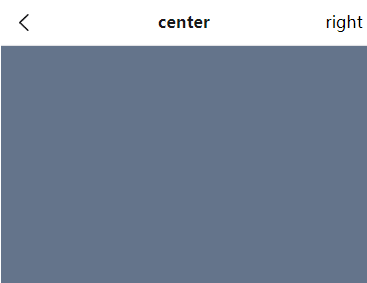

# 高阶路由过渡处理方案 - 浏览器堆栈主动介入
通过 `vue-router` 的过渡动效是无法实现期望的路由切换效果的


所谓路由的跳转无非指的是两个部分：

1. 浏览器的 `url` 发生了变化
2. 浏览器中展示的页面组件发生了变化

那么只要满足这两点，就认为 **路径进行了跳转**

所以说，是不是可以换个思路，**不去进行真实的路由跳转** ，而是 **先修改浏览器的 URL ，再切换展示的页面（以组件的形式覆盖整个浏览器可视区域）** 。这样对于用户而言，就完成了整个的路由跳转工作

所以说具体问题就变成了：

1. 如何让浏览器的 `url` 发生变化，但是不跳转页面
2. 如何让一个新的组件以包含动画的形式进行展示

那么想要完成第一个功能可以使用：[History.pushState()](https://developer.mozilla.org/zh-CN/docs/Web/API/History/pushState) 方法

而第二个功能可以使用 [GSAP](https://github.com/greensock/GSAP) 这个动画库来进行实现

## 主动介入浏览器堆栈管理
可以通过 [History.pushState()](https://developer.mozilla.org/zh-CN/docs/Web/API/History/pushState) 方法，来修改浏览器的 `url` ，并且**不让浏览器发生对应的跳转**

1. 在 `src/views/main/components/list/item.vue` 中，添加 `div` 点击事件：
```js
...
const emits = defineEmits(['click'])

/**
 * 进入详情点击事件
 */
const onToPinsClick = () => {
  emits('click', {
    id: props.item.id
  })
}
```

2. 在 `src/views/main/components/list/index.vue` 中，监听对应的点击事件，并修改对应路由：
```js
// 监听 item 组件传的图片 id , 改变 url 地址
const onToPins = (obj) => {
  // console.log(obj.id)
  // 使用history api 的 pushState, 不刷新页面改变 url 地址
  window.history.pushState(null, null, obj.id )
}
```

## 基于 GSAP 实现高阶路由过渡动画分析
当 `url` 发生变化之后，接下来就只需要处理对应的动画就可以了

动画的处理依赖于 [GSAP](https://github.com/greensock/GSAP) 进行实现。对于 `GSAP` 而言，主要依赖两个方法：

1. [gsap.set()](https://greensock.com/docs/v3/GSAP/gsap.set()) ：这个方法通常使用在动画开始之前，表示设置动画开始前的元素属性
2. [gsap.to()](https://greensock.com/docs/v3/GSAP/gsap.to())：这个方法表示 **最终元素展示的状态**
`GSAP` 会基于 `set` 和 `to` 的状态，来自动执行中间的补间动画。

所以只需要：

1. 创建一个对应的组件，使用 `transition` 进行包裹
2. 计算出 `set` 时，组件元素对应的样式属性 (这里主要处理的是位置信息, 图片中心的位置.., 下同)
3. 计算出 `to` 时，组件元素对应的样式属性

然后就可以由 `GSAP` 自动实现对应的补间动画了
### 基于 GSAP 实现高阶路由过渡动画处理
1. 创建 `src/views/pins/index.vue` 组件，该组件的作用之后再说

2. 创建 `src/views/pins/components/pins.vue` 组件，该组件即为详情组件，在该组件中写入一些初始内容
```vue
<template>
  <div class="fixed left-0 top-0 w-screen h-screen text-xl bg-slate-500 z-20">
    {{ id }}
  </div>
</template>

<script setup>
defineProps({
  // 图片的 id
  id: {
    type: String,
    required: true
  }
})
</script>
```
3. 在 `src/views/main/components/list/index.vue` 中使用 `pins` 组件，并使用 `transition` 进行包裹，并利用 [JavaScript 钩子](https://v3.cn.vuejs.org/guide/transitions-enterleave.html#javascript-%E9%92%A9%E5%AD%90) 绑定对应的三个状态，并添加 `css="false"`

```html
<!-- 大图详情处理 -->
<transition :css="false" @before-enter="beforeEnter" @enter="enter" @leave="leave">
  <pins-vue v-if="isVisiblePins" :id="currentPins.id" />
</transition>
```

4. 修改对应的 `onToPins` 方法
```js
...
    <item-vue :item="item" :width="width" @click="onToPins"></item-vue>
...
<!--pins 图片详情页面-->
<transition :css="false" @before-enter="beforeEnter" @enter="enter" @leave="leave">
  <pins-vue v-if="isPinsVisible" :id="currentPins.id"></pins-vue>
</transition>
....

// 点击的 pins 的数据
const currentPins = ref({})
// pins 页面的显示/隐藏
const isPinsVisible = ref(false)

// 监听 item 组件传的图片 id , 改变 url 地址
const onToPins = (obj) => { // { 图片id , 图片中央位置信息 } 对象
  currentPins.value = obj
  isPinsVisible.value = true
  // 使用history api 的 pushState, 不刷新页面改变 url 地址
  window.history.pushState(null, null, `/pins/${obj.id}`)

  //img的中间位置 x,y
  console.log(obj.imgCenterInfo.value)
}
```

5. 那么此时点击即可展示出对应的 `pins` 组件

接下来缺少的就是对应的动画内容

1. 在 `src/views/main/components/list/item.vue` 中，记录点击时当前 `item` 图片的中心位置，该位置即为**动画的起点**，此处将使用到 [useElementBounding](https://vueuse.org/core/useElementBounding/) 方法, 把得到的位置信息传递到外面

因为要做动画的话, 需要的是每张图片中心点的位置信息, 在编写 gsap 函数的时候会使用到位置信息
```js
// 点击进入详情页面, 给父组件传 id
const onToPinsClick = () => {
  console.log('item 中点击了图片详情') 
  // 使用 useElementBounding 拿到图片的位置信息
  const { x, y, width, height } = useElementBounding(imgRef)

  // 图片中心的位置信息
  const imgCenterInfo = computed(() => {
    return {
      x: parseInt(x.value + (width.value / 2)),
      y: parseInt(y.value + (height.value / 2))
    }
  })
  emits('click', {
    id: props.item.id,  // 图片 id
    imgCenterInfo       // 图片中间位置信息 x,y
  })
} 
```

2. 安装 `GSAP`:
```shell
npm i --save gsap@3.9.1
```

3. 在 `src/views/main/components/list/index.vue` 中，填充三个 `transition` 钩子：
```js
import gasp from 'gsap'
const beforeEnter = (el) => {
  gsap.set(el, {
    scaleX: 1,
    scaleY: 1,
    transformOrigin: '0 0',

    opacity: 0
  })
}
const enter = (el, done) => {
  gsap.to(el, {
    duration: 0.3,
    scaleX: 1,
    scaleY: 1,
    opacity: 1,
    translateX: 0,
    translateY: 0,
    onComplete: done
  })
}
const leave = (el, done) => {
  gsap.to(el, {
    duration: 0.3,
    scaleX: 0,
    scaleY: 0,
    x: currentPins.value.imgCenterInfo?.x,
    y: currentPins.value.imgCenterInfo?.y,
    opacity: 0
  })
}
```
那么此时可以实现 `item` 点击的跳转动画

此时可以监听浏览器的 **后退** 事件，在点击后退时，关闭 `pins`
```js
window.addEventListener('popstate', () => {
  isPinsVisible.value = false
})
```

## 通用组件：navbar 构建方案分析
移动端中，则会展示对应的 `navbar` 的内容，所以我们首先先构建出 `navbar` 通用组件，然后在基于 `navbar` 构建对应的 `pins` 样式

那么对于 `navbar` 而言：

1. 它分为 **左、中、右** 三个大的部分，三个部分都可以通过插槽进行指定
2. **左、右** 两边的插槽可以 **自定义点击事件**
3. 同时 `navbar` 有时候会存在**吸顶**的效果，所以最好还可以通过一个 `prop` 指定对应的吸顶展示
### 构建 navbar


1. 创建 `src/libs/navbar/index.vue`通用组件，并构建对应的 `props：``
```js
const props = defineProps({
  // 是否吸顶
  sticky: {
    type:Boolean
  }
})
```

2. 创建 `template：`
```vue
<template>
  <div 
    class="flex items-center h-5 w-full bg-white dark:bg-zinc-800 border-b border-b-zinc-200 dark:border-b-zinc-700"
    :class="[sticky ? 'sticky left-0 top-0' : 'relative']"
    >
    <!--左-->
    <div class="absolute left-0 top-0 h-full w-5 flex items-center justify-center text-base"
      @click="onClickLeft"  
    >
      <slot name="left">
        <m-svg-icon
          name="back"
          class="w-2 h-2"
          fillClass="fill-zinc-900 dark:fill-zinc-200"
        />
      </slot>
    </div>
    <!--中-->
    <div class="h-full flex items-center justify-center m-auto font-bold text-base text-zinc-900 dark:text-zinc-200">
      <slot name="center"></slot>
    </div>
    <!--右-->
    <div class="absolute right-0 top-0 h-full flex items-center w-5 justify-center text-base"
      @click="onClickRight"
    >
      <slot name="right"></slot>
    </div>
  </div>
</template>
<script setup>
import { useRouter } from 'vue-router'
const props = defineProps({
  // 是否吸顶
  sticky: {
    type:Boolean
  }
})
const emits = defineEmits(['clickLeft', 'clickRight'])
const router = useRouter()
const onClickLeft = () => {
  console.log('点击了 左测区域')
  emits('clickLeft')
  // 后退
  router.back()
}

const onClickRight = () => {
  console.log('点击了 右测区域')
  emits('clickRight')
}
</script>
```
## 基于 navbar 处理响应式的 pins 页面
1. 在 `src/api/pexels.js` 中定义对应接口：
```js
/**
 * 获取指定图片数据
 */
export const getPexelsFromId = (id) => {
  return request({
    url: `/pexels/${id}`
  })
}
```

2. 在 `src/views/pins/components/pins.vue` 中，获取 `pexel` 详细数据：
```js
import { ref } from 'vue'
import { getPexelsFromId } from '@/api/pexels'

const pexelData = ref({})
/**
 * 获取详情数据
 */
const getPexelData = async () => {
  const data = await getPexelsFromId(props.id)
  pexelData.value = data
}
getPexelData()
```

3. 构建对应的 `template`：
```vue
<template>
  <div
    class="fixed left-0 top-0 w-screen h-screen z-20 backdrop-blur-4xl bg-transparent pb-2 overflow-y-auto xl:p-2"
  >
    <!-- 移动端下展示 navbar -->
    <m-navbar v-if="isMobileTerminal" @clickLeft="onPop" @clickRight="onPop">
      {{ pexelData.title }}
      <template #right>
        <m-svg-icon
          name="share"
          class="w-3 h-3"
          fillClass="fill-zinc-900 dark:fill-zinc-200"
        ></m-svg-icon>
      </template>
    </m-navbar>
    <!-- pc 端下展示关闭图标 -->
    <m-svg-icon
      v-else
      name="close"
      class="w-3 h-3 ml-1 p-0.5 cursor-pointer duration-200 rounded-sm hover:bg-zinc-100 absolute right-2 top-2"
      fillClass="fill-zinc-400"
      @click="onPop"
    ></m-svg-icon>

    <div class="xl:w-[80%] xl:h-full xl:mx-auto xl:rounded-lg xl:flex">
      
      <div
        class="xl:w-2/5 xl:h-full xl:bg-white xl:dark:bg-zinc-900 xl:rounded-tr-lg xl:rounded-br-lg xl:p-3"
      >
        <div v-if="!isMobileTerminal" class="flex justify-between mb-2">
          <m-svg-icon
            name="share"
            class="w-4 h-4 p-1 cursor-pointer hover:bg-zinc-200 dark:hover:bg-zinc-800 duration-300 rounded"
            fillClass="fill-zinc-900 dark:fill-zinc-200"
          ></m-svg-icon>

          <m-button
            class=""
            type="info"
            icon="heart"
            iconClass="fill-zinc-900 dark:fill-zinc-200"
          />
        </div>
        <!-- 标题 -->
        <p
          class="text-base text-zinc-900 dark:text-zinc-200 ml-1 font-bold xl:text-xl xl:mb-5"
        >
          {{ pexelData.title }}
        </p>
        <!-- 作者 -->
        <div class="flex items-center mt-1 px-1">
          
          <span class="text-base text-zinc-900 dark:text-zinc-200 ml-1">{{
            pexelData.author
          }}</span>
        </div>
      </div>
    </div>
  </div>
</template>
```

4. 在 `tailwind.config.js` 中指定更大的毛玻璃效果
```js
backdropBlur: {
  '4xl': '240px'
}
```

5.  处理对应的关闭事件：
```js
/**
 * 关闭按钮处理事件
 */
const router = useRouter()
const onPop = () => {
  router.back()
}
```
此时整个的 `pins` 展示无论是在 `移动端` 还是 `PC 端` 均已完成
## 处理刷新空白问题
通过 `pushState` 跳转到了一个新的 `url`，并且通过 `transition` 进行了 `pins` 展示的动画处理。但是我们发现了一个问题，那就是只要在 pins 展示的时候，刷新页面，那么整个页面会变成空白, 同时控制台会抛出一个警告那就是 `No match found for location with path` ，表示 **路由无法被找到**

(如果使用了 `hash` 模式 , 就没有这样的问题, 这个项目使用的是 `history` 模式)

愿意就是现在还没有对应的 `/pins/:id` 的路由

1. 在 `src/router/modules/pc-terminal-routes.js` 中新增路由
```js
{
  path: '/pins/:id',
  name: 'pins',
  component: () => import('@/views/pins/index.vue')
},
```

2. 在 `src/router/modules/mobile-terminal-routes.js` 中新增路由：
```js
{
  path: '/pins/:id',
  name: 'pins',
  component: () => import('@/views/pins/index.vue')
},
```
3. 在 `src/views/pins/index.vue` 中，渲染 `pins` 组件 ：
```vue
<template>
  <div class="w-full h-full bg-zinc-200 dark:bg-zinc-800">
    <pins-vue :id="$route.params.id" />
  </div>
</template>

<script setup>
import pinsVue from './components/pins.vue'
</script>
```

即可解决刷新空白的问题