# 搭建
## 通过 Vite 构建项目
::: tip
兼容性注意

Vite 需要 Node.js 版本 >= 12.0.0
:::

在 vite 下载完成之后，通过以下流程来构建一个 vite 项目

1. 创建一个项目
```shell
npm init vite@latest
```
2. 如果没有安装过 vite@latest，那么则会提示进行安装，选择 y 即可
```shell
Need to install the following packages:
  create-vite@latest
Ok to proceed? (y) y
```
3. 选配置, 创建项目 

4. 项目创建完成之后，依次执行三个指令即可
```
cd imooc-front
npm install   
npm run dev
```

5. 如果你期望你的项目可以显示 Network 的路径，那么可以到 package.json 中，修改 dev 指令
```json
"dev": "vite --host"
```
## 安装 tailwindcss 和 sass
#### **tailwindcss 的价值体现**
 `tailwindcss` 中一个非常核心的内容就是： 每一个类名都代表了一个 `css` 属性 ，这个样式在 `tailwindcss` 中被称作为 **原子化 CSS**

&emsp;&emsp;对于 **高定制化、高个性化、高交互性** 的前台应用而言， **通用组件库** 这种普适的组件系统是很难满足对应需求的。那么这也就意味着我们无法借助现有的样式，而需要 **手动** 写入大量的 css 样式和动画。

&emsp;&emsp;因为这个项目中，包含 **响应式 和 主题更换** ，而这两种功能如果想要通过 **传统形式** 来进行实现的话，是比较复杂的。因为这意味着我们需要定义大量的 **媒体查询 和 主题类名**

&emsp;&emsp;所以综上所述，在 **高定制化、高个性化、高交互性** 的前台应用中， **原子化 `CSS`** 是最合适的一种形式。而这种形式的具体体现就是 **`tailwindcss`**

#### 安装 tailwindcss
[tailwindcss官网 https://tailwindcss.com/docs/installation](https://tailwindcss.com/docs/installation)

1. 在我们的项目中执行 `npm install -D tailwindcss@3.0.23 postcss@8.4.8 autoprefixer@10.4.2` ，安装 `tailwindcss`

2. 执行 `npx tailwindcss init -p` 创建 `tailwind.config.js` 文件，该文件为 `tailwindcss` 的配置文件，该文件默认内容为：

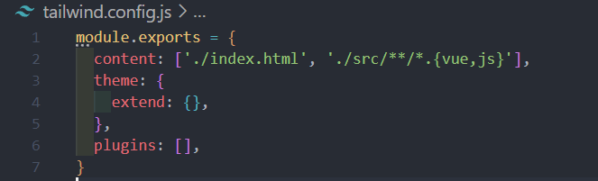

3. 接下来需要添加 模板路径（tailwind 的应用范围）

4. 在 `tailwind.config.js` 文件中的 `content` 选项下，写入如下内容：
```js
module.exports = {
  // Tailwind 应用范围
  content: ['./index.html', './src/**/*.{vue,js}'],
	...
}
```
5. 接下来需要添加一些 tailwind 的指令

6. 创建 `src/styles/index.scss` 文件，并写入如下代码：
```css
// 导入 tailwind 的基础指令组件
@tailwind base;
@tailwind components;
@tailwind utilities;  
```
7. 然后在 `src/main.js` 中引入该 `index.scss`

8. 因为我们使用了 `scss` ，所以需要安装 `sass` ，执行 `npm i -D sass@1.45.0` 安装 sass

9. 此时 `tailwind` 已经安装到我们的项目中

10. 我们可以在 `src/App.vue` 中为 `img` 标签增加一个 `class="bg-red-900"`
```html
  
```
11. 查看项目 img 标签背景变为红色，则表示成功


## 搭建基础项目结构
&emsp;&emsp;前面已经使用了 `Vite` 搭建了项目, 并且引入了 `tailwindcss`

接下来主要需要构建项目的基础架构，其中包括：

1. VS Code 辅助插件安装
2. 项目基础结构路由分析
3. 路由表划分
4. 项目架构搭建
5. ...
### 项目开发助手 Prettier - Code formatter 、 Tailwind CSS IntelliSense、Volar

#### Prettier - Code formatter
1. 在 VSCode 的扩展中，安装插件 Prettier - Code formatter
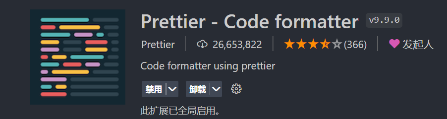

2. 然后需要在 **项目根目录** 之中创建 `.prettierrc`并且写入如下内容：
```
{
  // 代码结尾不加分号
  "semi": false,
  // 优先单引号
  "singleQuote": true,
  // 不添加尾随逗号
  "trailingComma": "none"
}
```
3. 在 `.vue` 文件、`.js` 文件中，鼠标右键，**选择 使用…格式化文档**, 选择 **配置默认格式化程序**, 选择 `prettier`
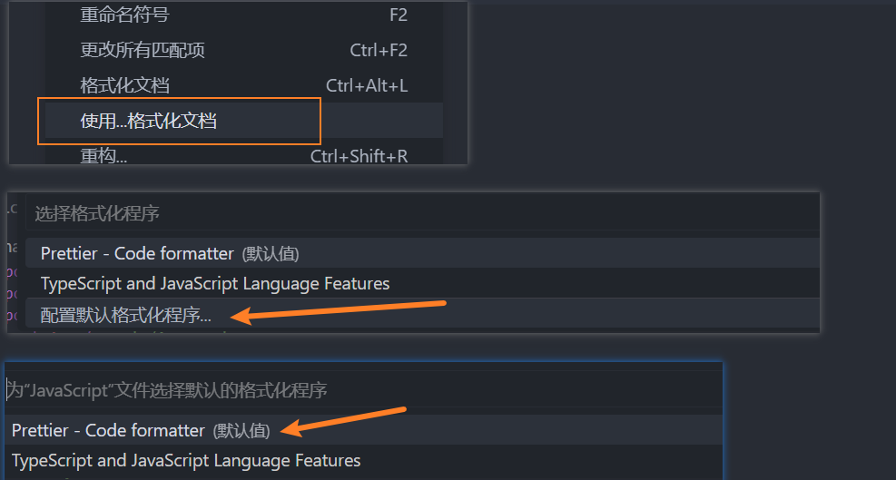

4. 如果你希望在 **保存代码** 时，自动格式化代码内容，则可以在 设置 中勾选 `format on save`
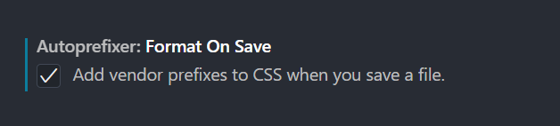
#### Tailwind CSS IntelliSense
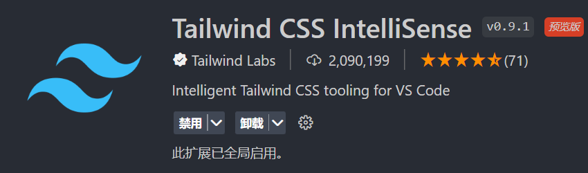

安装成功之后，此时只需要在：**元素的 class 中，先按下《空格》，然后输入任意的 tailwind 类名，则可得到对应提示**
#### Volar
Volar 全名是 `Vue Language Features (Volar)` ，是一个专门的 vue3 辅助插件

这个插件不需要做什么特殊的处理，只需要安装即可
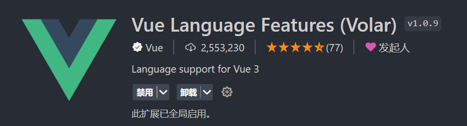


### 项目架构基本结构处理分析
&emsp;&emsp;这个项目分为 **移动端** 和 **PC端** 两种显示结果，但是这两种显示结果通过同一套代码进行实现，也就是所谓的 **响应式** 构建方案。那么在分析的时候就需要分别分析（此处只分析大的路由方案，目的是对基本的项目结构有一个初步的认识，以方便项目结构处理，后续具体的细节构建方案不在这次分析行为之内）

1. 移动端结构
2. PC 端结构

然后把这两种的分析方案，合并到一起，组成一个最终的架构方案

#### 移动端结构分析
移动端的结构相对比较简单，当我们去进行路由跳转时，它是以 **整个页面进行的整体路由切换** 

那么由此可知，**移动端** 不存在 嵌套路由的概念，只需要在 `APP.vue` 中保留 **一个路由出口** 即可

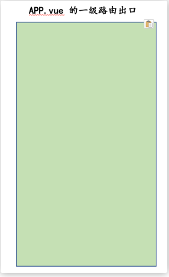
#### PC 端结构分析
而 PC 端的结构相对比较复杂，如下图所示

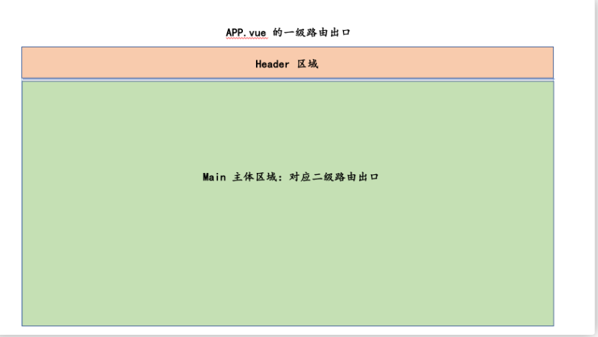

需要通过 **两个路由出口** 进行表示：

1. App.vue: 一级路由出口，用作整页路由切换
2. Main.vue：二级路由出口，用作局部路由切换

&emsp;&emsp;由此可知, **移动端** 和 **PC 端** 两者的路由结构是不同的，所以这就要求我们需要根据 **当前用户所在设备的不同，构建不同的路由表** 


**项目在不同设备中，需要具备不同的路由结构**，所以我们就需要生成 **多个路由表** 来应对不同的情况。
### 构建项目架构
先安装这两个插件：
```shell
npm i --save vuex@4.0.2 vue-router@4.0.14
```

然后去处理项目基本架构，最终架构如下（部分省略）
```js
├── src
│   ├── App.vue // 项目根组件，一级路由出口
│   ├── api // 接口请求
│   ├── assets // 静态资源
│   │   ├── icons // svg icon 图标
│   │   ├── images // image 图标。比如:xxx.png
│   │   └── logo.png // logo
│   ├── components // 通用的业务组件。比如：一个组件在多个页面中使用到
│   ├── constants // 常量
│   ├── directives // 自定义指令
│   ├── libs // 通用组件，可用于构建中台物料库或通用组件库
│   ├── main.js // 入口文件
│   ├── permission.js // 页面权限控制中心
│   ├── router // 路由
│   │   ├── index.js // 路由处理中心
│   │   └── modules // 路由模块
│   │       ├── mobile-routes.js // 移动端路由
│   │       └── pc-routes.js // PC 端路由
│   ├── store // 全局状态
│   │   ├── getters.js // 全局状态访问处理
│   │   ├── index.js // 全局状态中心
│   │   └── modules // 状态子模块
│   ├── styles // 全局样式
│   │   └── index.scss // 全局通用的样式处理
│   ├── utils // 工具模块
│   ├── vendor // 外部供应资源。比如：人类行为认证
│   └── views // 页面组件。与 components 的区别在于：此处组件对应路由表，以页面的形式展示
│       └── layout // 用于 PC 端，分割一级路由和二级路由
│           ├── components // 该页面组件下的业务组件
│           └── index.vue // layout 组件
├── tailwind.config.js // wailwind css 配置文件，与 src 平级
└── vite.config.js // vite 配置文件，与 src 平级
```
## vite配置方案
### 明确移动端和 PC 端的构建顺序
因为这个项目是使用的 `tailwindcss` 作为样式处理的核心库，所以我们的 **构建顺序** 需要尊重 `tailwindcss` **的构建顺序** 的。

那么在 tailwind 中，有 [这样](https://tailwindcss.com/docs/responsive-design#mobile-first) 一段内容：

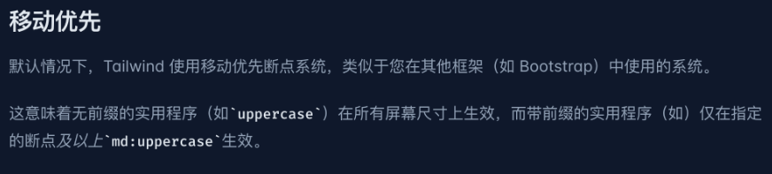

就是 **移动优先** 的原则

也就是说，使用 `tailwind` 构建 **响应式系统时**，需要 **先构建移动端，再构建 PC 端**  

### 构建移动处理工具 isMobileTerminal
如何判断当前的设备是移动设备呢？

为什么达到这个目的，就需要先去构建出咱们的第一个工具方法：`isMobileTerminal` ，该方法将返回一个 `boolean` 形的数据，如果为 `true` 则表示当前所在为 **移动端**，如果为 `false` 则表示当前为 **PC 端**

那么根据之前的 **构建方案** ，所有的工具方法需要被放入到 `utils` 中，所以下面首先需要在 `utils` 中创建一个 工具类 `flexible.js` ，在该方法中规定 **屏幕宽度 < 1280 则为移动设备** ，并且为了保证这个方法的灵活性，可以让它称为一个 **计算属性** ，所以得出如下代码：


utils/flexible.js
```js
import { computed } from 'vue'
import { PC_DEVICE_WIDTH } from '../constants'

/**
 * 判断当前是否为移动设备，判断依据为屏幕的宽度是否大于指定值（1280）
 */
export const isMobileTerminal = computed(() => {
  return document.documentElement.clientWidth < PC_DEVICE_WIDTH
})
```

src/constants/index.js
```js
// PC 设备指定宽度
export const PC_DEVICE_WIDTH = 1280
```

src/App.vue
```vue
<template>
  <div>{{ isMobileTerminal }}</div>
</template>

<script setup>
import { isMobileTerminal } from './utils/flexible'
</script>

<style lang="scss" scoped></style>
```

此时当切换浏览器设备时，就可以得到对应的判断结果。

**注意**： 因为要在后面进行 **响应式的视图处理** 所以此处通过 **宽度** 进行移动端判断！！！！

在实际开发中更建议通过以下代码来进行
::: details
```js
/**
 * 判断当前是否为移动设备
 */
export const isMobileTerminal = computed(() => {
  return /Android|webOS|iPhone|iPad|iPod|BlackBerry|IEMobile|Opera Mini/i.test(
     navigator.userAgent
  )
})
``` 
:::
### 通过 vueuse 优化处理方案
对于 `isMobileTerminal` 方法，此时还存在一个问题，那就是当我们切换浏览器设备时，它的结果并 **不是响应式** 的，这种让计算属性显得毫无意义了

那么为什么会这样呢？

对于计算属性而言，它会在 **依赖的响应式数据发生变化时**，重新计算。但是现在以来的 `document.documentElement.clientWidth` 并非响应式数据，所以 **计算属性无法发生重新计算**

那么要怎么做呢？

在这里需要给使用一个新的库 [vueuse](https://vueuse.org/),  `vueuse` 是一个 **vue 的工具类库** 。它内部提供了很多的方法，可以帮助进行很多的便捷操作

比如说 [useWindowSize](https://vueuse.org/core/useWindowSize/) 这个方法，这个方法会给我们返回一个 **响应式** 的页面宽高，那么就可以利用这个响应式数据实现 `isMobileTerminal`


1. 安装 vueuse
```shell
npm i @vueuse/core@8.1.2
```

2. 在 `src/utils/flexible.js` 中使用 `useWindowSize` 方法, 利用 `width` 计算 `isMobileTerminal`
```js
import { computed } from 'vue'
import { PC_DEVICE_WIDTH } from '../constants'
import { useWindowSize } from '@vueuse/core'

const { width } = useWindowSize()

// 判断当前是否为移动设备, 判断依据为 屏幕的宽度是否小于指定值(1280)
export const isMobileTerminal = computed(() => {
  return width.value < PC_DEVICE_WIDTH
})
```

### 定义 @ 软链接
在 webpack 中可以直接通过 @ 符号表示 src 路径，但是在 vite 默认是不可以的。

如果修改 constants 的导入路径为
```js
import { PC_DEVICE_WIDTH } from '@/constants'
```
那么则会得到错误

vite 默认不支持 `@` 软链接

vite 提供了 [resolve.alias](https://cn.vitejs.dev/config/#resolve-alias) 功能，表示：**通过别名在指向一个具体的路径**

在 `vite.config.js` 中
```js
import { join } from 'path'

export default defineConfig({
  plugins: [vue()],
  // 软链接
  resolve: {
    alias: {
      '@': join(__dirname, '/src')
    }
  }
})
```

此时，重启项目，该错误消失
### 构建 VueRouter 移动端路由表
那么到现在已经有了 `isMobileTerminal` 方法，那么接下来就可以利用这个方法处理 **移动端路由表**，不过在处理该路由表之前还需初始化咱们的 vue-router

1. 在 `src/router/index.js` 中初始化 VueRouter
```js
import { createRouter, createWebHistory } from 'vue-router'
import { isMobileTerminal } from '@/utils/flexible'
import mobileTerminalRoutes from './modules/mobile-routes'
import pcTerminalRoutes from './modules/pc-routes'

// 创建 vueRouter 实例
const router = createRouter({
  history: createWebHistory(),
  routes: isMobileTerminal.value ? mobileTerminalRoutes : pcTerminalRoutes
})

export default router
```

2. 在 `src/router/modules/mobile-routes.js` 构建移动端路由表
```js
export default [
  {
    path: '/',
    name: 'home',
    component: () => import('@/views/main/index.vue')
  }
]
```
3. 在 `src/router/modules/pc-routes.js` 构建 PC 端路由表
```js
export default []
```
4. 在 `src/main.js` 中，注册 VueRouter
```js
import router from './router'
createApp(App).use(router).mount('#app')
```
5. 在 src/App.vue 中写入 **一级路由出口**
```vue
<template>
  <!-- 一级路由出口 -->
  <router-view></router-view>
</template>
```
6. 创建首页组件 `src/views/main/index.vue` ，并且写入如下内容
```vue
<template>
  <div>这是首页内容</div>
</template>
<script setup></script>
```
此时移动端初始路由表构建完成，在 **移动端下**，可访问 `Home` 组件

### 划分移动端首页模块
移动端首页模块总共可分为三部分：

1. 顶部的 `navigationBar`


2. 中间的列表内容

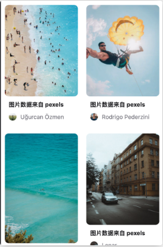

3. 底部的 tabbar


那么首先要开发的就是 **顶部的 navigationBar** 部分

而对于该部分又可以分为三块内容：
* `navigator` 列表：
* 右侧汉堡按钮：
* 点击汉堡按钮展示的 `popup` 弹出层

那么明确好这些内容之后，接下来就可以按照这个顺序进行依次开发。

下面首先创建 移动端的 `navigation` 模块

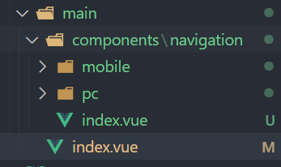


1. 创建 `src/views/main/components/navigation/mobile/index.vue` 组件, 也为 PC端 在mobile平级中 pc/index.vue 创建一个 
```vue
<template>
  <div>移动端下的 navigation</div>
</template>
```

2. 创建 `src/views/main/components/navigation/index.vue` 组件，为 **控制移动端和 PC 端**的 navigation 展示组件
```vue
<template>
  <mobile-navigation-vue v-if="isMobileTerminal" />
</template>

<script setup>
import { isMobileTerminal } from '@/utils/flexible'
import mobileNavigationVue from './mobile/index.vue'
</script>
```

3. 在 `src/views/main/index.vue` 中导入该组件
```vue
<template>
  <div>
    <navigation-vue></navigation-vue>
  </div>
</template>

<script setup>
import navigationVue from './components/navigation/index.vue'
</script>
```
### 导入并配置 axios
在有了 `navigation` 组件之后，接下来就可以尝试 **获取数据，渲染数据** 了

那么想要获取数据，要使用 `axios`


1. 安装 `axios` 依赖
```shell
npm install axios
```

2. 创建 `src/utils/request.js`
```js
import axios from 'axios'

const service = axios.create({
  baseURL: 'https://api.imooc-front.lgdsunday.club/api',
  timeout: 5000
})

export default service
```

3. 创建请求接口 `src/api/category.js`
```js
import request from '@/utils/request'

/**
 * 获取分类列表
 */
export const getCategory = () => {
  return request({
    url: '/category'
  })
}
```

4. 在 `src/views/main/components/navigation/index.vue` 调用接口，尝试获取数据

```vue
<script>
import { getCategory } from '@/api/category'

const getCategoryData = async () => {
  const res = await getCategory()
  console.log(res)
}
getCategoryData()
</script>
```

**请求标准流程** 就完成了，但是此时运行项目，将会得到一个错误

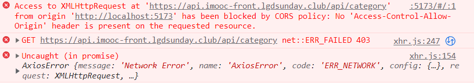

这是因为 **跨域** 导致的

那么在 `webpack` 中，可以直接通过 `proxy` 处理跨域错误，但是在 `vite` 中应该怎么做？

### vite 处理代理服务器 ( 跨域 ) 
在上面遇到了一个跨域的问题，这个问题在 **前后端分离** 的项目开发中是非常常见的。同时对于 `webpack` 可以直接通过 `proxy` 进行处理，那么 vite 中是否也提供了类似的能力呢？

是的，`vite` 同样提供了 `proxy` 的配置项。

具体使用的方式与 `webpack` 中的 `proxy` 基本没有区别，**依然是通过 `devServer` 根据 `url` 进行代理处理**

具体配置方式如下：

1. 在 `src/utils/request.js` 中，修改 `basURL` 为 `/api` ，表示当前请求为 `开发时的 api` 请求
```js
const service = axios.create({
  baseURL: '/api',
  ...
})
```

2. 在 `vite.config.js` 中新增 `server` 选项，配置代理
```js
// https://vitejs.dev/config/
export default defineConfig({
  ...
  // 代理
  server: {
    proxy: {
      // 代理所有 /api 的请求，该求情将被代理到 target 中
      '/api': {
        // 代理请求之后的请求地址
        target: 'https://api.imooc-front.lgdsunday.club/',
        // 跨域
        changeOrigin: true
      }
    }
  }
})
```
### vite 处理环境变量
已经可以请求到服务端，并且得到对应的数据响应了

这个项目 `baseURL` **分为两种**：
* `DEV` ： `https://api.imooc-front.lgdsunday.club/api`

* `PROD` ： `https://api.imooc-front.lgdsunday.club/prod-api`

在通常企业级项目开发之中，都会区分 **开发时服务** 和 **生产时服务**

对于开发时服务而言，它内部的数据是 **假数据** ，所以可以随便修改

而生产时服务，它内部数据为 **真实数据**，所以是不能随意修改的

那么在进行项目开发时，我们需要把服务切换为 `DEV` 模式，而在打包项目时需要切换为 `PROD` 模式

所以可以期望可以 **根据项目状态，自动切换请求的服务地址**

在 vite 中提供了 [.env](https://cn.vitejs.dev/guide/env-and-mode.html#env-files) 文件 ，该文件为环境变量文件，默认提供了四种文件格式：

```
.env                # 所有情况下都会加载
.env.local          # 所有情况下都会加载，但会被 git 忽略
.env.[mode]         # 只在指定模式下加载
.env.[mode].local   # 只在指定模式下加载，但会被 git 忽略
```
其中有一种 `.env.[mode]` 的格式可以在 **不同模式下加载不同内容** ，这不正是想要的吗？

1. 新建 `.env.development` 文件，表示 **开发时** 的 `.env` 文件
```
# 只在指定模式（development）下加载

# base api, 只有以 VITE_ 为前缀的变量才会暴露给经过 vite 处理
VITE_BASE_API = '/api'
```
2. 新建 `.env.production` 文件，表示 **生产时** 的 `.env` 文件
```
# 只在指定模式（production）下加载

# base api, 只有以 VITE_ 为前缀的变量才会暴露给经过 vite 处理
VITE_BASE_API = '/prod-api'
```
3. 在 `src/utils/request.js` 中打印 `VITE_BASE_API`
```js
console.log(import.meta.env.VITE_BASE_API)
```

此时当我们执行 `npm run dev` 时，可以发现浏览器打印为 `/api` ，表示 **开发时服务地址**

执行 `npm run build` 打包项目后运行（可以通过 anywhere 运行 dist 目录），浏览器打印为 `/prod-api`，表示 **发布时服务地址**

表明咱们的 **环境变量配置成功**

那么只需要修改 `baseURL` 为 `import.meta.env.VITE_BASE_API` 变量即可

```js
baseURL: import.meta.env.VITE_BASE_API
```

重新运行项目，接口依然请求成功


### 数据拦截简化数据获取流程
如果我们想要获取到 `categorys` ，那么就必须要 `res.data.data.categorys` 。

有没有简单的方式可以不用嵌套那么多层级呢？

答案肯定是：有的。

可以利用 `axios` 的 **响应拦截器** 进行处理。

在 `src/utils/request.js` 中：
```js
// 响应拦截器
service.interceptors.response.use((response) => {
  const { success, message, data } = response.data
  // 要根据success的成功与否决定下面的操作
  if (success) {
    return data
  } else {
    // TODO：业务错误
    return Promise.reject(new Error(message))
  }
})
```
