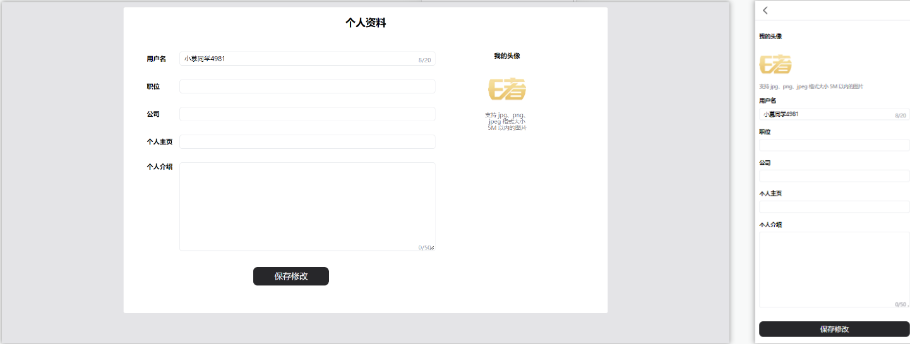
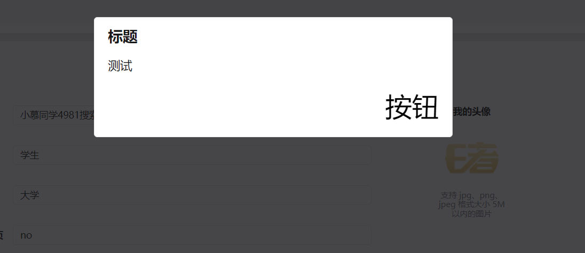

# 图片裁剪与上传处理方案 - 基于阿里云 OSS 处理用户资料
这里涉及到的知识点有:

1. 图片的裁剪
2. 阿里云 `OSS`
3. 腾讯云 `COS`
4. 通用组件：`input`
5. 通用组件：`Dialog`
6. …

## 通用组件 : input 输入框构建方案分析
在用户详情页面中 , 会包含大量的 `input`输入框, 并且这些输入框应包含最大字符数的提示

那么这样的能力默认的 `input` 标签是不具备的

期望通用组件 `input` 可以满足以下场景的使用：
1. 可以以单行输入`（input）`的形式展示
2. 可以以多行输入`（textarea）`的形式展示
3. 可以通过 `v-model` 绑定输入内容
4. 支持设定最大字符数

所提 `input` 通用组件中，需要包含三个对应的 `prop：`

* `modelValue`：双向绑定
* `type`：`text || textarea`
* `max`：最大字符数

然后根据这三个 `prop` 处理对应的视图

### 通用组件：input 构建实现
1. 创建 `src/libs/input/index.vue` 组件

2. 定义对应的 `props`：
```vue
<script>
const TYPE_TEXT = 'text'
const TYPE_TEXTAREA = 'textarea'
</script>
<script setup>
import { computed } from 'vue';
const props = defineProps({
  modelValue: {
    type:String
  },
  // 风格 : text / textarea
  type: {
    type: String,
    default: TYPE_TEXT,
    validator(value) {
      const arr = [TYPE_TEXT, TYPE_TEXTAREA]
      const result = arr.includes(value)
      if (!result) {
        throw new Error(`input 组件的 type 必须传如 ${arr.join(',')} 中的一个值`)
      }
      return result
    }
  },
  // 最大字符数
  max: {
    type:[String , Number]
  }
})
</script>
```

3. 定义计算属性，记录当前输入的字符数：
```js
// 目前输入框的字符数(计算属性)
const currentLength = computed(() => {
  return props.modelValue.length
})
```

4. 处理数据双向绑定, 并监听表单的 `input`事件触发 `update:modelValue` 事件
```js
<template>
  <div class="relative">
    <input type="text" 
      ...
      v-if="(type === TYPE_TEXT)" :maxlength="max" :value="modelValue" @input="onInput($event)">
    <textarea 
     ...
      v-else-if="(type === TYPE_TEXTAREA)" cols="30" rows="10" :maxlength="max" :value="modelValue"  @input="onInput($event)"></textarea>
    <!--最大字符提示-->
    <span v-if="max" class="absolute right-1 bottom-0.5 text-zinc-400 text-xs">{{currentLength}}/{{max}}</span>
  </div>
</template>

const emits = defineEmits(['update:modelValue'])

const onInput = ($event) => {
  emits('update:modelValue', $event.target.value)
}
```

5. 构建样式 , 显示最大字符串数, 最终
```vue
<template>
  <div class="relative">
    <input type="text" 
      class="border-gray-200 dark:border-zinc-600 dark:bg-zinc-800 duration-100
        dark:text-zinc-400 border-[1px] outline-0 py-0.5 px-1 text-sm rounded-sm focus:border-blue-400 w-full"
      v-if="(type === TYPE_TEXT)" :maxlength="max" :value="modelValue" @input="onInput($event)">
    <textarea 
      class="border-gray-200 dark:border-zinc-600 dark:bg-zinc-800 duration-100 
      dark:text-zinc-400 border-[1px] outline-0 py-0.5 px-1 text-sm rounded-sm focus:border-blue-400 w-full"
      v-else-if="(type === TYPE_TEXTAREA)" cols="30" rows="10" :maxlength="max" :value="modelValue"  @input="onInput($event)"></textarea>
    <!--最大字符提示-->
    <span v-if="max" class="absolute right-1 bottom-0.5 text-zinc-400 text-xs">{{currentLength}}/{{max}}</span>
  </div>
</template>
<script>
const TYPE_TEXT = 'text'
const TYPE_TEXTAREA = 'textarea'
</script>
<script setup>
import { computed } from 'vue';
const props = defineProps({
  modelValue: {
    type:String
  },
  // 风格 : text / textarea
  type: {
    type: String,
    default: TYPE_TEXT,
    validator(value) {
      const arr = [TYPE_TEXT, TYPE_TEXTAREA]
      const result = arr.includes(value)
      if (!result) {
        throw new Error(`input 组件的 type 必须传如 ${arr.join(',')} 中的一个值`)
      }
      return result
    }
  },
  // 最大字符数
  max: {
    type:[String , Number]
  }
})

const emits = defineEmits(['update:modelValue'])
// 目前输入框的字符数(计算属性)
const currentLength = computed(() => {
  return props.modelValue.length
})
// 监听 input , 触发 update:modelValue 事件
const onInput = ($event) => {
  emits('update:modelValue', $event.target.value)
}
</script>
```

## 构建用户资料基础样式

1. 创建 `src/views/profile/index.vue` 组件

2. 对 `PC` 和 `移动端`构建用户资料路由表：
```js
{
  path: '/profile',
  name: 'profile',
  component: () => import('@/views/profile/index.vue'),
  meta: {
    user: true
  }
}
```

3. 构建对应样式

```vue
<template>
  <div
    class="h-full bg-zinc-200 dark:bg-zinc-800 duration-400 overflow-auto xl:pt-1"
  >
    <div
      class="relative max-w-screen-lg mx-auto bg-white dark:bg-zinc-900 duration-400 xl:rounded-sm xl:border-zinc-200 xl:dark:border-zinc-600 xl:border-[1px] xl:px-4 xl:py-2"
    >
      <!-- 移动端 navbar -->
      <m-navbar sticky v-if="isMobileTerminal" @clickLeft="onNavbarLeftClick">
        个人资料
      </m-navbar>
      <!-- pc 端 -->
      <div v-else class="text-lg font-bold text-center mb-4 dark:text-zinc-300">
        个人资料
      </div>
      <div class="h-full w-full px-1 pb-4 text-sm mt-2 xl:w-2/3 xl:pb-0">
        <!-- 头像 -->
        <div class="py-1 xl:absolute xl:right-[16%] xl:text-center">
          <span
            class="w-8 inline-block mb-2 font-bold text-sm dark:text-zinc-300 xl:block xl:mx-auto"
            >我的头像</span
          >
          <!-- 头像部分 -->
          <div
            class="relative w-[80px] h-[80px] group xl:cursor-pointer xl:left-[50%] xl:translate-x-[-50%]"
          >
            
            <div
              class="absolute top-0 rounded-[50%] w-full h-full bg-[rgba(0,0,0,.4)] hidden xl:group-hover:block"
            >
              <m-svg-icon
                name="change-header-image"
                class="w-2 h-2 m-auto mt-2"
              ></m-svg-icon>
              <div
                class="text-xs text-white dark:text-zinc-300 scale-90 mt-0.5"
              >
                点击更换头像
              </div>
            </div>
          </div>
          <!-- 隐藏域 -->
          <input
            v-show="false"
            ref="inputFileTarget"
            type="file"
            accept=".png, .jpeg, .jpg, .gif"
            @change="onSelectImgHandler"
          />
          <p class="mt-1 text-zinc-500 dark:text-zinc-400 text-xs xl:w-10">
            支持 jpg、png、jpeg 格式大小 5M 以内的图片
          </p>
        </div>
        <!-- 用户名 -->
        <div class="py-1 xl:flex xl:items-center xl:my-1">
          <span class="w-8 block mb-1 font-bold dark:text-zinc-300 xl:mb-0"
            >用户名</span
          >
          <m-input
            v-model="$store.getters.userInfo.nickname"
            class="w-full"
            type="text"
            max="20"
          ></m-input>
        </div>
        <!-- 职位 -->
        <div class="py-1 xl:flex xl:items-center xl:my-1">
          <span class="w-8 block mb-1 font-bold dark:text-zinc-300 xl:mb-0"
            >职位</span
          >
          <m-input
            v-model="$store.getters.userInfo.title"
            class="w-full"
            type="text"
          ></m-input>
        </div>
        <!-- 公司 -->
        <div class="py-1 xl:flex xl:items-center xl:my-1">
          <span class="w-8 block mb-1 font-bold dark:text-zinc-300 xl:mb-0"
            >公司</span
          >
          <m-input
            v-model="$store.getters.userInfo.company"
            class="w-full"
            type="text"
          ></m-input>
        </div>
        <!-- 个人主页 -->
        <div class="py-1 xl:flex xl:items-center xl:my-1">
          <span class="w-8 block mb-1 font-bold dark:text-zinc-300 xl:mb-0"
            >个人主页</span
          >
          <m-input
            v-model="$store.getters.userInfo.homePage"
            class="w-full"
            type="text"
          ></m-input>
        </div>
        <!-- 个人介绍 -->
        <div class="py-1 xl:flex xl:my-1">
          <span class="w-8 block mb-1 font-bold dark:text-zinc-300 xl:mb-0"
            >个人介绍</span
          >
          <m-input
            v-model="$store.getters.userInfo.introduction"
            class="w-full"
            type="textarea"
            max="50"
          ></m-input>
        </div>
        <!-- 保存修改 -->
        <m-button
          class="w-full mt-2 mb-4 dark:text-zinc-300 dark:bg-zinc-800 xl:w-[160px] xl:ml-[50%] xl:translate-x-[-50%]"
          >保存修改</m-button
        >
        <!-- 移动端退出登录 -->
        <m-button
          v-if="isMobileTerminal"
          class="w-full dark:text-zinc-300 dark:bg-zinc-800 xl:w-[160px] xl:ml-[50%] xl:translate-x-[-50%]"
          @click="onLogoutClick"
        >
          退出登录
        </m-button>
      </div>
    </div>
  </div>
</template>

<script>
export default {
  name: 'profile'
}
</script>

<script setup>
import { isMobileTerminal } from '@/utils/flexible'
import { confirm } from '@/libs'
import { useRouter } from 'vue-router'
import { useStore } from 'vuex'
import { ref } from 'vue'

const store = useStore()
const router = useRouter()

// 隐藏域
const inputFileTarget = ref(null)
/**
 * 更换头像点击事件
 */
const onAvatarClick = () => {
  inputFileTarget.value.click()
}

/**
 * 头像选择之后的回调
 */
const onSelectImgHandler = () => {}

/**
 * 移动端后退处理
 */
const onNavbarLeftClick = () => {
  router.back()
}

/**
 * 移动端：退出登录
 */
const onLogoutClick = () => {
  confirm('确定要退出登录吗？').then(() => {
    store.dispatch('user/logoutAction')
  })
}
</script>
```
## 用户基本资料修改方案
接下来处理除 **头像** 之外的其他用户资料的修改

不过在修改用户资料之前，需要先处理一个小问题，那就是：`m-input` 中的双向绑定

目前上面的双向绑定方式为：
```html
 <m-input v-model="$store.getters.userInfo.nickname" ...  ></m-input>
```

但是知道修改 `state` 的数据其唯一的方式就是提交 `mutation`, 如果这样直接修改就`不规范` 

所以先声明一个响应式数据
```js
// 用户的信息
const userInfo = ref({
  nickname: store.getters.userInfo.nickname,
  title: store.getters.userInfo.title,
  company:store.getters.userInfo.company,
  homePage: store.getters.userInfo.homePage,
  introduction: store.getters.userInfo.introduction,
  avatar: store.getters.userInfo.avatar
})
```
然后把这个响应式数据绑定到模板里面
```html
 <m-input v-model="userInfo.nickname" ...  ></m-input>
```

但需要发起真正的**修改数据的网络请求**

1. 在 `src/api/sys.js` 中定义对应的接口：
```js
/**
 * 修改用户信息
 */
export const putProfile = (data) => {
  return request({
    url: '/user/profile',
    method: 'PUT',
    data
  })
}
```

2. 在 `Vuex` 的 `user` 模块定义对应的修改个人信息的 `action`
```js
  // 修改个人信息
    async changeProfileAction(context, data) {
      // 发起真正请求
      await putProfile(data)

      message('success' , '成功修改用户信息')
      // 修改state的userInfo
      context.commit('setUserInfo', { ...context.state.userInfo, ...data })
    }
```
**上面需要注意一个细节**:
* 必须网络请求成功之后 ,  才要修改同步的数据
* 所以提交 `mutation` 的代码, 要写在 `await` 下面行里

3. 在页面内部处理保存修改点击事件：
```js
<!-- 保存修改 -->
  <m-button
    class="w-full mt-2 mb-4 dark:text-zinc-300 dark:bg-zinc-800 xl:w-[160px] xl:ml-[50%] xl:translate-x-[-50%]"
    :loading="loading"
    @click="onChangeProfile"
>保存修改</m-button>

...
const loading = ref(false)

/**
 *  点击修改个人信息
 * */ 
const onChangeProfile = async () => {
  // 调修改个人信息 action
  loading.value = true
  await store.dispatch('user/changeProfileAction', userInfo.value)
  loading.value = false
}
```
## 头像修改方案流程分析
那么接下来需要处理头像修改的业务逻辑。

对于该功能而言分为 `PC端` 和 `移动端` 两种情况，需要分别进行处理：

PC 端：
1. 点击更换头像
2. 选择对应文件
3. 通过 Dialog 展示图片裁剪
4. 裁剪后图片上传
5. 功能完成

移动端：
1. 点击更换头像
2. 选择对应文件
3. 通过 popup 展示图片裁剪
4. 裁剪后图片上传
5. 功能完成

两者之间需要通过不同的组件进行裁剪展示

所以后续的流程为：

1. 通用组件：`Dialog` 的实现
2. 处理图片裁剪
3. 处理裁剪后上传


## 通用组件 : Dialog 构建方案分析

首先处理 `Dialog` 通用组件

对于 `Dialog` 通用组件而言，可以参考 `confirm` 的组件的构建过程。

它们两个构建方案非常类似，唯二不同的地方是：

* `Dialog` 无需通过方法调用的形式展示, 它的显示/隐藏通过 `v-model` 控制
* `Dialog` 的内容区可以渲染任意的内容(默认插槽)
* `footer` 区域也可以渲染任意的内容(具名插槽 `footer`)

## 通用组件 : Dialog 构建实现


1. 创建 `src/libs/dialog/index.vue` 组件

2. 定义对应的 `props`：
```js
const props = defineProps({
  modelValue: {
    type: Boolean,
    default:false
  },
  close: {
    type:Function
  },
  title: {
    type:String
  }
})
```
3. 处理双向绑定
```js
const emits = defineEmits(['update:modelValue'])

// 关闭 dialog
const close = () => {
  emits('update:modelValue', false)
  if (props.close) {
    props.close()
  }
}
```

4. 处理对应视图
```vue
<template>
  <div >
    <!--蒙版-->
    <transition name="fade">
      <div 
        v-if="modelValue" 
        class="fixed z-40  left-0 top-0 w-screen h-screen bg-zinc-900/80"
        @click="close"
        ></div>
    </transition>
    <!--内容区-->
    <transition name="up">
      <div
        v-if="modelValue"
        class="max-w-[80%] max-h-[80%] overflow-auto fixed top-[10%] left-[50%] translate-x-[-50%] z-50 px-2 py-1.5 rounded-sm border dark:border-zinc-600 cursor-pointer bg-white dark:bg-zinc-800 xl:min-w-[35%]"
      >
        <!-- 标题 -->
        <div
          class="text-lg font-bold text-zinc-900 dark:text-zinc-200 mb-2"
          v-if="title"
        >
          {{ title }}
        </div>
        <!-- 内容 -->
        <div class="text-base text-zinc-900 dark:text-zinc-200 mb-2">
          <slot />
        </div>
        <!-- footer 插槽-->
        <div class="flex justify-end" v-if="$slots.footer">
          <slot name="footer"></slot>
        </div>
      </div>
    </transition>
  </div>
</template>
```

4. 测试展示：
```html
  <!-- dialog 组件-->
    <m-dialog v-model="isDialogVisible" title="标题">
      默认插槽
      <template #footer>
        footer 插槽
      </template>
    </m-dialog>
```

## 应用 Dialog 展示头像
有了通用组件 `Dialog` 之后，就可以利用 `Dialog` 处理选中头像的展示

1. **选择图片** 代码
```html
<!-- 隐藏域 -->
<input
  v-show="false"
  ref="inputFileTarget"
  type="file"
  accept=".png, .jpeg, .jpg, .gif"
  @change="onSelectImgHandler"
/>
```
```js
// 隐藏域
const inputFileTarget = ref(null)
/**
 * 更换头像点击事件
 */
const onAvatarClick = () => {
  inputFileTarget.value.click()
}
```
2. 在 `src/views/profile/index.vue` 中，选中的图片会回调至 `onSelectImgHandler` 方法，可以利用 [URL.createObjectURL()](https://developer.mozilla.org/zh-CN/docs/Web/API/URL/createObjectURL) 获取到对应的 `blob` 对象
```js
/**
 * 头像图片选择之后的回调
 */
const onSelectImgHandler = () => {
  // 获取选中的文件
  const imgFile = inputFileTarget.value.files[0]
  // 生成 blob 对象
  const blob = URL.createObjectURL(imgFile)
  console.log(blob)
}
```
3. 打印该 `blob` 可在浏览器地址栏按回车会展示选中的图片

4. 那么想要在 `Dialog` 中展示选中的图片，也只需要使用 `img` 标签的 `src` 属性即可：
```html
 <!-- dialog 组件-->
    <m-dialog v-model="isDialogVisible" title="标题">
      
    </m-dialog>
```
```js
// 当前选中图片的 blob 对象
const currentBlob = ref('')
// dialog 显示/隐藏
const isDialogVisible = ref(false)
/**
 * 头像图片选择之后的回调
 */
const onSelectImgHandler = () => {
  // 获取选中的文件
  const imgFile = inputFileTarget.value.files[0]
  // 生成 blob 对象
  const blob = URL.createObjectURL(imgFile)
  // 赋值
  currentBlob.value = blob
  // 再打开 dialog 显示
  isDialogVisible.value = true
}
```

5. 但是现在的 `Dialog` 展示出来的内容有点难看，所以现在期望创建一个单独的业务组件，美化下样式，并且处理后续的裁剪、上传功能

6. 创建 `src/views/profile/components/change-avatar.vue` 组件：
```vue
<template>
  <div class="overflow-auto flex flex-col items-center">
    <m-svg-icon
      v-if="isMobileTerminal"
      name="close"
      class="w-3 h-3 p-0.5 m-1 ml-auto"
      fillClass="fill-zinc-900 dark:fill-zinc-200 "
      @click="close"
    ></m-svg-icon>

    

    <m-button class="mt-4 w-[80%] xl:w-1/2" @click="onConfirmClick"
      >确定</m-button
    >
  </div>
</template>

<script>
const EMITS_CLOSE = 'close'
</script>

<script setup>
import { isMobileTerminal } from '@/utils/flexible'

defineProps({
  blob: {
    type: String,
    required: true
  }
})

const emits = defineEmits([EMITS_CLOSE])

/**
 * 确定按钮点击事件
 */
const onConfirmClick = () => {}

/**
 * 关闭事件
 */
const close = () => {
  emits(EMITS_CLOSE)
}
</script>
```
7. 在 `src/views/profile/index.vue` 中处理对应展示：
```html
<!-- 图片展示-->
<!-- PC 端 -->
<m-dialog v-if="!isMobileTerminal" v-model="isDialogVisible">
  <change-avatar-vue
    :blob="currentBlob"
    @close="isDialogVisible = false"
  ></change-avatar-vue>
</m-dialog>
<!-- 移动端：在展示时指定高度 -->
<m-popup v-else :class="{ 'h-screen': isDialogVisible }" v-model="isDialogVisible">
  <change-avatar-vue
    :blob="currentBlob"
    @close="isDialogVisible = false"
  ></change-avatar-vue>
</m-popup>
```
8. `file-input` 如果处理同一个图片文件就不会触发 `@change` 事件 , 所以解决办法就是: 每次使用完毕就把他的 `value` 置空
```js
// file-input 如果处理同一个图片文件就不会触发 change 事件
// 所以解决办法就是: 每次使用完毕就把他的 value 置空
watch(isDialogVisible, (val) => {
  if (!val) {
    inputFileTarget.value.value = null
  }
})
```
## 头像裁剪构建方案
现在需要在 `src/views/profile/components/change-avatar.vue` 中处理对应的图片裁剪功能

想要处理图片裁剪需要使用到 [cropperjs](https://github.com/fengyuanchen/cropperjs) ，它是一个 `JavaScript` 的库，同时支持 `PC 端` 和 `移动端`

目前 `cropperjs` 的最新发布版本为 `1.5.12` ，`V2` 级别的版本还是 `alpha` 阶段，所以还是使用它的 V`1` 版本\

1. 安装 `cropperjs`
```shell
npm install cropperjs@1.5.12 --save
```

2. 在 `src/views/profile/components/change-avatar.vue`中进行导入
```js
import Cropper from 'cropperjs'
import 'cropperjs/dist/cropper.css'
```

3. 使用 `new Cropper` 进行初始化，区分 `PC端` 和 `移动端`：[所有配置项](https://github.com/fengyuanchen/cropperjs#options)
```js


// 移动端配置对象
const mobileOptions = {
  // 将裁剪框限制在画布的大小
  viewMode: 1,
  // 移动画布，裁剪框不动
  dragMode: 'move',
  // 裁剪框固定纵横比：1:1
  aspectRatio: 1,
  // 裁剪框不可移动
  cropBoxMovable: false,
  // 不可调整裁剪框大小
  cropBoxResizable: false
}

// PC 端配置对象
const pcOptions = {
  // 裁剪框固定纵横比：1:1
  aspectRatio: 1
}

/**
 * 图片裁剪处理
 */
const imageTarget = ref(null)
let cropper = null
onMounted(() => {
  /**
   * 接收两个参数：
   * 1. 需要裁剪的图片 DOM
   * 2. options 配置对象
   */
  cropper = new Cropper(
    imageTarget.value,
    isMobileTerminal.value ? mobileOptions : pcOptions
  )
})
```
4. 此时，图片可裁剪

5. 监听确定按钮点击事件，拿到裁剪后的图片：


```js
const loading = ref(false)
/**
 * 确定按钮点击事件
 */
const onConfirmClick = () => {
  // 开启 loading
  loading.value = true
  // 获取裁剪后的图片
  cropper.getCroppedCanvas().toBlob((blob) => {
    // 裁剪后的 blob 地址
    console.log(URL.createObjectURL(blob))
  })
}
```

## 上传图片到 Bucket 的流程分析
1. 想要上传文件到 `Bucket` 那么需要使用 `ali-sdk` [ali-oss](https://github.com/ali-sdk/ali-oss?spm=a2c4g.11186623.0.0.59451cd5m9aTAc)
2. 利用 `ali-oss` 生成 `OSS` 对象
3. 但是在生成 `OSS` 对象时，需要传递 **文件上传凭证** ：
   * `accessKeyId`
   * `accessKeySecret`
   * `stsToken`
4. 所以需要通过接口 `/user/sts` 获取 **文件上传凭证**

所以整体的文件上传流程为：

1. 通过接口 `/user/sts` 获取 **文件上传凭证**
2. 通过 `npm i ali-oss` 安装依赖包
3. 利用凭证中的数据构建 `OSS` 对象 [点击这里查看文档](https://www.alibabacloud.com/help/zh/doc-detail/64041.htm#concept-64041-zh)

### 使用临时凭证，上传裁剪图片到阿里云 OSS
将裁剪后的图片上传至阿里云 `OSS`

1. 安装 `ali-oss` 依赖
2. 通过接口获取临时访问凭证，生成 `OSS` 实例
3. 利用 `ossClient.put` 方法，完成对应上传

接下来就一步一步来去做：
1.  安装 `ali-oss` 依赖
```shell
npm i --save ali-oss@6.17.0
```
2. 创建 `src/utils/sts.js` 模块，用来**生成 `OSS` 实例**
```js
import OSS from 'ali-oss'
import { REGION, BUCKET } from '@/constants'
import { getSts } from '@/api/sys'

export const getOSSClient = async () => {
  const res = await getSts()
  return new OSS({
    // yourRegion填写Bucket所在地域。以华东1（杭州）为例，Region填写为oss-cn-hangzhou。
    region: REGION,
    // 从STS服务获取的临时访问密钥（AccessKey ID和AccessKey Secret）。
    accessKeyId: res.Credentials.AccessKeyId,
    accessKeySecret: res.Credentials.AccessKeySecret,
    // 从STS服务获取的安全令牌（SecurityToken）。
    stsToken: res.Credentials.SecurityToken,
    // 填写Bucket名称。
    bucket: BUCKET,
    // 刷新 token，在 token 过期后自动调用（但是并不生效，可能会在后续的版本中修复）
    refreshSTSToken: async () => {
      // 向您搭建的STS服务获取临时访问凭证。
      const res = await getSts()
      return {
        accessKeyId: res.Credentials.AccessKeyId,
        accessKeySecret: res.Credentials.AccessKeySecret,
        stsToken: res.Credentials.SecurityToken
      }
    },
    // 刷新临时访问凭证的时间间隔，单位为毫秒。
    refreshSTSTokenInterval: 5 * 1000
  })
}
```

3. 在 `constants` 中定义 `REGION, BUCKET`'
```js
// STS 上传数据
export const REGION = 'oss-cn-beijing'
export const BUCKET = 'imooc-front'
```

4. 在 `src/api/sys.js` 定义接口，获取 `accessKeyId、accessKeySecret`
```js
/**
 * 获取 OSS 上传凭证
 */
export const getSts = () => {
  return request({
    url: '/user/sts'
  })
}
```

5. 在 `src/views/profile/components/change-avatar.vue` 中，定义 `putObjectToOSS `方法，上传图片到 `OSS：`
```js
import { getOSSClient } from '@/utils/sts'
import { message } from '@/libs'
import {useStore} from 'vuex'

/**
 * 进行 OSS 上传
 */
let ossClient = null
let store = useStore()
const putObjectToOSS = async (file) => {
  if (!ossClient) {
    ossClient = await getOSSClient()
  }
  try {
    // 因为当前凭证只具备 images 文件夹下的访问权限，所以图片需要上传到 images/xxx.xx 。否则你将得到一个 《AccessDeniedError: You have no right to access this object because of bucket acl.》 的错误
    const fileTypeArr = file.type.split('/')
    const fileName = `${store.getters.userInfo.username}/${Date.now()}.${fileTypeArr[fileTypeArr.length - 1]}`
		// ossClient.put 的参数: 文件存放路径，文件
    const res = await ossClient.put(`images/${fileName}`, file)
    console.log(res)
    // TODO：图片上传成功
  } catch (e) {
    message('error', e)
  }
}
```

6. 当图片裁剪完成之后，触发该方法：
```js
/**
 * 确定按钮点击事件
 */
const onConfirmClick = () => {
  cropper.getCroppedCanvas().toBlob((blob) => {
    // console.log(URL.createObjectURL(blob))
    putObjectToOSS(blob)
  })
}
```

### 完成头像更新操作
头像上传成功之后，只需要调用对应 **更新用户信息** 接口，即可完成头像的更新

1. 在 `src/views/profile/components/change-avatar.vue` 中, 调 **更新用户信息** `action`
```js{20-25}
...
const EMITS_UPLOAD_SUCCESS= 'upload-success'
...
/** 
 * 进行 OSS 上传
 */
let ossClient = null
let store = useStore()
const putObjectToOSS = async (file) => {
  if (!ossClient) {
    ossClient = await getOSSClient()
  }
  try {
    // 因为当前凭证只具备 images 文件夹下的访问权限，所以图片需要上传到 images/xxx.xx 。否则你将得到一个 《AccessDeniedError: You have no right to access this object because of bucket acl.》 的错误
    const fileTypeArr = file.type.split('/')
    const fileName = `${store.getters.userInfo.username}/${Date.now()}.${
      fileTypeArr[fileTypeArr.length - 1]
    }`
		// 文件存放路径，文件
    const res = await ossClient.put(`images/${fileName}`, file)
    console.log(res.url)
    // TODO：图片上传到服务器, 更新用户信息
    // 调接口: 更新用户信息
    await store.dispatch('user/changeProfileAction', { ...store.getters.userInfo, avatar: res.url })
    // 通知外面, 改下数据, 实现页面的同步
    emits(EMITS_UPLOAD_SUCCESS, res.url)
    // 提示
    message('success', '头像修改成功')
  } catch (e) {
    message('error', e)
  }
}
```
```js
/**
 * 确定按钮点击事件
 */
const onConfirmClick = () => {
  // 开启 loading
  loading.value = true
  // 获取裁剪后的图片
  cropper.getCroppedCanvas().toBlob(async (blob) => {
    // 裁剪后的 blob
    // console.log(blob)
    // console.log(URL.createObjectURL(blob))
    await putObjectToOSS(blob)
    // 关闭 loading
    loading.value = false
    // 关闭 dialog
    close()
  })
}
```

2. 在 `src/views/profile/index.vue` 监听图片更新成功事件, 更新图片地址到视图
```js{6,14}
<!-- PC 端 -->
<m-dialog v-if="!isMobileTerminal" v-model="isDialogVisible">
  <change-avatar-vue
    :blob="currentBlob"
    @close="isDialogVisible = false"
    @upload-success="userInfo.avatar = $event"
  ></change-avatar-vue>
</m-dialog>
<!-- 移动端：在展示时指定高度 -->
<m-popup v-else :class="{ 'h-screen': isDialogVisible }" v-model="isDialogVisible">
  <change-avatar-vue
    :blob="currentBlob" 
    @close="isDialogVisible = false"
    @upload-success="userInfo.avatar = $event"
  ></change-avatar-vue>
</m-popup>
....
....
// 用户的信息
const userInfo = ref({
  nickname: store.getters.userInfo.nickname,
  title: store.getters.userInfo.title,
  company:store.getters.userInfo.company,
  homePage: store.getters.userInfo.homePage,
  introduction: store.getters.userInfo.introduction,
  avatar: store.getters.userInfo.avatar
})
```

## 登录鉴权解决方案
目前退出登录之后，应用依然会停留在 `profile` 用户信息页面，这显然是不合理的，所以下面需要处理该问题

针对于该问题可以通过 `vue-router` 的 `beforeEach` 路由守卫来进行实现

`permission.js`文件: 
```js
import store from '@/store'
import router from '@/router'
import { message } from '@/libs';

router.beforeEach((to,from) => {
  if (store.getters.token) {
    // 已登录
    return true
  } else {
    // 没有登录
    if (to.meta.user) { // 需要登录的页面
      message('warn', '访问失败, 请先登录')
      return '/login'
    } else {
      return true
    }
  }
})
```

2. 在` main.js` 中触发该模块
```js
import './permission'
```

