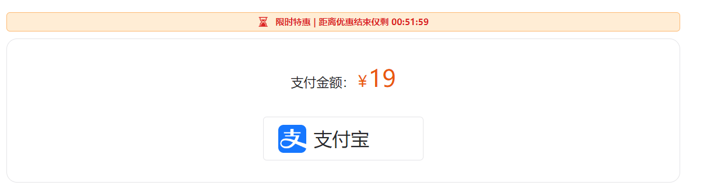

# VIP 通用业务构建方案 - 处理 VIP 服务 (这儿不处理业务, 只是搭建模块)
## 构建基础样式


1. 创建 `src/views/member/index.vue` 组件


2. 处理对应路由表：
```js
 {
    path: '/member',
    name: 'member',
    component: () => import('@/views/member/index.vue'),
    meta: {
      user: true // 需要登录才可以访问
    }
  }
```

3. 创建 `src/api/pay.js` 接口地址：
```js
import request from '@/utils/request'

/**
 * 获取 VIP 支付数据
 */
export const getVipPayList = () => {
  return request({
    url: '/user/vip/pay/list'
  })
}
```

4. 为 `src/views/member/index.vue` 指定样式：
```vue
<template>
  <div class="h-full bg-zinc-200 dark:bg-zinc-800 duration-400 xl:pt-1">
    <div
      class="max-w-screen-lg mx-auto bg-white dark:bg-zinc-900 duration-400 xl:rounded-sm xl:border-zinc-200 xl:dark:border-zinc-600 xl:border-[1px] xl:px-4"
    >
      <!-- 移动端 navbar 处理 -->
      <m-navbar v-if="isMobileTerminal" sticky :clickLeft="onNavbarLeftClick">
        精选会员
      </m-navbar>

      <div class="py-2 px-1">
        <h2
          class="text-center text-[34px] font-bold tracking-widest text-yellow-600"
        >
          精选VIP
        </h2>
        <p class="text-center text-lg text-yellow-500">
          升级精选VIP，畅想所有内容
        </p>
        <div
          class="flex justify-between mt-5 overflow-x-auto pb-2
            scrollbar-thin scrollbar-thumb-zinc-200 dark:scrollbar-thumb-zinc-700 scrollbar-track-transparent"
        >
          <pay-menu-item-vue
            v-for="item in vipPayListData"
            :key="item.id"
            :hot="item.isHot"
            :select="item.id === currentPayData.id"
            :data="item"
            @click="onChangeCurrentPay"
          ></pay-menu-item-vue>
        </div>
        <p class="mt-1 text-sm text-zinc-500">{{ currentPayData.desc }}</p>
        <!-- 支付 -->
      </div>
    </div>
  </div>
</template>

<script>
export default {
  name: 'member'
}
</script>

<script setup>
import { isMobileTerminal } from '@/utils/flexible'
import payMenuItemVue from './components/pay-menu-item.vue'
import { useStore } from 'vuex'
import { useRouter } from 'vue-router'
import { ref } from 'vue'
import { getVipPayList } from '@/api/pay'

/**
 * 列表数据
 */
const vipPayListData = ref([])
const getVipPayListData = async () => {
  const res = await getVipPayList()
  vipPayListData.value = res
  currentPayData.value = vipPayListData.value[0]
}
getVipPayListData()

// navbar
const store = useStore()
const router = useRouter()
const onNavbarLeftClick = () => {
  // 配置跳转方式
  store.commit('app/changeRouterType', 'back')
  router.back()
}

/**
 * 选中支付项
 */
const currentPayData = ref({})
const onChangeCurrentPay = (item) => {
  currentPayData.value = item
}
</script>

```

5. 创建 `src/views/member/components/pay-menu-item.vue`：
```vue
<template>
  <!-- 单个的支付项 -->
  <div
    class="w-[100px] flex flex-col shrink-0 items-center mt-2 mr-2 py-3 border-[1px]
      hover:bg-orange-50 hover:border-orange-300 rounded-md relative cursor-pointer xl:w-[150px] xl:py-2"
    :class="[
      select
        ? 'bg-orange-50 dark:bg-orange-50/10 border-orange-300 '
        : 'bg-white dark:bg-zinc-900 border-zinc-300 dark:border-zinc-500'
    ]"
    @click="onItemClick"
  >
    <!-- 标题 -->
    <p
      class="text-base"
      :class="[
        select
          ? 'text-yellow-800 dark:text-orange-300'
          : 'text-yellow-800 dark:text-zinc-300'
      ]"
    >
      {{ data.title }}
    </p>
    <!-- 价格 -->
    <p
      class="text-[32px] tracking-tighter font-sans font-bold"
      :class="[
        select
          ? 'text-yellow-800 dark:text-orange-300'
          : 'text-yellow-800 dark:text-zinc-300'
      ]"
    >
      <span class="text-base">￥</span>
      {{ data.price }}
    </p>
    <!-- 原价 -->
    <p class="text-xs text-yellow-500 line-through">￥{{ data.oldPrice }}</p>
    <!-- 热销 -->
    <div
      v-if="hot"
      class="absolute right-[-1px] top-[-12px] h-[22px] w-[48px] leading-[22px] text-center text-yellow-700 bg-gradient-to-r from-orange-300 to-orange-100 text-[12px] rounded-tr-[10px] rounded-bl-[10px]"
    >
      热销
    </div>
  </div>
</template>

<script>
const EMITS_CLICK = 'click'
</script>

<script setup>
const props = defineProps({
  // 数据源
  data: {
    type: Object,
    required: true
  },
  // 是否热选
  hot: {
    type: Boolean
  },
  // 是否被选中
  select: {
    type: Boolean,
    default: false
  }
})

const emits = defineEmits([EMITS_CLICK])

const onItemClick = () => {
  emits(EMITS_CLICK, props.data)
}
</script>
```

## 通用组件：倒计时 count-down 构建方案分析
所谓倒计时，其实更多的是一个时间的处理，那么对于时间的处理，此时我们就需要使用到一个第三方的包：[dayjs](https://dayjs.gitee.io/zh-CN/) 。通过这个包可以处理对应的倒计时格式问题

期望对倒计时模块，可以传递两个值:
1. `time` 毫秒值：表示倒计时的时长
2. `format` 格式：表示倒计时的展示格式 [dayjs 时间格式](https://day.js.org/docs/zh-CN/parse/string-format#%E6%94%AF%E6%8C%81%E7%9A%84%E8%A7%A3%E6%9E%90%E5%8D%A0%E4%BD%8D%E7%AC%A6%E5%88%97%E8%A1%A8)


### 倒计时构建实现
1. 创建 `src/libs/count-down/index.vue` 组件，并定义对应的 `props`:
```js
const props = defineProps({
  // 倒计时 毫秒
  time: {
    type: Number,
    required: true
  },
  // 遵循 dayjs format 标准：https://day.js.org/docs/zh-CN/parse/string-format
  format: {
    type: String,
    default:'HH:mm:ss'
  }
})
```

2. 该倒计时应该提供两个事件：`change`：倒计时改变、`finish`：倒计时结束：
```vue
<script>
// 倒计时结束
const EMITS_FINISH = 'finish'
// 倒计时改变
const EMITS_CHANGE = 'change'
// 间隔: 1秒钟
const INTERVAL_COUNT = 1000
</script>

const emits = defineEmits([EMITS_FINISH, EMITS_CHANGE])
```

3. 定义一些方法
```js
let intervalId = null 
// 清除计时器
const close = () => {
  if(intervalId) {
    clearInterval(intervalId)
  }
}

// 总时长: 一开始被 watch 赋值到 props.time
const duration = ref(0)
// 开始计时
const start = () => {
  // 开始之前,先把之前的删掉
  close()
  intervalId = setInterval(() => {
    duration.value -= INTERVAL_COUNT
    emits(EMITS_CHANGE)
    if (duration.value <= 0) {
      // 倒计时结束
      emits(EMITS_FINISH)
      close()
    }
  }, INTERVAL_COUNT)
}

// 一开始 !
watch(() => props.time, (val) => {
  duration.value = val
  start()
}, {immediate: true})
```

4. 在组件销毁时，关闭倒计时：
```js
/**
 * 组件销毁时，清理倒计时
 */
onUnmounted(() => {
  close()
})
```

5. 定义 `src/libs/count-down/utils.js` 模块，用来处理倒计时的事件展示，`dayjs` 版本为 `1.11.0`：
```js
import dayjs from 'dayjs'
import 'dayjs/locale/zh-cn'
import duration from 'dayjs/plugin/duration'

// 中文
dayjs.locale('zh')
// duration 插件
dayjs.extend(duration)

export default dayjs
```

6. 在组件中, 利用 `dayjs` 处理事件展示：
```js
import dayjs from './utils'

/**
 * 处理显示时间
 */
const showTime = computed(() => {
  return dayjs.duration(duration.value).format(props.format)
})
```

7. 构建对应 `template`：
```html
<template>
  <div>
    <slot :duration="showTime"> 
      <!--就默认展示, 倒计时直接通过作用域插槽给外面了-->
      <p>{{showTime}}</p>
    </slot>
  </div>
</template>
```

8. 测试使用：
```html
    <!--倒计时-->
    <m-count-down :time="(1000 * 60)">
      <template v-slot="{ duration }">
        {{duration}}
      </template>
    </m-count-down>
```

倒计时模块构建成功
## 支付模块：PC 端支付样式处理
对于支付模块的样式而言，`PC端` 和 `移动`端 差距较大。所有分别进行处理

1. 创建 `src/views/member/components/payment/index.vue` 组件：
```vue
<template>
  <div>
    <!-- PC 端支付 -->
    <pc-payment-vue v-if="!isMobileTerminal"></pc-payment-vue>
  </div>
</template>

<script setup>
import { isMobileTerminal } from '@/utils/flexible'
import pcPaymentVue from './pc-payment/index.vue'
</script>
```

2. 创建 `src/views/member/components/payment/pc-payment/index.vue` 组件
```vue
<template>
  <div>
    <!-- 特惠提示 -->
    <discounts-vue></discounts-vue>
  </div>
</template>

<script setup>
import discountsVue from '../discounts.vue'
</script>
```

3. 构建 `src/views/member/components/payment/discounts.vue` 特惠倒计时组件：

```vue
<template>
  <div
    class="flex justify-center items-center py-0.5 bg-orange-100 border-orange-300 border-t xl:border xl:rounded-sm"
    v-if="!isCountDownFinish"
  >
    <m-svg-icon
      name="countdown"
      class="w-1.5 h-1.5 mr-1"
      fillClass="fill-red-600"
    ></m-svg-icon>
    <p class="text-xs text-red-600 font-bold">
      限时特惠 | 距离优惠结束仅剩
      <m-count-down
        :time="52 * 60 * 1000"
        class="inline-block"
        @finish="isCountDownFinish = true"
      ></m-count-down>
    </p>
  </div>
</template>

<script setup>
import { ref } from 'vue'
// 倒计时是否结束
const isCountDownFinish = ref(false)
</script>
```

4. 在 `src/views/member/index.vue` 中展示 `payment`:
```html
<!-- 支付 -->
<payment-vue class="mt-4" />
```

5. 在 `src/views/member/components/payment/pc-payment/index.vue` 中继续构建剩余样式：

```vue
<template>
  <div>
    <!-- 特惠提示 -->
    <discounts-vue></discounts-vue>
    <div
      class="flex flex-col items-center justify-evenly border-zinc-200 dark:border-zinc-600 border-[1px] py-3 rounded-md mt-1"
    >
      <p class="text-[32px] text-orange-600 font-sans">
        <span class="text-base text-zinc-900 dark:text-zinc-200"
          >支付金额：</span
        >
        <span class="text-lg mr-[-12px]">￥</span>
        19
      </p>

      <div class="flex mt-3">
        <!-- 支付宝支付 -->
        <div
          class="border border-zinc-200 dark:border-zinc-600 rounded-sm w-[220px] h-[60px] flex items-center pl-2 cursor-pointer duration-200 hover:bg-zinc-50 hover:dark:bg-zinc-800"
        >
          
          <p class="text-xl ml-1 text-zinc-800 dark:text-zinc-200">支付宝</p>
        </div>
      </div>
    </div>
  </div>
</template>
```

PC 端支付样式构建完成
## 支付模块：移动端支付样式处理

1. 创建 `src/views/member/components/payment/mobile-payment/index.vue` 组件：
```vue
<template>
  <div
    class="fixed left-0 bottom-0 w-screen text-center bg-white dark:bg-zinc-800 xl:hidden"
  >
    <!-- 特惠提示 -->
    <discounts-vue></discounts-vue>
    <!-- 支付 -->
    <div class="flex justify-between text-xs px-1 py-0.5">
      <div class="text-left text-zinc-900 dark:text-zinc-200">
        <p class="">
          券后合计：<span class="text-red-600 text-[16px] font-sans font-medium"
            >￥</span
          ><span class="text-red-600 text-[22px] font-sans font-medium">9</span>
        </p>
        <p class="text-red-600">优惠券：限时立减 ￥10</p>
      </div>
      <m-button class="w-[120px]" :isActiveAnim="false">立即开通</m-button>
    </div>
    <!-- TODO: popup -->
  </div>
</template>

<script setup>
import discountsVue from '../discounts.vue'
</script>
```

2. 在 `src/views/member/components/payment/index.vue` 中进行展示：
```vue
<template>
  <div>
    <!-- PC 端支付 -->
    <pc-payment-vue v-if="!isMobileTerminal"></pc-payment-vue>
    <!-- 移动端支付 -->
    <mobile-payment-vue v-else></mobile-payment-vue>
  </div>
</template>

<script setup>
import { isMobileTerminal } from '@/utils/flexible'
import pcPaymentVue from './pc-payment/index.vue'
import mobilePaymentVue from './mobile-payment/index.vue'
</script>
```

3. 点击 `立即开通` 时，通过 `popup` 展示对应的支付模块

4. 创建 `src/views/member/components/payment/mobile-payment/mobile-pay-select.vue` 组件，作为 `popup` 中的展示模块：


```vue
<template>
  <div class="py-2 h-[80vh] flex flex-col">
    <h2 class="text-xl text-zinc-900 dark:text-zinc-200 font-bold mb-2 px-1">
      选择支付方式
    </h2>
    <!-- 支付宝 -->
    <div
      class="flex items-center px-2 py-2 border-b border-b-zinc-200 dark:border-b-zinc-600 active:bg-zinc-200 dark:active:bg-zinc-900"
    >
      
      <p class="text-xl ml-1 text-zinc-800 dark:text-zinc-200">支付宝</p>
    </div>
  </div>
</template>

<script setup></script>
```

5. 在 `src/views/member/components/payment/mobile-payment/index.vue` 中，通过 `popup` 展示：
```vue
<template>
    ...
    ...
    <!-- TODO: popup -->
    <m-popup v-model="isOpenPopup" class="rounded">
      <mobile-pay-select-vue></mobile-pay-select-vue>
    </m-popup>
  </div>
</template>

<script setup>
import {ref} from 'vue'
import discountsVue from '../discounts.vue'
import mobilePaySelectVue from './mobile-pay-select.vue'

const isOpenPopup = ref(false)
const onConfirmClick = () => {
  isOpenPopup.value = !isOpenPopup.value
}
</script>
```
移动端支付样式处理完成