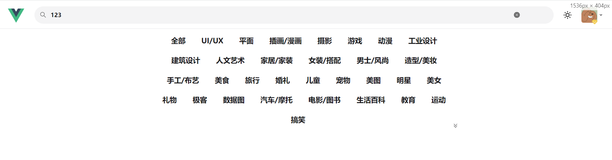
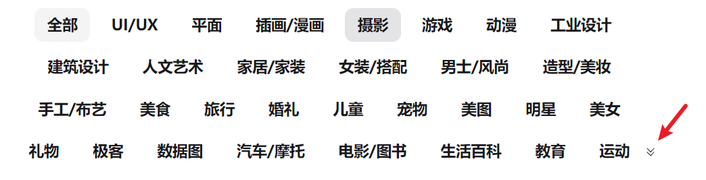
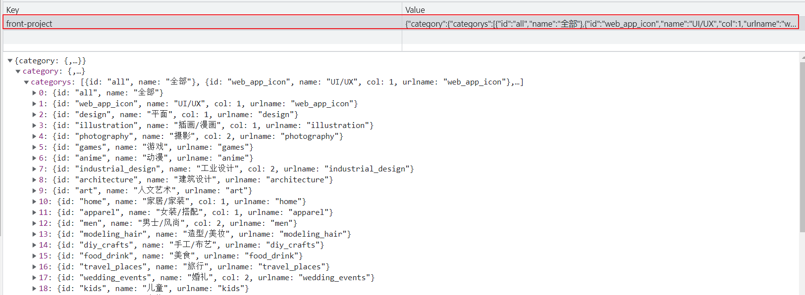

# 前中台响应式处理方案
#### 数据 
先分析数据，双方`（移动端和 PC端 ）`的数据是一样的。所以说这一块是完全可以复用的

那么目前`navigationBar`的数据是通过 `src/views/main/components/navigation/index.vue` 进行获取，然后进行传递的。那么期望进行数据的复用，如果一直进行数据传递的话，未免有些过于复杂了。

所以说对于数据，可以直接通过 **`vuex`** 来封装这一系列的 **获取、切换** 行为。

#### 视图
双方的视图在展示中的逻辑具备较大的差异，所以为了综合 **可维护性**，视图逻辑部分的话单独封装到各自的组件中来进行处理

#### 总结
就分析好了 **navigationBar** 的公有和私有部分：

1. 数据 为公有数据，可以在 `vuex` 中进行抽离处理
2. 视图 为私有部分，需要在各自的组件中进行单独处理
## 抽离公用逻辑，封装系列动作
根据刚才的分析，抽离公用逻辑，其实指的是：**把公有数据的一系列动作封装起来，那么想要封装我们就需要创建对应的 `vuex` 模块**

1. 创建 `src/store/modules/category.js` 文件
```js
import { getCategory } from '@/api/category'
import { ALL_CATEGORY_ITEM } from '@/constants'
export default {
  namespaced: true,
  state() {
    return {
      category: [ALL_CATEGORY_ITEM]
    }
  },
  mutations: {
    setCategorys(state, categorys) {
      state.categorys = [ALL_CATEGORY_ITEM, ...categorys]
    }
  },
  actions: {
    async getCategoryData(context) {
      const res = await getCategory()
      context.commit('setCategorys', res.categorys)
    }
  }
}
```

2. 在 `src/store/index.js` 中初始化 `store`，并注册 `category` 模块：
```js
import { createStore } from 'vuex'
import category from './modules/category'
import getters from './getters'

const store = createStore({
  getters,
  modules: {
    category
  }
})

export default store
```
3. 在 `src/store/getters.js` 中创建 `category` 的访问
```js
export default {
  categorys: (state) => state.category.categorys
}
```
4. 在 `main.js` 完成 `store` 注册：
```js
import store from './store'
createApp(App).use(store)...
```

5. 在 `src/views/main/components/navigation/index.vue` 转移数据获取到 `vuex`
```vue
<template>
  <mobile-navigation-vue v-if="isMobileTerminal" />
</template>

<script setup>
import { isMobileTerminal } from '@/utils/flexible'
import mobileNavigationVue from './mobile/index.vue'
import { useStore } from 'vuex'

const store = useStore()
// 触发 category 数据获取动作
store.dispatch('category/getCategoryData')
</script>
```
6. 在 `src/views/main/components/navigation/mobile/index.vue` 中，从 `vuex` 读取数据
```html
<!-- category item -->
<li
	v-for="(item, index) in $store.getters.categorys"
...
    
<m-popup v-model="isOpenPopup">
  <menu-vue @onItemClick="onItemClick"></menu-vue>
</m-popup>

<!-- js 部分删除 props -->
```

7. 在 `src/views/main/components/menu/index.vue` 中，从 `vuex` 读取数据

```html
<li
        v-for="(item, index) in $store.getters.categorys"
```

数据就已经被抽离到 `vuex` 之中

## PC 端 navigationBar 私有视图处理
1. 创建 `src/views/main/components/navigation/pc/index.vue` 文件
```vue
<pc-navigation-vue v-else></pc-navigation-vue>
```
2. 在 `src/views/main/components/navigation/index.vue` 中按需渲染


```vue
<pc-navigation-vue v-else></pc-navigation-vue>
```
3. 在 `src/views/main/components/navigation/pc/index.vue` 中，完成基本的数据渲染
```vue
<template>
  <div class="bg-white sticky top-0 left-0 w-full z-10">
    <ul
      class="w-[800px] relative flex flex-wrap justify-center overflow-x-auto px-[10px] py-1 text-xs text-zinc-600 duration-300 overflow-hidden mx-auto"
    >
      <!-- lg 下展开箭头 -->
      <div
        class="absolute right-1 bottom-1 z-20 p-1 rounded cursor-pointer duration-200 hover:bg-zinc-200"
      >
        <m-svg-icon
          name="unfold"
          class="w-1 h-1"
          fillClass="fill-zinc-900"
        ></m-svg-icon>
      </div>
      <!-- category item -->
      <li
        v-for="item in $store.getters.categorys"
        :key="item.id"
        class="shrink-0 px-1.5 py-0 z-10 duration-200 last:mr-4 text-zinc-900 text-base font-bold h-4 leading-4 cursor-pointer hover:bg-zinc-200 rounded mr-1 mb-1"
      >
        {{ item.name }}
      </li>
    </ul>
  </div>
</template>
```

4. 在 `src/views/layout/components/main.vue` 定义二级路由出口：
```vue
<template>
  <router-view></router-view>
</template>
```
5. 在 `src/router/modules/pc-routes.js` 中创建对应路由表
```js
export default [
  {
    path: '/',
    name: 'main',
    component: () => import('@/views/layout/index.vue'),
    children: [
      {
        path: '',
        name: 'home',
        component: () => import('@/views/main/index.vue')
      }
    ]
  }
]
```
## PC 端 navigationBar 私有逻辑处理


1. 在 `src/views/main/components/navigation/pc/index.vue`  **处理`展开/收缩`功能**

```vue
<script setup>
import { ref } from 'vue'

/**
 * 状态切换处理
 */
const isOpenCategoty = ref(false)
const triggerState = () => {
  isOpenCategoty.value = !isOpenCategoty.value
}
</script>
```

2. 通过数据控制展开和关闭状态
```vue
<template>
  ...
    <ul
      ...
      :class="[isOpenCategoty ? 'h-[206px]' : 'h-[56px]']"
    >
      <!-- lg 下展开箭头 -->
      <div
        ...
        @click="triggerState"
      >
        <m-svg-icon
          :name="isOpenCategoty ? 'fold' : 'unfold'"
          ...
        </m-svg-icon>
        ...
  </ul>
</template>
```
3. 建立数据源控制选中状态
```js
/**
 * 选中状态处理
 */
const currentCategoryIndex = ref(0)
const onItemClick = (index) => {
  currentCategoryIndex.value = index
}
```
4. 绑定状态到数据
```html
<!-- category item -->
<li
  ... 
  :class="{
    'text-zinc-900 bg-zinc-200 ': currentCategoryIndex === index
  }"
  @click="onItemClick(index)"
>
  {{ item.name }}
</li>
```
`PC` 端 `navigationBar` 基本渲染完成。
## 处理 navigationBar 闪烁问题

**分析问题出现的原因**

出现该问题的原因，其实非常简单：

* `在初始状态中，navigationBar` 所依赖的 `$store.getters.categorys` 并没有数据
* 当 `categoryData` 数据获取成功之后，进行展示
* 这样一个 **展示** 的过程就变成了 **闪烁** 的问题

**解决方案**
1. 让 `$store.getters.categorys` 具备一个**初始数据**
2. 当获取到服务端数据时，替换初始数据
3. 同时缓存该次服务端数据，作为下次的初始数据
4. 之后每次进入都执行该三步操作

1. 在 `src/constants/index.js` 定义初始数据
```js
// 初始 category 数据
export const CATEGORY_NOMAR_DATA = [
  ALL_CATEGORY_ITEM,
  { id: 'web_app_icon', name: 'UI/UX' },
  { id: 'design', name: '平面' },
  { id: 'illustration', name: '插画/漫画' },
  { id: 'photography', name: '摄影' },
  { id: 'games', name: '游戏' },
  { id: 'anime', name: '动漫' },
  {
    id: 'industrial_design',
    name: '工业设计'
  },
  {
    id: 'industrial_design',
    name: '建筑设计'
  },
  {
    id: 'industrial_design',
    name: '人文艺术'
  },
  {
    id: 'industrial_design',
    name: '家居/家装'
  }
]
```
2. 在 `src/store/modules/category.js` 中赋值初始数据
```js
import { getCategory } from '@/api/category'
import { ALL_CATEGORY_ITEM,CATEGORY_NOMAR_DATA } from '@/constants'
export default {
  namespaced: true,
  state() {
    return {
      categorys: CATEGORY_NOMAR_DATA // 指定这些初始数据
    }
  },
  mutations: {
    setCategorys(state, categorys) {
      state.categorys = [ALL_CATEGORY_ITEM,...categorys]
    }
  },
  actions: {
    async getCategoryData(context) {
      const res = await getCategory()
      context.commit('setCategorys', res.categorys)
    }
  }
}
```
那么此时再刷新页面，`navigationBar` 则不在闪烁

### category 数据缓存，覆盖初始数据
**缓存请求得来的 vuex 中的数据，并且在下次运行时把缓存的数据作为初始值**

可以利用 [vuex-persistedstate](https://github.com/robinvdvleuten/vuex-persistedstate)

`vuex-persistedstate`：可以自动保存 `vuex` 中的数据到 `localStorage`，并且在下次开始的时候自动读取这个数据到对应的 `state` 中

1. 安装 **vuex-persistedstate**

```shell
npm i --save vuex-persistedstate@4.1.0
```

2. 在 `src/store/index.js` 中导入，并注册 `plugin`

```js
import createPersistedState from 'vuex-persistedstate'
const store = createStore({
  ...
  plugins: [
    createPersistedState({
      // 保存到 localStorage 中的 key
      key: 'front-project',
      // 需要保存的模块
      paths: ['category']
    })
  ]
})
```


