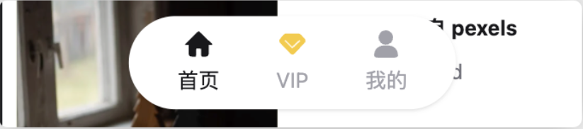
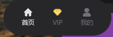
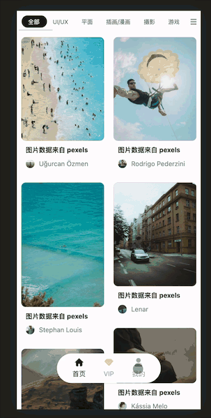
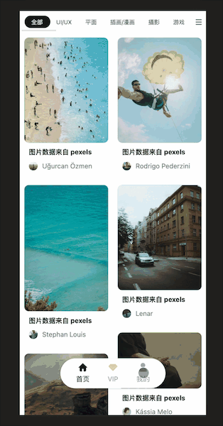
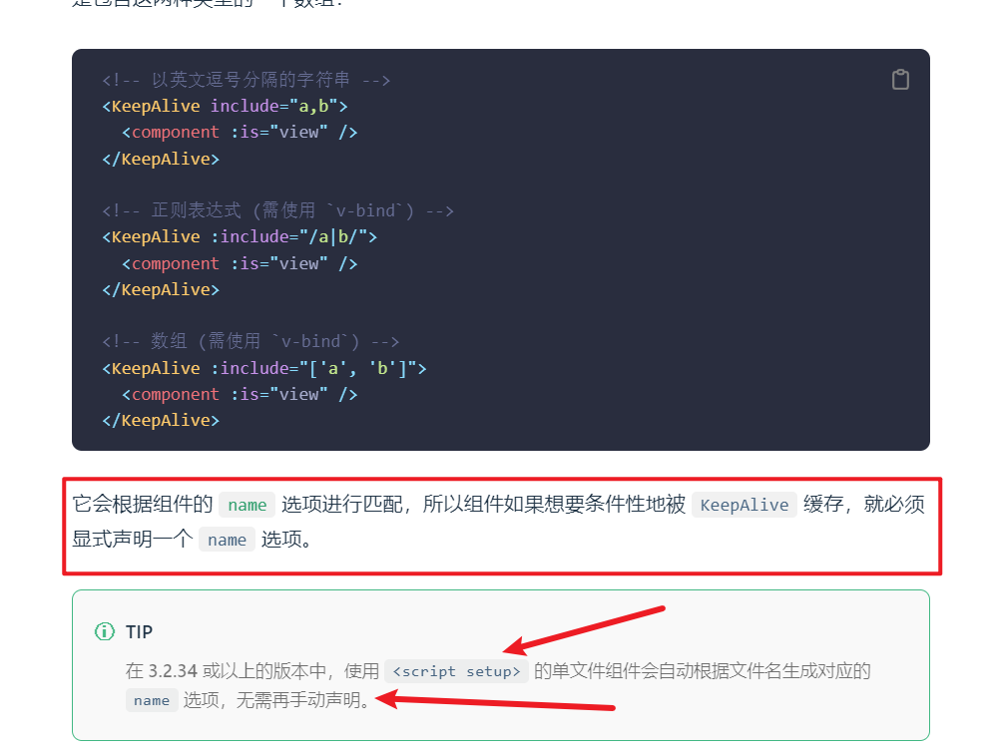

# 移动端路由切换解决方案  - 虚拟任务栈让 H5 丝滑
## 通用组件：trigger-menu 和 trigger-menu-item 构建方案分析
现在主要处理的就是移动端下的交互内容。那么对于移动端的展示而言，它有一个和 `PC端` 非常不一样的地方，那就是：


这块内容充当了移动端中的 `TabBar` 的作用，所以目前期望把它封装为一个通用的组件

我期望将来 `trigger-menu` 可以以这样的形式进行使用：
```html
<m-trigger-menu>
  <m-trigger-menu-item
    icon="home"
    iconClass="fill-zinc-900 dark:fill-zinc-200"
    >首页</m-trigger-menu-item
  >
  <m-trigger-menu-item
    icon="vip"
    iconClass="fill-zinc-400 dark:fill-zinc-500"
    textClass="text-zinc-400 dark:text-zinc-500"
    @click="onVipClick"
    >VIP</m-trigger-menu-item
  >
  <m-trigger-menu-item
    icon="profile"
    iconClass="fill-zinc-400 dark:fill-zinc-500"
    textClass="text-zinc-400 dark:text-zinc-500"
    @click="onMyClick"
    >我的</m-trigger-menu-item
  >
</m-trigger-menu>
```

也就是说，它被分成了两个组件：`trigger-menu` 和 `trigger-menu-item`

所以分析需要针对于这两个组件分别进行分析：
1. `trigger-menu`：对于它而言，只起到一个 **包裹容器** 的作用，所以只需要提供一个对应的**插槽**即可
2. `trigger-menu-item` ：起到了对应的展示作用，展示包括了 `icon` 和 `文字`。所以内部应该存在 `svg-icon` 用来展示图片，存在一个插槽用来展示文字

### 通用组件：构建 trigger-menu 和 trigger-menu-item

1. 创建 src/libs/trigger-menu/index.vue ：
```vue
<template>
  <div class="min-w-[180px] bg-white dark:bg-zinc-800 rounded-full shadow flex items-center justify-between px-2">
    <slot />
  </div>
</template>
<script setup>
</script>
```

2. 创建 `src/libs/trigger-menu-item/index.vue`，并定义 `props`：
```js
const props = defineProps({
  // 图标
  icon: {
    type: String,
    required: true
  },
  // icon 的类
  iconClass: {
    type: String
  },
  // 字体 类
  textClass: {
    type: String,
    default:'text-zinc-900 dark:text-zinc-200'
  },
  // 跳转到哪里
  to: {
    type:String
  }
})
```

3. 根据 `props` 处理对应视图：
```vue
<template>
  <div class="flex flex-col items-center py-2 px-2" @click="clickItem">
    <m-svg-icon :name="icon" :fillClass="iconClass" class="w-2 h-2"></m-svg-icon>
    <span :class="textClass" class="text-sm mt-[4px] whitespace-nowrap"> 
      <slot />
    </span>
  </div>
</template>
<script setup>
const props = defineProps({
  // 图标
  icon: {
    type: String,
    required: true
  },
  // icon 的类
  iconClass: {
    type: String
  },
  // 字体 类
  textClass: {
    type: String,
    default:'text-zinc-900 dark:text-zinc-200'
  },
  // 跳转到哪里
  to: {
    type:String
  }
})
</script>
```
4. 处理对应的点击跳转：
```js
import { useRouter } from 'vue-router'
...
...
const router = useRouter()
const clickItem = () => {
  if (!props.to) {
    return
  }
  // 跳转
  router.push(props.to)
}
```

5 在 `src/views/main/index.vue`中根据 **设备状态(pc端/移动端)** 和 **登录/未登录状态** 进行展示：
```html
<!--移动端: 下面导航栏-->
    <m-trigger-menu v-if="isMobileTerminal" class="fixed bottom-2 left-[50%] translate-x-[-50%]">
      <m-trigger-menu-item 
        icon="home"  
        iconClass="fill-zinc-900 dark:fill-zinc-200"
        to="/"
      >
        首页
      </m-trigger-menu-item>
      <m-trigger-menu-item
        v-if="$store.getters.token"
        icon="vip"
        iconClass="fill-zinc-400 dark:fill-zinc-500"
        textClass="text-zinc-400 dark:text-zinc-500"
        to="/member"
      >
      VIP
    </m-trigger-menu-item>
    <m-trigger-menu-item
        icon="profile"
        iconClass="fill-zinc-400 dark:fill-zinc-500"
        textClass="text-zinc-400 dark:text-zinc-500"
        to="/profile"
    >
    {{$store.getters.token ? '我的' : '未登录'}}
    </m-trigger-menu-item>
  </m-trigger-menu>
```
那么至此, 渲染完成



## 前台业务下 H5 的应用场景
通常情况下我们说起移动端项目，指的一般是两种：

1. 原生 `APP`
2. `H5` 网页

现在所做的这个移动端，指的其实就是 `H5` 网页

而 `H5` 网页应用到手机端的时候，通常也是有两种运行的形式：

1. 直接在手机端浏览器中运行：这种使用情况相对较少。在这种情况下，用户明显的知道这就是一个网页
2. 在原生组件 `WebView` 中运行（混合开发）：通常会被嵌入到 `APP` 之中，这种使用情况比较多。所以以下内容，主要针对这种情况进行说明

那么这种情况下，用户会认为该内容是 `APP` 的一部分，不会把它当成网页，而是会把它当做 `原生APP`。那么一旦用户把它作为 `APP` 来进行衡量，那么就会对这块应用有更高的要求

比如可以接收一个网页的页面跳转为



但是绝对不能接受一个 `APP` 的页面跳转是这样，我理想的 `APP` 页面跳转应该是这个样子的：



路由之间的跳转应该具备对应的动画，并且**上一个页面的状态应该被缓存（页面的滚动状态和数据视图）**

现在期望把整个的一套移动端的跳转全部封装为一个 **通用组件** ，期望通过这个通用组件来实现 **移动端下 H5 页面的过渡功能**

## 通用组件：transition-router-view 构建方案分析 与 虚拟任务栈
接下来要实现 **移动端的过渡动效**，以达到一个良好的移动端用户交互体验

它的实现方案整体分为两种：

1. 过渡动画
2. 组件缓存

#### 过渡动画
需要使用到 [过渡动效](https://router.vuejs.org/zh/guide/advanced/transitions.html) 这个功能，它描述了两个路由之间进行过渡时的动画效果

这个功能的官方描述中，主要包含了三个对应的组件
```html
<!-- 路由出口 -->
<router-view v-slot="{ Component }">
  <!-- 动画 -->
  <transition :name="transitionName">
    <!-- 动态组件 -->
    <component :is="Component" />
  </transition>
</router-view>
```
利用其中的 `transition` 就可以实现跳转时的动画效果

但是需要注意过渡动画分为两部分：
1. 进入动画
2. 退出动画

所以这里 `transition` 的 `name` 需要是动态的，一次来表示对应的两种动画形式

#### 组件缓存
要使用到 组件缓存 ，所以还需要依赖 [keep-alive](https://v3.cn.vuejs.org/api/built-in-components.html#keep-alive)

那么这四个组件想要在一起工作，将要按照以下的方式进行组合
```html
<!-- 路由出口 -->
<router-view v-slot="{ Component }">
  <!-- 动画组件 -->
  <transition
    :name="transitionName"
  >
    <!-- 缓存组件-->
    <keep-alive>
      <!-- 动态组件 -->
      <component
        :is="Component"
        :key="$route.fullPath"    // 同域名下的跳转。比如（动态路由 /detail/:id）      
      />
    </keep-alive>
  </transition>
</router-view>
```

但需要注意：**不是所有的组件都需要缓存**

在当前移动端的组件处理中，同样期望有一个栈来维护组件进入和退出流程，所以把这样的一套流程，称作：**虚拟任务栈**

那么对于这样的一个虚拟任务栈而言，可以通过 **数组** 来进行维护，因为数组与栈的概念相同都是：**先进后出** 的流程

然后我们可以通过 `keep-alive` 中的 `include` 概念，把 **虚拟任务栈 - 数组** 进行绑定，从而实现 **任务栈** 的缓存概念

#### 总结
1. 过渡动画：利用 **过渡动效** 实现
2. 组件缓存：**虚拟任务栈 - 数组** 配合 `keep-alive` 中的 `include` 实现


### 通用组件：transition-router-view 构建方案之过渡动效
1. 创建 `src/libs/transition-router-view/index.vue` 组件

2. 创建如下 `template`
```js
<template>
  <!-- 路由出口 -->
  <router-view v-slot="{ Component }">    <!--注意 Component 要大写 -->
    <!-- 动画组件 -->
    <transition :name="transitionName">
      <!-- 缓存组件 -->
      <keep-alive>                        <!--keep-alive 只允许有一个节点, 所以不能有注释-->
        <component :is="Component" />
      </keep-alive>
    </transition>
  </router-view>
</template>
```

3. 定义对应的 `props` ：
```vue
<script>
// none
const ROUTER_TYPE_NONE = 'none'
// 进入 push
const ROUTER_TYPE_PUSH = 'push'
// 退出 back
const ROUTER_TYPE_BACK = 'back'
</script>
<script setup>
import { ref } from 'vue'
import { useRouter } from 'vue-router'
const props = defineProps({
  // 状态: none , push , back 
  routerType: {
    type: String,
    default: ROUTER_TYPE_NONE,
    validator(val) {
      const routerTypeArr = [ROUTER_TYPE_NONE, ROUTER_TYPE_PUSH, ROUTER_TYPE_BACK]
      const result = routerTypeArr.includes(val)
      if (!result) {
        throw new Error(`你必须要传入 ${routerTypeArr.join(',')} 中的一个值`)
      }
      return result
    }
  },
  // 首页的组件名称, 对应任务栈的第一个组件
  mainComponentName: {
    type: String,
    required:true
  }
})
</script>
```

4. 接下来处理 **路由过渡动画：**
```vue
<style lang="scss" scoped>
// push页面时：新页面的进入动画
.push-enter-active {
  animation-name: push-in;
  animation-duration: 0.4s;
}
// push页面时：老页面的退出动画
.push-leave-active {
  animation-name: push-out;
  animation-duration: 0.4s;
}
// push页面时：新页面的进入动画
@keyframes push-in {
  0% {
    transform: translate(100%, 0);
  }
  100% {
    transform: translate(0, 0);
  }
}
// push页面时：老页面的退出动画
@keyframes push-out {
  0% {
    transform: translate(0, 0);
  }
  100% {
    transform: translate(-50%, 0);
  }
}

// 后退页面时：即将展示的页面动画
.back-enter-active {
  animation-name: back-in;
  animation-duration: 0.4s;
}
// 后退页面时：后退的页面执行的动画
.back-leave-active {
  animation-name: back-out;
  animation-duration: 0.4s;
}
// 后退页面时：即将展示的页面动画
@keyframes back-in {
  0% {
    width: 100%;
    transform: translate(-100%, 0);
  }
  100% {
    width: 100%;
    transform: translate(0, 0);
  }
}
// 后退页面时：后退的页面执行的动画
@keyframes back-out {
  0% {
    width: 100%;
    transform: translate(0, 0);
  }
  100% {
    width: 100%;
    transform: translate(50%, 0);
  }
}
</style>
```

5. 处理逻辑
```js
const router = useRouter()
// 跳转动画
const transitionName = ref('')
/**
 * 监听路由变化
 */
router.beforeEach((to, from) => {
  // 定义当前动画名称
  transitionName.value = props.routerType
})
```

接下来我们就需要使用 `transition-router-view` ，通过 `routerType` 的 props 去指定跳转动画


现在期望：

1. 在 `PC端` 时：`routerType` 始终为 `NONE`
2. 在移动端时：`routerType` 根据进入或退出的状态指定为 `push` 或者 `back`

所以，这样的一个处理，可以通过一个全局的状态来进行管理：

1. 在 `src/store/modules/app.js` 中，定义对应的状态：
```js
export default {
  namespaced: true,
  state: () => ({
    ...
    // 路由跳转类型
    routerType: 'none'
  }),
  mutations: {
    ...
    /**
     * 修改 routerType
     */
    changeRouterType(state, newType) {
      state.routerType = newType
    }
  }
}
```

2. 定义对应的 `getters`，处理 `PC 端`状态：
```js
// 路由跳转方式
routerType: (state) => {
  // 在 PC 端下，永远为 none
  if (!isMobileTerminal.value) {
    return 'none'
  }
  return state.app.routerType
}
```

3. 在每次进行 `router.push()` 操作前，修改 `routerType` 为 `push`，在执行 `router.back()` 操作前，修改 `routerType` 为 `back`。但是需要注意两点：


* 不要再 `libs` 中修改，因为 `libs` 为通用组件
* 不要再跳转到 **首页** 时添加该操作，因为首页为任务栈的 **根**

此时, 虽然动画 “有些问题” 但是整个的进入和退出动画已经可以正常展示

### 处理过渡动效展示样式错误的问题
审查元素我们可以发现，该样式错误的原因其实是因为 **两个组件的样式在同一个文档流** 导致的。

所以只需要在动画开始前，让组件**脱离文档流**，在动画结束后在回归原文档流即可


1. 在 `src/libs/transition-router-view/index.vue` 中，监听动画开始和结束的状态：
```html
<transition
      :name="transitionName"
      @before-enter="beforeEnter"
      @after-leave="afterLeave"

```

2. 在对应状态时，定义变量：
```js
// 处理动画状态变化
const isAnimation = ref(false)
const beforeEnter = () => {
  isAnimation.value = true
}
const afterLeave = () => {
  isAnimation.value = false
}
```

3. 根据动画状态为动态组件新增样式：
```html
<component
  :is="Component"
  :class="{ 'fixed top-0 left-0 w-screen z-50': isAnimation }"
/>
```

此时动画正常
### 虚拟任务栈处理



对于组件缓存而言，将通过 `keep-alive` 来构建一个虚拟任务栈：

1. 在 `src/libs/transition-router-view/index.vue` 中，定义变量：
```js
// 任务栈
const virtualTaskStack = ref([props.mainComponentName])
```
2. 在 `beforeEach` 中，定义出栈和入栈：
```js
/**
 * 监听路由变化
 */
router.beforeEach((to, from) => {
  ...

  if (props.routerType === ROUTER_TYPE_PUSH) {
    // 入栈
    virtualTaskStack.value.push(to.name)
  } else if (props.routerType === ROUTER_TYPE_BACK) {
    // 出栈
    virtualTaskStack.value.pop()
  }
})

```
3. 定义清空栈的方法，在进入首页时应该调用：
```js
/**
 * 清空栈
 */
const clearTask = () => {
  virtualTaskStack.value = [props.mainComponentName]
}

/**
 * 监听路由变化
 */
router.beforeEach((to, from) => {
  ...

  // 进入首页默认清空栈
  if (to.name === props.mainComponentName) {
    clearTask()
  }
})
```
4. 在 `keep-alive` 中，指定 `include` 属性：
```js
<keep-alive :include="virtualTaskStack" 
```
5. 在 `src/App.vue` 中指定 `mainComponentName` 为 `home：`
```html
    <m-transition-router-view 
      :routerType="($store.getters.routerType)"
      mainComponentName="home"
    ></m-transition-router-view>
```

6. 为所有的路由表和组件，指定对应的 `name`，并保持相同

比如:
```vue
<script>
export default {
  name:'home'
}
</script>
```

此时，已经可以完成动态的数据缓存
### 记录页面滚动位置
`keep-alive` 组件只能够帮助**缓存**组件，但是**不能**够记录页面的滚动位置

所以如果想要记录页面滚动位置的话，需要在 **通用组件外** 单独处理

目前在当前项目中仅需要保存 `home` 页面的滚动位置即可

1. 在 `src/views/main/index.vue` 中，进行记录滚动位置，可以通过 [useScroll](https://vueuse.org/core/useScroll/) 进行记录
```js
// 记录滚动位置
const containerRef = ref(null)
// 拿到滚动的距离
const { y } = useScroll(containerRef)
// 被激活时
onActivated(() => {
  if (!containerRef.value) {
    return
  }
  // 赋值给 scrollTop
  containerRef.value.scrollTop = y.value
})
```

至此 , 整个的 `transition-router-view` 已经完成
## 总结
两个通用组件的构建：

1. `trigger-menu` && `trigger-menu-item`
2. `transition-router-view`：
   1. 动画效果
   2. 组件缓存
   3. 滚动位置缓存

对于整个应用而言，页面部分就只剩 `VIP服务` 页面了

