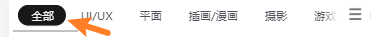
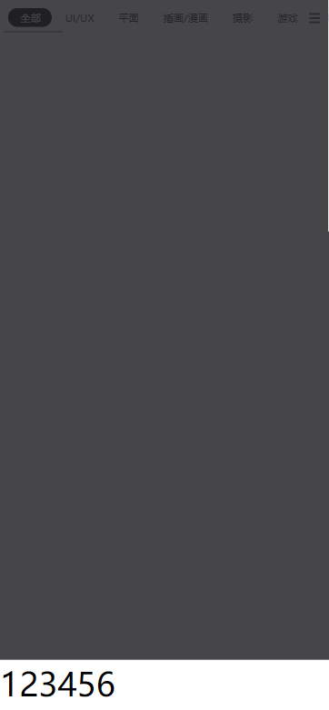
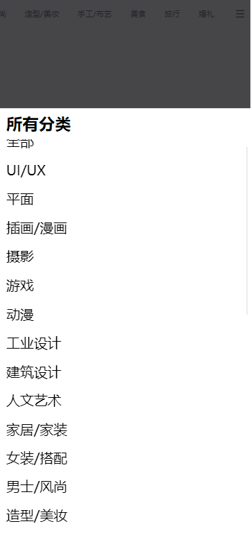

# 构建自己的组件库 - 实现前端设计
因为 **前台系统** 和 **后台系统** 的这种 **根本性的设计区别（前台讲究个性化，后台偏同质化）** ，所以这就导致了目前市面上的 **通用组件库** 更多的是 后台 PC 系统组件库（比如 element 或者 antd） 。

这就导致，如果想要开发一个前台系统，那么就需要拥有自己的 **组件库** 

这也是为什么必须要开发一个组件库的原因
## 业务组件：移动端 navigationBar
截止到现在已经可以成功的拿到简洁的服务端返回的数据，那么接下来就可以利用这个数据构建 **移动端 `navigationBar` 部分**

该部分的处理将分成两部分：

1. 数据
2. 视图

#### 数据
1. 在 `src/views/main/components/navigation/mobile/index.vue` 中定义 `props` 接收数据源
```vue
<script setup>
defineProps({
  data: {
    type: Array,
    required: true
  }
})
</script>
```

2. 在 `src/views/main/components/navigation/index.vue`中传递对应数据
```vue
<template>
  <mobile-navigation-vue v-if="isMobileTerminal" :data="categoryData" />
</template>

<script setup>
import { isMobileTerminal } from '@/utils/flexible'
import mobileNavigationVue from './mobile/index.vue'
import { getCategory } from '@/api/category'
import { ref } from 'vue'

const categoryData = ref([])
const getCategoryData = async () => {
  const { categorys } = await getCategory()
  categoryData.value = categorys
}
getCategoryData()
</script>
```

#### 视图
在 `src/views/main/components/navigation/mobile/index.vue` 中进行视图处理
```vue
<template>
  <div class="bg-white sticky top-0 left-0 z-10">
    <ul
      class="relative flex overflow-x-auto p-1 text-xs text-zinc-600 overflow-hidden"
    >
      <!-- category item -->
      <li
        v-for="item in data"
        :key="item.id"
        class="shrink-0 px-1.5 py-0.5 z-10 duration-200"
      >
        {{ item.name }}
      </li>
    </ul>
  </div>
</template>
```
那么至此 **移动端 navigationBar 部分** 就完成了基础的渲染

## 动态 rem 基准+修正 tailwind，完善移动端navigationBar

需要修正的点主要有两个：

1. **`rem` 基准值**：因为 `tailwind` 的尺寸单位默认为 `rem` ，这也是为了适配移动端下的情况。但是针对于这样的 `rem` 并没有指定其基准值，所以首先需要做的就是指定 `rem` 基准值。对于该基准值期望可以 **根据用户设备的不同，在一个幅度之内变化**，所以就需要一个 **动态的 `rem` 值** 

在 `src/utils/flexible.js` 中，新增一个方法
```js
/**
 * 初始化 rem 基准值，最大为 40px
 */
export const useREM = () => {
  // 定义最大的 fontSize
  const MAX_FONT_SIZE = 40

  // 监听 html 文档被解析完成的事件
  document.addEventListener('DOMContentLoaded', () => {
    // 获取 html 标签
    const html = document.querySelector('html')
    // 获取根元素 fontSize 标准，屏幕宽度 / 10。（以 Iphone 为例 Iphone 6 屏幕宽度为 375，则标准 fontSize 为 37.5）
    let fontSize = window.innerWidth / 10
    // 获取到的 fontSize 不允许超过我们定义的最大值
    fontSize = fontSize > MAX_FONT_SIZE ? MAX_FONT_SIZE : fontSize
    // 定义根元素（html）fontSize 的大小 （rem）
    html.style.fontSize = fontSize + 'px'
  })
}
```

接下来在 `main.js` 中调用它
```js
import { useREM } from './utils/flexible'
useREM()
```

2. **修正 `tailwind` 的基准值**: 对 `tailwind` 而言它具备默认的 [font-size](https://tailwindcss.com/docs/font-size) 大小，并且这个大小也是以 `rem` 作为标准指定的，但是因为通过的修改了基准 `rem` 所以这个 `tailwind` 的 `fontsize` 基准值我们也需要进行改变

在 `tailwind.config.js` 的 `theme` 选项中，进行以下指定
```js
  theme: {
    extend: {
      fontSize: {
        xs: ['0.25rem', '0.35rem'],
        sm: ['0.35rem', '0.45rem'],
        base: ['0.45rem', '0.55rem'],
        lg: ['0.55rem', '0.65rem'],
        xl: ['0.65rem', '0.75rem']
      }
    }
  }
```
那么此时，**移动端navigationBar** 的效果就具备了一个比较好看的基准样式了

## 通用组件：基于 Vite 的统一 svg 处理 svg-icon
接下来就处理第一个通用组件 `svg-icon` ：用于显示 `svg` 矢量图

1. 创建 `src/libs/svg-icon/index.vue`
```vue
<template>
  <svg aria-hidden="true">
    <use :xlink:href="symbolId" :class="fillClass" :fill="color"></use>
  </svg>
</template>
<script setup>
const props = defineProps({
  // 显示的 svg 图标名称 (不包含 #icon-)
  name: {
    type: String,
    required: true,
  },
  // 直接指定 svg 图标的颜色
  color: {
    type:String
  },
  // 通过 tailwind 指定 svg 颜色的类名
  fillClass: {
    type:String
  }
})
// 真实显示的 svg 图标名（拼接 #icon-）
const symbolId = computed(() => {
  return `#icon-${props.name}`
})
</script>
<style lang="scss" scoped>
</style>
```

2. 创建 `src/libs/index.js` ，完成通用组件注册
```js
import svgIcon from './svg-icon/index.vue'

export default {
  install(app) {
    app.component('m-svg-icon', svgIcon)
  }
}
```
3. 在 `main.js` 中导入，并利用 `use` 注册
```js
import mLibs from './libs'
createApp(App).use(mLibs)....
```
4. 最后在 ``src/views/main/components/navigation/mobile/index.vue`` 中使用组件, 显示汉堡按钮
```vue
<!-- 汉堡按钮 -->
<li
  class="z-20 fixed top-0 right-[-1px] h-4 px-1 flex items-center bg-white"
>
  <m-svg-icon class="w-1.5 h-1.5" name="hamburger"></m-svg-icon>
</li>
```

5. 因为期望汉堡按钮存在一个横向的阴影效果，在 `tailwind` 中没有对应的样式，所以需要新增这个样式, 在 `tailwind.config.js` 中写入
```js
module.exports = {
  ...
  theme: {
    extend: {
      ...
      boxShadow: {
        'l-white': '-10px 0 10px white'
      }
    }...
}
```
6. 在 `src/views/main/components/navigation/mobile/index.vue` 中使用该样式
```vue
<!-- 汉堡按钮 -->
<li
  class="... shadow-l-white"
>
  <m-svg-icon class="w-1.5 h-1.5" name="hamburger"></m-svg-icon>
</li>
```

7. 指定最后一个 `categoryItem` 距离右侧距离
```html
class="shrink-0 px-1.5 py-0.5 z-10 duration-200 last:mr-4"
```

发现其实面包屑按钮并 **未显示** ，那么为什么会这样？
## vite 处理 svg 矢量图
无论是 `vue-cli` 还是 `vite` 默认他们都不会处理咱们主动导入的 svg 矢量图标，也就是说 **虽然把 svg 图标放入到了项目中，但是 vite “无法使用” 到它们**

那么怎么办呢？

此时就需要使用到一个 `vite` 的 `plugin` [vite-plugin-svg-icons](https://github.com/vbenjs/vite-plugin-svg-icons)

1. 安装 `vite-plugin-svg-icons` 到项目中
```shell
npm i --save-dev vite-plugin-svg-icons@2.0.1
```

2. 在 `vite.config.js` 中注册
```js
...
import path, { join } from 'path'
import { createSvgIconsPlugin } from 'vite-plugin-svg-icons'

// https://vitejs.dev/config/
export default defineConfig({
  plugins: [
    vue(),
    createSvgIconsPlugin({
      // 指定需要缓存的图标文件夹
      iconDirs: [path.resolve(process.cwd(), 'src/assets/icons')],
      // 指定symbolId格式
      symbolId: 'icon-[name]'
    })
  ],
  ...
})
```

3. 在 `main.js` 中完成注册
```js
import 'virtual:svg-icons-register'
```

重新运行项目


## 移动端 slider 处理


接下来我们来处理对应的 `slider` 选中滑块。

对于选中滑块而言，我们想要处理分为两部分：

1. `slider` 滑块的本身样式
2. 滑块切换时逻辑与滚动动画

#### slider 样式处理
在 `src/views/main/components/navigation/mobile/index.vue` 中新增：
```vue
<!-- 滑块 -->
<li
  ref="sliderTarget"
  class="absolute h-[22px] bg-zinc-900 rounded-lg duration-200"
  :style="sliderStyle"
></li>
```

```vue
<script setup>
import { ref } from 'vue'

// 滑块 : height 固定,  需要改变的是 translateX的值和 width的值
const sliderStyle = ref({
  transform: 'translateX(0px)',
  width: '60px'
})
</script>
```

#### 处理切换逻辑


当 `slider` 进行切换时，它的当前位置就是通过 `translateX` 进行指定，也就是说只需要 **计算出当前点击的 `item 位置与宽度即可`**

就需要具备以下内容：

1. 选中的 `item` 下标：`currentCategoryIndex`
2. 所有的 item 元素：`itemRefs`
3. `ul` 的**横向滚动偏离位置**：`ulScrollLeft`
4. 最后在 `currentCategoryIndex` 发生改变时，获取 `item` 下标元素的 `left` 和 `width`，计算 `sliderStyle` 即可

```vue
<template>
  ...
	<ul
      ...
      ref="ulRef"
    >
      ...

      <!-- slider 滑块 -->
      <li
        ...
        ref="sliderRef"
        :style="sliderStyle"
      ></li>

      <!-- category item -->
      <li
        ...
        :ref="setItemRef"
        @click="onItemClick(index)"
      >
        {{ item.name }}
      </li>
    </ul>
</template>

<script setup>
import { ref, watch } from 'vue'
import { useScroll } from '@vueuse/core';
....
// slider 的样式:
const sliderStyle = ref({
  width: '60px',
  transform: 'translateX(0px)'
})
// 当前分类的 index
const currentCategoryIndex = ref(0)
// 切换 index
const onItemClick = (index) => {
  currentCategoryIndex.value = index
}
// 所有 category 的 el 数组
const itemRefs = []
const setItemRef = (el) => {
  if (el) {
    itemRefs.push(el)
  }
}
onBeforeUpdate(() => { // 数据变化之后, dom 变化之前
  itemRefs = []
})
const ulRef = ref(null)
const { x: ulScrollLeft } = useScroll(ulRef)
// 监听 currentCategoryIndex 的变化, 把对应元素的 width 和 left 赋值给slider的样式
watch(currentCategoryIndex, (newIndex) => {
  const currentCategoryEl = itemRefs[newIndex]
  const { width, left } = currentCategoryEl.getBoundingClientRect()
  // 改样式
  sliderStyle.value = {
    width: width + 'px',
    transform: `translateX(${ulScrollLeft.value + left - 10}px)`
  }
})
</script>
```

那么此时，就可以完成对应的一个 `slider` 切换效果。

最后只需要指定对应的 选中文字高亮即可

```vue
<!-- category item -->
<li
  ...
  :class="{
    'text-zinc-100 ': currentCategoryIndex === index
  }"
>
  {{ item.name }}
</li>
```
## 补全 category 数据 ('全部')
对于 `category` 的数据而言，服务端返回的数据之中，还缺少一个 **全部** 的数据源，这个在实际开发中是非常常见的一个情况，服务端仅会返回 **具体分类** 而不包含 **全部概念**

如果实际开发中也遇到了这样的情况的话，那么就需要 **自定义数据**，以补全缺失的展示数据

1. 在 `src/constants/index.js` 定义
```js
// category 的本地构建数据
export const ALL_CATEGORY_ITEM = {
  id: 'all',
  name: '全部'
}
```
2. 在 `src/views/main/components/navigation/index.vue` 进行数据补全
```js
const getCategoryData = async () => {
  ...
  categoryData.value.unshift(ALL_CATEGORY_ITEM)
}
```
3. 修改 `src/views/main/components/navigation/mobile/index.vue` 中的 `sliderStyle` 初始宽度
```js
// 滑块
const sliderStyle = ref({
  transform: 'translateX(0px)',
  width: '52px'
})
```
## 通用组件：弹出窗口 - popup 能力分析


当点击 **面包屑按钮** 时，会有一个 弹出窗口 `popup` 自低而上弹出，那么这样的一个功能，一样可以把它处理为项目的 通用组件

那么想要处理 `popup` 的话，首先就需要先搞清楚 `popup` 的能力。

1. 当 `popup` 展开时，内容视图应该不属于任何一个 **组件内部** ，而应该直接被插入到 `body` 下面
2. `popup` 应该包含两部分内容，一部分为背景蒙版，一部分为内容的包裹容器
3. `popup` 应该通过一个双向绑定进行控制展示和隐藏
4. `popup` 展示时，页面滚动应该被锁定(不让页面滚动)
5. 内容区域应该接收所有的 `attrs`，并且应该通过插槽让调用方指定其内容
### 弹出窗口-popup 实现
1. 新建 `src/libs/popup/index.vue` 文件
::: details
```vue
<template>
  <div>
    <teleport to='body'>
      <!--蒙版-->
      <transition name="fade">
        <div v-if="modelValue" class="w-screen h-screen fixed z-40 left-0 top-0 bg-zinc-900/80"
          @click="emits('update:modelValue', false)"
        ></div>
      </transition>
      <!--弹出框-->
      <transition name="downToUp">
        <div v-if="modelValue" class="w-screen fixed  bottom-0 z-50 bg-white" v-bind="$attrs">
          <slot></slot>
        </div>
      </transition>
    </teleport>
  </div>
</template>
<script setup>
import { watch } from 'vue'
import { useScrollLock } from '@vueuse/core'
const props = defineProps({
  modelValue: {
    type: Boolean,
  }
})
const emits = defineEmits(['update:modelValue'])

// 当popup 显示时 , 页面禁止滚动
const isLocked = useScrollLock(document.body)
watch(() => props.modelValue, (val) => {
  if (val) {
    isLocked.value = val
  } else {
    isLocked.value = false
  }
}, {
  immediate: true
})
</script>
<style lang="scss" scoped>
  .fade-enter-active,.fade-leave-active {
    transition: all 0.25s ease;
  }
  .fade-enter-from,.fade-leave-to {
    opacity: 0;
  }
  .downToUp-enter-active,.downToUp-leave-active {
    transition: all 0.25s ease;
  }
  .downToUp-enter-from,.downToUp-leave-to {
    transform: translateY(100%);
  }
</style>
```
:::

2. 在 src/libs/index.js 中注册该组件
::: details
```js
import svgIcon from './svg-icon/index.vue'
import popup from './popup/index.vue'

export default {
  install(app) {
    app.component('m-svg-icon', svgIcon)
    app.component('m-popup', popup)
  } 
}
```
:::
3. 在 `src/views/main/components/navigation/mobile/index.vue` 中使用该组件
```vue
<!-- 汉堡按钮 -->
      <li
        ...
        @click="isOpenPopup = !isOpenPopup"
      >
        ...
      </li>

<m-popup v-model="isOpenPopup">
  <div>测试内容</div>
</m-popup>
```
```js
// popup 展示
const isOpenPopup = ref(false)
```


## vite 通用组件自动化注册
目前在项目中已经完成了两个通用组件，将来还会完成更多的通用组件开发。那么如果每次开发完成一个通用组件之后，都去手动进行注册，未免有些过于麻烦了，所以我们期望通过 **`vite` 提供的功能，进行通用组件的自动化注册**

如果想要完成这个功能的话，就需要使用到两个关键的知识点：
1. [vite 的 Glob 导入 功能](https://cn.vitejs.dev/guide/features.html#glob-import)：该功能可以帮助我们在 **文件系统中导入多个模块**
2. [vue 的 defineAsyncComponent 方法](https://v3.cn.vuejs.org/api/global-api.html#defineasynccomponent)：该方法可以创建一个 **按需加载的异步组件**

基于以上两个方法，实现 **组件自动注册**

在 `src/libs/index.js` 中：

::: details
```js
import { defineAsyncComponent } from 'vue'

export default {
  install(app) {
    // 获取当前路径任意文件夹下的 index.vue 文件
    const components = import.meta.glob('./*/index.vue')
    // 遍历获取到的组件模块
    for (const [key, value] of Object.entries(components)) {
      // 拼接组件注册的 name
      const componentName = 'm-' + key.replace('./', '').split('/')[0]
      // 通过 defineAsyncComponent 异步导入指定路径下的组件
      app.component(componentName, defineAsyncComponent(value))
    }
  }
}
```
:::

## 业务组件：移动端弹层 menu


当 `popup` 弹出时，期望在内部展示一个对应的 列表 `menu`，这一块就是一个标准的业务组件，可以直接去进行渲染

创建 `src/views/main/components/menu/index.vue`
```vue
<template>
  <div class="h-[80vh] py-1 flex flex-col">
    <h1 class="px-1 pb-1 font-bold text-xl">所有分类</h1>
    <ul class="overflow-y-scroll">
      <li v-for="item,index in categorys" :key="index"
        class="px-1 py-1 text-lg active:bg-zinc-200 duration-200"
        @click="onItemClick(index)"
      >
        {{item.name}}
      </li>
    </ul>
  </div>
</template>
<script setup>
const props = defineProps({
  categorys: {
    type: Array,
    required: true
  }
})
const emits = defineEmits(['itemClick'])
// 点击 item 时 触发事件
const onItemClick = (index)=> {
  emits('itemClick', index)
}
</script>
```
在 `src/views/main/components/navigation/mobile/index.vue` 接受数据，并触发事件函数

```vue
<m-popup v-model="isOpenPopup">
	<menu-vue :categorys="data" @itemClick="itemClick"></menu-vue>
</m-popup>

// item 点击事件
const itemClick = (index) => {
  currentCategoryIndex.value = index
  isVisible.value = false
}
```
## 总结
在这里处理了 **移动端的 navgationBar 模块**，在处理该模块的过程中，做了：

1. 自定义了两个通用组件，这两个组件都是将来可以被随意放入到 **中台组件库/物料库** 中：
* `svg-icon`
* `popup`
2. 修正了 `rem` 值，对于移动端的 `rem` 处理目前可以根据设备的不同来自动修正
3. 基于 `vite` 的 `svg` 矢量图导入和自动组件注册
4. 使用了 `vueuse` 中更多的功能方法


