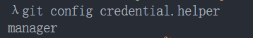
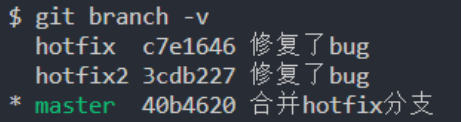

# Git
## Git的安装
* Git的官网：`https://git-scm.com/downloads`
* 根据自己的操作系统下载 Git 即可

### Git 的配置分类
既然已经在系统上安装了 Git，你会需要做几件事来定制你的 Git 环境：
* 每台计算机上只需要配置一次，程序升级时会保留配置信息；
* 你可以在任何时候再次通过运行命令来修改它们；

Git 自带一个 git config 的工具来帮助设置控制 Git 外观和行为的配置变量：
1. `/etc/gitconfig` 文件：包含系统上每一个用户及他们仓库的通用配置
* 如果在执行 git config 时带上 --system 选项，那么它就会读写该文件中的配置变量；
*  由于它是系统配置文件，因此你需要管理员或超级用户权限来修改它。（开发中通常不修改）
2. **`~/.gitconfig 或 C/用户/coderwhy/.gitconfig` 文件：只针对当前用户**
* **你可以传递` --global` 选项让 Git 读写此文件，这会对你系统上 所有 的仓库生效；**
3. `当前使用仓库的 Git 目录中的 config 文件（即 .git/config）`：针对该仓库
* 你可以传递 --local 选项让 Git 强制读写此文件，虽然默认情况下用的就是它；
### Git 额配置选项 
**安装 Git 后，要做的第一件事就是设置你的用户名和邮件地址。**
* 这一点很重要，因为**每一个 Git 提交都会使用这些信息**，它们会写入到你的每一次提交中，不可更改；
* 如果使用了 `--global` 选项，**那么该命令只需要运行一次**，因为之后无论你在该系统上做任何事情， Git 都会使用那些信息；

```shell
git config --global user.name "eren"

git config --global user.email "66666666@163.com"
```

**检测当前的配置信息：`git config --list`**


查看单个某个配置项
```shell
git config user.name  // eren
```
## 获取Git仓库 – git init / git clone

通常有两种获取 Git 项目仓库的方式：
* 方式一：**初始化一个Git仓库**，并且可以将当前项目的文件都添加到Git仓库中（目前很多的脚手架在创建项目时都会默认创建一个Git仓库）；
* 方式二：**从其它服务器 克隆（clone）** 一个已存在的 Git 仓库（第一天到公司通常我们需要做这个操作）；

**方式一：初始化Git仓库**
```shell
git init
```
* 该命令将创建一个名为 `.git` 的子目录，这个子目录含有你初始化的 Git 仓库中所有的必须文件，这些文件是 Git 仓库的核心；
* 但是，在这个时候，我们仅仅是做了一个初始化的操作，你的项目里的文件还没有被跟踪；

**方式二：从Git远程仓库**
```shell
git clone https://github.com/coderwhy/hy-react-web-music.git
```
## 文件的状态划分
* **未跟踪：** 默认情况下，Git仓库下的文件也没有添加到Git仓库管理中，我们需要通过 `add` 命令来操作；
* **已跟踪：** 添加到Git仓库管理的文件处于已跟踪状态，Git 可以对其进行各种跟踪管理；

**已跟踪**的文件又可以进行细分状态划分：
* `staged`：暂缓区中的文件状态；
* `Unmodified`：`commit` 命令，可以将 staged 中文件提交到 Git 仓库
* `Modified`：修改了某个文件后，会处于 Modified 状态；


## 检测文件的状态 - git status
我们在有 Git 仓库的目录下新建一个文件，查看文件的状态：
```shell
git status
```


`Untracked files`：未跟踪的文件
* 未跟踪的文件意味着 Git 在之前的提交中没有这些文件；
* Git 不会自动将之纳入跟踪范围，除非你明明白白地告诉它“我需要跟踪该文件”；

也可以查看更加简洁的状态信息：
```shell
git status -s
git status --short 
```


## 文件添加到暂存区 – git add
```shell
git add .
```
跟踪新文件命令：
* 使用命令 `git add` 开始跟踪一个文件

跟踪修改的文件命令：
* 如果我们已经跟踪了某一个文件，这个时候**修改了文件也需要重新添加到暂存区中**

## git 忽略文件
一般我们总会有些文件无需纳入 Git 的管理，也不希望它们总出现在未跟踪文件列表。
* 通常都是些自动生成的文件，比如日志文件，或者编译过程中创建
的临时文件等；
* 我们可以创建一个名为 .`gitignore` 的文件，列出要忽略的文件的模
式；
在实际开发中，这个文件通常不需要手动创建，在必须的时候添加自
己的忽略内容即可；

比如创建的 `Vue` 项目自动创建的忽略文件：
* 包括一些不需要提交的文件、文件夹；
* 包括本地环境变量文件；
* 包括一些日志文件；
* 包括一些编辑器自动生成的文件；


## 文件更新提交 – git commit
现在的暂存区已经准备就绪，可以提交了。
* 每次准备提交前，先用 `git status` 看下，你所需要的文件是不是都已暂存起来了；
* 再运行提交命令 `git commit`；
* 可以在 `commit` 命令后添加 `-m` 选项，将提交信息与命令放在同一行
```shell
git commit –m "提交信息"
```

如果 `add` 操作和 `commit` 操作比较繁琐 , 那么可以将两个命令结合来使用
```shell
git commit -a -m '提交信息'
```

## 查看提交历史 - git log 
在提交了若干更新，又或者克隆了某个项目之后，有时候我们想要查看一下所有的历史提交记录。

这个时候可以使用 `git log` 命令：
* 不传入任何参数的默认情况下，`git log` 会按时间先后顺序列出所有的提交，最近的更新排在最上面；
* 这个命令会列出每个提交的 SHA-1 校验和、作者的名字和电子邮件地址、提交时间以及提交说明；

```shell
git log 
```

```shell
git log --pretty=oneline
```


```shell
git log --pretty=oneline --graph
```


## 版本回退 – git reset
如果想要进行版本回退，我们需要先知道目前处于哪一个版本：Git 通过 HEAD 指针记录当前版本。
* HEAD 是当前分支引用的指针，它总是指向该分支上的最后一次提交；
* 理解 HEAD 的最简方式，就是将它看做 该分支上的最后一次提交 的快照；


可以通过 `HEAD` 来改变 Git 目前的版本指向：
* 上一个版本就是`HEAD^`，上上一个版本就是`HEAD^^`；
* 如果是上 1000 个版本，我们可以使用`HEAD~1000`；
* 我们可以可以指定某一个`commit id`；
```shell
git reset --hard HEAD^
git reset --hard HEAD~1000
git reset --hard 2d44982
```
回退以后再执行 `git log` 发现之前的提交记录已经看不见了 

那么这个时候想要回退到最出的提交开路的话可以使用 **`git reflog`** 查看更详细的提交记录, 并进行回退


## 远程仓库
什么是远程仓库`（Remote Repository）`呢？
* 目前我们的代码是保存在一个本地仓库中，也就意味着我们只是在进行本地操作；
* 在真实开发中，通常是多人开发的，所以将管理的代码共享到远程仓库中；

那么如何创建一个远程仓库呢？
* 远程仓库通常是搭建在某一个服务器上的（当然本地也可以，但是本地很难共享）；
* 所以我们需要在 Git 服务器上搭建一个远程仓库；

目前我们有如下方式可以使用Git服务器：
* 使用第三方的Git服务器：比如 `GitHub、Gitee、Gitlab等等`
* 在自己服务器搭建一个 Git 服务；
### 远程仓库的验证
常见的远程仓库有哪些呢？目前比较流行使用的是三种：
* `GitHub`：https://github.com/
* `Gitee`：https://gitee.com/
* 自己搭建 `Gitlab`：http://152.136.185.210:7888/

对于私有的仓库我们想要进行操作，远程仓库会对我们的身份进行验证：
* 如果没有验证，任何人都可以随意操作仓库是一件非常危险的事情；

目前 Git 服务器验证手段主要有两种：
* **方式一：基于 HTTP 的凭证存储（Credential Storage）**
* **方式二：基于 SSH 的密钥**
### 远程仓库的验证 – 凭证

因为本身 HTTP 协议是无状态的连接，所以每一个连接都需要用户名和密码：
* 如果每次都这样操作，那么会非常麻烦；
* 幸运的是，Git 拥有一个凭证系统来处理这个事情；

下面有一些 Git Crediential 的选项：
* 选项一：默认所有都不缓存。 每一次连接都会询问你的用户名和密码；
* 选项二：“cache” 模式会将凭证存放在内存中一段时间。 密码永远不会被存储在磁盘中，并且在15分钟后从内存中清除；
* 选项三：“store” 模式会将凭证用明文的形式存放在磁盘中，并且永不过期；
* 选项四：如果你使用的是 Mac，Git 还有一种 “osxkeychain” 模式，它会将凭证缓存到你系统用户的钥匙串中（加密的）；
* 选项五：如果你使用的是 Windows，你可以安装一个叫做 “`Git Credential Manager for Windows”` 的辅助工具；
  * 可以在 https://github.com/Microsoft/Git-Credential-Manager-for-Windows 下载。



### 远程仓库的验证 – SSH密钥
`Secure Shell`（安全外壳协议，简称SSH）是一种加密的网络传输协议，可在不安全的网络中为网络服务提供安全的传输环境。

SSH 以非对称加密实现身份验证。
* 例如其中一种方法是使用自动生成的公钥-私钥对来简单地加密网络连接，随后使用密码认证进行登录；
* 另一种方法是人工生成一对公钥和私钥，通过生成的密钥进行认证，这样就可以在不输入密码的情况下登录；
* 公钥需要放在待访问的电脑之中，而对应的私钥需要由用户自行保管；

如果我们以 SSH 的方式访问Git仓库，那么就需要生产对应的**公钥和私钥**：

```shell
ssh-keygen -t ed25519 -C “your email"
```


把这些文件拖到编辑器查看**公钥和私钥**

并把**公钥**添加到远程服务器上

## 管理远程服务器
**查看远程地址：比如我们之前从GitHub上clone下来的代码，它就是有自己的远程仓库的：**
```shell
git remote
git remote –v
-v是—verbose的缩写(冗长的)
```


**添加远程地址：让本地的仓库和远程服务器仓库建立连接**
```shell
git remote add <shortname> <url>
git remote add origin http://152.136.185.210:7888/coderwhy/gitremotedemo.git
远程仓库的名字默认经常会使用 origin 这个名字
```

**重命名远程地址：**
```shell
git remote rename origin gitlab
```
**移除远程地址：**
```shell
git remote remove origin
```
### 本地分支的上游分支（跟踪分支)
在本地的仓库和一个远程仓库建立连接之后想要执行 `git pull` 命令, 想拉下远程仓库的代码的时候出现问题


### 拒绝合并不相干的历史


## 远程仓库的交互


::: tip
情况一 : 到公司之后公司已经有了项目, 并且有远程仓库了
1. `git clone xxxxx`
2. 进行开发 
   * `git add .`
   * `git commit -m 'xxx'`
   * `git pull`
   * `git push`

情况二: 开发一个全新的项目(有我来搭建)
1. 先创建一个远程仓库
2. 有两种方案
   * **方案一:**
     1. `git clone  xxxxx`
     2. 在 git clone 下来的文件夹中搭建整个项目
     3. `git add .`
     4. `git commit -m 'xxx'`
     5. `git push`
   * **方案二:**
     1. 创建一个本地仓库并搭建本地的项目
     2. 把当前本地仓库和之前搭建的远程仓库进行关联 `git remote add origin xxxxx`
     3. gitee : `git branch --set-upstream-to=origin/master`

        **github**: `git branch --set-upstream-to=origin/main` 
     4. `git fetch`
     5. `git merge --allow-unrelated-histories`
     5. `git push`
:::

## Git标签（tag）
### 创建tag
**对于重大的版本常常会打上一个标签，以表示它的重要性：**
* Git 可以给仓库历史中的某一个提交打上标签；
* 比较有代表性的是人们会使用这个功能来标记发布结点（ v1.0 、 v2.0 等等）；

**创建标签：**
* Git 支持两种标签：轻量标签（lightweight）与附注标签（annotated）；
* 附注标签：通过-a选项，并且通过-m添加额外信息；
```shell
git tag v1.0.0

git tag -a v1.0.0 -m '附注标签'
```
**默认情况下，git push 命令并不会传送标签到远程仓库服务器上**
* 在创建完标签后你必须显式地推送标签到共享服务器上，当其他人从仓库中克隆或拉取，他们也能得到你的那些标签；
```shell
git push origin v1.0.0 把某一个标签共享到远程服务器上

git push origin --tags 把所有标签都共享到远程服务器上
```

### 删除和检出 tag
**删除本地tag：**
* 要删除掉你本地仓库上的标签，可以使用命令 `git tag -d <tagname>`
```shell
git tag -d v1.0.0
```

**删除远程tag：**
* 要删除远程的tag我们可以通过`git push <remote> –delete <tagname>`
```shell
git push origin -delete v1.0.0
```
**检出tag：**
* 如果你想查看某个标签所指向的文件版本，可以使用 `git checkout` 命令；
* 通常我们在检出 tag 的时候还会创建一个对应的分支
```shell
git checkout v1.0.0
```
## 分支
### 创建分支
Git 是怎么创建新分支的呢？
* 很简单，它只是为你创建了一个可以移动的新的指针；

**比如，创建一个 testing 分支， 你需要使用 git branch 命令：**
```shell
git branch testing
```

**那么，Git 又是怎么知道当前在哪一个分支上呢？**
* 也很简单，它也是通过一个名为 `HEAD` 的特殊指针
```shell
git checkout testing
```


### 分支提交
 如果我们指向某一个分支，并且在这个分支上提交：
 
 你也可以切换回到master分支，继续开发：


### 创建分支并同时切换

**创建新分支的同时切换过去**
* 通常我们会在创建一个新分支后立即切换过去；
* 这可以用 `git checkout -b <newbranchname>` 一条命令搞定；
```shell
git checkout -b newBranch
```
## 为什么需要使用分支呢？
**让我们来看一个简单的分支新建与分支合并的例子，实际工作中你可能会用到类似的工作流**。
* 开发某个项目，在默认分支master上进行开发；
* 实现项目的功能需求，不断提交；
* 并且在一个大的版本完成时，发布版本，打上一个tag v1.0.0；

**继续开发后续的新功能，正在此时，你突然接到一个电话说有个很严重的问题需要紧急修补， 你将按照如下方式来处理：**
* 切换到tag v1.0.0的版本，并且创建一个分支hotfix；

**想要新建一个分支并同时切换到那个分支上，你可以运行一个带有 -b 参数的 git checkout 命令**：`git checkout -b hotfix`


### 分支开发和合并
**分支上开发、修复bug**：
* 我们可以在创建的 hotfix 分支上继续修复 bug
* 当完成要做的工作后，重新打上一个新的 tag v1.0.1；

切换回 master 分支，但是这个时候 master 分支也需要修复刚刚的bug：
* 所以我们需要将 master 分支和 hotfix 分支进行合并；
```shell
git checkout master
git merge hotfix
```
### 查看和删除分支
如果我们希望查看当前所有的分支，可以通过以下命令：
```shell
git branch # 查看当前所有的分支
git branch –v # 同时查看最后一次提交
git branch --merged # 查看所有合并到当前分支的分支
git branch --no-merged # 查看所有没有合并到当前分支的分支
```


如果某些已经合并的分支我们不再需要了，那么可以将其移除掉：(commit 的记录是不会删除的, 只会将**指针**移除掉)
```shell
git branch –d hotfix # 删除当前分支
git branch –D hotfix # 强制删除某一个分支
```
## Git的工作流（git flow)
**由于Git上分支的使用的便捷性，产生了很多Git的工作流：**
* 也就是说，在整个项目开发周期的不同阶段，你可以同时拥有多个开放的分支；
* 你可以定期地把某些主题分支合并入其他分支中；

**比如以下的工作流：**
* master 作为主分支；
* develop 作为开发分支，并且有稳定版本时，合并到master分支中；
* topic 作为某一个主题或者功能或者特性的分支进行开发，开发完成后合并到develop分支中；


### 比较常见的git flow


## Git的远程分支


