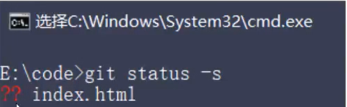
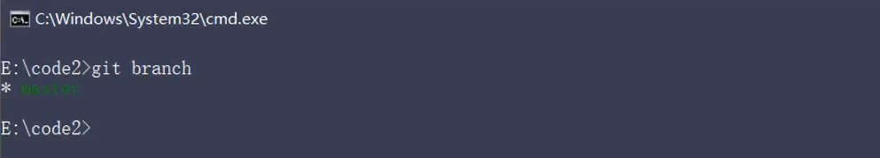

# Git
## 基本操作
### 获取 Git 仓库的两种方式
1. **将**尚未进行版本控制的**本地目录转换为 Git 目录**

2. 从其他服务器**克隆**一个已存在的Git仓库
### 现有目录中初始化仓库
当前目录转化为 Git 仓库
```shell
git init 
```
这个命令会创建一个名为 **.git** 的隐藏目录, 这个 .git 目录就是当前项目的 Git 仓库

### 工作区中文件的4种状态 
工作区中每一个文件可能有 **4 种状态**, 这四种状态共分为**两大类**: 


Git 操作的终极结果: 让工作区中的文件都处于 "未修改的" 状态

### 检查文件的状态
```shell
git status
```


Untracked files(未跟踪的文件) , Git 不会自动将值纳入跟踪范围, 除非我明确告诉他 "我要使用 Git 跟踪管理该文件" 
### 精简方式显示文件状态
两条命令完全等价 , 其中 **-s 是 --short 的简写形式**
```shell 
# 以精简的方式显示文件状态
git status -s

git status --short
```
未跟踪的有 红色的 `??` 标记


### 跟踪新文件
```shell
git add 一个文件
```
再运行 `git status` 命令, 会看到 index.html 文件在 *Changes to be committed*  , 说明已经被跟踪, **并处于暂存状态**: 


以精简方式显示文件的状态, 文件前面有绿色的 `A` 标记


### 提交更新
**-m 选项**后面是本次的提交信息, 用来对提交的内容进一步的描述
```shell
git commit -m '提交一个文件'
```

`git status` 检查状态

证明工作区中所有的文件都处于 **"未修改"** 的状态, 没有任何文件需要提交
### 对已提交的文件进行了修改
修改了已提交的文件的内容在之后, 再次运行 `git status` 和 `git status -s`


modified, 说明已跟踪的文件的内容发生了变化 , 但还没放到暂存区

有 红色的 `M`标记

### 暂存已修改的文件

绿色的 M
### 提交已暂存的文件
再次提交
```shell
git commit -m '再洗提交'
```

### 撤销对文件的修改
撤销对文件的修改指的是: 把工作区中对应文件的修改, **还原**成 Git 仓库中所保存的版本 

注意: 所有的修改会被丢失, 且无法修复! **危险性比较高, 慎重操作**! 
```shell
git checkout -- 文件名
```
### 取消暂存的文件
如果需要从暂存区中移除对应的文件, 使用这个命令
```shell
git reset HEAD 要移除的文件名称

git reset HEAD . 
```
### 跳过使用暂存区域
Git 标准的工作流程是 **工作区 -> 暂存区 -> Git 仓库**

这个过程优点繁琐, 可以简化为 **工作区 -> Git仓库**

git commit 加上 `-a`选项, 自动暂存一并提交
```shell
git commit -a -m '描述信息'
```

### 移除文件
```shell
# 从 Git 仓库和工作区中同时移除 index,js 文件
git rm -f index.js
# 只从 Git 仓库中移除 index.js 文件, 但保留工作区中 index.css 文件
git rm -- cached index.js
```
还要 commit 一下
### 忽略文件和 glob 匹配模式

.gitignore 配置文件

1. #开头的是注释
2. / 结尾的是目录
3. / 开头的防止递归
4. !开头表示取反
5. glob模式下进行文件和文件夹的匹配(glob 指简化了的正则表达式 )


glob模式: 


.gitignore文件的例子:

### 查看提交历史

### 回退到指定版本


## github
### 远程仓库克隆到本地
```
git clone 远程仓库的地址
```
## 分支
### 分支的作用

### master 主分支
初始化本地 Git 仓库, 默认已经创建了 master 的分支, 也叫做**主分支** 


作用: **用来保存和记录整个项目已完成的功能代码**

因此不允许程序员在 master 主分支上修改代码, 因为这样做风险太高, 容易导致整个项目的崩溃
### 功能分支
由于程序员不能在 master 分支上进行功能的开发, 所以就有了**功能分支**的概念

**功能分支**指的是**专门用来开发新功能的分支**, 它是临时从 master 主分支分叉出来的 , 最终合并到 master 主分支

### 查看分支列表
查看当前 Git 仓库中所有的分支列表: 
```shell
git branch 
```

分支名称前面的 `*`号**表示当前所处的分支**
### 创建新分支
基于当前分支, 创建一个新的分支, 此时, 新分支中的代码和当前分支完全一样
```
git branch 分支名称
```


### 切换分支
```shell
git checkout 都要切换的分支名称
```


### 分支的快速创建和切换
创建指定名称的新分支, 并立即切换到新分支上
```
git checkout -b  分支名称
```
是简写形式:
* git branch 分支名称
* git checkout 分支名称

### 合并分支
功能分支的代码开发测试完毕后, 可以使用如下命令, 将完成的代码合并到 master 主分支上:

```shell
# 1. 切换到 master 分支
git checkout master
# 2. 在 master 分支上运行 git merge 命令, 将分值代码合并到 master 主分支
git merge 分支名称 
```

假设要把 C 代码 合并到 A 分支, 则必须**先切换到 A 分支, 在运行 git merge 命令**, 合并 C 分支

### 删除分支
```
git branch -d 分支名称
```

### 遇到冲突时的分支合并
程序员手动打开文件, 需要**手动解决冲突**

手动解决了冲突之后,在执行, `git add .` ,`git commit -m '解决冲突的问题'`


## 远程分支操作
### 本地分支 推送到远程仓库
**第一次**将分支推送到跟远程仓库

### 查看远程仓库中所有的分支列表
```shell
git remote show 远程仓库名称
```
远程仓库名称默认为 origin

### 跟踪分支
从远程仓库中, 把远程分支下载到本地仓库中, 需要运行的命令:

### 拉取远程分支最新的代码
把远程分支最新的代码下载到本地对应的分支中
```
git pull
```
### 删除远程分支

## Git的远程分支 !!!
**远程分支是也是一种分支结构：**
* 以 `<remote>/<branch>` 的形式命名的；

**操作一：推送分支到远程**
* 当你想要公开分享一个分支时，需要将其推送到有写入权限的远程仓库上；
* 运行 `git push <remote> <branch>`；
```shell
git push origin <branch>
```
**操作二：跟踪远程分支**
* 当克隆一个仓库时，它通常会自动地创建一个跟踪 origin/main 的 main 分支；
* 如果你愿意的话可以设置其他的跟踪分支，可以通过运行 `git checkout --track <remote>/<branch>`
* 如果你尝试检出的分支 (a) 不存在且 (b) 刚好只有一个名字与之匹配的远程分支，那么 Git 就会为你创建一个跟踪分支
```shell
git checkout --track <remote>/<branch>
git checkout <branch>  #简写
```
**操作三：删除远程分支**
* 如果某一个远程分支不再使用，我们想要删除掉，可以运行带有 --delete 选项的 git push 命令来删除一个远程分支。
```shell
git push origin --delete <branch>
```


**将本地仓库和远程仓库建立连接**
```shell
git init 创建本地仓库
创建一些文件之后
git add .
git commit -m '初始化项目'

目前跟远程仓库没有建立过关系, 所以先需要把本地仓库跟远程仓库建立关系
git remote add origin xxxxxxxxxxxxxxxxx 跟远程仓库建立关系

git fetch origin main  把远程仓库的 main 分支拿到本地去了 , 在本地叫做 origin/main

git branch --set-upstream-to=origin/main  设置上游分支

本地的分支和远程的分支没有共同的祖先(common base), 所以不能 git merge(完整写法是 git merge origin main, 但上面已经设置了上游分支, 所以默认可以省略) 
所以要执行 git merge --allow-unrelated-histories

但 git push 的时候又不行
(1) 需要执行 git config push.default upstream

因为 git push 的默认是 git config push.default simple  , simple 的时候会去找本地的 master 分支, 而不是上游分支, 所以不行

再 git push

(2)或者 
git checkout --track origin/main

因为本地的分支叫做 master ,  远程的分支叫做 main, 两个名字不一样的情况下不行
`git checkout --track origin/main` 表示要跟踪 origin/main

再 git push
```

在本地新创建一个 `develop` 分支
```shell
git checkout -b develop #在本地创建了一个 develop 分支 

要把本地的 develop 分支推送到远程
git push origin develop 
那么远程也多了一个叫 develop 的分支

在 develop 分支上提交一些文件之后, 但这个时候还不能执行 git push 推送到远程, 还需要指定上游分支
git branch --set-upstream-to=origin/develop

然后才可以执行 git push
```
比如项新增特性, 在本地创建了一个叫做 `feature` 分支(步骤同上)
```shell
git checkout -b feature

git push origin feature

git branch --set-upstream-to=origin/feature

然后把一些新的文件推送到远程, git push
```

作为 **组员**的操作: 
```shell
git clone xxxxxxxxxxxxxxxx

但默认 clone 下来的分支只有 main 主分支, 没有 develop 分支(需要知道开发需要都在 develop 分支上进行开发嘛)

那么在组员的本地怎么去跟踪 develop 分支 ?
需要执行 git checkout --track origin/develop
或者直接 git checkout develop (简写)


git pull 拉下其他人写的代码
然后进行开发, 再 git push
```

## Git 命令速查表


