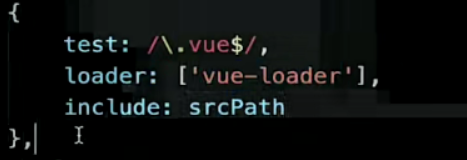
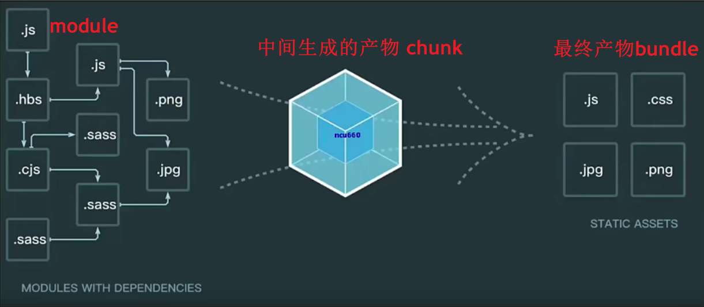
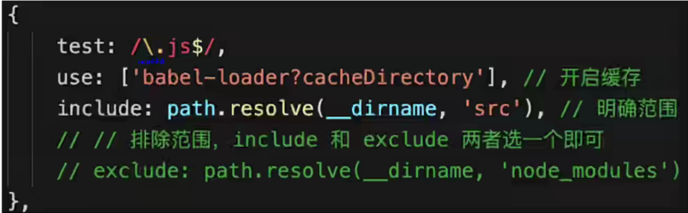
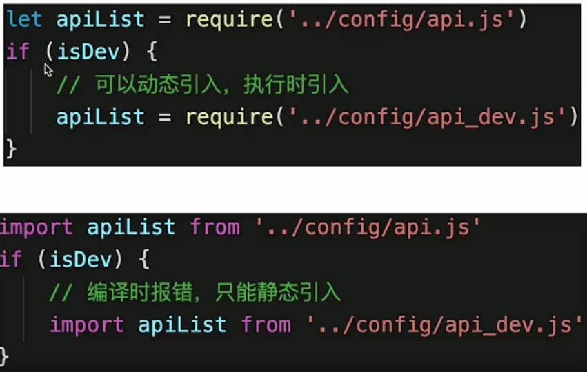

# webpack 复习和总结
## webpack 的基本配置
* 拆分配置和 `merge`
* 启动本地服务(开发模式)
* 处理 ES6
* 处理样式
* 处理图片
* (模块化)
`build-base-config` 文件夹

`build-base-config/paths.js` 常用文件路径
```js
/**
 * @description 常用文件夹路径
 */
const path = require('path')

const srcPath = path.join(__dirname, '..', 'src')
const distPath = path.join(__dirname, '..', 'dist')

module.exports = {
  srcPath,
  distPath
}
```
`build-base-config/webpack.common.js` 公共配置文件
```js
const path = require('path')
const HtmlWebpackPlugin = require('html-webpack-plugin')
const { srcPath, distPath } = require('./paths')

module.exports = {
    entry: path.join(srcPath, 'index'),
    module: {
        rules: [
            {
                test: /\.js$/,
                loader: ['babel-loader'],
                include: srcPath,
                exclude: /node_modules/
            },
            // {
            //     test: /\.vue$/,
            //     loader: ['vue-loader'],
            //     include: srcPath
            // },
            // {
            //     test: /\.css$/,
            //     // loader 的执行顺序是：从后往前（知识点）
            //     loader: ['style-loader', 'css-loader']
            // },
            {
                test: /\.css$/,
                // loader 的执行顺序是：从后往前
                loader: ['style-loader', 'css-loader', 'postcss-loader'] // 加了 postcss
            },
            {
                test: /\.less$/,
                // 增加 'less-loader' ，注意顺序
                loader: ['style-loader', 'css-loader', 'less-loader']
            }
        ]
    },
    plugins: [
        new HtmlWebpackPlugin({
            template: path.join(srcPath, 'index.html'),
            filename: 'index.html'
        })
    ]
}
```
`build-base-config/webpack.dev.js`  开发环境配置
```js
const path = require('path')
const webpack = require('webpack')
const webpackCommonConf = require('./webpack.common.js')
const { smart } = require('webpack-merge')
const { srcPath, distPath } = require('./paths')

module.exports = smart(webpackCommonConf, {
    mode: 'development',
    module: {
        rules: [
            // 直接引入图片 url
            {
                test: /\.(png|jpg|jpeg|gif)$/,
                use: 'file-loader'
            }
        ]
    },
    plugins: [
        new webpack.DefinePlugin({
            // window.ENV = 'development'
            ENV: JSON.stringify('development')
        })
    ],
    devServer: {
        port: 8080,
        progress: true,  // 显示打包的进度条
        contentBase: distPath,  // 根目录
        open: true,  // 自动打开浏览器
        compress: true,  // 启动 gzip 压缩
        // 设置代理
        proxy: {
            // 将本地 /api/xxx 代理到 localhost:3000/api/xxx
            '/api': 'http://localhost:3000',

            // 将本地 /api2/xxx 代理到 localhost:3000/xxx
            '/api2': {
                target: 'http://localhost:3000',
                pathRewrite: {
                    '/api2': ''
                }
            }
        }
    }
})
```
`build-base-config/webpack.prod.js` 生产环境配置
```js
const path = require('path')
const webpack = require('webpack')
const { CleanWebpackPlugin } = require('clean-webpack-plugin')
const webpackCommonConf = require('./webpack.common.js')
const { smart } = require('webpack-merge')
const { srcPath, distPath } = require('./paths')

module.exports = smart(webpackCommonConf, {
    mode: 'production',
    output: {
        filename: 'bundle.[contentHash:8].js',  // 打包代码时，加上 hash 戳
        path: distPath,
        // publicPath: 'http://cdn.abc.com'  // 修改所有静态文件 url 的前缀（如 cdn 域名），这里暂时用不到
    },
    module: {
        rules: [
            // 图片 - 考虑 base64 编码的情况
            {
                test: /\.(png|jpg|jpeg|gif)$/,
                use: {
                    loader: 'url-loader',
                    options: {
                        // 小于 5kb 的图片用 base64 格式产出
                        // 否则，依然延用 file-loader 的形式，产出 url 格式
                        limit: 5 * 1024,

                        // 打包到 img 目录下
                        outputPath: '/img1/',

                        // 设置图片的 cdn 地址（也可以统一在外面的 output 中设置，那将作用于所有静态资源）
                        // publicPath: 'http://cdn.abc.com'
                    }
                }
            },
        ]
    },
    plugins: [
        new CleanWebpackPlugin(), // 会默认清空 output.path 文件夹
        new webpack.DefinePlugin({
            // window.ENV = 'production'
            ENV: JSON.stringify('production')
        })
    ]
})
```

`package.json`
```json
{
  ...
  "scripts": {
  "devBuild": "webpack --config build-base-config/webpack.dev.js",
  "dev": "webpack-dev-server --config build-base-config/webpack.dev.js",
  "build": "webpack --config build-base-config/webpack.prod.js"
},
}
```

`.babelrc`
```
{
    "presets": ["@babel/preset-env"],
    "plugins": []
}
```
`postcss.config.js`
```js
module.exports = {
    plugins: [require('autoprefixer')]
}
```
## 如何配置多入口
描述: `entry` 配多个入口 js 文件,  `output` 要通过像 `[name].[contenthash:8].js`这种`[name]`变量的形式去做, 在 `plugins`里面需要针对每一个入口都生成对应的 `html-webpack-plugin` 的实例(并且要注意配置 `chunks`)

`webpack.common.js`
```js
const path = require('path')
const HtmlWebpackPlugin = require('html-webpack-plugin')
const { srcPath, distPath } = require('./paths')

module.exports = {
    entry: {
        index: path.join(srcPath, 'index.js'),
        other: path.join(srcPath, 'other.js')
    },
    module: {
        rules: [
            {
                test: /\.js$/,
                loader: ['babel-loader'],
                include: srcPath,
                exclude: /node_modules/
            },
            // {
            //     test: /\.css$/,
            //     // loader 的执行顺序是：从后往前
            //     loader: ['style-loader', 'css-loader']
            // },
            {
                test: /\.css$/,
                // loader 的执行顺序是：从后往前
                loader: ['style-loader', 'css-loader', 'postcss-loader'] // 加了 postcss
            },
            {
                test: /\.less$/,
                // 增加 'less-loader' ，注意顺序
                loader: ['style-loader', 'css-loader', 'less-loader']
            }
        ]
    },
    plugins: [
        // new HtmlWebpackPlugin({
        //     template: path.join(srcPath, 'index.html'),
        //     filename: 'index.html'
        // })

        // 多入口 - 生成 index.html                        // <- 针对每一个入口都 new 出来html插件
        new HtmlWebpackPlugin({
            template: path.join(srcPath, 'index.html'),
            filename: 'index.html',
            // chunks 表示该页面要引用哪些 chunk （即上面的 index 和 other），默认全部引用
            chunks: ['index']  // 只引用 index.js , 针对与对应的文件
        }),
        // 多入口 - 生成 other.html
        new HtmlWebpackPlugin({
            template: path.join(srcPath, 'other.html'),
            filename: 'other.html',
            chunks: ['other']  // 只引用 other.js
        })
    ]
}

```

`webpack.prod.js`
```js{11,12}
const path = require('path')
const webpack = require('webpack')
const { CleanWebpackPlugin } = require('clean-webpack-plugin')
const webpackCommonConf = require('./webpack.common.js')
const { smart } = require('webpack-merge')
const { srcPath, distPath } = require('./paths')

module.exports = smart(webpackCommonConf, {
    mode: 'production',
    output: {
        // filename: 'bundle.[contentHash:8].js',  // 打包代码时，加上 hash 戳
        filename: '[name].[contentHash:8].js', // name 即多入口时 entry 的 key
        path: distPath,
        // publicPath: 'http://cdn.abc.com'  // 修改所有静态文件 url 的前缀（如 cdn 域名），这里暂时用不到
    },
    module: {
        rules: [
            // 图片 - 考虑 base64 编码的情况
            {
                test: /\.(png|jpg|jpeg|gif)$/,
                use: {
                    loader: 'url-loader',
                    options: {
                        // 小于 5kb 的图片用 base64 格式产出
                        // 否则，依然延用 file-loader 的形式，产出 url 格式
                        limit: 5 * 1024,

                        // 打包到 img 目录下
                        outputPath: '/img1/',

                        // 设置图片的 cdn 地址（也可以统一在外面的 output 中设置，那将作用于所有静态资源）
                        // publicPath: 'http://cdn.abc.com'
                    }
                }
            },
        ]
    },
    plugins: [
        new CleanWebpackPlugin(), // 会默认清空 output.path 文件夹
        new webpack.DefinePlugin({
            // window.ENV = 'production'
            ENV: JSON.stringify('production')
        })
    ]
})
```
## 抽离(分割) css 文件, 压缩
其实在开发环境下通过 `style-loader`把 `css` 代码塞到 `js` 文件里通过`style` 标签引入到页面是没有问题的, 但是放在线上需要对 css 文件进行抽离(mini-css-extract-plugin 插件), 并压缩(optimize-css-assets-plugin 插件)

抽离 `css` 文件只在`生产环境`下使用即可 


`webpack.dev.js` 在开发环境依然使用 `style-loader`
```js
const path = require('path')
const webpack = require('webpack')
const webpackCommonConf = require('./webpack.common.js')
const { smart } = require('webpack-merge')
const { srcPath, distPath } = require('./paths')

module.exports = smart(webpackCommonConf, {
    mode: 'development',
    module: {
        rules: [
            // 直接引入图片 url
            {
                test: /\.(png|jpg|jpeg|gif)$/,
                use: 'file-loader'
            },
            // {
            //     test: /\.css$/,
            //     // loader 的执行顺序是：从后往前
            //     loader: ['style-loader', 'css-loader']
            // },
            {
                test: /\.css$/,
                // loader 的执行顺序是：从后往前
                loader: ['style-loader', 'css-loader', 'postcss-loader'] // 加了 postcss
            },
            {
                test: /\.less$/,
                // 增加 'less-loader' ，注意顺序
                loader: ['style-loader', 'css-loader', 'less-loader']
            }
        ]
    },
    plugins: [
        new webpack.DefinePlugin({
            // window.ENV = 'production'
            ENV: JSON.stringify('development')
        })
    ],
    devServer: {
        port: 8080,
        progress: true,  // 显示打包的进度条
        contentBase: distPath,  // 根目录
        open: true,  // 自动打开浏览器
        compress: true,  // 启动 gzip 压缩

        // 设置代理
        proxy: {
            // 将本地 /api/xxx 代理到 localhost:3000/api/xxx
            '/api': 'http://localhost:3000',

            // 将本地 /api2/xxx 代理到 localhost:3000/xxx
            '/api2': {
                target: 'http://localhost:3000',
                pathRewrite: {
                    '/api2': ''
                }
            }
        }
    }
})
```

`webpack.prod.js` 在开发环境下, 进行 `css` 抽离(MiniCssExtractPlugin), 并压缩(OptimizeCSSAssetsPlugin)
```js
const path = require('path')
const webpack = require('webpack')
const { smart } = require('webpack-merge')
const { CleanWebpackPlugin } = require('clean-webpack-plugin')
const MiniCssExtractPlugin = require('mini-css-extract-plugin')
const TerserJSPlugin = require('terser-webpack-plugin')
const OptimizeCSSAssetsPlugin = require('optimize-css-assets-webpack-plugin')
const webpackCommonConf = require('./webpack.common.js')
const { srcPath, distPath } = require('./paths')

module.exports = smart(webpackCommonConf, {
    mode: 'production',
    output: {
        // filename: 'bundle.[contentHash:8].js',  // 打包代码时，加上 hash 戳
        filename: '[name].[contentHash:8].js', // name 即多入口时 entry 的 key
        path: distPath,
        // publicPath: 'http://cdn.abc.com'  // 修改所有静态文件 url 的前缀（如 cdn 域名），这里暂时用不到
    },
    module: {
        rules: [
            // 图片 - 考虑 base64 编码的情况
            {
                test: /\.(png|jpg|jpeg|gif)$/,
                use: {
                    loader: 'url-loader',
                    options: {
                        // 小于 5kb 的图片用 base64 格式产出
                        // 否则，依然延用 file-loader 的形式，产出 url 格式
                        limit: 5 * 1024,

                        // 打包到 img 目录下
                        outputPath: '/img1/',

                        // 设置图片的 cdn 地址（也可以统一在外面的 output 中设置，那将作用于所有静态资源）
                        // publicPath: 'http://cdn.abc.com'
                    }
                }
            },
            // 抽离 css
            {
                test: /\.css$/,
                loader: [
                    MiniCssExtractPlugin.loader,  // 注意，这里不再用 style-loader
                    'css-loader',
                    'postcss-loader'
                ]
            },
            // 抽离 less --> css
            {
                test: /\.less$/,
                loader: [
                    MiniCssExtractPlugin.loader,  // 注意，这里不再用 style-loader
                    'css-loader',
                    'less-loader',
                    'postcss-loader'
                ]
            }
        ]
    },
    plugins: [
        new CleanWebpackPlugin(), // 会默认清空 output.path 文件夹
        new webpack.DefinePlugin({
            // window.ENV = 'production'
            ENV: JSON.stringify('production')
        }),

        // 抽离 css 文件
        new MiniCssExtractPlugin({
            filename: 'css/main.[contentHash:8].css'  // 定义文件名字,  注意加上 [contenthash] , 命中缓存
        })
    ],

    optimization: {
        minimizer: [
          new TerserJSPlugin({}),  // 压缩 js 代码
          new OptimizeCSSAssetsPlugin({})   // 压缩 css
        ],
    }
})
```
## 抽离公共代码和第三方代码
公共的代码必须要抽出来。因为打包时每个模块都有公共的部分, 这样就比较浪费, 类似于写代码时的复制粘贴, 所以要想办法把公共代码把他们抽离出来并相互引用, 这样就会较少加载次数和引用的次数

所以: 
* 第三方模块单独拆出去
* 公共引用的代码单独拆出去


开发环境没必要做处理, 主要是生产环境配置下东西

`webpack.prod.js`
```js
const path = require('path')
const webpack = require('webpack')
const { smart } = require('webpack-merge')
const { CleanWebpackPlugin } = require('clean-webpack-plugin')
const MiniCssExtractPlugin = require('mini-css-extract-plugin')
const TerserJSPlugin = require('terser-webpack-plugin')
const OptimizeCSSAssetsPlugin = require('optimize-css-assets-webpack-plugin')
const webpackCommonConf = require('./webpack.common.js')
const { srcPath, distPath } = require('./paths')

module.exports = smart(webpackCommonConf, {
    mode: 'production',
    output: {
        // filename: 'bundle.[contentHash:8].js',  // 打包代码时，加上 hash 戳
        filename: '[name].[contentHash:8].js', // name 即多入口时 entry 的 key
        path: distPath,
        // publicPath: 'http://cdn.abc.com'  // 修改所有静态文件 url 的前缀（如 cdn 域名），这里暂时用不到
    },
    module: {
        rules: [
            // 图片 - 考虑 base64 编码的情况
            {
                test: /\.(png|jpg|jpeg|gif)$/,
                use: {
                    loader: 'url-loader',
                    options: {
                        // 小于 5kb 的图片用 base64 格式产出
                        // 否则，依然延用 file-loader 的形式，产出 url 格式
                        limit: 5 * 1024,

                        // 打包到 img 目录下
                        outputPath: '/img1/',

                        // 设置图片的 cdn 地址（也可以统一在外面的 output 中设置，那将作用于所有静态资源）
                        // publicPath: 'http://cdn.abc.com'
                    }
                }
            },
            // 抽离 css
            {
                test: /\.css$/,
                loader: [
                    MiniCssExtractPlugin.loader,  // 注意，这里不再用 style-loader
                    'css-loader',
                    'postcss-loader'
                ]
            },
            // 抽离 less
            {
                test: /\.less$/,
                loader: [
                    MiniCssExtractPlugin.loader,  // 注意，这里不再用 style-loader
                    'css-loader',
                    'less-loader',
                    'postcss-loader'
                ]
            }
        ]
    },
    plugins: [
        new CleanWebpackPlugin(), // 会默认清空 output.path 文件夹
        new webpack.DefinePlugin({
            // window.ENV = 'production'
            ENV: JSON.stringify('production')
        }),

        // 抽离 css 文件
        new MiniCssExtractPlugin({
            filename: 'css/main.[contentHash:8].css'
        })
    ],

    optimization: {
        // 压缩 css
        minimizer: [new TerserJSPlugin({}), new OptimizeCSSAssetsPlugin({})],

        // 分割代码块
        splitChunks: {
            chunks: 'all',
            /**
             * initial 入口 chunk，对于异步导入的文件不处理
                async 异步 chunk，只对异步导入的文件处理
                all 全部 chunk
             */

            // 缓存分组
            cacheGroups: {
                // 第三方模块
                vendor: {
                    name: 'vendor', // chunk 名称
                    priority: 1, // 权限更高，优先抽离，重要！！！
                    test: /node_modules/,  // 命中第三方模块
                    minSize: 0,  // 大小限制 , 一般 5Kb -> 5000 , 这里写成了 0 是为了调试
                    minChunks: 1  // 最少复用过几次
                },

                // 公共的模块
                common: {
                    name: 'common', // chunk 名称
                    priority: 0, // 优先级
                    minSize: 0,  // 公共模块的大小限制
                    minChunks: 2  // 公共模块最少复用过几次
                }
            }
        }
    }
})
``` 

这里注意一下 `minChunks`的配置 `1` 和 `2` 的含义是不同的, 比如第三方模块的话只要引入了一次就必须分割, 但像公共模块只引入了一次就没有什么问题, 所以一般会配置成 `2` , 公共的模块引入了两次以上才会单独分割文件

但是重新打包发现 `other.html` 虽然没有引入 lodash 第三方模块, 但打包后的 `other.html` 被引入了 `vendor.[contenthash].js` , 先然这里有问题

`webpack.common.js`
```js{31,38}
const path = require('path')
const HtmlWebpackPlugin = require('html-webpack-plugin')
const { srcPath, distPath } = require('./paths')

module.exports = {
    entry: {
        index: path.join(srcPath, 'index.js'),
        other: path.join(srcPath, 'other.js')
    },
    module: {
        rules: [
            {
                test: /\.js$/,
                loader: ['babel-loader'],
                include: srcPath,
                exclude: /node_modules/
            }
        ]
    },
    plugins: [
        // new HtmlWebpackPlugin({
        //     template: path.join(srcPath, 'index.html'),
        //     filename: 'index.html'
        // })

        // 多入口 - 生成 index.html
        new HtmlWebpackPlugin({
            template: path.join(srcPath, 'index.html'),
            filename: 'index.html',
            // chunks 表示该页面要引用哪些 chunk （即上面的 index 和 other），默认全部引用
            chunks: ['index', 'vendor', 'common']  // 要考虑代码分割
        }),
        // 多入口 - 生成 other.html
        new HtmlWebpackPlugin({
            template: path.join(srcPath, 'other.html'),
            filename: 'other.html',
            chunks: ['other', 'common']  // 考虑代码分割
        })
    ]
}
```
`HtmlWebpackPlugin`插件配置 `chunks` 属性指定一下哪些 `chunks` 需要引入, 它对应的是 `splitChunksPlugin` 插件 `cacheGroups` 的 `name` 属性, 在 `other.js` 里面因为没有用到 lodash库这样的第三方模块, 所以`other.html`的 `chunks` 没必要引入 `vendors` 

## 懒加载(异步加载 js)
ES6 的 `import()` 语法, 单独为异步代码打一个包。  `webpack` 默认支持语法, `webpack` 自动生成 `chunk`
`index.js`
```js
// 引入动态数据 - 懒加载
setTimeout(()=>{
  // 回顾 Vue 的异步组件
  // 定义一个 chunk
  import('./dynamic-data.js').then(res=>{
    console.log(res.default.message)  // 注意这里的 default
  })
},1500)
```
##  vue-loader
安装 `vue-loader`, 在配置 


## module, chunk, bundle 的区别
* `module` - 各种源码文件, webpack 中一切皆模块
* `chunk` - `webpack` 进行分析过程中通过入口文件进行依赖的分析生成的一坨一坨模块的集合, 如 `entry`, `import()`, `splitChunk`
* `bundle` - 最终的输出文件




## webpack 优化构建速度
`webpack` 性能优化: 
* 优化打包构建速度 - 开发体验和效率
* 优化产出代码 - 产品性能

1. 优化 `babel-loader`

(1)缓存 (2)明确范围, 或者 排除范围

对于 Loader 来说，影响打包效率首当其冲必属 Babel 了。因为 Babel 会将代码转为字符串生成 AST，然后对 AST 继续进行转变最后再生成新的代码，项目越大，转换代码越多，效率就越低。当然了，我们是有办法优化的。

首先可以优化 `Loader` 的文件搜索范围

对于 `Babel` 来说，我们肯定是希望只作用在 JS 代码上的，然后 node_modules 中使用的代码都是编译过的，所以我们也完全没有必要再去处理一遍。

当然这样做还不够，还可以将 `Babel` 编译过的文件**缓存**起来，下次只需要编译更改过的代码文件即可，这样可以大幅度加快打包时间

```js
  {
      test: /\.js$/,
      loader: ['babel-loader?cacheDirectory'],
    // 只在 src 文件夹下查找
      include: srcPath,
        // 不会去查找的路径
      // exclude: /node_modules/
  },
```
2. `IgnorePlugin`,  `HappyPack` 多进程打包, `ParalleUglifyPlugin` 压缩代码

受限于 `Node` 是单线程运行的，所以 `Webpack` 在打包的过程中也是单线程的，特别是在执行 `Loader` 的时候，长时间编译的任务很多，这样就会导致等待的情况。

**`HappyPack` 可以将 `Loader` 的同步执行转换为并行的**，这样就能充分利用系统资源来加快打包效率了
```js
module: {
  loaders: [
    {
      test: /\.js$/,
      include: [resolve('src')],
      exclude: /node_modules/,
      // id 后面的内容对应下面
      loader: 'happypack/loader?id=happybabel'
    }
  ]
},
plugins: [
  new HappyPack({
    id: 'happybabel',
    loaders: ['babel-loader?cacheDirectory'],
    // 开启 4 个线程
    threads: 4
  })
]
```

在 Webpack3 中，一般使用 `UglifyJS` 来压缩代码，但是这个是单线程运行的，为了加快效率，我们可以使用 `webpack-parallel-uglify-plugin` 来并行运行 `UglifyJS`，从而提高效率。

在 `Webpack4` 中，就不需要以上这些操作了，只需要将 `mode` 设置为 `production` 就可以默认开启以上功能。代码压缩也是我们必做的性能优化方案，当然我们不止可以压缩 JS 代码，还可以压缩 HTML、CSS 代码，并且在压缩 JS 代码的过程中，我们还可以通过配置实现比如删除 console.log 这类代码的功能。

`webpack.prod.js`
```js
const path = require('path')
const webpack = require('webpack')
const { smart } = require('webpack-merge')
const { CleanWebpackPlugin } = require('clean-webpack-plugin')
const MiniCssExtractPlugin = require('mini-css-extract-plugin')
const TerserJSPlugin = require('terser-webpack-plugin')
const OptimizeCSSAssetsPlugin = require('optimize-css-assets-webpack-plugin')
const HappyPack = require('happypack')
const ParallelUglifyPlugin = require('webpack-parallel-uglify-plugin')
const webpackCommonConf = require('./webpack.common.js')
const { srcPath, distPath } = require('./paths')

module.exports = smart(webpackCommonConf, {
    mode: 'production',
    output: {
        // filename: 'bundle.[contentHash:8].js',  // 打包代码时，加上 hash 戳
        filename: '[name].[contentHash:8].js', // name 即多入口时 entry 的 key
        path: distPath,
        // publicPath: 'http://cdn.abc.com'  // 修改所有静态文件 url 的前缀（如 cdn 域名），这里暂时用不到
    },
    module: {
        rules: [
            // js
            {
                test: /\.js$/,
                // 把对 .js 文件的处理转交给 id 为 babel 的 HappyPack 实例
                use: ['happypack/loader?id=babel'],
                include: srcPath,
                // exclude: /node_modules/
            },
            // 图片 - 考虑 base64 编码的情况
            {
                test: /\.(png|jpg|jpeg|gif)$/,
                use: {
                    loader: 'url-loader',
                    options: {
                        // 小于 5kb 的图片用 base64 格式产出
                        // 否则，依然延用 file-loader 的形式，产出 url 格式
                        limit: 5 * 1024,

                        // 打包到 img 目录下
                        outputPath: '/img1/',

                        // 设置图片的 cdn 地址（也可以统一在外面的 output 中设置，那将作用于所有静态资源）
                        // publicPath: 'http://cdn.abc.com'
                    }
                }
            },
            // 抽离 css
            {
                test: /\.css$/,
                loader: [
                    MiniCssExtractPlugin.loader,  // 注意，这里不再用 style-loader
                    'css-loader',
                    'postcss-loader'
                ]
            },
            // 抽离 less
            {
                test: /\.less$/,
                loader: [
                    MiniCssExtractPlugin.loader,  // 注意，这里不再用 style-loader
                    'css-loader',
                    'less-loader',
                    'postcss-loader'
                ]
            }
        ]
    },
    plugins: [
        new CleanWebpackPlugin(), // 会默认清空 output.path 文件夹
        new webpack.DefinePlugin({
            // window.ENV = 'production'
            ENV: JSON.stringify('production')
        }),

        // 抽离 css 文件
        new MiniCssExtractPlugin({
            filename: 'css/main.[contentHash:8].css'
        }),

        // 忽略 moment 下的 /locale 目录
        new webpack.IgnorePlugin(/\.\/locale/, /moment/),

        // happyPack 开启多进程打包
        new HappyPack({
            // 用唯一的标识符 id 来代表当前的 HappyPack 是用来处理一类特定的文件
            id: 'babel',
            // 如何处理 .js 文件，用法和 Loader 配置中一样
            loaders: ['babel-loader?cacheDirectory']
        }),

        // 使用 ParallelUglifyPlugin 并行压缩输出的 JS 代码
        new ParallelUglifyPlugin({
            // 传递给 UglifyJS 的参数
            // （还是使用 UglifyJS 压缩，只不过帮助开启了多进程）
            uglifyJS: {
                output: {
                    beautify: false, // 最紧凑的输出
                    comments: false, // 删除所有的注释
                },
                compress: {
                    // 删除所有的 `console` 语句，可以兼容ie浏览器
                    drop_console: true,
                    // 内嵌定义了但是只用到一次的变量
                    collapse_vars: true,
                    // 提取出出现多次但是没有定义成变量去引用的静态值
                    reduce_vars: true,
                }
            }
        })
    ],

    optimization: {
        // 压缩 css
        minimizer: [new TerserJSPlugin({}), new OptimizeCSSAssetsPlugin({})],

        // 分割代码块
        splitChunks: {
            chunks: 'all',
            /**
             * initial 入口chunk，对于异步导入的文件不处理
                async 异步chunk，只对异步导入的文件处理
                all 全部chunk
             */

            // 缓存分组
            cacheGroups: {
                // 第三方模块
                vendor: {
                    name: 'vendor', // chunk 名称
                    priority: 1, // 权限更高，优先抽离，重要！！！
                    test: /node_modules/,
                    minSize: 0,  // 大小限制
                    minChunks: 1  // 最少复用过几次
                },

                // 公共的模块
                common: {
                    name: 'common', // chunk 名称
                    priority: 0, // 优先级
                    minSize: 0,  // 公共模块的大小限制
                    minChunks: 2  // 公共模块最少复用过几次
                }
            }
        }
    }
})
```
3. 自动刷新 (不用于生产环境)
4. 热更新 `HMR` (不用于生产环境)

整个网页全部刷新, 速度较慢, 里面的状态也会被丢失

`webpack.dev.js`
```js{6,55,13-15}
const path = require('path')
const webpack = require('webpack')
const webpackCommonConf = require('./webpack.common.js')
const { smart } = require('webpack-merge')
const { srcPath, distPath } = require('./paths')
const HotModuleReplacementPlugin = require('webpack/lib/HotModuleReplacementPlugin');

module.exports = smart(webpackCommonConf, {
    mode: 'development',
    entry: {
        // index: path.join(srcPath, 'index.js'),
        index: [
            'webpack-dev-server/client?http://localhost:8080/',
            'webpack/hot/dev-server',
            path.join(srcPath, 'index.js')
        ],
        other: path.join(srcPath, 'other.js')
    },
    module: {
        rules: [
            {
                test: /\.js$/,
                loader: ['babel-loader?cacheDirectory'],
                include: srcPath,
                // exclude: /node_modules/
            },
            // 直接引入图片 url
            {
                test: /\.(png|jpg|jpeg|gif)$/,
                use: 'file-loader'
            },
            // {
            //     test: /\.css$/,
            //     // loader 的执行顺序是：从后往前
            //     loader: ['style-loader', 'css-loader']
            // },
            {
                test: /\.css$/,
                // loader 的执行顺序是：从后往前
                loader: ['style-loader', 'css-loader', 'postcss-loader'] // 加了 postcss
            },
            {
                test: /\.less$/,
                // 增加 'less-loader' ，注意顺序
                loader: ['style-loader', 'css-loader', 'less-loader']
            }
        ]
    },
    plugins: [
        new webpack.DefinePlugin({
            // window.ENV = 'production'
            ENV: JSON.stringify('development')
        }),
        new HotModuleReplacementPlugin()
    ],
    devServer: {
        port: 8080,
        progress: true,  // 显示打包的进度条
        contentBase: distPath,  // 根目录
        open: true,  // 自动打开浏览器
        compress: true,  // 启动 gzip 压缩

        hot: true,

        // 设置代理
        proxy: {
            // 将本地 /api/xxx 代理到 localhost:3000/api/xxx
            '/api': 'http://localhost:3000',

            // 将本地 /api2/xxx 代理到 localhost:3000/xxx
            '/api2': {
                target: 'http://localhost:3000',
                pathRewrite: {
                    '/api2': ''
                }
            }
        }
    },
    // watch: true, // 开启监听，默认为 false
    // watchOptions: {
    //     ignored: /node_modules/, // 忽略哪些
    //     // 监听到变化发生后会等300ms再去执行动作，防止文件更新太快导致重新编译频率太高
    //     // 默认为 300ms
    //     aggregateTimeout: 300,
    //     // 判断文件是否发生变化是通过不停的去询问系统指定文件有没有变化实现的
    //     // 默认每隔1000毫秒询问一次
    //     poll: 1000
    // }
})
```

`index.js`
```js
// 引入 css
import './style/style1.css'
import './style/style2.less'

import { sum } from './math'

const sumRes = sum(10, 20)
console.log('sumRes', sumRes)

// 增加，开启热更新之后的代码逻辑
if (module.hot) {
    module.hot.accept(['./math'], () => {
        const sumRes = sum(10, 30)
        console.log('sumRes in hot', sumRes)
    })
}
```
## webpack 优化产出代码
* 体积更小
* 合理分包,避免重复加载
* 速度更快, 内存使用少

方法: 
1. **小图片 `base64` 编码**
2. **bundle 加 `hash`**
3. **懒加载**
4. **提取公共代码**
5. **使用 CDN 加速**
6. **使用 `production`**
7. **Scope Hosting**
8. **IgnorePlugin**

-----

1. 小图片 `base64` 编码

`webpack.prod.js`
```js
    // 图片 - 考虑 base64 编码的情况
    {
        test: /\.(png|jpg|jpeg|gif)$/,
        use: {
            loader: 'url-loader',
            options: {
                // 小于 5kb 的图片用 base64 格式产出
                // 否则，依然延用 file-loader 的形式，产出 url 格式
                limit: 5 * 1024,

                // 打包到 img 目录下
                outputPath: '/img1/',

                // 设置图片的 cdn 地址（也可以统一在外面的 output 中设置，那将作用于所有静态资源）
                // publicPath: 'http://cdn.abc.com'
            }
        }
    },
```
2. `bundle` 加 `hash`

* 代码没有变化, `hash` 值没有变, **命中缓存**, 加载更快, 提高加载效率
* 代码变了, `hash` 值也会变, 请求新的资源

`webpack.prod.js`
```js
 output: {
        // filename: 'bundle.[contentHash:8].js',  // 打包代码时，加上 hash 戳
        filename: '[name].[contentHash:8].js', // name 即多入口时 entry 的 key
        path: distPath,
        // publicPath: 'http://cdn.abc.com'  // 修改所有静态文件 url 的前缀（如 cdn 域名），这里暂时用不到
  },
```
3. 懒加载 
通过 `import()` 语法
4. 提取公共代码

第三方代码 或者公共的代码打出来, 公共的代码没有必要在多个入口重复的打包进去, 所以生成公共的包, 相互引用, 整个代码体积会小一些

```js
...
optimization: {
        // 压缩 css
        minimizer: [new TerserJSPlugin({}), new OptimizeCSSAssetsPlugin({})],

        // 分割代码块
        splitChunks: {
            chunks: 'all',
            /**
             * initial 入口chunk，对于异步导入的文件不处理
                async 异步chunk，只对异步导入的文件处理
                all 全部chunk
             */

            // 缓存分组
            cacheGroups: {
                // 第三方模块
                vendor: {
                    name: 'vendor', // chunk 名称
                    priority: 1, // 权限更高，优先抽离，重要！！！
                    test: /node_modules/,
                    minSize: 0,  // 大小限制
                    minChunks: 1  // 最少复用过几次
                },

                // 公共的模块
                common: {
                    name: 'common', // chunk 名称
                    priority: 0, // 优先级
                    minSize: 0,  // 公共模块的大小限制
                    minChunks: 2  // 公共模块最少复用过几次
                }
            }
        }
    }
```
5. 使用 `CDN` 加速

* 配置 `output` 的 `publicPath`
```js{5}
  output: {
      // filename: 'bundle.[contentHash:8].js',  // 打包代码时，加上 hash 戳
      filename: '[name].[contentHash:8].js', // name 即多入口时 entry 的 key
      path: distPath,
      publicPath: 'http://cdn.abc.com'  // 修改所有静态文件 url 的前缀（如 cdn 域名），这里暂时用不到
  },
```
```js
  // 图片 - 考虑 base64 编码的情况
  {
      test: /\.(png|jpg|jpeg|gif)$/,
      use: {
          loader: 'url-loader',
          options: {
              // 小于 5kb 的图片用 base64 格式产出
              // 否则，依然延用 file-loader 的形式，产出 url 格式
              limit: 5 * 1024,

              // 打包到 img 目录下
              outputPath: '/img1/',

              // 设置图片的 cdn 地址（也可以统一在外面的 output 中设置，那将作用于所有静态资源）
              // publicPath: 'http://cdn.abc.com'
          }
      }
  },
```

* **需要把 `dist` 目录下的打包产物全部上传到 `CDN` 服务器上去**

6. **使用 `production`**
`mode: production`

* **自动会开启代码压缩**
* Vue, React 会自动删除调试代码
* 启动 `tree-shaking` (`ES Module` 才能然 tree-shaking 生效, commonjs 不经)

7. **SCope Hosting**

## ES Module 和 Commonjs 区别
1. `ES Module` 静态引入, **编译时**引入
2. `Commonjs` 动态引入, **执行时**引入
3. 只有 ES Module 才能静态分析, 实现 `tree-shaking`

`webpack` 打包只是一个静态分析, 代码还没有执行, 只是构建。




## 总结
1. 基本配置
* 拆分配置和 `merge`
* 启动本地服务
* 处理 `ES6` 
* 处理样式
* 处理图片
2. 高级配置
* 多入口
* 抽离 `CSS` 代码, 压缩
* 抽离公共代码 `splitChunk`
* 懒加载
3. 优化打包效率
4. 优化产出代码
5. 构建流程概述

## 前端为何要进行打包和构建
代码层面:
1. 打包出来的代码体积更小( `tree-shaking`, 压缩, 合并), 加载更快
2. 编译高级语言和语法( TS, ES6+ ,模块化, scss..)
3. 兼容性错误和检查(Polyfill, postcss, eslint)

* 统一,搞笑的开发环境
* 统一的构建流程和产出标准
* 集成公司构建规范(提测, 上线 等)

一些知识点: 
1. module, chunk , bundle 区别
2. `loader` 和 `plugin` 区别
* loader : 模块转换器 , less -> css
* plugin: 扩展插件, 如 HtmlWebpackPlugin
3. 常见 `loader` 和 `plugin`
4. babel  和 webpack 区别
* babel: js 新语法编译工具, 不关心模块化
* webpack: 模块化打包工具, 是多个 loader 和 plugin 的集合
5. `webpack` 如何实现懒加载
* `import`
* 结合 Vue,react 异步组件
* Vue, react 异步加载路由
6. `webpack` 优化构建速度
7. `webpack` 优化产出代码


