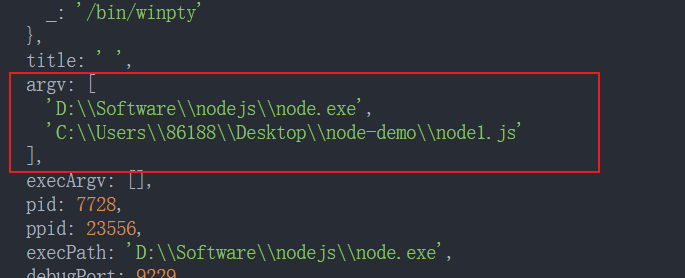

# 高级概念
## Tree Shaking
一句话总结 : 把没有用到的代码删掉

在引入模块的时候, 我们不引入所有的代码, 而是只引入咱们需要的代码, 这就需要借助 `tree-shaking`来实现

摇树, 在一个模块里没用的东西就摇晃掉, 只对引入的东西做打包, 没引入就不打包

**`tree-shaking` 只支持 `ES Module` 的引入方式(静态引入)**, 因为ES6的模块依赖关系式确定的, 和运行时状态无关, 可以进行可靠的**静态分析**, 即从字面量上对代码分析


* `usedExports` 只需要将 `usedExports` 设为 `true` ；使用之后，没被用上的代码在 `webpack` 打包中会加入`unused harmony export mul`注释，用来告知 `Terser` 在优化时，可以删除掉这段代码

`webpack.config.js`
```js
module.exports = {
  mode:'development',
  ...
  optimization:{
    usedExports: true 
  }
}
```

* `sideEffects` 配置方法在 `package.json` 中设置 `sideEffects` 属性，如果sideEffects设置为 `false` ，就是告知 webpack 可以安全的删除未用到的 `exports`即无副作用 。如果有些文件需要保留，可以设置为数组的形式

`package.json`
```json
{
  "sideEffects": false // tree-shaking 对全部模块都作用, 没有特殊处理的东西
}
```

比如 `import './style.css'` 他没有导出任何的内容, `tree-shaking` 会把它忽略掉, 这样会发生问题

比如  `在sideEffects` 里会把 `*.css` 文件写上去

`package.json`
```json
{
  "sideEffects": ["*.css"] // 别让 tree-shaking 把.css 文件摇晃掉, 指定文件不让 tree-shaking
}
```

在 `development`的环境下即使我们用了 `tree-shaking`, 他也不会把我们的代码直接从打包后的代码去除掉, 他只是在代码里面提示一下
之所以这样做, 因为在开发环境生成的代码需要做调试, 如果开发环境下 `tree-shaking` 把我们的代码删除掉, 那么调试起来困难, 所以会保留

但真正把代码打包上线, `development` 变成 `production` , 那么这个时候 `tree-shaking` 才会真正生效

其实在 `production` 模式下关于 `tree-shaking` 的配置已经自动帮我们写好了, 这个时候连 `optimization`都可以不用写, 但是 `package.json` 的`sideEffects`的配置呢需要写一下

还有在 `production`模式下, 一般会配置 `devtool`:`cheap-module-source-map`, 这个内容在前面已经总结过, 并且在 `development`模式下
`devtool`一般设置成 `eval-cheap-module-source-map`, 开发环境下这个时候 `optimization`属性需要配置一下


## development 和 production 模式的区分打包

几个方面上的差异
1. `development`模式下 `source-map` 是非常全的,  这样的话, 可以在开发环境下快速的定位代码的问题, 但是在 `production`环境下, 
代码已经要上线了, 那么 `source-map`其实可以不那么重要, 所以在线上环境下 , 一般它的 `source-map` 会更简洁一些, 或者呢, 在线下环境下的
`source-map` 我们可以生成一个 `.map` 文件来你行存储

2. 在开发环境下, 一般我们打包的代码不需要做压缩, 因为我们希望达到之后的代码比较明显的看到具体的说明项, 一旦代码上线, 那么代码就可以被压缩了, 在 `production`模式下, 代码呢, 一般是被压缩过得代码


但现在就有个问题, 在开发环境和生产环境的切换过程当中, 我们需要不断的修改 `webpack.config.js` 配置文件, 这就比较麻烦了

所以可以这么做, 生成 `webpack.dev.js` 文件表示开发环境下的配置文件, 在创建 `webpack.prod.js` 文件, 表示一旦要打包线上代码就用这个配置文件

`webpack.dev.js`
```js
const path = require('path')
const HtmlWebpackPlugin = require('html-webpack-plugin')
const { CleanWebpackPlugin }= require('clean-webpack-plugin')
const webpack = require('webpack')

module.exports = {
  mode:'development',
  devtool:'cheap-module-eval-source-map',
  entry:{
    main:'./src/index.js'
  },
  output:{
    path:path.resolve(__dirname, 'dist'),
    filename: '[name].js'
  },
  devServer:{
    contentBase:'./dist',
    open:true,
    hot:true,
    hotOnly: true
    port:8080
  },
  module:{
    rules:[
      {
        test:/\.js$/,
        exclude:/node_modules/,
        loader:'babel-loader'
      },
      {
        test:/\.(jpg|gif|svg)$/,
        use:[
          {
            loader:'url-loader',
            options:{
              name:'[name]_[hash].[ext]',
              outputPath:'images/'
              limit:10240
            }
          }
        ]
      },
      {
        test:/\.(eot|ttf|svg)$/,
        loader:'file-loader'
      },
      {
        test:/\.scss$/,
        use:[
          'style-loader',
          {
            loader:'css-loader',
            options:{
              importLoaders:2
            }
          },
          'sass-loader',
          'postcss-loader'
        ]
      }
    ]
  },
  plugins:[
    new HtmlWebpackPlugin({
      template:'./src/index.html'
    }),
    new CleanWebpackPlugin(),
    new webpack.HotModuleReplacementPlugin()
  ],
  optimization:{
    usedExports: true
  },
}
```

`webpack.prod.js`
```js
const path = require('path')
const HtmlWebpackPlugin = require('html-webpack-plugin')
const { CleanWebpackPlugin } = require('clean-webpack-plugin')
// const webpack = require('webpack')

module.exports = {
  mode:'production',  // 生产环境
  devtool:'cheap-module-source-map', // 这里也要该成这样
  entry:{
    main:'./src/index.js'
  },
  output:{
    path:path.resolve(__dirname, 'dist'),
    filename: '[name].js'
  },
  // devServer:{  // 开发环境不需要 devServer
  //   contentBase:'./dist',
  //   open:true,
  //   hot:true,
  //   hotOnly: true
  //   port:8080
  // },
  module:{
    rules:[
      {
        test:/\.js$/,
        exclude:/node_modules/,
        loader:'babel-loader'
      },
      {
        test:/\.(jpg|gif|svg)$/,
        use:[
          {
            loader:'url-loader',
            options:{
              name:'[name]_[hash].[ext]',
              outputPath:'images/'
              limit:10240
            }
          }
        ]
      },
      {
        test:/\.(eot|ttf|svg)$/,
        loader:'file-loader'
      },
      {
        test:/\.scss$/,
        use:[
          'style-loader',
          {
            loader:'css-loader',
            options:{
              importLoaders:2
            }
          },
          'sass-loader',
          'postcss-loader'
        ]
      }
    ]
  },
  plugins:[
    new HtmlWebpackPlugin({
      template:'./src/index.html'
    }),
    new CleanWebpackPlugin(),
    // new webpack.HotModuleReplacementPlugin() // 不需要
  ],
  // optimization:{   // 不需要
  //   usedExports: true
  // },
}
```

`package.json` 
```json
{
  ...
  "scripts":{
    "dev":"webpack-dev-server --config webpack.dev.js",  // 开发时
    "build":"webpack --config webpack.prod.js",         // 上线时
  }
}
```

但可以发现在 `webpack.dev.js` 和 `webpack.prod.js` 有很多重复的代码

所以可以把公用的的代码提取出来, 放到 `webpack.common.js` 文件上面

`webpack.common.js`
```js
const path = require('path')
const HtmlWebpackPlugin = require('html-webpack-plugin')
const { CleanWebpackPlugin } = require('clean-webpack-plugin')
module.exports = {
  entry:{
    main:'./src/index.js'
  },
  output:{
    path:path.resolve(__dirname, 'dist'),
    filename: '[name].js'
  },
  module:{
    rules:[
      {
        test:/\.js$/,
        exclude:/node_modules/,
        loader:'babel-loader'
      },
      {
        test:/\.(jpg|gif|svg)$/,
        use:[
          {
            loader:'url-loader',
            options:{
              name:'[name]_[hash].[ext]',
              outputPath:'images/'
              limit:10240
            }
          }
        ]
      },
      {
        test:/\.(eot|ttf|svg)$/,
        loader:'file-loader'
      },
      {
        test:/\.scss$/,
        use:[
          'style-loader',
          {
            loader:'css-loader',
            options:{
              importLoaders:2
            }
          },
          'sass-loader',
          'postcss-loader'
        ]
      }
    ]
  },
  plugins:[
    new HtmlWebpackPlugin({
      template:'./src/index.html'
    }),
    new CleanWebpackPlugin(),
  ],
}
```

然后在 `webpack.dev.js` 和 `webpack.prod.js` 里重复的逻辑都删掉

光删掉是不行的, 需要把 `common` 里的配置需要合并再输出 , 这个时候咱们需要一个模块 `webpack-merge`
```shell
npm install webpack-merge -D
```

所以在开发环境配置文件 `webpack.dev.js`
```js
const webpack = require('webpack')
const merge = require('webpack-merge')
const commonConfig = require('./webpack.common.js') // 引入公共的配置

const devConfig = { // 开发环境下独有配置
  mode:'development',
  devtool: 'cheap-module-eval-source-map',
  devServer:{
    contentBase:'./dist',
    hot:true,
    hotOnly:true,
    port:8080,
    open:true
  }
  plugins:[
    new webpack.HotModuleReplacement()
  ],
  optimization:{
    userExports: true
  }
}

module.exports = merge(commonConfig , devConfig)  // 合并配置
```

然后在生产环境配置文件 `webpack.prod.js`
```js
const merge = require('webpack-merge')
const commonConfig = require('webpack.common.js') // 公共的配置

const prodConfig = {  // 生产环境独有的配置
  mode:'production',
  devtool:'cheap-module-source-map',
}

module.exports = merge(commonConfig , prodConfig)  // 合并
```

最后重新运行对应的命令


还有在有些框架, 他会把这些配置文件 `webpack.common.js`,`webpack.dev.js`,`webpack.prod.js` 都放到独立的 `build` 文件下下面

所以这个情况赞们需要修改对应 `package.json` 的执行命令的路径

`package.json`
```json
{
  ...
  "scripts":{
    "dev":"webpack-dev-server --config ./build/webpack.dev.js",  // 开发时
    "build":"webpack --config ./build/webpack.prod.js",         // 上线时
  }
}
```
这里需要额外注意  , 因为配置文件在 build 目录下 , 所以在生成打包后的文件时候会根据配置文件所在的当前目录及 build 文件夹上会生成dist 目录和打包文件, 但是我希望它打包到`根目录`下的 dist 文件夹下面, 这个时候需要配置一下 `output`

`webpack.common.js`
```js
module.exports = {
  entry:...
  output:{
    path:path.resolve(__dirname, '../dist'),  
    // 会根据配置文件的路径(build文件夹下)生成产物, 所以这里需要写 ../dist (上一层也就是跟木下生成 dist 目录) 
    filename: '[name].js'
  },
  ..
  plugins:[
    ...
    new CleanWebpackPlugin() 
  ]
```


OK!! 大功告成

**总结**一下: 了解了一下**为什么**需要开发环境和生产环境,  开发环境有 `devServer` 方便我们开发, 生产环境需要对带吗进行压缩并且对`source-map`进行精简, 所以需要建立不同环境有自己的配置文件, 有了配置文件之后呢, 会发现, 这两个配置文件, 实际上有很多公共的内容, 
我们可以吧公共的内容提取出来放到 `common` 的文件里,  最后的在不同的环境下引入 common 的配置内容, 通过 `webpack-merge` 这个第三方模块
可以吧 common 的配置内容和对应不同环境的独立的配置内容进行合并, 最后生成环境下要使用的 config 的内容


## Webpack 和 Code Splitting
代码分割的意义:
* 不是所有内容都需要在首屏加载
* 按需加载可以节省网络资源, 提升首屏速度


将代码分离到不同的 `bundle` 中，之后可以**按需加载**，或者**并行加载**这些文件。默认情况下，所有的 `JS` 代码在首页全部加载，会影响到首页的加载速度。代码可以分出更小的bundle，以及控制资源加载的优先级，提供代码的加载性能, 更是可以**优化加载的时间**

* 打包文件会很大, 加载时间会长
* 我们改了业务代码, 那么用户需要重新加载对应的 `main.js` 才能显示最新的内容
* 有没有办法解决这个问题?

代码分割 三种:
* 设置 `entry` 多入口
* 设置内置的 `SplitChunksPlugin` 相关属性；
* 通过 `import()` 动态引入模块, 异步加载
### SplitChunks
一种分包的模式是 `splitChunk` ，它是使用 `SplitChunksPlugin` 来实现的：
* 因为该插件 `webpack` 已经默认安装和集成，不需要单独安装和直接使用该插件；
* 只需要提供 `SplitChunksPlugin` 相关的配置信息即可；

有了 `webpack` , 会根据插件自动地执行 `code Splitting`

`webpack.common.js`
```js
module.exports= {
  ...
  optimization:{
    splitChunks: {
      chunks: 'all'   // 如果splitChunks 是空对象, 那么 chunks 的默认值是 async , 但设置成了 all 
    } 
  }
}
```

通过合理的代码分割, 可以让我们运行的项目性能更高, 那以前没有 `webpack` 的时候, 我们需要手动的去思考, 代码怎么做分割合适, 然后自己做分割
, 但是有了 `webpack` 之后只需要在配置中去使用几个简单的配置项, 他就知道怎么做分割最为合适, 自动帮我们分割。


发现魔法注释我们填写的是 lodash,为什么打包后生成的文件名是 vendors~lodash,多了一个 vendors 呢?因为受配置文件中 optimization 的默认配置项的值的影响

### SplitChunksPlugin 的配置参数
[SplitChunksPlugin 的配置参数](https://webpack.docschina.org/plugins/split-chunks-plugin/)

看一看这些配置项
```js
module.exports = {
  //...
  optimization: {
    splitChunks: {
      chunks: 'all',  // 对同步和异步的代码都生效, 有三个值: async, all , initial
      minSize: 30000,  // 如果一个包拆分出来, 达不到 minSize (30kb) , 那么这个包就不会做代码的分割
      // maxSize: 50000,  // 一般不配 
      minRemainingSize: 0, 
      minChunks: 1, // 至少被引入的此时 , 默认是 1 , 如果写了2, 但实际引入了2次, 那么久不会做代码分割
      maxAsyncRequests: 30,
      maxInitialRequests: 30,
      enforceSizeThreshold: 50000,
      automaticNameDelimiter:'~'  // 组合文件之间, 分割后的代码会以 xxxx~xxxx.js 的形式以 ~ 链接生成 , 如果在下面赔了 filename 就被覆盖
      name:true,  // 控制缓存组的  filename 是否有效
      cacheGroups: {         // 对拆分地包进行*分组* , 比如 lodash 被拆分之后并不会立即打包, 会走这条规则  
        defaultVendors: {
          test: /[\\/]node_modules[\\/]/,  // 检查如果 lodash 这种库是不是在 node_modules 目录下的, 如果是, 就打包单独放到文件里
          priority: -10,  // 优先级 : -10 大于 -20 , 所以如果分组的 `test` 都满组条件会走这条路
          reuseExistingChunk: true,
          filename:'vendors.js'   // 分包出来的文件名会变成自定义的文件名 vendors.js,  原来是 vendors~main.js (后面的这个 'main' 是根据 output 的配置决定的)
        },
        default: {
          minChunks: 2,
          priority: -20,
          reuseExistingChunk: true, // 如果一个模块已经被打包过了, 那我再打包的时候就忽略这个模块直接使用之前被大包过的内容
          filename:'common.js'  // 分组分割后的文件名变成了 common.js , 原来是 default~main.js
        },
      },
    },
  },
};
```

如果我们打包一个**同步**的代码, 不仅仅会走 `chunks:'all'/'async'`这个配置参数, 实际上他还会往下走到 `cacheGroups` 这个参数, 我知道你要打包一个同步的库, 那怎么打包怎么根据下面的一个个组来进行打包, 如果发现引入的库, 它实际上是在 `node_modules`里面的话, 那么在打包的过程中呢, 我就会把这个库, 分割到叫做 `vendors.js` 的文件里去, 这两个配置是配合用的 `chunks` 和 `cacheGroups`

简单来说如果咱们引入了一个 `lodash`, 一个 `jquery` , 那么代码打包怎么样? 如果想要把它们打包分割到一个 `js` 文件, 那么没有 `cacheGroups` 就做不到, 实际上 `cacheGroups` 相当于是一个缓存组, 那打包 `jquery` 的时候先不着急打包这个 `jquery` 文件, 我先放到这个组里先缓存着, 我发现 `lodash` 也符合这个组的要求, 我也缓存到这个组里面,  当所有的模块分析好了之后呢, 把符合这个组的所有的模块都打包到一起去


所以在做同步代码的代码分割, 如果发现我们打包的文件复合上面这些配置逻辑, 实际上, 这个文件不会被直接进行代码分割, 还会走到 `cacheGroups`这个缓存组里面去, 如果我的这个文件复符合
缓存分组里面的要求, 他就会把文件打包到分组对应的这个最终文件里面去


### Lazy Loading 懒加载 , Chunk 是什么?
懒加载原理就是使用了 `import()` 语法, 真正需要时在请求代码

`webpack` 解析依赖的时候，**遇到import()形式的的引入方式就会将这段代码分割成一个单独的 `js` 文件**，等到要动态导入的时候，`webpack`会构造一个 script 标签，由浏览器异步请求 js 文件导入

作用: 可以优化首屏加载，因为 `webpack` 会打包会默认只会生成一个 `bundle` 文件，但是懒加载之后会把部分代码分割成后续再加载的 `js` 文件，**减少了主要 `bundle` 的体积，加快了加载时间**。


1. `import('')`

`import ‘./xxxx’` 改成 `() => import(‘lazyComponent.js’).then(data=>console.log(data))`

`ES6` 的提案，返回一个 `promise`，导入的模块在 `then` 中拿到
    
用函数引入，而且使用括号括起来，现在只能通过编译去使用， 而且 `babel` 为了解析 `import()` 语法需要引入一个插件：`babel-plugin-syntax-dynamic-import`
```shell
npm install @/babel/plugin-syntax-dynamic-import -D
```

这个插件使用方式在 `.babelrc` 里加：`“plugins”: [“syntax-dynamic-import”]`

或者 在 `babel.config.js`
```js{11}
module.exports={
  presets: [
      [
        '@babel/preset-env',
        {
          "useBuiltIns": "usage", 
          "corejs": "3.8"
        }
      ]
    ],
    plugins: ["@/babel/plugin-syntax-dynamic-import"]
}
```


## 打包分析, preload 预加载, prefetch 预获取
[webpack-bundle-analyzer](https://github.com/webpack-contrib/webpack-bundle-analyzer)一个 plugin 和 CLI 工具，它将 bundle 内容展示为一个便捷的、交互式、可缩放的树状图形式。
```shell
npm install --save-dev webpack-bundle-analyzer
```

```js
const BundleAnalyzerPlugin = require('webpack-bundle-analyzer').BundleAnalyzerPlugin;

module.exports = {
  ...
  plugins: [
    new BundleAnalyzerPlugin()
  ]
}
```
#### prefetch 预获取
空闲的时间偷偷把其他某块的代码下载下来, 利用空闲的时间

预获取`(prefetch)` **魔法注释**
```js
...
import(/* webpackPrefetch: true */ './path/to/LoginModal.js');
```
这会生成 `<link rel="prefetch" href="login-modal-chunk.js">` 并追加到页面头部，指示着浏览器在闲置时间预取 `login-modal-chunk.js` 文件

**这个注释`/* webpackPrefetch:true */`就能使异步模块在网络空闲的时候能够被预先加载**

`prefetch`  和 `preload` 的区别:
* preload chunk 会在父 chunk 加载时，以**并行**方式开始加载。prefetch chunk 会在父 chunk **加载结束后**开始加载
* preload chunk 具有中等优先级，并立即下载。prefetch chunk 在**浏览器闲置时**下载。
* preload chunk 会在父 chunk 中立即请求，用于当下时刻。prefetch chunk 会用于未来的某个时刻
* 浏览器支持程度不同

这样看来：
`preload` 主要用于预加载**当前**页面需要的资源；而 `prefetch` 主要用于加载**将来**页面可能需要的资源；


## CSS 文件的代码分割
先看一看小的知识点

在 `output` 的配置中, 可能会看得到这样的配置:

`webpack.common.js`
```js{6}
module.exports = {
  ...
  output:{
    path:path.resolve(__dirname, 'dist')
    filename:`[name].js`,
    chunkFIlename: '[name].chunk.js'
  }
}
```

打包生成 

`src/index.js` 文件会走的时候 `filename` 这个配置参数, 像 `lodash` 是通过异步加载的方式引入对应的代码, 如果是间接引用了这种模块, 
那么打包生成的文件名就会走 `chunkFilename` 这块的配置内容

### MiniCssExtractPlugin
一句话总结: 生成一个单独的 `css`文件, 需要注意**不能和 `style-loader` 一起使用**, 要用 `MiniCssExtractPlugin.loader`

默认情况, 打包并不会生成一个 CSS 文件, webpack 在进行打包的时候, 他会把 CSS 文件直接打包到 js 里面, 这就是经常听说的 CSS in JS 的概念,
但我希望在打包生成代码的时候, 如果我引入的是 CSS 文件, 那么把 CSS 文件单独打包到 dist 目录下, 生成单独的 `css` 文件, 而不是打包到 js 文件里

本插件**会将 CSS 提取到单独的文件中**，为**每个包含 CSS 的 JS 文件创建一个 CSS 文件**，并且支持 CSS 和 SourceMaps 的按需加载

最后会通过 `link` 标签引入打包出来的 `.css` 文件

[MiniCssExtractPlugin 官方文档](https://webpack.docschina.org/plugins/mini-css-extract-plugin)

安装
```shell
npm install --save-dev mini-css-extract-plugin
```

`MiniCssExtractPlugin` 只在**生产环境**下使用

`src/index.js` 引入了一个 `css` 文件
```js
import './style.css'
```

`MiniCssExtractPlugin` 的官网基本的配置是这样的, 实际上使用这个插件, 还需要对 `loader` 进行配置, 所以现在需要区分 `开发/生产/公用`环境的配置文件
```js
const MiniCssExtractPlugin = require("mini-css-extract-plugin");

module.exports = {
  plugins: [new MiniCssExtractPlugin({
    filename:'[name].css'
  })],// <-
  module: {
    rules: [
      {
        test: /\.css$/i,
        use: [MiniCssExtractPlugin.loader, "css-loader"], // <- 这个 loader 不能跟 style-loader 一起使用
      },
    ],
  },
};
```
首先到 `webpack.common.js` 这个文件, 对 `sass 和 css` 的 `loader` 部分的代码线剪切一下 

现在要做的事情就是: 在开发环境是使用 `style-loader`, 但在生产环境使用的是  `MiniCssExtractPlugin` 它里面提供的 `loader`, 所以要区分一下

然后到开发环境中 `webpack.dev.js`
```js
const webpack = require('webpack')
const merge = require('webpack-merge')
const commonConfig = require('./webpack.common.js') 

const devConfig = { 
  mode:'development',
  devtool: 'cheap-module-eval-source-map',
  devServer:{
    contentBase:'./dist',
    hot:true,
    hotOnly:true,
    port:8080,
    open:true
  },
  module:{   // 开发环境依然使用 style-loader
    rules:[
      {
        test:/\.scss$/,
        use:[
          'style-loader',   // <-
          {
            loader:'css-loader',
            options:{
              importLoaders:2
            }
          },
          'sass-loader',
          'postcss-loader'
        ]
      },
       {
        test:/\.css$/,
        use:[
          'style-loader',   // <-
          'css-loader',
          'postcss-loader'
        ]
      },
    ]
  },
  plugins:[
    new webpack.HotModuleReplacement()
  ],
  optimization:{
    userExports: true
  }
}

module.exports = merge(commonConfig , devConfig)
```

到生产环境 `webpack.prod.js`, 使用 `MiniCssExtractPlugin.loader`
```js
const merge = require('webpack-merge')
const commonConfig = require('webpack.common.js') 
const MiniCssExtractPlugin = require("mini-css-extract-plugin");

const prodConfig = { 
  mode:'production',
  devtool:'cheap-module-source-map',
   module:{   // 开发环境依然使用 MiniCssExtractPlugin.loader
    rules:[
      {
        test:/\.scss$/,
        use:[
          MiniCssExtractPlugin.loader,   // <-
          {
            loader:'css-loader',
            options:{
              importLoaders:2
            }
          },
          'sass-loader',
          'postcss-loader'
        ]
      },
       {
        test:/\.css$/,
        use:[
          MiniCssExtractPlugin.loader, // <-
          'css-loader',
          'postcss-loader'
        ]
      },
    ]
  },
   plugins: [new MiniCssExtractPlugin()],  // // <-  配置 plugin
}

module.exports = merge(commonConfig , prodConfig)  // 合并
```

还需要注意的是因为 `tree-shaking` 的影响, 使用 `import ./style.css` 代码会被摇晃掉, 所以注意要在 `package.json` 配置
```json
{
  "sideEffects": ["*.css"] // 别让 tree-shaking 把.css 文件摇晃掉, 指定文件不让 tree-shaking
}
```

还有些高级配置: 比如: [生产模式压缩 css 文件](https://webpack.docschina.org/plugins/mini-css-extract-plugin#minimizing-for-production) 

[提取所有的 CSS 到一个文件中](https://webpack.docschina.org/plugins/mini-css-extract-plugin#extracting-all-css-in-a-single-file)用过使用 `optimization.splitChunks.cacheGroups` 选项，所有的 CSS 可以被提取到一个 CSS 文件中
## CSS 代码压缩 : CssMinimizerWebpackPlugin
[CssMinimizerWebpackPlugin 官方文档](https://webpack.docschina.org/plugins/css-minimizer-webpack-plugin/#root)

安装
```shell
npm install css-minimizer-webpack-plugin --save-dev
```

```js
const MiniCssExtractPlugin = require("mini-css-extract-plugin");
const CssMinimizerPlugin = require("css-minimizer-webpack-plugin");  // <- 

module.exports = {
  module: {
    rules: [
      {
        test: /.s?css$/,
        use: [MiniCssExtractPlugin.loader, "css-loader", "sass-loader"],
      },
    ],
  },
  optimization: {
    minimizer: [
      new CssMinimizerPlugin(),  // <- css 代码压缩
    ],
  },
  plugins: [new MiniCssExtractPlugin()], 
};
```
这将**仅在生产环境**开启 `CSS` 优化

如果还想在开发环境下启用 CSS 优化，请将 `optimization.minimize 设置为 true`

```js
// [...]
module.exports = {
  optimization: {
    // [...]
    minimize: true,
  },
};
```
## webpack 和浏览器缓存 (Caching)
我们要保证，改过的文件需要更新 `hash` 值，而没改过的文件依然保持原本的 `hash` 值，这样才能保证在上线后，浏览器访问时没有改变的文件会命中缓存，从而达到性能优化的目的

`webpack.prod.js`
```js
module.exports = {
  output:{
     // 给js文件加上 contenthash,
    filename: '[name]-[contenthash].js',
    chunkFilename:'[name]-[contenthash].js',
  }
}
```


只要我们不改源代码, 文件的内容不变, 这两个值在打包的过程中, 永远都不会变 

**源代码变了, 对应的 `hash` 值会变, 那么如果重新打包上线, 发现之前的文件跟现在的文件名字是一模一样的, 那么就直接用缓存, 但如果 `hash` 变了, 需要到我们的服务器上重新加载新的 `js` 文件**

**通过使用 `contenthash`  这种新式, 我们可以做到, 当我们重新打包代码上线的时候, 用户只需要请求有变化的文件, 而没有变化的文件就直接使用之前本地的缓存**


## 环境变量的使用方法
在 `webpack.dev.js` 和 `webpack.prod.js` 里让导出的不是 merge 之后的东西, 把代码改成 导出配置对象

`webpack.common.js`
```js
const path = require('path')
const HtmlWebpackPlugin = require('html-webpack-plugin')
const {CleanWebpackPlugin} = require('clean-webpack-plugin') 

const devConfig = requirer('./webpack.dev.js')  // <-  
const prodConfig = requirer('./webpack.prod.js') // <-
const merge = require('webpack-merge') // <-
const commonConfig = {
  ...
}

module.exports = (env,argv) =>{
  if(argv.mode === 'production') {  // 如果 env.production 全局变量存在..
    return merge(commonConfig , prodConfig)
  } else {
    return merge(commonConfig , devConfig)
  }
}
```


`package.json` : 全部都使用了 `webpack.common.js` 配置文件, 执行命令了
```json
{
  "scripts":{
    "dev-build":"webpack --config ./build/webpack.common.js",
    "dev":"webpack-dev-server --config ./build/webpack.common.js",
    "build":"webpack --config ./build/webpack.common.js --mode=production",  // <-  --mode=xxx 使用了环境变量 : 表示了生产环境
  }
}
```
通过传入 `mode` 环境变量区分环境

把 `env` 和 `argv` 打出来看看



## 公共静态资源的处理
1. 使用外链 `externals` 

**防止**将某些 `import` 的包(package) 打包到 bundle 中，而是在**运行时** (runtime) 再去从外部获取这些扩展依赖

例如，从 `CDN` 引入 `jQuery`，而不是把它打包：

`webpack.config.js`
```js
module.exports = {
  ...
  externals:{
    jquery1:'jQuery' 
  }
}
```
`index.html`
```html
<script src="https://code.jquery.com/jquery-3.1.0.js" ></script>
```

```js
import $ from 'jquery1'

console.log($)
```

2. **利用 `html-webpack-plugin` 编写**

`webpack.config.js`
```js{9-12}
const HtmlWebpackPlugin = require('html-webpack-plugin')
...
module.exports = {
  plugins:[
    ...
    new HtmlWebpackPlugin({
      filename:'test.html', // 打包输出的文件名称
      template:'./src/index.html', // 模板
      templateParameters:{   // 注入的变量, 在 index.html 里面通过 ejs 模板语法获取 
        titleName:'test2',
        jsList:['https://code.jquery.com/jquery-3.1.0.js']  // <-
      }
    })
  ]
}
```

`src/index.html`
```html
<!DOCTYPE html>
<html lang="en">
<head>
  <meta charset="UTF-8">
  <meta http-equiv="X-UA-Compatible" content="IE=edge">
  <meta name="viewport" content="width=device-width, initial-scale=1.0">
  <title><%= titleName %></title>         // <- ejs 模板语法
  <% for(var item in jsList) { %}                // <-
    <script src="<%= jsList[item] %>"></script>
  <% } %>
</head>
<body>
  <div id="root"></div>
</body>
</html>
```
## 资源内联到 html 中
内联的意义: 
* 减少 http 请求, 提升性能
* 提高用户体验
* 复用资源, 提升开发效率


如何内联:
1. `html` 片段: `rwa-loader` / `asset/source + html-webpack-plugin`

`src/inline/meta.html`
```html
<meta title="test" content="test">
```
`webpack.config.js`
```js
module.exports={
  ...
  module:{
    rules:[
      ...
      {
        test: /meta.html/,
        type:'asset/source'
      }
    ]
  }
}
```

src/index.html
```html
<!DOCTYPE html>
<html lang="en">
<head>
  <meta charset="UTF-8">
  <meta http-equiv="X-UA-Compatible" content="IE=edge">
  <meta name="viewport" content="width=device-width, initial-scale=1.0">
  <%= require(./inline/meta.html) %>      // <- 看这里
  <title><%= titleName %></title>        
  <% for(var item in jsList) { %}             
    <script src="<%= jsList[item] %>"></script>
  <% } %>
</head>
<body>
  <div id="root"></div>
</body>
</html>
```

`npm run build` 打包

得到 `test.html`
```html
<!DOCTYPE html>
<html lang="en">
  <head>
    <meta charset="UTF-8" />
    <meta http-equiv="X-UA-Compatible" content="IE=edge" />
    <meta name="viewport" content="width=device-width,initial-scale=1" />
    <title>test-title-name</title>
    <meta title="test" content="test" />    // <- 发现已经内联成功
    <script src="https://code.jquery.com/jquery-3.1.0.js"></script>
    <script defer="defer" src="main_f09fabf9355303804fed.js"></script>
    <script defer="defer" src="test_f09fabf9355303804fed.js"></script>
    <link href="main.css" rel="stylesheet" />
  </head>
  <body>
    <div id="root"></div>
  </body>
</html>
```

或者**使用 `raw-loader `**

`webpack.config.js`
```js
module.exports={
  ...
  module:{
    rules:[
      ...
      {
        test: /meta.html/,
        use:[
          {
            loader:'raw-loader',
            options:{
              esModule: false
            }
          }
        ]
      }
    ]
  }
}
```
2. js : 同上面的 html
3. css : `style-loader`
4. 图片, 字体: asset | asset-inline or url-loader


## 通过 webpack 构建去除代码中的调试日志 - terser-webpack-plugin
作用: 删除代码中的 `console.log`

[terser-webpack-plugin 官方文档](https://webpack.docschina.org/plugins/terser-webpack-plugin/#root)

使用 `terser-webpack-plugin`, `webpack5` 是开箱即用, `webpack4` 需要下载安装

```js
...
const TerserPlugin = require("terser-webpack-plugin"); // 删除 console

module.exports={
  ...
  optimization: {
    minimizer: [
      new CssMinimizerPlugin(), 
      new TerserPlugin({       // 删除 console
         terserOptions: {
          compress: {            
            drop_console: true  // 只 production 模式生效
          }
        }
      }) 
    ],
    minimize: true
  },
}
```


